# Holosphere

### [▶ Play with the live WebAssembly simulator](https://woundedlion.github.io/daydream/)

### [📖 API documentation (Doxygen)](https://woundedlion.github.io/pov/)

---

<p align="center">
  <a href="https://woundedlion.github.io/daydream/?effect=IslamicStars" target="_blank">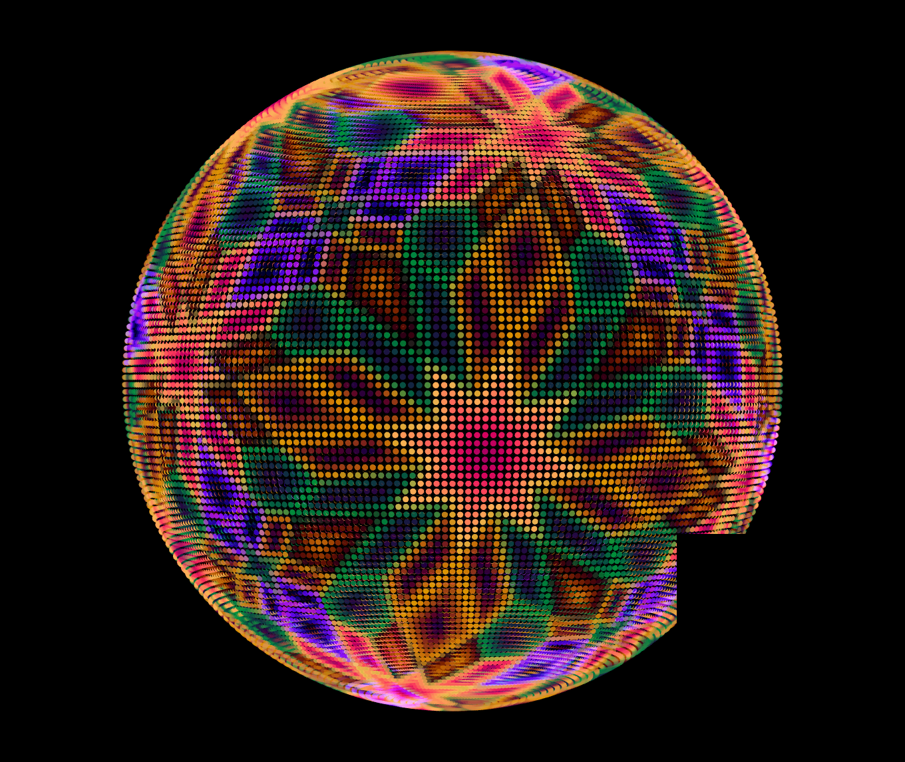</a>
</p>

A persistence-of-vision (POV) LED sphere and its real-time simulator. The device spins a strip of LEDs at 480 RPM while a Teensy microcontroller fires pixels at microsecond intervals to paint full-color imagery on the surface of a virtual sphere. The simulator renders the same effects in a browser window at up to 288×144 resolution using the identical C++ code compiled to WebAssembly.

The project spans **two repositories** that ship as one product:

| Repo | Role | What lives here |
|---|---|---|
| [**Holosphere**](https://github.com/woundedlion/pov) | C++ engine + firmware | All rendering code, effects, hardware drivers (`pov_single.h`, `pov_segmented.h`), the Emscripten/WASM target, unit tests, and this README. |
| [**daydream**](https://github.com/woundedlion/daydream) | Web simulator | Three.js renderer, the compiled `holosphere_wasm.{js,wasm}` artifacts (output of Holosphere's WASM build), GUI/sidebar, recorder, segmented-POV Web Workers, and standalone geometry tools. |

Building the WASM target in Holosphere installs `holosphere_wasm.js`, `holosphere_wasm.wasm`, this README, and `docs/screenshots/` into the sibling `daydream/` checkout — so both repos always serve the same README. The live demo is daydream served from GitHub Pages.

---

## Table of Contents

1. [Hardware](#1-hardware)
2. [Engineering Philosophies](#2-engineering-philosophies)
3. [Repository Map](#3-repository-map)
4. [Architecture Overview](#4-architecture-overview)
5. [Data Flow: Frame Lifecycle](#5-data-flow-frame-lifecycle)
6. [The Rendering Pipeline](#6-the-rendering-pipeline)
   - [End-to-End Flow](#end-to-end-flow)
   - [Pipeline Domain Transitions](#pipeline-domain-transitions)
   - [The Canvas](#the-canvas)
   - [The Filter Pipeline](#the-filter-pipeline)
7. [Core Subsystems](#7-core-subsystems)
   - [7.0 The Shader Interface](#70-the-shader-interface)
   - [7.1 SDF Shapes and the Scan Rasterizer](#71-sdf-shapes-sdfh-and-the-scan-rasterizer-scanh)
   - [7.2 The Curve Rasterizer](#72-the-curve-rasterizer-ploth)
   - [7.3 The Animation System](#73-the-animation-system-animationh)
   - [7.4 Geometry Transformers](#74-geometry-transformers-transformersh)
   - [7.5 Memory Architecture](#75-memory-architecture-memoryh-memorycpp)
   - [7.6 The Color System](#76-the-color-system-colorh)
   - [7.7 The Mesh System](#77-the-mesh-system-meshh-conwayh-hankinh-spatialh-solidsh)
   - [7.8 Generators](#78-generators-generatorsh)
   - [7.9 The Preset System](#79-the-preset-system-presetsh)
   - [7.10 Hardware Drivers](#710-hardware-drivers-dma_ledh-pov_singleh-pov_segmentedh)
     - [Frame Sync Protocol: 1-Wire Signal Datasheet](#frame-sync-protocol-1-wire-signal-datasheet)
8. [The Effect System](#8-the-effect-system)
9. [Effects Reference](#9-effects-reference)
10. [The Web Simulator (Daydream)](#10-the-web-simulator-daydream)
    - [10.1 Process and Threading Model](#101-process-and-threading-model)
    - [10.2 The WASM Bridge](#102-the-wasm-bridge)
    - [10.3 The Three.js Renderer](#103-the-threejs-renderer-driverjs)
    - [10.4 Application State](#104-application-state-statejs)
    - [10.5 The Effect Sidebar](#105-the-effect-sidebar-sidebarjs)
    - [10.6 GUI Auto-Generation](#106-gui-auto-generation)
    - [10.7 Segmented POV Workers](#107-segmented-pov-workers-segment_workerjs)
    - [10.8 Vendor Importmap](#108-vendor-importmap-local-first--cdn-fallback)
    - [10.9 Video Recording](#109-video-recording-recorderjs)
    - [10.10 Resolution Presets](#1010-resolution-presets)
    - [10.11 Geometry Tools](#1011-geometry-tools-daydreamtools)
11. [Building](#11-building)

---

## 1. Hardware

Two physical targets share the same rendering engine:

### Holosphere (2015)

| Component | Detail |
|---|---|
| Controller | Teensy 4.0 (600 MHz ARM Cortex-M7) |
| LEDs | 40-pixel addressable strip (20 per half-arm, two-arm rotation) |
| Protocol | SPI via FastLED (WS2801 at 6 MHz) or DMA (HD107S at 12 MHz) |
| Rotation | 480 RPM (8 revolutions/second) |
| Virtual resolution | 96 × 20 |
| Driver | `POVDisplay<40, 480>` in `pov_single.h` |
| Pin assignments | DATA: pin 11, CLOCK: pin 13, RANDOM seed: analog pin 15 |

### Phantasm

| Component | Detail |
|---|---|
| Controllers | 4× Teensy 4.0 (600 MHz ARM Cortex-M7) |
| LEDs | 2 × 144-pixel strips (288 total, 72 per segment) |
| Protocol | DMA (HD107S at 24 MHz) |
| Rotation | 480 RPM (8 revolutions/second), 16 FPS from 2 sides of the ring |
| Virtual resolution | 288 × 144 |
| Driver | `POVSegmented<288, 4, 480>` in `pov_segmented.h` |
| Synchronization | 1-wire: count-coded sync symbols from segment 0 discipline a per-board flywheel timebase (`hardware/pov_sync.h`) |
| Pin assignments | ID: pins 21–23 (pin 23 reserved for ID2, read only at N=8), Sync: pin 3 (shared — master drives, downstream receive), master-enable: pin 5, SPI: pins 11 + 13 |

The POV effect works because each revolution takes ~125 ms and a new column is painted every `1,000,000 / (RPM/60) / width` microseconds (on Holosphere the IntervalTimer ISR advances one column per fire; on Phantasm each board's flywheel ISR derives the column from the CPU cycle counter — see §7.10). The LED strip is mounted on both sides of a rotating arm: the top half of the strip handles one hemisphere and the bottom half handles the opposite hemisphere, so one full revolution paints a complete sphere.

---

## 2. Engineering Philosophies

The five design decisions below account for much of the engine's structure; the rest of the document assumes them.

### Why 16-bit Linear Color?

Most LED art codebases use gamma-corrected 8-bit values throughout and blend in sRGB space. This produces muddy mixes: red + blue = dark purple instead of magenta. Holosphere blends in linear light (16-bit precision), then gamma-encodes only at the hardware output. The improvement is most visible in soft gradients and multi-layer alpha compositing. Palette interpolation goes a step further into the OKLCH perceptual color space, with shortest-arc hue interpolation that avoids the red→green→blue detour.

### Why Compile-Time Resolution?

Templating on `<W, H>` means every pixel coordinate transform, bounding box computation, and LUT index is resolved at compile time. The hardware target `<96, 20>` runs with no runtime overhead from generality. The simulator builds separate specializations for `<288, 144>`. Each supported resolution is a separate instantiation, so binary size increases in exchange.

### Why Arena Allocation?

The Teensy heap fragments under heavy mesh subdivision. The single-block partitioned arena design (persistent + scratch A + scratch B, 330 KiB total) gives deterministic memory behavior: persistent data allocated once and kept; scratch data RAII-scoped to the function that needed it. The `configure_arenas()` function allows effects to repartition the fixed block based on their needs — mesh-heavy effects can claim more persistent space, while subdivision-heavy effects can expand their scratch pools. All functions take explicit `Arena&` parameters — Conway operators take `(Arena& target, Arena& temp)`, generators take `(Arena& a, Arena& b)` — so the memory layout during heavy geometric operations is explicit at every call site, with no hidden state or implicit arena references.

### Why the ISR Double Buffer?

POV display requires pixel data to be ready before each column interval fires — roughly 434 µs to 1.3 ms depending on resolution at 480 RPM (the per-column period is `1,000,000 / (RPM/60) / W` µs, i.e. ~434 µs for Phantasm's 288 columns and ~1302 µs for Holosphere's 96). A naive approach (rendering in the ISR) would block the main loop. Instead, the main loop renders freely into a back buffer while the ISR reads from a separate front buffer. `queue_frame()` / `advance_display()` synchronize with minimal interrupt-disabled critical sections.

### Why Fail-Fast (`HS_CHECK`)?

On hardware there is no debugger attached and no console to read — a corrupted arena that ships garbage to the LEDs is the worst possible outcome, because the failure is silent and the cause is already gone by the time it shows on the sphere. So invariant violations *trap at the violation site* rather than being masked by bounded fallbacks. `HS_CHECK(cond)` (`platform.h`) compiles to a single predicted-not-taken branch to `__builtin_trap()` and, unlike `assert()`, is **not** stripped by `NDEBUG` — it still fires in the optimized device build, where `NDEBUG` is defined only to keep newlib's `__assert_func`→`fprintf` (and all of stdio) out of the image. It pulls in no stdio of its own.

The rule is deliberate about *where* it goes: `HS_CHECK` guards **cold** paths only — container growth, arena OOM, capacity and bounds guards at allocation/registration/config seams — where a violation is a logic or sizing bug with no valid recovery. It is never placed in the per-pixel hot loop; hot paths that need a check use a stripped `assert` backed by a cold trap at the corresponding bind/setup site. Genuinely *transient* conditions (a DMA overrun, a dropped frame) are not invariant violations and get bounded/soft handling instead. The native test suite includes a death harness that asserts these traps actually fire (`SIGILL` / `STATUS_ILLEGAL_INSTRUCTION`), so the safety net is verified rather than assumed.

### Coordinate Conventions

- **Y-up Cartesian**: `Vector(x, y, z)` — `y` is the vertical axis
- **Spherical**: `theta` = azimuth (longitude), `phi` = polar angle from +Y (co-latitude)
- **Pixel mapping**: `x ∈ [0, W)` → `theta ∈ [0, 2π)`, `y ∈ [0, H)` → `phi ∈ [0, π]`
- **SDF distances**: in radians on the unit sphere (matching `angle_between()`)
- All geometry LUTs (`PhiLUT<H>`, `TrigLUT<W,H>`) are pre-computed eagerly via `init_geometry_luts()` at engine setup

```
   Side view (looking down −Z):          Top view (looking down −Y):

         +Y (φ=0, north pole)                   +Z (θ=π/2)
          │                                      │
          │  ╱ point P                           │
          │ ╱φ                                   │  ╱ point P
          │╱                                    │ ╱θ
  ────────●────────  equator (φ=π/2)    ────────●────────  +X (θ=0)
          │                                      │
          │                                      │
         −Y (φ=π, south pole)                   −Z (θ=3π/2)

   Pixel canvas → sphere:
      x ∈ [0, W)  →  θ ∈ [0, 2π)    column wraps around the equator (x=0 at +X)
      y ∈ [0, H)  →  φ ∈ [0, π]     row descends from north pole (y=0) to south pole
```

---

## 3. Repository Map

### Holosphere (engine + firmware)

```
├── core/                       Rendering engine
│   ├── platform.h              Arduino vs. WASM vs. Desktop abstraction layer
│   ├── constants.h             MAX_W, MAX_H + ClipRegion segment clip rectangle
│   ├── canvas.h                Effect base class + Canvas RAII write-buffer guard
│   ├── engine.h                Engine API umbrella — included by every effect
│   ├── effects.h               Effect roster (includes each effect + HS_EFFECT_LIST)
│   ├── effects_legacy.h        Pre-engine effects (TheMatrix, Spirals, etc.)
│   ├── effect_registry.h       Self-registering factory: REGISTER_EFFECT macro
│   ├── led.h                   LED pin constants + color-correction RAII guards (driver in hardware/pov_single.h)
│   │
│   ├── 3dmath.h                Vector, Quaternion, Spherical, Complex, Möbius math
│   ├── geometry.h              Fragment, Dots/Points, PhiLUT/TrigLUT, coord conversions
│   ├── color.h                 Pixel16 (16-bit linear), Color4, blend helpers, palettes
│   ├── palettes.h              Named ProceduralPalette instances + shared MeshPaletteBank
│   ├── color_luts.h            Precomputed sRGB ↔ linear LUTs
│   │
│   ├── concepts.h              FunctionRef/Fn callable wrappers, PipelineRef type erasure, Tweenable concept
│   ├── filter.h                Composable render pipeline + all Filter::World/Screen/Pix
│   ├── sdf.h                   SDF shape primitives, CSG operations, distance queries
│   ├── scan.h                  Rasterization primitives (Ring, Circle, Star, Mesh, etc.)
│   ├── plot.h                  Line/curve rasterizer with geodesic/planar strategies
│   ├── animation.h             Timeline, all Animation:: types, ParticleSystem
│   ├── transformers.h          Ripple, Noise, Möbius warp geometry transformers
│   ├── easing.h                Easing functions (cubic, sine, elastic, expo, etc.)
│   ├── waves.h                 sin_wave / tri_wave / square_wave generators
│   │
│   ├── memory.h / memory.cpp   Arena allocator, ScratchScope, Persist<T>
│   ├── mesh.h                  PolyMesh, HalfEdgeMesh, MeshOps (compile, clone, etc.)
│   ├── conway.h                Conway operators (dual, kis, ambo, truncate, etc.)
│   ├── hankin.h                Hankin pattern compilation and update system
│   ├── solids.h                Platonic + Archimedean + Catalan + Islamic solid registry
│   ├── spatial.h               KDTree, k-nearest-neighbor, MeshState (+ speculative AABB)
│   ├── static_circular_buffer.h Fixed-capacity non-allocating circular buffer
│   ├── rotate.h                Quaternion projection helpers
│   ├── generators.h            Universal generate() wrapper for procedural geometry
│   ├── presets.h               Generic Presets<Params, Size> template
│   ├── styles.h                Feedback::Style named presets + space/color transform functions
│   ├── util.h                  wrap(), fast_wrap(), shortest/fwd_distance, apply_if_changed
│   ├── reaction_graph.h/.cpp   Precomputed Fibonacci-lattice K-NN graph (90 KiB / 92,160-byte table)
│   ├── FastNoiseLite.h         Third-party: single-header noise library
│   └── FastNoiseLite_config.h  FastNoiseLite build configuration
│
├── effects/                    27 effects (28 headers incl. the shared ReactionDiffusionBase.h):
│                                BZReactionDiffusion.h, HopfFibration.h, IslamicStars.h,
│                                Raymarch.h, … — see §9 Effects Reference
│
├── hardware/                   Hardware drivers
│   ├── dma_led.h               Non-blocking DMA LED controller for HD107S (Teensy 4.x)
│   ├── hd107s_frame.h          HD107S protocol buffer + inline color correction (host-testable)
│   ├── pov_segment_map.h       Pure segment index math (host-testable)
│   ├── pov_single.h            Single-Teensy POV driver (Holosphere)
│   ├── pov_sync.h              Phantasm sync protocol core: flywheel timebase, symbol codec, epoch/beacon (host-testable)
│   └── pov_segmented.h         Multi-Teensy segmented POV driver (Phantasm)
│
├── targets/                    Per-target entry points
│   ├── Holosphere/
│   │   └── Holosphere.ino      Holosphere entry — NUM_PIXELS=40, RPM=480
│   ├── Phantasm/
│   │   └── Phantasm.ino        Phantasm entry — 4×Teensy, TOTAL_PIXELS=288, RPM=480
│   └── wasm/
│       ├── wasm.cpp            Emscripten bindings — HolosphereEngine JS class
│       └── param_marshal.h     Pure parameter definition/value marshaling, single ordering source (host-testable)
│
├── CMakeLists.txt              Emscripten build (outputs holosphere_wasm.js + .wasm)
├── tests/                      Unit tests (CMake subdirectory)
├── scripts/                    Build + CI tooling
│   ├── generate_luts.py        sRGB ↔ linear LUT generator of record (emits core/color_luts.h)
│   ├── wasm_smoke.mjs          Runtime WASM smoke: drives every effect at both resolutions (CI)
│   └── capture_screenshots.mjs Headless gallery capture for docs/screenshots/
└── justfile                    Task runner: `just build` / `build-debug` / `test` / `install`
```

### daydream (web simulator)

```
├── index.html                  Main simulator page
├── vendor-importmap.js         Local-first / CDN-fallback importmap helper
├── holosphere_wasm.js          Installed from Holosphere's WASM build
├── holosphere_wasm.wasm        Installed from Holosphere's WASM build
├── README.md                   Installed from Holosphere (this file)
├── docs/screenshots/           Installed from Holosphere
│
├── daydream.js                 App entry: WASM loader, state wiring, GUI/sidebar
├── driver.js                   Three.js scene: sphere mesh, dots, OrbitControls,
│                                  axes overlay, picture-in-picture camera, resize
├── geometry.js                 Sphere-pixel position math (pixelToVector, etc.)
├── state.js                    AppState (pub/sub) + URLSync (query-string mirror)
├── gui.js                      lil-gui wrapper used by the main page and tools
├── sidebar.js                  Effect list + sort + keyboard navigation
├── recorder.js                 MediaRecorder pipeline (mp4 / webm), sim-synced
├── segment_controller.js       Orchestrates the segmented-POV worker pool:
│                                  dispatch, generation fence, and compositing
├── segment_worker.js           Web Worker that hosts one WASM instance per
│                                  Phantasm hardware segment (parallel render)
├── segment_layout.js           Pure segment-layout math (Node-unit-testable, no WASM/Worker)
├── worker_protocol.js          JSDoc @typedef contract for main↔worker messages (no runtime code)
├── styles/                     CSS for the main page and tools
│
├── tools/                      Standalone geometry tools (own HTML pages)
│   ├── lissajous.html          Spherical Lissajous curve designer
│   ├── mobius.html             Möbius transformation visualizer
│   ├── palettes.html           Procedural palette tuner
│   ├── solids.html             Conway operator playground (uses MeshOps bridge)
│   └── splines.html            Catmull-Rom spline designer
│
├── three.js/                   Optional vendored Three.js checkout
├── node_modules/lil-gui/       Optional local lil-gui (npm install)
└── package.json
```

When the local `three.js/` and `node_modules/lil-gui/` directories are absent (e.g. on the GitHub Pages deploy, and by default), [`vendor-importmap.js`](https://github.com/woundedlion/daydream/blob/master/vendor-importmap.js) resolves libraries from jsdelivr; `npm run importmap:local` switches it to the vendored copies for offline dev. See [§10.8](#108-vendor-importmap-local-first--cdn-fallback).

---

## 4. Architecture Overview

Three build targets share a common engine:

```
┌──────────────────────────────────────────────────────────────────────────┐
│                            C++ Codebase                                 │
│                                                                         │
│  ┌──────────────┐   ┌──────────────────────────────────────────────┐    │
│  │   targets/   │   │          core/  (Rendering Engine)           │    │
│  │              │   │                                              │    │
│  │ Holosphere/  │   │  Effects → Canvas → Filter Pipeline          │    │
│  │  .ino        │   │      → SDF/Plot → Pixel Buffer               │    │
│  │              │   │                                              │    │
│  │ Phantasm/    │   │  effects/  (27 visual algorithms)            │    │
│  │  .ino        │   │                                              │    │
│  │              │   ├──────────────────────────────────────────────┤    │
│  │ wasm/        │   │          hardware/  (Drivers)                │    │
│  │  wasm.cpp   │   │  pov_single.h — single-Teensy POV            │    │
│  │              │   │  pov_segmented.h — multi-Teensy segmented POV │    │
│  │              │   │  dma_led.h — HD107S DMA SPI pipeline          │    │
│  └──────┬───────┘   └──────────────────────────────────────────────┘    │
│         │                              ↑                                │
└─────────┼──────────────────────────────┼────────────────────────────────┘
          │                              │
   ┌──────┴──────┐              ┌────────┴────────┐
   │  Teensy 4.x │              │   Emscripten    │
   │  ISR + DMA  │              │   WASM build    │
   │  480 RPM    │              │                 │
   └──────┬──────┘              └────────┬────────┘
    Physical LED strip            daydream/
    (Holosphere/Phantasm)         Three.js + WASM
```

### Compile-Time Resolution Parameterization

Every rendering-related class is templated on `<int W, int H>`:

```cpp
template <int W, int H> class HopfFibration : public Effect { ... };
template <int W, int H, typename... Filters> struct Pipeline { ... };
```

This means the compiler generates fully specialized, zero-overhead versions of the entire pipeline for each supported resolution. The original Holosphere runs `<96, 20>` (96 columns × 20 rows). The new art piece runs `<288, 144>`. The simulator supports both resolutions.

The `platform.h` header abstracts all target-specific differences:

| Symbol | Arduino/Teensy | WASM/Desktop |
|---|---|---|
| `DMAMEM` | Teensy DMA-accessible RAM segment | No-op macro |
| `hs::log()` | `Serial.println()` | `vprintf`/`printf` |
| `hs::millis()` | `::millis()` | `std::chrono` |
| `hs::rand_f()` | `Pcg32(1337)` | `Pcg32(1337)` |
| `hs::disable_interrupts()` | `noInterrupts()` | No-op |
| `CRGB`, `CHSV` | FastLED types | Struct mocks |

---

## 5. Data Flow: Frame Lifecycle

### Hardware Path

```
Main Loop (draw_frame)                    ISR (show_col, fires every N µs)
─────────────────────────────────         ─────────────────────────────────
                                          Timer fires at column interval
POVDisplay<S,RPM>::show<Effect>()
  IntervalTimer::begin(show_col, interval)

  effect->draw_frame():
    Canvas canvas(*effect)               ISR reads from bufs_[prev_]
      ↓ advance_buffer()                 for y in 0..S/2:
      ↓ (copies prev if persist_pixels)    leds[S/2 - y - 1] = get_pixel(x, y)
      ↓                                    leds[S/2 + y]     = get_pixel(x±W/2, y)
    [effect renders to bufs_[cur_]]
      ↓                                  FastLED.show()
    ~Canvas():                           if strobe_columns(): FastLED.showColor(black)
      queue_frame()                      x = (x+1) % width
      ↓ next_ = cur_ (interrupt-safe)    if x==0 || x==width/2:
                                           advance_display()  (prev_ = next_)
                                           [new frame begins displaying]
```

Three `std::atomic<int>` indices manage the double buffer:

| Index | Role |
|---|---|
| `cur_` | Which buffer the main loop is currently writing |
| `next_` | The last completed frame (queued by `queue_frame()`) |
| `prev_` | The frame the ISR is currently reading |

The ISR never touches `cur_`. The main loop atomically updates `next_` inside `queue_frame()` with interrupts disabled. `advance_display()` is called by the ISR at every half-revolution to flip `prev_` to `next_`.

The two framebuffers are placed in Teensy DMAMEM (OCRAM) for capacity — at `MAX_W * MAX_H` 16-bit pixels they are far too large for the tightly-coupled DTCM that holds the stack and hot data. They are software render targets, read by the ISR and packed into the LED controller's protocol frame; they are never DMA'd themselves (the eDMA TX buffer is `HD107SFrame::buffer_`, in the controller, which is the buffer that actually clocks out over SPI):

```cpp
static DMAMEM Pixel buffer_a[MAX_W * MAX_H];
static DMAMEM Pixel buffer_b[MAX_W * MAX_H];
```

### WASM Path

In the simulator there is no ISR. `HolosphereEngine::drawFrame()` calls `draw_frame()` then `advance_display()` directly. The pixel buffer is a flat 16-bit array that is read back by JavaScript as a zero-copy `typed_memory_view`:

```
C++: wasmEngine.drawFrame()
       → currentEffect->draw_frame()
       → currentEffect->advance_display()
       → copy Pixel(r,g,b) into pixelBuffer as uint16_t triples

JS:  wasmEngine.getPixels()
       → Uint16Array view into WASM linear memory (no copy)
       → bound as the instanced dot-mesh's `instanceColor` attribute, declared
         `normalized` so the GPU scales 0–65535 → 0–1 (no JS-side divide)
       → WebGL renderer
```

---

## 6. The Rendering Pipeline

### End-to-End Flow

A typical effect frame follows a four-stage pipeline. Not every effect uses every stage — some skip generation entirely, others skip transformations, and a few full-screen shader effects (e.g. Liquid2D, Flyby, Raymarch) extend `Effect` directly and bypass the filter pipeline altogether — but the available primitives compose along this flow:

```
┌─────────────┐     ┌──────────────┐     ┌──────────────┐     ┌──────────────┐
│  Generate   │     │  Transform   │     │  Rasterize   │     │   Filter     │
│             │ ──▸ │              │ ──▸ │              │ ──▸ │   Pipeline   │
│ geometry.h  │     │transformers.h│     │ sdf.h/scan.h │     │  filter.h    │
│ solids.h    │     │              │     │ plot.h       │     │              │
│ generators.h│     │              │     │              │     │              │
└─────────────┘     └──────────────┘     └──────────────┘     └──────────────┘

  Solids::get()      MeshOps::transform    Scan::Mesh::draw     Pipeline<W,H,
  MeshOps::hankin    RippleTransformer      Scan::Ring::draw       Orient,
  generate(arena,fn) NoiseTransformer       Plot::SplineChain      AntiAlias,
  ParticleSystem     OrientTransformer      Scan::Shader::draw     Feedback>
```

**Generate**: Create or update geometry — mesh from the solids registry, Hankin pattern compilation, Fibonacci lattice for reaction-diffusion, or particle positions from physics. The `generate()` wrapper manages arena lifecycle.

**Transform**: Deform geometry in world space — ripple wavelets, noise displacement, Möbius warps, quaternion rotation. `MeshOps::transform()` chains transformers: `transform(input, output, arena, ripple, orient)`.

**Rasterize**: Convert geometry to pixels. Two families:
- **SDF path** (`sdf.h` → `scan.h`): analytic shapes with scanline intervals and `quintic_kernel` anti-aliasing
- **Plot path** (`plot.h`): line/curve rasterization with adaptive step size from full 2-D screen-velocity tracking for uniform sampling
- **Shader path** (`Scan::Shader`): full-screen per-pixel evaluation with optional SSAA

**Filter**: The `Pipeline<W, H, Filters...>` variadic template processes each plotted point through a chain of filter stages before it reaches the canvas.

### Pipeline Domain Transitions

The filter pipeline operates across three coordinate domains. Each filter declares which domain it works in, and the pipeline automatically converts between them at compile time:

```
          World Space                Screen Space             Pixel Space
     (3D unit-sphere vectors)     (fractional x, y)       (integer x, y)
    ┌──────────────────────┐    ┌─────────────────┐    ┌─────────────────┐
    │ World::Orient        │    │ Screen::AntiAlias│    │ Pixel::Feedback │
    │ World::Trails        │──▸ │ Screen::Blur     │──▸ │ Pixel::Chromatic│
    │ World::Replicate     │    │ Screen::Trails   │    │   Shift         │
    │ World::Mobius        │    │                  │    │                 │
    │ World::Hole          │    │                  │    │                 │
    └──────────────────────┘    └─────────────────┘    └─────────────────┘
    Coordinate: Vector(x,y,z)   Coordinate: float x,y   Coordinate: int x,y

         vector_to_pixel() ──▸         floor/clamp ──▸
    ◂── pixel_to_vector()         ◂── expand to float
```

**World → Screen**: `vector_to_pixel()` projects a 3D unit-sphere vector to fractional pixel coordinates near `(theta / 2π * W, phi / π * H)`, deriving `theta`/`phi` with the approximate `fast_atan2`/`fast_acos`. The approximation makes the projection sub-pixel inexact, so `vector → pixel → vector` does not exactly invert the exact-trig `pixel_to_vector()`.

**Screen → Pixel**: `AntiAlias` distributes the fractional coordinate to its 4 nearest integer pixels as a `quintic_kernel`-eased 2×2 splat.

**Pixel → Canvas**: The base `Pipeline<W,H>` (the identity terminal) composites the final color into `canvas(x, y)` with straight-alpha (`src * α + dst * (1-α)`) in linear light.

**World filters** operate on the 3D vector before projection — they can rotate, replicate, or warp geometry in spherical coordinates without loss. **Screen filters** operate after projection but before integer snapping — they distribute sub-pixel energy for anti-aliasing and blur. **Pixel filters** operate per-frame on the full canvas — feedback and chromatic aberration read from the previous frame buffer.

### The Canvas

`Canvas` is a RAII scope guard for one frame of rendering. Constructing it acquires the next write buffer; destroying it queues the finished frame for display.

```cpp
void MyEffect::draw_frame() override {
    Canvas canvas(*this);   // advance_buffer() — grab write buffer
                            // clear buffer if !persist_pixels
    // ... render here using canvas(x, y) = pixel ...
}                           // ~Canvas() — queue_frame()
```

`canvas(x, y)` is a direct array subscript into the write buffer (`bufs_[cur_][y * width + x]`). No bounds checking, no virtual dispatch.

### The Filter Pipeline

The **filter pipeline** is a variadic template that chains filter stages:

```cpp
Pipeline<W, H,
    Filter::World::Trails<W, MAX_ITEMS>,   // 3D world-space trail decay
    Filter::World::Orient<W>,              // quaternion rotation + motion blur
    Filter::Screen::AntiAlias<W, H>        // quintic-eased 2×2 splat AA
> filters;
```

`Pipeline<W, H, Filters...>` is a recursive template that chains filter stages. Each stage receives a `plot()` call and can transform it before forwarding downstream:

```
filters.plot(canvas, world_position, color, age, alpha)
    → World::Trails: store for later decay, pass through
    → World::Orient: rotate by current quaternion, adjust age
    → Screen::AntiAlias: distribute to 4 nearest pixels
    → Pipeline<W,H> (base): vector_to_pixel → canvas(x,y) = blend(color, alpha)
```

The pipeline handles the 3D/2D coordinate mismatch automatically at compile time: if a 3D filter receives a 2D coordinate it lifts it via `pixel_to_vector`; if a 2D filter receives a 3D vector it projects via `vector_to_pixel`.

#### World-Space Filters

| Filter | Effect |
|---|---|
| `World::Orient<W>` | Rotates every incoming 3D point by the current `Orientation` quaternion. Uses the orientation history to distribute motion-blur age values across a SLERP-interpolated sweep. |
| `World::Trails<W, Capacity>` | Stores world-space points in an arena-allocated ring buffer with a TTL countdown. On `flush()`, re-draws aged points through a `TrailFn` color function. Trail items are quantized to 8 bytes each (int16 xyz + uint8 TTL). |
| `World::Replicate<W>` | Clones geometry N times around the Y-axis by re-plotting each point rotated by `2π/N`. |
| `World::VertexReplicate<W, N>` | Replicates geometry onto the N vertices of a solid by precomputing rotation quaternions from vertex[0] to each other vertex. |
| `World::Mobius<W>` | Applies a Möbius transformation via stereographic projection: sphere → complex plane → Möbius(z) → back to sphere. |
| `World::Hole<W>` | Masks out a spherical cap by attenuating points within a radius via quintic falloff. Supports both by-value and by-reference origin (`HoleRef<W>`). |
| `World::OrientSlice<W>` | Selects from a list of orientations based on each point's projection along an axis — enables per-hemisphere rotation effects. |

#### Screen-Space Filters

| Filter | Effect |
|---|---|
| `Screen::AntiAlias<W,H>` | Distributes a sub-pixel coordinate to its 4 nearest integer pixels as a `quintic_kernel`-eased 2×2 splat, applied uniformly on both axes in framebuffer space — no `sin(φ)` density compensation, because anti-aliasing is a property of the pixel grid, not of where the columns map on the sphere. |
| `Screen::Blur<W, H>` | Applies a parameterized 3×3 Gaussian convolution kernel at plot time. |
| `Screen::Trails<W, MAX_PIXELS>` | Screen-space variant of trail decay; stores 2D coordinates with TTL and redraws via a trail color function. Uses arena-allocated storage (`MAX_PIXELS` capacity, default 1024). |

#### Pixel-Space Filters

| Filter | Effect |
|---|---|
| `Pixel::Feedback<W, H>` | Style-driven full-screen feedback loop. During `flush()` iterates the full canvas, samples the previous frame from the Canvas front buffer with bilinear interpolation, applies the bound `Feedback::Style`'s spatial transform and color transform with fade, then blends into the back buffer. Stateless — uses Canvas double-buffering, no internal frame storage. The warp field is computed on a coarse `W/DS × H/DS` grid (scratch-arena allocated) and bilinearly upsampled; `DS = style.downsample`. See `Feedback::Style` below for preset selection. |
| `Pixel::ChromaticShift<W>` | Splits a pixel into R, G, B channels and offsets them by 1–3 pixels horizontally to simulate chromatic aberration. |

#### Feedback Styles (`styles.h`)

`Feedback::Style` bundles spatial transform, color transform, and scalar parameters into a single POD-copyable struct with named presets. `Filter::Pixel::Feedback<W,H>` (see Pixel-Space Filters above) takes a `Style&` directly — no template parameters for transform types, no adapter boilerplate.

```cpp
// Declare a style member and use it in the pipeline:
Feedback::Style style = Feedback::Style::Smoke();
Pipeline<W, H, Filter::World::Orient<W>, Filter::Screen::AntiAlias<W, H>,
         Filter::Pixel::Feedback<W, H>> filters(
    ..., Filter::Pixel::Feedback<W, H>(style));
```

The Filter auto-syncs from the Style every frame — when the Style lerps between presets, the function pointers snap at the midpoint while scalars interpolate smoothly.

| Preset | Description |
|---|---|
| `Style::SlowTwist()` | Static fine-grain turbulence — high amplitude over a tight scale, no temporal drift. Frozen, twisted distortion. |
| `Style::Churn()` | Dense fine-grain turbulence with strong hue shift. Tight scale, slow drift. |
| `Style::Smoke()` | Gentle drifting haze with slow noise. Classic smoke look. |
| `Style::Frozen()` | Static frozen distortion — no temporal movement. |
| `Style::Shatter()` | Extreme static warping with fast decay. Shattering glass look. |
| `Style::Drift()` | Flowing medium-strength distortion. Gentle liquid drift. |
| `Style::Melting()` | Image melts and drips downward off the sphere. |
| `Style::Swirling()` | Fast downward swirl with strong distortion, no hue shift. |

Available transform functions:

| Space Transform | Description |
|---|---|
| `Feedback::noise_warp` (default) | 3D simplex noise distortion via `noise_transform()` |
| `Feedback::melt_warp` | Downward melt — slerps samples toward the north pole (image drips south) plus noise wobble |
| `Feedback::identity_warp` | No spatial distortion (pass-through) |

| Color Transform | Description |
|---|---|
| `Feedback::hue_fade` (default) | Multiplies by fade, then rotates hue by `style.hue_shift` |
| `Feedback::plain_fade` | Multiplies by fade only — no color shift |

Custom presets can use any function matching the `Feedback::SpaceFn` / `Feedback::ColorFn` signatures.

#### Combining Filters

Filters compose freely. The order matters — world-space filters must precede screen-space filters if both are present. Some common combinations:

```cpp
// Rotating geometry with anti-aliasing
Pipeline<W, H, Filter::World::Orient<W>, Filter::Screen::AntiAlias<W, H>>

// Particle trails in world space with orientation
Pipeline<W, H,
    Filter::World::Trails<W, 50000>,
    Filter::World::Orient<W>,
    Filter::Screen::AntiAlias<W, H>>

// Orientation + anti-aliasing + feedback with Smoke style
Pipeline<W, H,
    Filter::World::Orient<W>,
    Filter::Screen::AntiAlias<W, H>,
    Filter::Pixel::Feedback<W, H>>
```

---

## 7. Core Subsystems

### 7.0 The Shader Interface

All rasterizers — SDF scanline, curve plotting, mesh, volumetric, and full-screen shader — share a common shading model based on the `Fragment` struct and two function signatures.

#### The Fragment

A `Fragment` (`geometry.h`) is the data packet exchanged between rasterizers and shaders. It carries the pixel position, four general-purpose float registers, and the output color:

```cpp
struct Fragment {
  Vector pos;              // Position (typically a unit vector on the sphere)
  float v0 = 0.0f;        // Register 0: normalized progress t (0–1)
  float v1 = 0.0f;        // Register 1: arc length / distance
  float v2 = 0.0f;        // Register 2: index / face ID
  float v3 = 0.0f;        // Register 3: auxiliary
  float size = 1.0f;      // Size metric for normalization
  float age = 0.0f;       // Age (for trail decay / motion blur)
  Color4 color = Color4(0, 0, 0, 0); // Output: shader writes RGBA here; defaults to transparent black (Color4()'s default is opaque)
};
```

The registers are *inputs* — populated by the rasterizer before the shader runs. The shader reads them and writes `color`. The rasterizer then forwards the color through the filter pipeline to the canvas.

#### Shader Signatures

Two shader types are defined as zero-allocation `FunctionRef` callables (`concepts.h`):

| Signature | Type | Role |
|---|---|---|
| `FragmentShaderFn` | `void(const Vector &, Fragment &)` | Per-pixel/per-sample shader. Receives the world position and a pre-populated Fragment; writes `color`. Called for every rasterized point. |
| `VertexShaderFn` | `void(Fragment &)` | Per-vertex or per-pixel-center shader. Runs once before sub-sampling to set up expensive shared state in the Fragment registers. Optional. |

`FunctionRef` is a non-owning, non-allocating type-erased callable (similar to `std::function_ref` from C++26). It captures a pointer to any lambda, functor, or function pointer with zero heap allocation — critical for ISR-safe code on Teensy.

Effects pass lambdas that capture their state:

```cpp
auto shader = [&](const Vector &p, Fragment &f) {
    float t = f.v0;           // read: normalized progress from rasterizer
    f.color = palette.get(t); // write: color from palette lookup
};
Scan::Ring::draw<W, H>(pipeline, canvas, basis, radius, thickness, shader);
```

#### Register Conventions by Rasterizer

Each rasterizer family populates the Fragment registers with a consistent convention. Shaders can rely on these semantics:

**SDF Scanline Path** (`Scan::Ring`, `Scan::Star`, `Scan::PlanarPolygon`, `Scan::Flower`, `Scan::Line`, `Scan::Mesh`):

| Register | Source | Meaning |
|---|---|---|
| `v0` | `DistanceResult.t` | Normalized parameter (0–1) — azimuthal angle for rings, perimeter progress for polygons |
| `v1` | `DistanceResult.raw_dist` | Unsigned distance to shape centerline (for distance-based effects) |
| `v2` | Set by rasterizer | Face index for `Scan::Mesh` (0 otherwise) |
| `v3` | `DistanceResult.aux` | Auxiliary — shape-dependent secondary parameter (0 when unused, including faces) |
| `size` | `DistanceResult.size` | Shape radius or apothem for normalization (mesh `Face` floors it to ≥0.25× circumradius on sliver faces, so a normalized shader can see up to a 4× overstated inradius there) |

The `DistanceResult` struct is returned by each SDF shape's `distance<ComputeUVs>()` method:

```cpp
struct DistanceResult {
  float dist;        // Signed distance (negative = inside)
  float t;           // Normalized parameter (0–1)
  float raw_dist;    // Unsigned / supplementary distance
  float aux;         // Auxiliary (barycentric, etc.)
  float size = 1.0f; // Size metric
};
```

**Curve Plot Path** (`Plot::Line`, `Plot::Multiline`, `Plot::Ring`, `Plot::PlanarPolygon`, `Plot::SplineChain`, `Plot::Bezier`):

| Register | Meaning |
|---|---|
| `v0` | Path progress (0.0 → 1.0 along the full curve) |
| `v1` | Cumulative arc length in radians |
| `v2` | Vertex index (integer cast to float) |
| `v3` | Inherited from control-point Fragment (user-defined) |

Plot primitives interpolate registers between control-point Fragments via `Fragment::lerp()`. The vertex shader, if provided, runs once per control point before rasterization. For the always-planar primitives (`Plot::PlanarPolygon`, `Plot::Star`, `Plot::Flower`) the rasterizer re-derives `v0`/`v1` from the rendered azimuthal-equidistant arc — which bows longer than the great-circle chord between vertices — so both stay consistent with the drawn position.

**Full-Screen Shader Path** (`Scan::Shader`):

Registers are not pre-populated — the shader receives only `pos` (reconstructed from pixel coordinates). The single-callback overload provides a `Color4(const Vector &)` interface. The two-callback overload separates per-pixel vertex setup from per-subsample fragment evaluation.

**Volumetric Path** (`Scan::Volume`):

The fragment shader receives `pos` set to the closest local-space hit point (in the SDF's coordinate frame) and `size` set to the closest signed distance. No register convention — the shader computes lighting from the local-space position directly.

### 7.1 SDF Shapes (`sdf.h`) and the Scan Rasterizer (`scan.h`)

The rendering pipeline splits shape definitions from rasterization. `sdf.h` defines the SDF shape primitives, each implementing three methods:

1. **`get_vertical_bounds()`** — analytic tight bounding box in pixel-Y space (phi angle range). Only rows within this range are scanned.
2. **`get_horizontal_intervals(y, out)`** — analytic scanline intervals per row. Called per row to skip empty columns without evaluating the distance function.
3. **`distance<ComputeUVs>(p, result)`** — signed distance from a sphere-surface point `p` to the shape boundary, plus texture coordinate and auxiliary data in `DistanceResult`.

`scan.h` contains `Scan::rasterize()`, which drives the scanline loop and anti-aliasing, plus convenience wrappers that pair SDF shapes with the rasterizer.

The `process_pixel` function applies anti-aliasing based on shape type:
- **Solid shapes**: quintic smoothstep over a 2-pixel AA band centered on the edge (`-pixel_width <= d <= pixel_width`). Full interior pixels (`d < -pixel_width`) skip AA math entirely.
- **Strokes**: opacity falloff across the full stroke thickness.

#### SDF Shape Primitives (`sdf.h`)

| Shape | Description |
|---|---|
| `SDF::Ring` | Geodesic circle at a given radius and thickness |
| `SDF::DistortedRing` | Ring with per-azimuth radius perturbation via a callback |
| `SDF::PlanarPolygon` | Regular N-gon in the tangent plane of a basis vector |
| `SDF::SphericalPolygon` | Regular N-gon with geodesic (great-circle) edges |
| `SDF::Star` | N-pointed star using the standard inradius/circumradius construction |
| `SDF::Flower` | Inverted star (N-petal flower shape from the antipodal perspective) |
| `SDF::Line` | Geodesic line segment between two sphere-surface points |
| `SDF::Face` | Planar polygon face (used for mesh rendering) |
| `SDF::Torus` | 3D volumetric torus SDF with configurable major/minor radii (Cartesian ray-space, not a 2D sphere-surface shape) |
| `SDF::Warp::Twist` | Domain warp composed with a volumetric SDF via `SDF::WarpedVolume<Shape, Warp>` — e.g. `WarpedVolume<Torus, Warp::Twist>` twists a torus by oscillating Y around the ring azimuth, with an analytic Lipschitz bound for safe sphere-tracing (used by Raymarch) |

#### CSG Operations (`sdf.h`)

Shapes can be combined using Constructive Solid Geometry:

```cpp
SDF::Union<Ring, PlanarPolygon>        // min(d_A, d_B)
SDF::SmoothUnion<Ring, PlanarPolygon>  // smooth minimum with blending radius
SDF::Subtract<Ring, PlanarPolygon>     // max(d_A, -d_B)
SDF::Intersection<Ring, PlanarPolygon> // max(d_A, d_B) with interval intersection
SDF::AngularRepeat<Shape>        // N-fold angular repetition around an axis
```

#### Scan Rasterization Primitives (`scan.h`)

Convenience structs that construct an SDF shape and rasterize in a single `draw()` call:

| Primitive | Description |
|---|---|
| `Scan::Ring` | Rasterizes a ring (from `SDF::Ring`) |
| `Scan::Circle` | Filled circle (ring with radius-wide thickness) |
| `Scan::Point` | Thick dot at a sphere-surface position |
| `Scan::Line` | Geodesic line segment between two points |
| `Scan::Star` | N-pointed star shape |
| `Scan::Flower` | N-petal flower shape |
| `Scan::DistortedRing` | Ring with per-azimuth radius perturbation |
| `Scan::PlanarPolygon` | Regular N-gon in the tangent plane |
| `Scan::SphericalPolygon` | Regular N-gon with geodesic (great-circle) edges |
| `Scan::Mesh` | Rasterizes all faces of a `MeshState` or `PolyMesh` |
| `Scan::Shader` | Full-screen per-pixel shader with configurable SSAA (super-sample anti-aliasing). The single-callback overload accepts a fragment shader. The two-callback overload separates a per-pixel vertex shader (called once at pixel center) from a per-subsample fragment shader (called SAMPLES×) — enabling efficient SSAA with expensive per-pixel work computed once (used by BZReactionDiffusion for 4× SSAA). |
| `Scan::TransformedVolume` | Wraps an SDF shape with a world-space position and orientation quaternion for volumetric rendering |
| `Scan::Volume` | Volumetric ray-marcher that steps along the view direction through a `TransformedVolume`, applying a fragment shader at the hit point with configurable step count and AA width |

### 7.2 The Curve Rasterizer (`plot.h`)

For drawing lines, curves, and paths, the `Plot` namespace provides a geodesic/planar rasterizer with adaptive step size. Each sub-step is sized from the curve's full 2-D screen-space speed (`sqrt(vx² + vy²)`, combining longitudinal and latitudinal motion), so samples land roughly one pixel apart everywhere on the curve regardless of latitude. The step is clamped to keep the equator near one sample per column and floored near the poles — where screen speed diverges — so pole oversampling stays bounded.

```cpp
Plot::Line::draw<W, H>(pipeline, canvas, start, end, fragment_shader);
Plot::Bezier::draw<W, H>(pipeline, canvas, p0, p1, p2, p3, fragment_shader);
Plot::SplineChain::draw<W, H>(pipeline, canvas, control_points, tension, shader);
```

All `Plot` primitives accept a `Fragments` array (an arena-backed `ArenaVector<Fragment>`) where each fragment carries position, texture registers (v0–v3), age, and color. Two **independent** axes govern how a path is drawn — do not conflate them:

- **Edge interpolation** — how consecutive fragments are joined. *Geodesic* (the default) walks the great-circle arc between endpoints; *planar* interpolates along an azimuthal-equidistant straight line in a basis's tangent plane (for effects that live in a 2D local space). This is selected by whether a **planar basis** is supplied to the draw call (`null` ⇒ geodesic), **not** by `SplineMode`.
- **Spline evaluation** (`SplineMode`, the spline primitives `Bezier`/`SplineChain` only) — `SplineMode::Geodesic` (the default) samples control points with spherical, slerp-based cubic interpolation; `SplineMode::Fast` uses a cheaper polynomial-then-normalize approximation that distorts on long arcs. `SplineMode` has only `Fast` and `Geodesic` — there is no `SplineMode::Planar`, and it does not control edge interpolation.

#### Plot Primitives

| Primitive | Description |
|---|---|
| `Plot::Point` | Single plotted point |
| `Plot::Line` | Geodesic line segment between two points |
| `Plot::Vertices` | Vertex set rendering |
| `Plot::Multiline` | Connected line strip from a sequence of fragments |
| `Plot::Ring` | Circle rasterized as a plotted polyline |
| `Plot::PlanarPolygon` | Regular N-gon in the tangent plane |
| `Plot::SphericalPolygon` | Regular N-gon with geodesic (great-circle) edges |
| `Plot::DistortedRing` | Ring with per-azimuth radius perturbation via callback |
| `Plot::Spiral` | Fibonacci spiral on the sphere |
| `Plot::Star` | N-pointed star shape (alternating inner/outer radii) |
| `Plot::Flower` | N-petal flower shape |
| `Plot::Mesh` | Wireframe mesh rendering with edge deduplication |
| `Plot::ParticleSystem` | Particle trail rendering from `VectorTrail` history |
| `Plot::Bezier` | Single cubic Bézier curve on the sphere |
| `Plot::SplineChain` | Catmull-Rom spline chain through control points with configurable tension |

### 7.3 The Animation System (`animation.h`)

The `Timeline` class manages a list of running `IAnimation` objects. Each frame, `timeline.step(canvas)` advances all active animations. Finished animations are removed; repeating animations are rewound. All animation types inherit from `AnimationBase` and support method chaining via `.then()` for sequencing.

#### Animation Types

| Type | Description |
|---|---|
| `Rotation<W>` | Quaternion rotation of an `Orientation` around an axis, with optional repeat. Supports World and Local coordinate spaces. |
| `RandomWalk<W>` | Continuously perturbs an `Orientation` with smoothly changing random angular velocity driven by Perlin noise. Configurable via `Options` presets (Languid, Energetic). |
| `Motion<W, CAP>` | Moves an `Orientation` along a `Path` or `ProceduralPath` (the path is a constructor argument; `CAP` is the orientation sub-frame capacity, default 4) |
| `Sprite` | Calls a draw function over a duration with fade-in and fade-out envelopes |
| `PeriodicTimer` | Fires a callback at regular intervals (once or repeatedly) |
| `RandomTimer` | Fires a callback after a random delay within a min/max range |
| `Transition` | Smoothly interpolates a float variable from its current value to a target over a duration with easing |
| `Mutation` | Applies a custom scalar function to a float variable over time with easing |
| `Driver` | Continuously increments a float variable each frame (wraps at 0..1) |
| `Lerp` | Type-erased interpolation between any `T` that implements `lerp(start, target, t)`. The caller owns start, subject, and target data; Lerp holds pointers and a type-erased lerp function. |
| `ColorWipe` | Smoothly interpolates a `GenerativePalette` toward a target palette |
| `ParticleSystem<W>` | Physics simulation with emitters, attractors, friction, gravity. Particles have `VectorTrail` history for trail rendering. |
| `Ripple` | Animates a `RippleParams` to expand a Ricker wavelet across the sphere |
| `MobiusWarp` | Animates `MobiusParams` to apply and release a Möbius transformation |
| `MobiusWarpCircular` | Animates `MobiusParams` for a circular warp that stays warped throughout, suitable for repeating effects |
| `MobiusWarpEvolving` | Continuously modulates `MobiusParams` over multiple frequencies for a non-repeating, evolving warp |
| `MobiusFlow` | Animates `MobiusParams` for a continuous loxodromic flow |
| `Noise` | Animates `NoiseParams` over time for flowing distortion fields |
| `MeshMorph` | Morphs one `MeshState` into another by cloning both, building a nearest-vertex correspondence, and interpolating positions over a duration. The vertex-level primitive beneath `MeshCarousel`. |
| `MeshCarousel` | Double-buffered mesh transition system. Manages a pair of `MeshState` buffers and flips the front index eagerly so a freshly-scheduled `Animation::Sprite` captures the new shape. The crossfade emerges from **overlapping** sprites across consecutive transitions: each transition fades only its own incoming shape in (and back out), while the previous transition's sprite — still alive in its fade-out tail — keeps drawing the outgoing shape. No single call ever draws both meshes. Used by IslamicStars (sprite crossfade); MeshFeedback and HankinSolids reuse the buffered pair but drive vertex-level `MeshMorph` transitions over it instead. |

#### Orientation and Motion Blur

`Orientation<CAP>` stores a history of up to `CAP` quaternions (default 4) accumulated during one frame step. The template parameter is the history *capacity*, not the display width — effects use a small value like `Orientation<16>`, never `Orientation<288>`. The `World::Orient` filter iterates over this history to distribute motion blur: each point is plotted once per orientation step, with the `age` field increasing backward in time. This means fast-rotating effects naturally show streak-like motion blur with no extra code.

```cpp
timeline.add(0, Animation::Rotation<W>(orientation, Y_AXIS, 2 * PI_F, 600, ease_linear, true));
// orientation.orientations[] now grows by 1 per sub-step
// World::Orient distributes all steps → motion blur
```

`Orientation::upsample(count)` resamples the orientation history to a higher resolution via SLERP. This is used to rewrite the history when combining multiple animations for accurate parallel sub-frame path tracing — ensuring that concurrent rotations, motions, and walks all contribute to a single coherent set of intermediate orientations.

#### OrientationTrail

`OrientationTrail<OrientationType, CAPACITY>` maintains a circular buffer of past `Orientation` snapshots, allowing effects to recall where an object was over previous frames. Each snapshot is a full `Orientation` (with its own sub-frame history).

#### VectorTrail

`VectorTrail<CAPACITY>` maintains a circular buffer of past world-space `Vector` positions. Used by `ParticleSystem` to record per-particle trajectories for trail rendering.

#### `tween` and `deep_tween`

Two traversal helpers linearize multi-level orientation history into a single callback loop:

| Function | Input | Description |
|---|---|---|
| `tween(orientation, callback)` | `Orientation<CAP>` | Iterates over the sub-frame quaternion history of a single orientation, calling `callback(quaternion, t)` for each step with `t ∈ [0, 1]`. Used by `World::Orient` to distribute motion blur. |
| `deep_tween(trail, callback)` | Any `Tweenable` (`Orientation` or `OrientationTrail`) | Flattens a trail of orientations into a single continuous traversal, calling `callback(quaternion, t)` with a global `t` spanning all frames and sub-frames. Used by the orientation-trail effects (Comets, ChaoticStrings, RingSpin) for rendering trails with full sub-frame accuracy. |

#### Animations and Mutable State

Animations do not render directly — they mutate external state that the rendering pipeline reads. Each animation type targets a specific kind of mutable variable:

| Animation | Target State | What It Mutates |
|---|---|---|
| `Rotation`, `RandomWalk`, `Motion` | `Orientation<CAP>` | Quaternion orientation — pushes sub-frame steps into the orientation history, which `World::Orient` reads for motion blur |
| `Transition` | `float*` | Smoothly interpolates any float parameter (e.g. `speed`, `alpha`, `twist`) from current value to target with easing |
| `Mutation` | `float*` | Applies an arbitrary scalar function `f(t)` to a float over time (more general than `Transition`) |
| `Driver` | `float*` | Continuously increments a float each frame, wrapping at 0..1 — used for phase accumulators |
| `Lerp` | `T*` (type-erased) | Interpolates any type with a `lerp()` function — `MeshState`, params structs, etc. The caller owns start, subject, and target; Lerp holds pointers |
| `ColorWipe` | `GenerativePalette*` | Interpolates palette coefficients toward a target palette using `lerp_oklch_srgb` |
| `Ripple`, `MobiusWarp`, `Noise` | `TransformerParams` | Animate transformer parameters (expansion radius, warp strength, noise scale) which the transformer pool reads during `MeshOps::transform()` |
| `ParticleSystem` | `Vector[]` positions | Physics simulation updates particle positions; `VectorTrail` records history for trail rendering |

This separation means effects declare *what state exists* (orientations, floats, palettes) and *what animations drive that state* (rotations, transitions, drivers), but never manually interpolate or update values per-frame. The `Timeline` handles all timing, easing, sequencing, and cleanup:

```cpp
// Effect declares mutable state:
Orientation<16> orientation;   // CAP is the sub-frame capacity, not the display width
float twist = 0.0f;
GenerativePalette palette;

// Timeline drives state via animations:
timeline.add(0, Animation::Rotation<W>(orientation, Y_AXIS, TAU, 600, ease_linear, true));
timeline.add(0, Animation::Transition(twist, 2.5f, 1000, ease_in_out_cubic));
timeline.add(0, Animation::ColorWipe(palette, target_palette, 2000, ease_linear));

// Rendering reads state — no manual updates needed:
void draw_frame() {
    Canvas canvas(*this);
    timeline.step(canvas);  // all state updated automatically
    // orientation, twist, palette are now current-frame values
    filters.plot(canvas, v, palette.get(t), ...);
}
```

### 7.4 Geometry Transformers (`transformers.h`)

Transformers deform the sphere geometry before rendering. The `Transformer<ParamsT, AnimT, TransformFunc, CAPACITY>` class manages a pool of active transform instances, each with its own animated parameters:

```cpp
template <int CAPACITY>
using RippleTransformer = Transformer<RippleParams, Animation::Ripple,
                                      ripple_transform, CAPACITY>;
```

Available transformers:

| Transformer | Effect |
|---|---|
| `RippleTransformer` | Expands Ricker wavelets from a point, bending the sphere surface radially. Uses fast-reject dot-product heuristic — ~90-95% of vertices skip the slow `acosf` path. |
| `MobiusWarpTransformer` | Applies and releases a Möbius transformation |
| `MobiusWarpCircularTransformer` | Loops a Möbius warp continuously |
| `MobiusWarpGnomonicTransformer` | Möbius via gnomonic projection (preserves straight lines in hemisphere) |
| `NoiseTransformer` | Distorts surface positions with 3D simplex noise |
| `OrientTransformer` | Applies an `Orientation` quaternion rotation to all vertices |

Transformers integrate with the `MeshOps::transform()` pipeline and can be chained: `MeshOps::transform(input, output, arena, ripple_transformer, orient_transformer)`.

#### Standalone Utilities

`stereo_noise_warp()` (`transformers.h`) is a free function, not a `Transformer<>` specialization — it is called directly by effects rather than managed through the transformer pool. It takes an already-projected stereographic coordinate `z` (a `Complex`) plus its precomputed `r_sq` (|z|²) — the caller does the `stereo()` projection — and adds FastNoiseLite-driven displacement attenuated near the projection pole. Returns a `StereoWarpResult` containing the warped coordinate and displacement magnitude (used for hue shift by Liquid2D and Flyby).

### 7.5 Memory Architecture (`memory.h`, `memory.cpp`)

A single contiguous memory block (`GLOBAL_ARENA_SIZE = 330 KiB`) is partitioned into three arena allocators. This block is the same size on both Teensy and WASM targets. Individual effects can call `configure_arenas()` to repartition the block at runtime.

| Arena | Default Size | Purpose |
|---|---|---|
| `persistent_arena` | 298 KiB | Long-lived compiled mesh data, persists across frames |
| `scratch_arena_a` | 16 KB | Short-lived intermediate geometry (RAII scoped) |
| `scratch_arena_b` | 16 KB | Secondary scratch for ping-pong subdivision passes |

Effects that need more scratch memory can repartition at init time:

```cpp
// The three sizes must not exceed GLOBAL_ARENA_SIZE (330 KiB on device); an
// over-subscribed partition traps at init() via HS_CHECK rather than silently
// scaling down. Under-subscription is allowed (the surplus is just unused),
// but partitioning the full budget is the norm. Here scratch is doubled at the
// expense of persistent space:
configure_arenas(266 * 1024, 32 * 1024, 32 * 1024);  // 266 + 32 + 32 = 330 KiB
```

`ScratchScope` provides stack-like RAII lifetime:

```cpp
{
    ScratchScope scratch_a_guard(scratch_arena_a);  // save offset
    // ... allocate from scratch_arena_a ...
}                                        // restore offset — all allocations freed
```

All functions that require scratch memory take explicit `Arena&` parameters — there are no hidden arena references or implicit state:

```cpp
scratch_arena_a.reset();
scratch_arena_b.reset();
ScratchScope _a(scratch_arena_a);
ScratchScope _b(scratch_arena_b);
PolyMesh result = MeshOps::kis(mesh, scratch_arena_a, scratch_arena_b);
```

Conway operators take `(Arena& target, Arena& temp)`, generator functions take `(Arena& a, Arena& b)`, and `classify_faces_by_topology` takes `(Arena& scratch_a, Arena& scratch_b, Arena& persistent)`. This purely functional approach makes the memory layout during heavy geometric operations explicit at every call site.

#### Compaction with `Persist<T>`

`Persist<T>` is an RAII class that safely evacuates live data from the persistent arena, allowing it to be reset and defragmented, then automatically restores the data on destruction:

```cpp
{
    Persist<MeshState> p(live_mesh, scratch_arena_a, persistent_arena);
    persistent_arena.reset();
    // ... allocate fresh data into persistent_arena ...
}   // ~Persist: clones backup back into persistent_arena
```

#### Additional Data Structures

| Type | Description |
|---|---|
| `ArenaVector<T>` | Fixed-capacity, arena-backed vector (no dynamic growth). Copy-disabled, move-enabled. Debug builds detect use-after-free via arena generation tracking. |
| `ArenaSpan<T>` | Non-owning read-only view into an `ArenaVector` (explicit borrow) |

### 7.6 The Color System (`color.h`)

All internal color data is **16-bit linear light** (`uint16_t r, g, b` in range 0–65535). This avoids the precision loss and incorrect blending that occurs with gamma-encoded 8-bit values.

The conversion pipeline:
```
Input (sRGB 8-bit) → sRGB→linear LUT → Pixel16 (linear 16-bit) → blend ops
                                                                      ↓
FastLED output ← CRGB(gamma encode) ← linear→sRGB ← Pixel16
```

`Color4` wraps `Pixel` with a float alpha channel. The canvas sink composites with a single straight-alpha "over" operation — `blend_alpha(α)`, i.e. `dst = src * α + dst * (1-α)`, applied in 16-bit linear light (see `filter.h`). There is no selectable blend-mode tag.

`color.h` additionally provides standalone compositing helpers — `blend_over`, `blend_under`, `blend_add` (with an ARM `uqadd16` saturating-add path), `blend_max`, and `blend_mean` — as building blocks for additive/max/mean mixing. They are not wired into the canvas sink; an effect calls them directly when blending its own intermediate buffers.

#### Palette Types

| Type | Description |
|---|---|
| `ProceduralPalette` | Cosine palette: `a + b*cos(2π*(c*t + d))` per channel. Defined by 4 vec3 coefficients. |
| `Gradient` | Linear interpolation between a sorted list of (position, color) stops. |
| `GenerativePalette` | Procedurally generated palette from harmony rules (triadic, analogous, etc.) combined with brightness/saturation profiles. Supports snapshot/lerp for animated transitions. |
| `SolidColorPalette` | Constant color, adapts to the `Palette` interface. |

Twenty-one named `ProceduralPalette` instances are pre-defined: `darkRainbow`, `bloodStream`, `vintageSunset`, `richSunset`, `undersea`, `lateSunset`, `mangoPeel`, `iceMelt`, `lemonLime`, `algae`, `embers`, `fireGlow`, `darkPrimary`, `mauveFade`, `lavenderLake`, `desertRose`, `bruisedMoss`, `bruisedBanana`, `brightSunrise`, `fireAndIce`, and `peachPop`.

#### OKLCH Perceptual Color

All palette interpolation and procedural color generation is performed in the OKLCH perceptual color space. The pipeline:

```
Pixel (sRGB 16-bit) → linear RGB float → OKLab (L, a, b) → OKLCH (L, C, h)
                                                                  ↓
                                              shortest-arc hue interpolation
                                                                  ↓
                                    OKLCH → OKLab → linear RGB → Pixel
                                                       ↓ (only if out of gamut)
                                              reduce chroma, hold hue + L
```

| Function | Description |
|---|---|
| `linear_rgb_to_oklab()` | Convert linear RGB to the OKLab perceptual space |
| `oklab_to_oklch()` | Convert OKLab (rectangular) to OKLCH (polar: Lightness, Chroma, Hue) |
| `lerp_oklch()` | Interpolate two OKLCH values with shortest-arc hue (avoids the red→green→blue detour) |
| `lerp_oklch_srgb()` | Same as above but returns an sRGB `CPixel` (used by `GenerativePalette` transitions) |
| `gamut_clip_preserve_chroma()` | Maps an out-of-gamut OKLab color back into the sRGB cube by reducing chroma while holding hue and lightness (binary search on the chroma scale). The hue-preserving alternative to a per-channel RGB clip. Gated behind an in-gamut test (`oklab_to_linear_rgb_gamut`), so in-gamut colors — the vast majority — pay only the test and skip the search. |
| `hue_rotate()` | Perceptual hue rotation — rotates the (a,b) chroma plane in OKLab, preserving lightness and chroma. Forward nonlinearity uses `fast_cbrt` (hot per-pixel path); inverse is exact. Out-of-gamut results are chroma-reduced rather than per-channel clipped, which holds hue and stabilizes the feedback loop against saturated-color drift. Used by the feedback `hue_fade` transform and `Flyby`'s displacement-driven hue shift. |

#### Palette Modifiers

Modifiers compose around any palette source at compile time via
`StaticPalette<Source, Coords<...>, Colors<...>, Wrap>`. There are two axes: a
**coordinate** chain that remaps the lookup parameter `t` *before* the source is
sampled, and a **color** chain that reshapes the resulting sample *after*, with
the original coordinate in hand. Both chains are inlined by fold expression with
zero runtime overhead. `Wrap` (default `true`) wraps the final coordinate into
`[0,1)` before the lookup — leave it on for cycling modifiers that overflow the
range; set it `false` for bounded remaps that must reach the source endpoints.

Coordinate modifiers (`modify(float) -> float`):

| Modifier | Effect |
|---|---|
| `CycleModifier` | Shifts the lookup parameter by a continuously incrementing offset (palette scrolling) |
| `BreatheModifier` | Oscillates the lookup parameter with a sinusoidal "breathing" envelope |
| `RippleModifier` | Applies a wavelet distortion to the lookup parameter |
| `FoldModifier` | Folds the parameter space (mirror at edges) to create ping-pong patterns |
| `PinchModifier` | Non-linearly warps the lookup parameter toward a focal point |
| `QuantizeModifier` | Posterizes the palette into discrete bands |
| `ScaleModifier` | Scales and offsets the lookup parameter |
| `ReverseModifier` | Mirrors the lookup parameter (1.0 - t) |
| `MirrorModifier` | Maps [0,1] to [0,1,0] for a seamless symmetric loop |
| `InsetModifier` | Compresses the source domain into an inset window, clamping outside |

Color modifiers (`shade(Color4, float) -> Color4`):

| Modifier | Effect |
|---|---|
| `AlphaFalloffShade` | Scales alpha by a caller-supplied falloff curve over the coordinate |
| `EdgeFadeShade` | Fades the sample color to black near the edges (opaque vignette) |
| `EdgeAlphaShade` | Fades the sample alpha near the edges (transparent vignette) |

```cpp
// Compose a baked palette with a breathing coordinate modifier
StaticPalette<BakedPalette, Coords<BreatheModifier>> palette;

// A transparent vignette: inset the source, fade alpha at the edges
StaticPalette<ProceduralPalette, Coords<InsetModifier>,
              Colors<EdgeAlphaShade>, /*Wrap=*/false> vignette;
```

#### Additional Palette Types

| Type | Description |
|---|---|
| `MutatingPalette` | Extends `ProceduralPalette` with continuous coefficient mutation between two procedural palettes |
| `SolidColorPalette` | Returns a single fixed color for every coordinate |
| `PaletteFacade<SP>` | Exposes a compile-time `StaticPalette` composition through the polymorphic `Palette` API, for preset tables and baking |
| `BakedPalette` | Precomputes any palette source (a `Palette` or a `StaticPalette`) into a fast 16-bit LUT for O(1) lookup. Arena-allocated. |

### 7.7 The Mesh System (`mesh.h`, `conway.h`, `hankin.h`, `spatial.h`, `solids.h`)

The mesh system is split across several files:

- **`mesh.h`** — Core data structures (`PolyMesh`, `HalfEdgeMesh`) and fundamental `MeshOps` (compile, clone, classify)
- **`conway.h`** — Conway mesh operators and vertex transformations
- **`hankin.h`** — Hankin pattern compilation and dynamic update
- **`spatial.h`** — `MeshState` (flat-array renderer format) and `KDTree`
- **`solids.h`** — Platonic + Archimedean + Catalan + Islamic Star Pattern solid geometry data and registry

`PolyMesh` stores vertices and face connectivity via `ArenaVector` arrays. `MeshState` (in `spatial.h`) is the flat compiled format consumed by the renderer. `HalfEdgeMesh` provides a half-edge traversal structure built from either a `PolyMesh` or `MeshState`.

#### Core MeshOps (`mesh.h`)

| Operation | Description |
|---|---|
| `MeshOps::compile` | Convert a `PolyMesh` to the flat-array `MeshState` format used by the renderer |
| `MeshOps::clone` | Arena-safe deep copy |
| `MeshOps::classify_faces_by_topology` | Group faces by vertex count and neighbor topology for palette assignment |

#### Conway Operators (`conway.h`)

All Conway *geometry* operators (`dual` through `bevel` below) take `(const PolyMesh& mesh, Arena& target, Arena& temp)`; `transform`, `relax`, and `normalize` are listed in the same table but are mesh utilities with their own signatures. **Primitive** operators produce their `PolyMesh` into `target` and use `temp` for intermediate computation. **Composed** operators (`gyro`, `meta`, `needle`, `zip`, `bevel`) reuse the same internal ping-pong as their two constituent ops, so they return their output in `temp` — the *opposite* arena from a primitive (see the load-bearing COMPOSITION POLARITY note in `conway.h`). Plan arena lifetimes accordingly when invoking a composed operator directly rather than through `SolidBuilder`:

| Operation | Description |
|---|---|
| `MeshOps::transform` | Apply a chain of vertex transformers to produce a new `MeshState` |
| `MeshOps::dual` | Dual mesh (faces ↔ vertices) |
| `MeshOps::kis` | Raise a pyramid on each face |
| `MeshOps::ambo` | Truncate vertices to edge midpoints |
| `MeshOps::truncate` | Cut corners off the polyhedron (configurable depth) |
| `MeshOps::expand` | Separate faces (ambo of ambo) |
| `MeshOps::chamfer` | Bevel edges (hexagonal expansion) |
| `MeshOps::snub` | Chiral semi-regular polyhedron with twist (Newell-method face normals) |
| `MeshOps::gyro` | Gyro operator (= dual ∘ snub) |
| `MeshOps::meta` | Meta operator = kis ∘ ambo |
| `MeshOps::needle` | Needle operator = kis ∘ dual |
| `MeshOps::zip` | Zip operator = dual ∘ kis |
| `MeshOps::bevel` | Bevel operator = truncate ∘ ambo |
| `MeshOps::relax` | Edge-length relaxation by spring forces on the unit sphere. |
| `MeshOps::normalize` | Project all vertices onto the unit sphere |

#### Hankin Pattern System (`hankin.h`)

| Operation | Description |
|---|---|
| `MeshOps::compile_hankin` | Pre-compute topological data for fast Hankin pattern updates |
| `MeshOps::update_hankin` | Update dynamic vertices based on angle parameter (no new allocation when reusing a sufficiently-sized output mesh) |
| `MeshOps::hankin` | One-shot Hankin pattern generation (compile + update) |

`compile_hankin` produces a `CompiledHankin` struct containing base vertices, static midpoints, and dynamic instructions. `update_hankin` evaluates the dynamic vertices by sweeping the Hankin angle, producing the star polygon line intersections for each face. It re-binds the output mesh's vectors on every call, so it avoids new allocation only in the steady state — reusing the same output mesh against the same arena, already sized large enough.

#### Solids Library (`solids.h`)

`solids.h` provides constexpr vertex/face data for all Platonic solids plus procedural generators for Archimedean, Catalan, and Islamic Star Pattern families. The solids are organized into three registries, accessed by name via `Solids::get_by_name(arena, a, b, name)` (the firmware entry point) or by registry index via `Solids::get(arena, a, b, index)` — the latter is compiled only for the WASM build (`#ifdef EMSCRIPTEN`), where the geometry tools drive solids by numeric index:

| Registry | Count | Description |
|---|---|---|
| `simple_registry` | 18 entries | 5 Platonic (tetrahedron through icosahedron) + 13 Archimedean solids |
| `catalan_registry` | 13 entries | Duals of the Archimedean solids (triakisTetrahedron, rhombicDodecahedron, pentakisDodecahedron, etc.) |
| `islamic_registry` | 23 entries | Complex multi-operator recipes producing Islamic star patterns from base solids |

Total: **54 registered solids** (`Solids::NUM_ENTRIES`).

`Collections` namespace provides typed spans for iterating subsets: `get_platonic_solids()`, `get_archimedean_solids()`, `get_simple_solids()`, `get_catalan_solids()`, `get_islamic_solids()`.

`SolidBuilder` provides a fluent interface for chaining Conway operators with automatic arena swapping:

```cpp
return SolidBuilder(to_polymesh<Icosahedron>(a), a, b)
    .truncate()
    .dual()
    .build();
```

Islamic Star Pattern recipes chain multiple operators with Hankin pattern generation:

```cpp
SolidBuilder(dodecahedron(a, b), a, b)
    .hankin(54.0f * D2R).ambo().hankin(72.0f * D2R).build();
```

### 7.8 Generators (`generators.h`)

`generators.h` provides a single universal generation wrapper that manages arena lifecycle for all procedural geometry creation:

```cpp
template <typename GenerateFn, typename... Args>
auto generate(Arena &target, GenerateFn &&fn, Args &&...args);
```

It resets and scopes both scratch arenas, then invokes `fn(target, scratch_a, scratch_b, args...)`. Direct registry lookups and effect geometry creation go through this wrapper for a deterministic arena lifecycle:

```cpp
auto mesh = generate(persistent_arena, Solids::get_by_name, std::string_view("icosahedron"));
```

One deliberate exception: `SolidBuilder`'s fluent Conway chain (`solids.h`) owns its own two-arena ping-pong, swapping the scratch arenas between operators, so it manages arena lifecycle directly rather than through `generate()`.

### 7.9 The Preset System (`presets.h`)

`Presets<Params, Size>` is a generic template for managing parameter presets. It stores a fixed-size array of `PresetEntry<Params>` (each containing only a `Params` struct — no name field) and provides navigation and interpolation support:

```cpp
Presets<MeshFeedbackParams, 4> presets = {{
    {{{0.95f, 1.2f, ...}}},
    {{{0.88f, 0.5f, ...}}},
    ...
}};
presets.next();  // advance to next preset
presets.apply(current_params);  // copy current preset into live params
```

### 7.10 Hardware Drivers (`dma_led.h`, `pov_single.h`, `pov_segmented.h`)

Three hardware drivers form a layered stack.  `dma_led.h` handles the SPI wire protocol; `pov_single.h` and `pov_segmented.h` sit above it and manage the POV column sweep, differing only in how many Teensys share the work.

#### DMA LED Controller (`dma_led.h`)

Non-blocking DMA-based LED output for HD107S (APA102-compatible) LEDs on Teensy 4.x.  Enabled by `#define USE_DMA_LEDS` in the target sketch (e.g. `targets/Phantasm/Phantasm.ino`) before it includes the driver; `led.h` stays neutral (the define is commented out there) and the default FastLED/WS2801 path remains as fallback. The FastLED fallback applies only to the single-board `POVDisplay`; the segmented `POVSegmented` driver `#error`s without `USE_DMA_LEDS` (the FastLED path cannot honor the master sync pulse-width contract), so DMA LEDs are mandatory on Phantasm.

| Class | Role |
|---|---|
| `HD107SFrame<N>` | Pre-formatted DMA buffer for the HD107S protocol. `packPixel()` writes `Pixel16` values directly into the frame buffer with inline color correction (color correction → temperature → brightness), bypassing the CRGB intermediate. The buffer is 32-byte-aligned (`__attribute__((aligned(32)))`) and cleaned with `arm_dcache_flush()` (clean, no invalidate — the buffer is TX-only) for cache coherency. |
| `TeensySPIDMA` | Low-level DMA+SPI driver wired to LPSPI4. Configures a `DMAChannel` with completion interrupt for fully async byte-stream transmission. |
| `DMALEDController<N>` | Double-buffered high-level controller. The ISR packs pixels into `backFrame()`, then `submitFrame()` flushes it and triggers async DMA, returning immediately. If the previous transfer is still in flight, `submitFrame()` **drops** the new frame (bumping `getOverrunCount()`) rather than spinning — the in-flight DMA keeps showing the previous column; a transfer that never completes is surfaced as a wedged-channel fault. |

The 16-bit linear pipeline reaches from the canvas all the way to the SPI wire with no 8-bit intermediate:

```cpp
// ISR path (per column): fetch the display buffer once, index it directly
const Pixel* buf = effect_->display_buffer();              // 16-bit linear pixels
// Physical LED index comes from the single-source-of-truth map (pov_single_map.h),
// which applies the top-arm reversal / bottom-arm offset — never the raw row index.
frame.packPixel(pov::strip_top_led(y, S), buf[y * width + x]); // Pixel16 → HD107S frame
ledController_.submitFrame();                               // non-blocking DMA, drops on overrun
```

#### Single-Teensy POV Driver (`pov_single.h`)

`POVDisplay<S, RPM>` drives the Holosphere — one Teensy owns the entire LED strip.  An `IntervalTimer` ISR fires at `1,000,000 / (RPM/60) / width` µs intervals to advance one column:

```
Main Loop                              ISR (IntervalTimer)
──────────                             ───────────────────
effect->draw_frame()                   show_col() fires every N µs
  Canvas canvas(*this)                   for y in 0..S/2:
    render to bufs_[cur_]                  packPixel(strip_top_led(y,S),    get_pixel(x, y))                      // top arm
  ~Canvas → queue_frame()                  packPixel(strip_bottom_led(y,S), get_pixel(strip_opposite_col(x,W), y)) // bottom arm
                                         submitFrame() → async DMA
                                         x = (x+1) % width
                                         if x==0 || x==width/2: advance_display()
```

The top arm's physical LED ordering is reversed (LED 0 at the tip, descending in Y), and the bottom arm shows the opposite half of the image (x offset by W/2).

| Parameter | Value (Holosphere) |
|---|---|
| S (total pixels) | 40 |
| RPM | 480 |
| Column interval | ~1302 µs (= 125 ms / 96 columns) |
| ISR duration | ~20 µs |

#### Multi-Teensy Segmented POV Driver (`pov_segmented.h`)

`POVSegmented<S, N, RPM>` drives Phantasm — N Teensys (typically 4) each control a contiguous Y-segment of the LED strip on a single arm.  Two Teensys sit on each arm: one at the N pole (top), one at the S pole (bottom).

**Physical strip layout (N=4, S=288):**

```
Arm A                               Arm B (x offset by W/2)
┌──────────────────────────┐        ┌──────────────────────────┐
│ Seg 0 (top)              │        │ Seg 2 (top)              │
│ LED 0 at N pole (y=0)    │        │ LED 0 at N pole (y=0)    │
│ → LED 71 at junction     │        │ → LED 71 at junction     │
├────────── junction ──────┤        ├────────── junction ──────┤
│ Seg 1 (bottom, reversed) │        │ Seg 3 (bottom, reversed) │
│ LED 0 at S pole (y=143)  │        │ LED 0 at S pole (y=143)  │
│ → LED 71 at junction     │        │ → LED 71 at junction     │
└──────────────────────────┘        └──────────────────────────┘
```

**Hardware ID detection**: Each Teensy reads a 2-bit ID from GPIO pins 21–22 (active-low with pull-ups).  All-floating = ID 0 (sync master).  The ID determines which arm and which half this board owns.

**Branchless ISR**: All per-segment decisions are resolved at boot time into three precomputed values:

| Value | Description |
|---|---|
| `y_base_` | Starting Y index for LED 0 (0 for top segments, ROWS-1 for bottom) |
| `y_step_` | +1 (top, forward) or -1 (bottom, reversed) |
| `arm_b_` | Whether this segment is on arm B (x offset by W/2) |

The ISR loop has no branches:

```cpp
const Pixel* buf = effect_->display_buffer();   // fast path: no per-pixel virtual dispatch
int y = y_base_;
for (int i = 0; i < PPS; ++i, y += y_step_) {
    frame.packPixel(i, buf[y * width + x_col]);
}
```

**Effect transparency**: Effects render the full 288×144 canvas — segmentation is handled entirely in the ISR.  No changes to any effect code are needed.  All 4 boards share the same deterministic random seed (`Pcg32(1337)` in `platform.h`), so identical effect sequences produce identical canvases.

| Parameter | Value (Phantasm) |
|---|---|
| S (total pixels) | 288 |
| N (segments) | 4 |
| PPS (pixels per segment) | 72 |
| RPM | 480 (8 rev/s, ~125 ms/rev) |
| Frame rate | 16 FPS (2 frames/rev — one per side; each side draws W/2 = 144 cols per 62.5 ms frame) |
| Column frequency | 2304 Hz |
| Column interval | ~434 µs (= 125 ms / 288 = 62.5 ms / 144) |
| ISR duration (72px pack + DMA trigger) | ~96 µs worst case |

#### Frame Sync Protocol: 1-Wire Signal Datasheet

Phantasm's four boards stay coherent over **one wire**.  Segment 0 (the **master**) is the conductor; segments 1–3 (**downstream**) listen.  Each board generates its own columns from a local **flywheel timebase** and snaps that timebase to count-coded pulse bursts the master broadcasts on the wire.  Full design: `docs/phantasm_frame_sync_spec.md`; host-tested protocol core: `hardware/pov_sync.h`.

The flywheel derives the column index from the free-running CPU cycle counter, never from counting timer interrupts:

```
x = ( x_boundary + (now − epoch) · (W/2) / cycles_per_half_rev )  mod W
                                                    └─ 64-bit intermediate
```

`epoch` is folded forward by exactly one half-revolution at every boundary crossing, so the 32-bit cycle counter's ~7.16 s wrap is structurally unobservable.  An interrupt-masked window (e.g. `FastLED.show()`) cannot drop columns — the ISR that runs after the mask reads the clock and resumes at the *time-correct* column.

**Pin / signal description.**

| Signal | Master (seg 0) | Downstream (seg 1–3) | Electrical | Direction |
|---|---|---|---|---|
| `SYNC` | pin 3 (GPIO out) | pin 3 (ext. interrupt in) | 3.3 V CMOS, active-high pulses, idle LOW | master → all |
| `MASTER_EN` | pin 5 (drive LOW) | pin 5 (drive HIGH) | 3.3 V CMOS, gates the external sync-out buffer | per-board strap out |
| `ID[1:0]` | pins 21–22 | pins 21–22 | active-low, internal pull-ups | strap (board identity) |

`ID[1:0]` straps select the board: all-floating = `00` = master; the other three codes select arm/half.  `SYNC` is one shared pin 3 — the master drives it and downstream boards receive on its rising edge; `MASTER_EN` (pin 5) gates an external level shifter so only the master drives the shared bus.  The former column-clock wire is **deleted** and pin 4 is freed — `SYNC` is the only inter-board connection.  It is assumed physically reliable (a hard, soldered line); a severed wire is out of scope (boards free-run and precess apart at crystal rate, a slow smear, never an instant break).

**Signal levels & symbol waveforms.** The wire idles LOW.  A **symbol** is a burst of short active-high pulses at a fixed pitch; **the meaning is the count of rising edges — pulse width carries no information.**  Each pulse is HIGH for one ISR body (pin set HIGH at ISR entry, LOW at exit; tens of µs) and the rising edge is the only timed event.  Pulses are drawn narrow, to scale against the ~868 µs pitch:

```
 HALF — 1 pulse — marks boundary x = W/2 (144)
            ┌┐
 ───────────┘└──────────────────────────────────────────────────  idle LOW
            ▲
            └ boundary instant (x = W/2)

 ZERO — 3 pulses — marks boundary x = 0
            ┌┐      ┌┐      ┌┐
 ───────────┘└──────┘└──────┘└───────────────────────────────────
            ▲   └ 2-col pitch ┘
            └ boundary instant (x = 0)

 ZERO+EPOCH — 5 pulses — marks x = 0 AND advances the playlist
            ┌┐      ┌┐      ┌┐      ┌┐      ┌┐
 ───────────┘└──────┘└──────┘└──────┘└──────┘└───────────────────
            ▲
            └ boundary instant (x = 0)
```

A burst terminates when the wire stays quiet past the **gap timeout** (4 columns).  The consumer counts rising edges and classifies:

| Symbol | Edges | Marks | Carries | Rate |
|---|---|---|---|---|
| `HALF` | **1** | boundary `x = W/2` | half-rev phase + flip | 1 / rev |
| `ZERO` | **3** | boundary `x = 0` | half-rev phase + flip | 1 / rev |
| `ZERO+EPOCH` | **5** | boundary `x = 0` | phase + flip + **playlist advance** | 1 / effect (×R repeats) |
| `BEACON` | 5 base-8 digits @ `x ≈ W/4` | — (data channel) | absolute effect index + rev count, checksummed | rev ≡ 1 (mod 16) + first revs of an effect |
| *invalid* | any **even** count, or > 5 | — | discarded whole: no snap, no flip, no advance | — |

**Why count, not width:** on the i.MX RT each pin has a single latched interrupt flag, so an IRQ-mask window *delays* an edge's ISR but cannot lose the edge unless two edges fall inside one mask window.  With pulse pitch chosen **greater than the worst-case mask window M**, the edge *count* is exact even when `FastLED.show()` masks IRQs mid-symbol (on Phantasm's DMA LED path, M ≈ 0).  The alphabet is **odd-only, distance 2** — a single lost or spurious edge lands on an even (invalid) count and is discarded.  A glitch degrades to a *missed* symbol (covered by the local boundary crossing), **never** a *misclassified* one: *fail to "missed," never to "wrong."*

**AC timing characteristics.** At 480 RPM / 600 MHz / W = 288 (1 column = 434.03 µs = 260,417 cycles):

| Parameter | Symbol | Columns | Time | Cycles | Rule |
|---|---|---|---|---|---|
| Column period | T0 | 1 | 434.0 µs | 260,417 | `cycles_per_half_rev / (W/2)` |
| Boundary pulse pitch | t_PB | 2 | 868.1 µs | 520,833 | **pitch > M** ⇒ no edge lost to the latch |
| Beacon digit pitch | t_PD | 1 | 434.0 µs | 260,417 | checksum tolerates tighter pitch |
| Burst gap timeout | t_GAP | 4 | 1.736 ms | 1,041,667 | **> pitch + M** ⇒ a mask can't split one burst |
| Glitch filter (min edge spacing) | t_GF | — | 100 µs | 60,000 | edges closer than this are EMI — rejected |
| Master late-censor budget | t_LATE | ½ | 217 µs | 130,208 | first pulse later than this ⇒ skip whole symbol |
| ACQUIRE quiet-before guard | t_QB | 16 | 6.94 ms | 4,166,667 | a hard snap requires this much prior silence |
| Beacon interdigit timeout | t_BID | 24 | 10.4 ms | 6,250,000 | stale partial beacon frame dropped after this |
| Half-revolution | — | 144 | 62.5 ms | 37,500,000 | one image / one flip interval |
| Revolution | — | 288 | 125 ms | 75,000,000 | two flips, two boundary symbols |

All bursts are ≪ the 62.5 ms half-rev, so consecutive symbols never overlap.

**One-revolution signal map.** Where each symbol lands across a single 125 ms revolution (beacon only on scheduled revolutions):

```
 column x →    0           72(W/4)        144(W/2)        216           288 ≡ 0
               │             │              │              │              │
 SYNC wire   ██ZERO     ░░░BEACON░░░      ██HALF                       ██ZERO
             (3 edges)  (5 digits, data)  (1 edge)                     (3 edges)
               │←─────────── half-rev = 62.5 ms ──────────→│
 display     flip A                       flip B                       flip A
 layer 1     snap φ                       snap φ                       snap φ
               │←──────────────────── revolution = 125 ms ────────────────────→│
```

Boundary symbols (`ZERO`/`HALF`) serve **two** layers at once: they snap the flywheel's column phase (Layer 1) *and* act as the exactly-once flip backstop (Layer 2).  The beacon rides the otherwise-quiet stretch at `x ≈ W/4`, separating the timing channel and the data channel **in time** on the same wire.

**The three disciplined layers.** Every layer reads the same flywheel timebase, so one snap corrects all three coherently; each also has an absolute reference on the wire that pulls it back if it drifts:

* **Layer 1 — Column phase.** Boundary symbols snap each flywheel twice per revolution; worst-case inter-snap crystal drift is **~0.006 column** at 40 ppm — far below a visible seam, which is the quantitative justification for deleting the column-clock wire.  In **LOCKED** a symbol is accepted only if its implied correction is **≤ G = 4 columns** and its boundary identity matches the flywheel's prediction (the plausibility gate).
* **Layer 2 — Buffer flip.** The local boundary crossing flips the display buffer; the symbol is a deduplicated backstop.  `try_flip`, keyed on boundary identity (boundaries strictly alternate `ZERO, HALF, …`), makes the flip **exactly-once** even when both the crossing and the symbol fire.  Losing both paths in one half-rev is the only glitch, and it self-heals the next half-rev.
* **Layer 3 — Content.** The playlist is **epoch-counted**, not `millis()`-gated.  The master emits the `EPOCH` mark (plus R = 3 redundancy repeats) when an effect's 960 revolutions elapse; every board counts down to the same **absolute** commit boundary regardless of which copy it heard, constructs the next roster entry during the final K = 2-revolution **construction window** (display black on all boards simultaneously), and all swap to its frame 0 at the same boundary.  The beacon broadcasts the absolute effect index so a board that missed every epoch repeat corrects within ~2 s, and a rebooted board rejoins at the correct effect — **fail-dark, never fail-wrong** (a board with no established identity shows black rather than a guessed effect).

**Index beacon frame format.** The beacon is a **data** symbol (integrity by *rejection*, not by exactness).  Five base-8 digits at 1-column pitch, each digit a burst of `digit + 1` pulses, digits separated by 5 quiet columns (one past the gap timeout, so the decoder reliably terminates each digit):

```
 Frame = [ idx_hi  idx_lo  rev_hi  rev_lo  checksum ]   (5 digits, base-8)
           └── effect index 0–63 ──┘ └ rev mod 64 ┘  └ Σ(i+1)·dᵢ mod 8

 digit Dk transmitted as (Dk+1) pulses @ 1-col pitch, then a 5-col quiet gap:

         D0          D1               D2          …        D4
        ┌┐          ┌┐┌┐┌┐           ┌┐┌┐                 ┌┐┌┐┌┐
 ───────┘└──/ /─────┘└┘└┘└──/ /──────┘└┘└──/ /───────────┘└┘└┘└──────────
        │←Dk+1 pulses→│   │←5-col quiet (terminates digit)→│
        │←──────────── frame ≈ 26 ms worst case (≪ half-rev) ───────────→│
```

Any checksum mismatch, wrong digit count, out-of-range digit, or stale partial frame **drops the whole frame** — the next beacon is ≤ 2 s away.  Schedule: revolution 1 of every 16 (`rev ≡ 1 mod 16` — never rev 0, so a just-powered board meets clean isolated boundary symbols first), plus the first revs of a fresh effect; silent during a pending commit.

**Receiver state machine.** Each downstream board is in one of two states.  The master is born `LOCKED` with identity (effect 0, rev 0) — it *is* the reference and never snaps:

```
                  first accepted snap
   ┌──────────────┐ ──────────────────▶ ┌──────────────┐
   │   ACQUIRE    │                      │    LOCKED    │
   │  (display    │                      │ (disciplined,│
   │   black)     │ ◀────────────────── │  rendering)  │
   └──────────────┘  R = 4 consecutive   └──────────────┘
                     gate rejections
                     (~2 revolutions)

 ACQUIRE : accept any *valid* symbol unconditionally (hard snap), but only
           on a burst preceded by ≥ t_QB (16 col) of wire silence — so a
           beacon digit train can't capture a just-rebooted board. Renders
           black until it has BOTH phase (a snap) AND identity (epoch/beacon).
 LOCKED  : accept a valid symbol only if implied correction ≤ G (4 col) AND
           boundary identity matches the prediction. Else reject (telemetry,
           no snap, no flip). After R rejections the board concludes its OWN
           timebase is at fault and falls back to ACQUIRE (the escape hatch
           that stops a genuinely-lost board from rejecting good symbols
           forever).
```

**Epoch commit sequence.** `EPOCH` at ZERO boundary **B** schedules an absolute commit at **B + R + K** (R = 3 repeats, K = 2 construction revolutions).  A board hearing any repeat infers its position in the train from its own revolution count and lands on the *same* boundary:

```
 ZERO boundary:   B        B+1      B+2      B+3      B+4      B+5
 master emits:   ●EPOCH    ○rpt     ○rpt     ○rpt      —        —
                 (5 edges) (5)      (5)      (5)
 commit_in_revs:   5        4        3        2        1        0
                 │←──── announce: keep playing OLD effect ────│
                                            │←── construct ──→│ swap → NEW
                                            ░░░ display BLACK ░░░  frame 0
 all boards:     ─────── outgoing effect ──────────░build/dark░── new effect
```

The dark window is identical (K revolutions) on every board because construction can't begin before B+R — only then is the window's start common knowledge regardless of which copy each board heard.  An effect that can't construct inside K revolutions trips `HS_CHECK` (fail-fast).  All boards reseed `hs::random()` (1337) per effect build, so the new instance is bit-identical no matter what each board rendered — or whether it even existed — before the epoch.

**Concurrency & failure modes.** Two ISRs per board, **single-writer** by construction.  The sync-wire RISING ISR is a pure *publisher* — glitch filter, edge count, first-edge timestamp into a small mailbox, nothing else.  The flywheel ISR (waking ~8× per column) is the sole *consumer/owner* of all sync state: it claims terminated bursts, classifies, gates, snaps, flips, and runs epoch scheduling.  The hot path is ~7-of-8 wakes doing one cycle-counter read and a 64-bit position compute (≈1 % CPU at 600 MHz); only a column change packs pixels and submits DMA.

| Event | Layer 1 (column) | Layer 2 (flip) | Layer 3 (content) |
|---|---|---|---|
| Masked-IRQ window (`FastLED.show()`) | resumes at time-correct column | unaffected | unaffected |
| 1 dropped boundary symbol | coasts ≤ 1 rev (~0.01 col); re-snaps next | local crossing still flips | unaffected |
| 1 spurious / EMI edge | even count discarded, or gate rejects | identity dedup no-ops it | epoch refractory + gate guard it |
| Late-emitted symbol | master self-censors; residual gate-rejected | crossing flips on time regardless | unaffected |
| 1 board renders slow (drops a frame) | — | shows prior frame for 1 period | stateless: heals next frame/beacon; stateful: heals next epoch |
| 1 dropped epoch symbol | — | — | R repeats; missed-all-R corrected by next beacon (~2 s) |
| Board reboots mid-show | re-acquires phase from next valid symbol | resumes flipping once LOCKED | rejoins correct effect via beacon, ≤ ~2 s; dark until then |
| Sync wire severed (out of scope) | free-runs on own crystal; precesses ≥ 1 col in ~10–20 s | keeps flipping locally | holds last effect; slow drift, never an instant break |

The flywheel ISR maintains telemetry counters (symbols accepted / gate-rejected / discarded, beacons ok / rejected, index corrections, epochs refractory-ignored, lock transitions, flips, emissions censored / aborted, longest coast) that the foreground reports behind `hs::debug` at ≤ 1 Hz — so any degradation the protocol absorbs silently is still visible at a glance.

---

## 8. The Effect System

Every visual effect inherits from `Effect`:

```cpp
template <int W, int H>
class MyEffect : public Effect {
public:
    MyEffect() : Effect(W, H), filters(...) {}

    void init() override {
        registerParam("Speed", &speed, 0.0f, 10.0f);
        persist_pixels = false;   // clear buffer each frame (this is the default)
    }

    bool strobe_columns() const override { return false; }

    void draw_frame() override {
        Canvas canvas(*this);       // acquire write buffer
        timeline.step(canvas);      // advance all animations
        // ... custom rendering ...
    }

private:
    Pipeline<W, H, ...> filters;
    Orientation<16> orientation;   // CAP is the sub-frame capacity, not the display width
    Timeline timeline;
    float speed = 1.0f;
};

REGISTER_EFFECT(MyEffect)
```

### Self-Registering Factory (`effect_registry.h`)

Effects register themselves into a global registry using the `REGISTER_EFFECT(ClassName)` macro placed at the bottom of each effect header. This uses a static initializer pattern — each effect creates a small registrar struct whose static member calls `EffectRegistry::add()` during program initialization, eliminating the need for a hand-maintained factory array. The registry stores resolution-specific fill functions for each supported `<W,H>` pair (96×20 and 288×144).

### Parameter Registration

Effects expose live-adjustable parameters via `registerParam()`. These are reflected into the WASM bridge and auto-generate GUI controls in the simulator:

```cpp
registerParam("Twist",   &params.twist, -5.0f, 5.0f);   // float slider (min, max)
registerParam("Enabled", &params.enabled);              // boolean toggle (bool* overload takes no range)
```

The parameter list (`ParamList` — a fixed `std::array<ParamDef, 32>`) is accessible via `getParameters()`, and `updateParameter(name, float)` sets values at runtime. Parameters support both `float*` and `bool*` targets via `std::variant`, with automatic bool threshold at 0.5. The animation system can also write to these parameters, allowing effects to animate their own exposed controls.

### The `persist_pixels` Flag

When `persist_pixels = true`, `Canvas` copies the previous frame's buffer into the new write buffer before rendering. This enables trail/decay effects without explicit trail storage — each frame partially overwrites the last. When `false` (the default), the buffer is zeroed each frame.

---

## 9. Effects Reference

All screenshots below were captured from the [live WebAssembly simulator](https://woundedlion.github.io/daydream/) at each effect's highest available resolution — the Phantasm 288×144 preset for most, and the Holosphere 96×20 preset for effects only registered there (RingShower, Dynamo).

### Core Effects (Modern Engine)

<table border="0"><tr>
<td width="300"><a href="https://woundedlion.github.io/daydream/?effect=BZReactionDiffusion" target="_blank">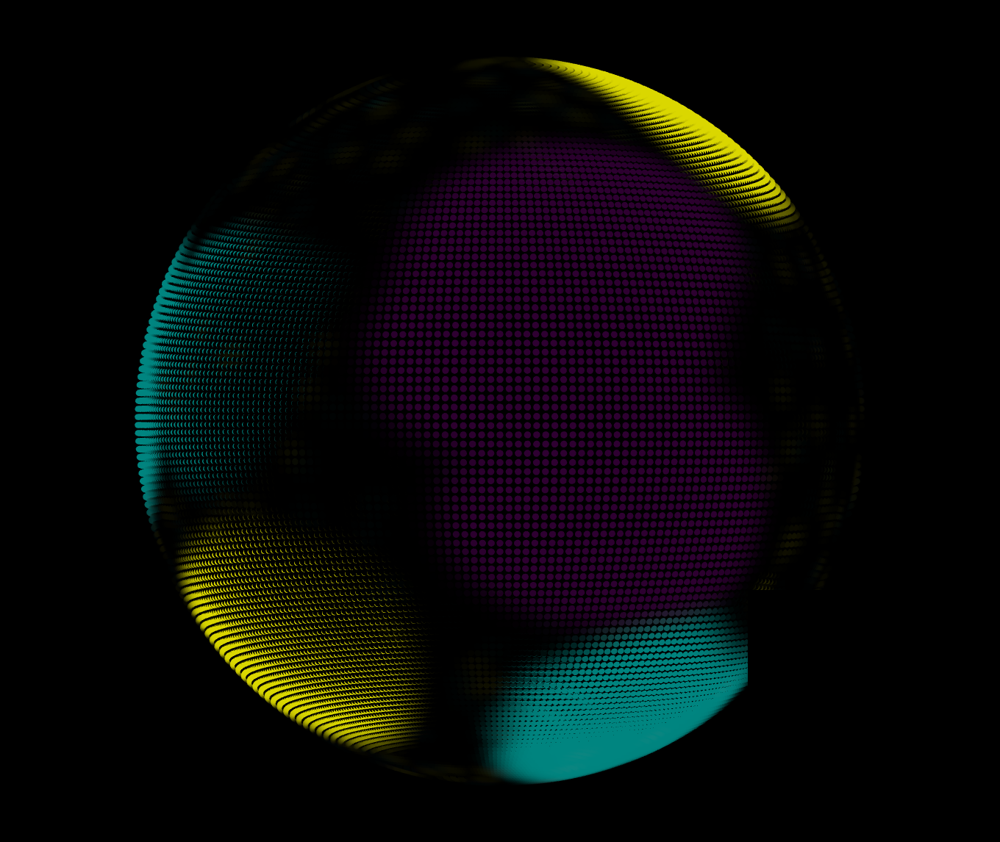</a></td>
<td valign="top">

#### BZReactionDiffusion

Simulates the Belousov-Zhabotinsky reaction — a 3-species cyclic competition (A beats B, B beats C, C beats A) producing rotating spiral waves. The simulation runs on a spherical k-nearest-neighbor graph (`ReactionGraph`: 7680 nodes, 6 neighbors each, precomputed Fibonacci lattice) with configurable diffusion rate and time step. Spiral waves are seeded periodically and evolve continuously.

**Parameters**: Compete (cyclic-competition/predation coefficient), Diff (diffusion rate), Speed (time step)

</td></tr></table>

<table border="0"><tr>
<td width="300"><a href="https://woundedlion.github.io/daydream/?effect=GSReactionDiffusion" target="_blank">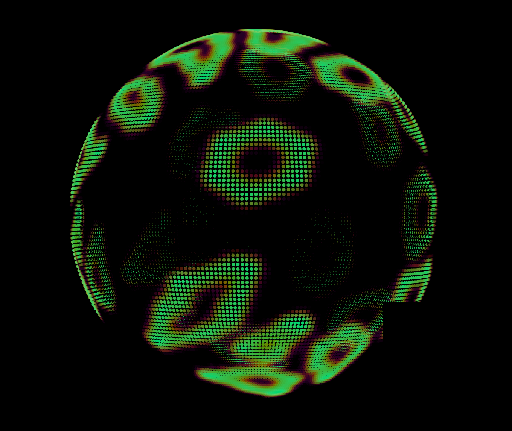</a></td>
<td valign="top">

#### GSReactionDiffusion

Gray-Scott reaction-diffusion system (U + 2V → 3V, V → P) on a spherical mesh. Produces spots, stripes, and labyrinthine patterns depending on feed/kill rates.

</td></tr></table>

<table border="0"><tr>
<td width="300"><a href="https://woundedlion.github.io/daydream/?effect=HopfFibration" target="_blank">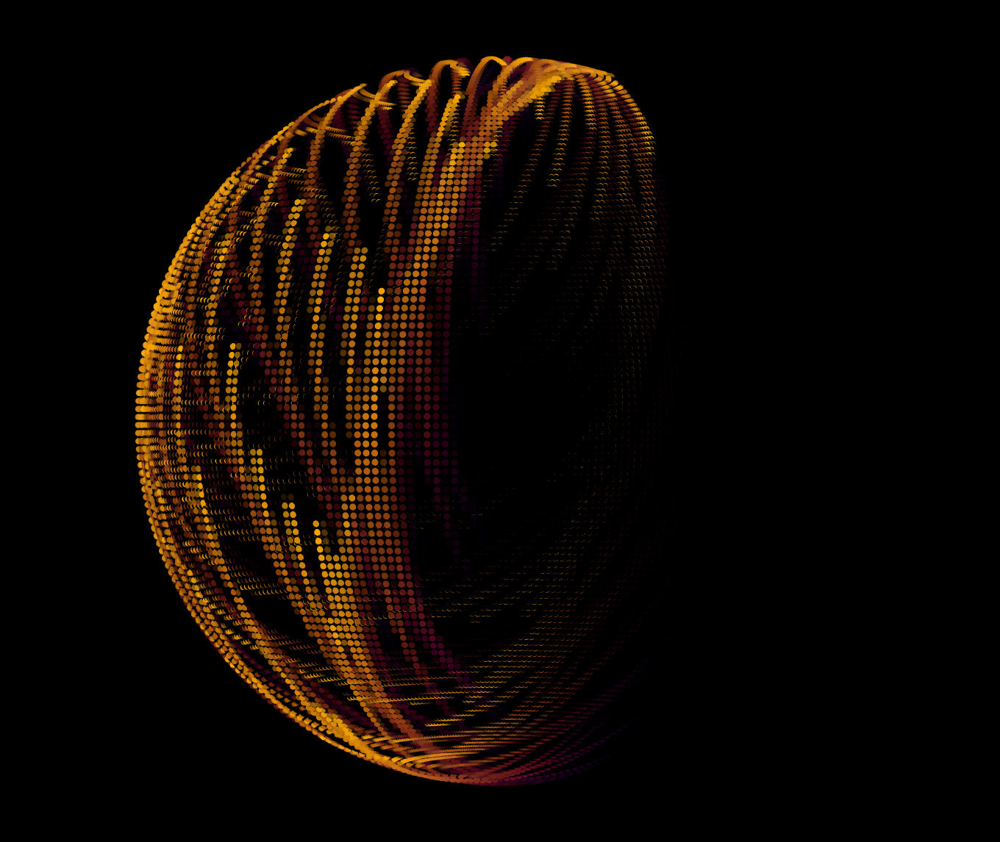</a></td>
<td valign="top">

#### HopfFibration

Visualizes the Hopf fibration — a map from S³ to S². Points on S² (the base space) are lifted to fibers on S³ via the quaternion parameterization `q = [cos(η)cos(φ+β), cos(η)sin(φ+β), sin(η)cos(β), sin(η)sin(β)]`, then stereographically projected to R³ and plotted on the sphere. A 4D tumble (R_xw × R_yz rotation) continuously rotates the fibration.

**Parameters**: Flow Spd, Tumble Spd, Folding, Twist, Alpha

</td></tr></table>

<table border="0"><tr>
<td width="300"><a href="https://woundedlion.github.io/daydream/?effect=IslamicStars" target="_blank"></a></td>
<td valign="top">

#### IslamicStars

Procedurally generates Islamic geometric patterns using Hankin's method (pentagon-based subdivision of the Archimedean solids). Each face of a rotating solid is decorated with its characteristic star polygon, colored by face topology (triangles, pentagons, hexagons, etc.). Ripple waves periodically distort the geometry.

**Parameters**: Duration, Fade, Burst, Ripp Amp, Ripp Decay, Ripp Dur, Debug BB

</td></tr></table>

<table border="0"><tr>
<td width="300"><a href="https://woundedlion.github.io/daydream/?effect=HankinSolids" target="_blank">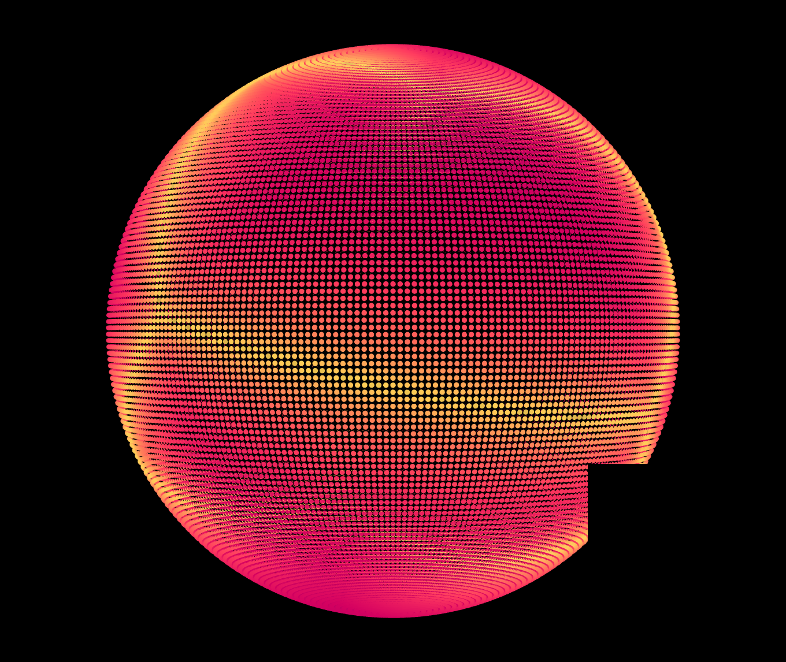</a></td>
<td valign="top">

#### HankinSolids

Similar to IslamicStars but sequences through the Platonic and Archimedean solids with animated palette transitions.

</td></tr></table>


<table border="0"><tr>
<td width="300"><a href="https://woundedlion.github.io/daydream/?effect=SphericalHarmonics" target="_blank">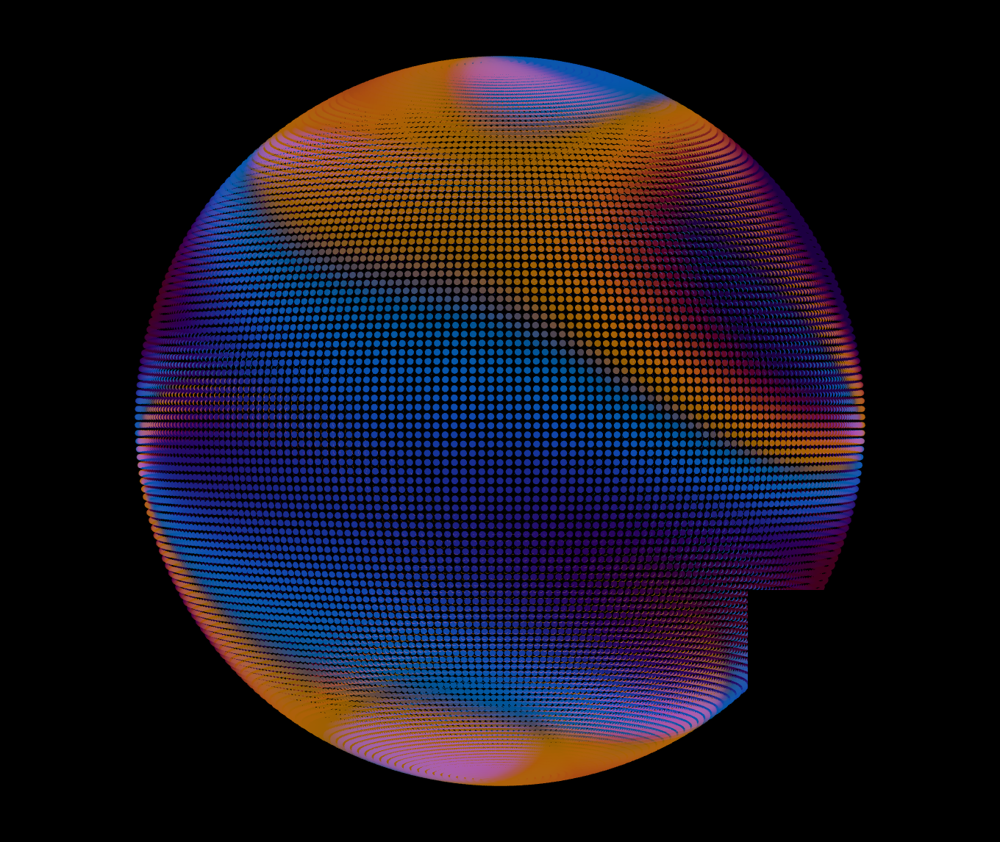</a></td>
<td valign="top">

#### SphericalHarmonics

Visualizes the real spherical harmonics Yˡₘ(θ, φ) as a colored scalar field over the sphere: the harmonic value drives a perceptual positive/negative palette split with ambient-occlusion shading. Continuously morphs between (l, m) modes.

</td></tr></table>

<table border="0"><tr>
<td width="300"><a href="https://woundedlion.github.io/daydream/?effect=MobiusGrid" target="_blank">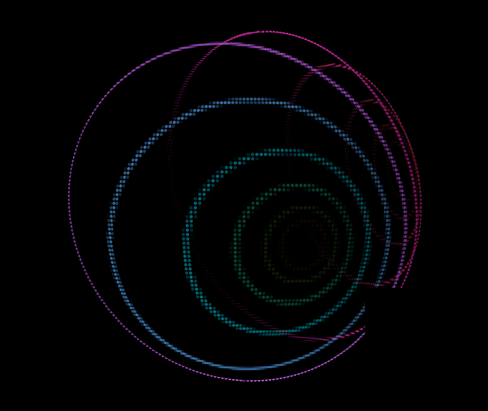</a></td>
<td valign="top">

#### MobiusGrid

A latitude-longitude grid that undergoes live Möbius transformation animation via `MobiusWarpCircularTransformer`.

**Parameters**: Rings, Lines, Alpha

</td></tr></table>

<table border="0"><tr>
<td width="300"><a href="https://woundedlion.github.io/daydream/?effect=Moire" target="_blank">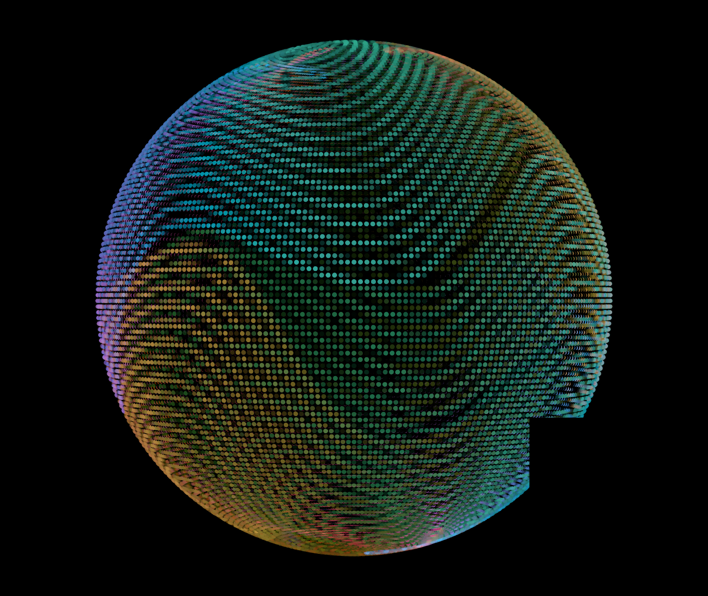</a></td>
<td valign="top">

#### Moire

Two counter-rotating families of concentric rings that beat against each other into a shifting moiré interference pattern, driven by an animated ring-distortion amplitude.

**Parameters**: Alpha, Density, Amp

</td></tr></table>

<table border="0"><tr>
<td width="300"><a href="https://woundedlion.github.io/daydream/?effect=FlowField" target="_blank">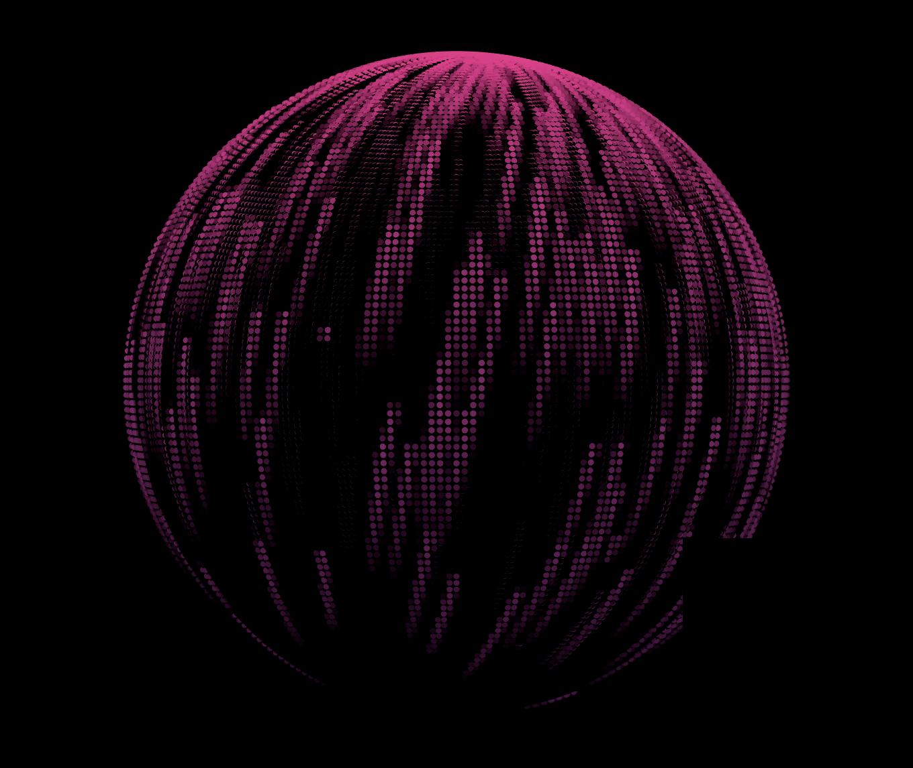</a></td>
<td valign="top">

#### FlowField

FastNoiseLite-driven flow field. Three independently offset 3D-noise channels form a per-particle force vector that is added to each particle's velocity (not curl noise, not a scalar gradient).

**Parameters**: Scale, Force, Max Spd, Alpha, Time Spd

</td></tr></table>

<table border="0"><tr>
<td width="300"><a href="https://woundedlion.github.io/daydream/?effect=Voronoi" target="_blank">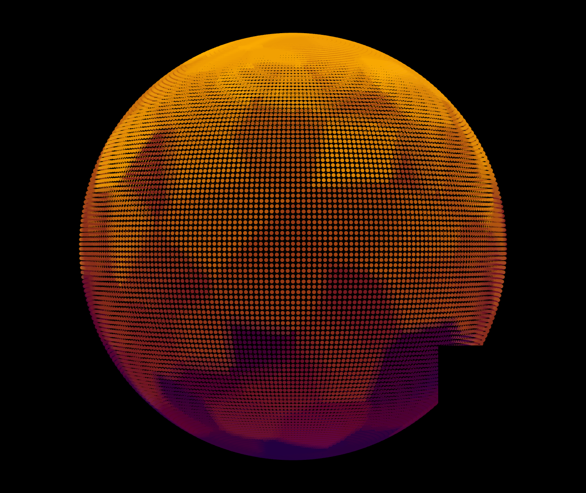</a></td>
<td valign="top">

#### Voronoi

Spherical Voronoi diagram with animated seed positions. Cells are always filled with per-site palette colors (blended across the seam between the nearest two sites); an optional black border seam is painted between neighboring cells when **Border Thick** > 0 (off by default).

**Parameters**: Num Sites, Speed, Sharpness, Border Thick

</td></tr></table>

<table border="0"><tr>
<td width="300"><a href="https://woundedlion.github.io/daydream/?effect=PetalFlow" target="_blank">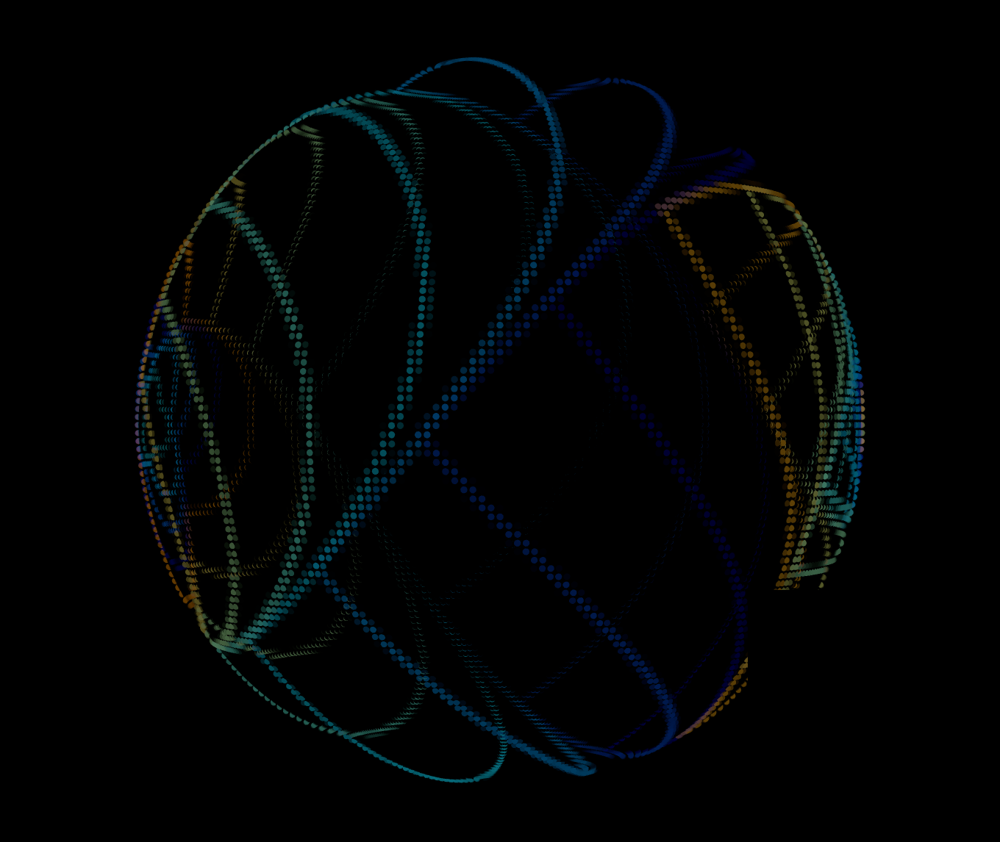</a></td>
<td valign="top">

#### PetalFlow

Polyline rings drift pole-to-pole through an inverse stereographic projection, each wobbled into petal lobes and twisted by an angle that grows with its position; rasterized via Plot.

**Parameters**: Twist, Speed, Alpha

</td></tr></table>

<table border="0"><tr>
<td width="300"><a href="https://woundedlion.github.io/daydream/?effect=DreamBalls" target="_blank">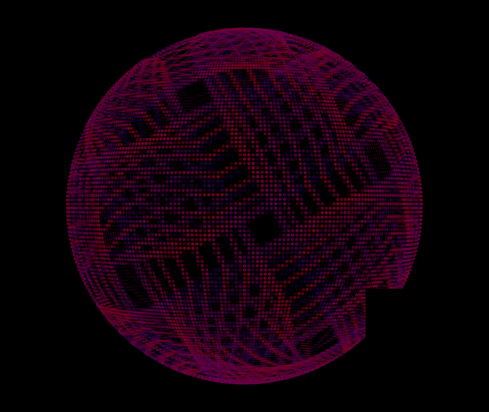</a></td>
<td valign="top">

#### DreamBalls

Draws twisting wireframe knotted structures derived from Archimedean solids. Mesh vertices are displaced along per-vertex tangent frames to create orbiting knot patterns, and a Möbius warp is applied to the geometry. Multiple copies orbit simultaneously while the whole structure tumbles under a slow Languid random-walk view orientation punctuated by periodic full-sphere spins.

**Parameters**: Copies (number of knot copies), Radius (displacement), Speed (orbit speed), Warp (Möbius warp scale), Alpha

</td></tr></table>

<table border="0"><tr>
<td width="300"><a href="https://woundedlion.github.io/daydream/?effect=Comets" target="_blank">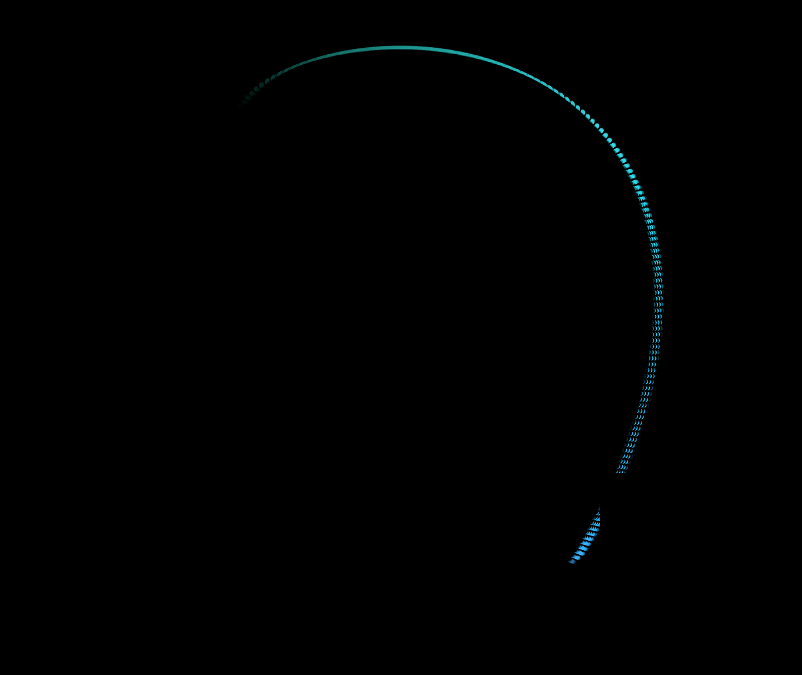</a></td>
<td valign="top">

#### Comets

A single head traces spherical Lissajous curves, cycling through a dozen configurations, trailed by a long 115-frame orientation tail and periodically wiping the palette to a fresh triadic scheme.

**Parameters**: Alpha, Thickness, Cycle Dur, Debug BB

</td></tr></table>

<table border="0"><tr>
<td width="300"><a href="https://woundedlion.github.io/daydream/?effect=RingSpin" target="_blank">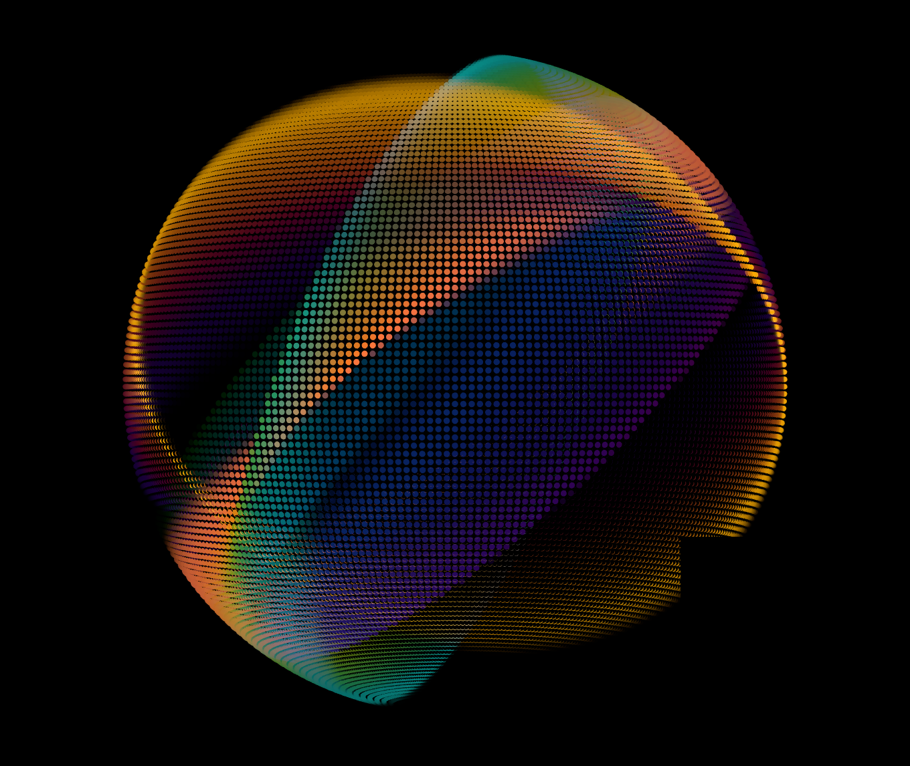</a></td>
<td valign="top">

#### RingSpin

Four great-circle rings tumble continuously under energetic random-walk rotation, each leaving a fading motion-blur trail of its recent orientations (drawn with `Scan::Ring`, head and tail of the trail thickened). Each ring is colored by a baked vignette palette.

**Parameters**: Alpha, Thickness, Show Bounding

</td></tr></table>

<table border="0"><tr>
<td width="300"><a href="https://woundedlion.github.io/daydream/?effect=RingShower" target="_blank">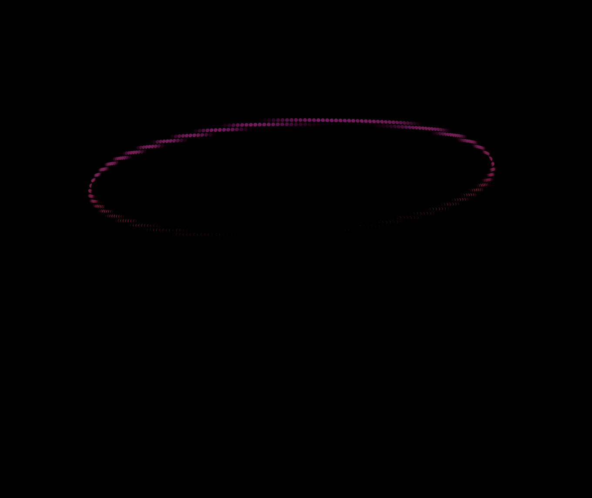</a></td>
<td valign="top">

#### RingShower

Rings bloom at random orientations and grow their radius from zero, fading in over the first few frames and then holding (no fade-out), colored by a generative circular analogous palette — a continuous shower of expanding rings drawn with `Plot::Ring`. Each ring's radius, fade, and lifetime are pure functions of its age driven directly from a recyclable slot rather than a per-ring `Sprite`.

**Parameters**: Alpha

</td></tr></table>

<table border="0"><tr>
<td width="300"><a href="https://woundedlion.github.io/daydream/?effect=ChaoticStrings" target="_blank">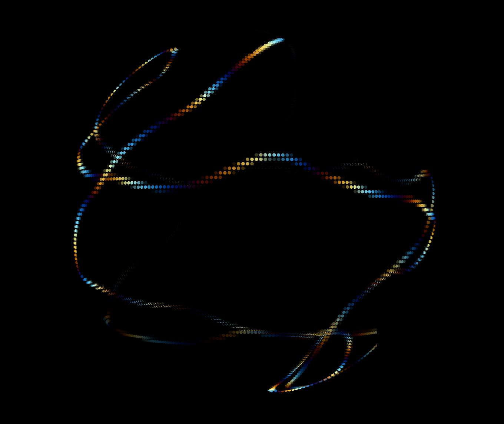</a></td>
<td valign="top">

#### ChaoticStrings

A head traces a fixed 12:5 spherical Lissajous figure whose long trail is continuously warped by a noise transformer, over a slowly cycling gradient palette.

**Parameters**: Alpha, Cycle Dur, Speed, Jitter Amp, Noise Freq, Scale Factor, Cycle Speed

</td></tr></table>

<table border="0"><tr>
<td width="300"><a href="https://woundedlion.github.io/daydream/?effect=MeshFeedback" target="_blank">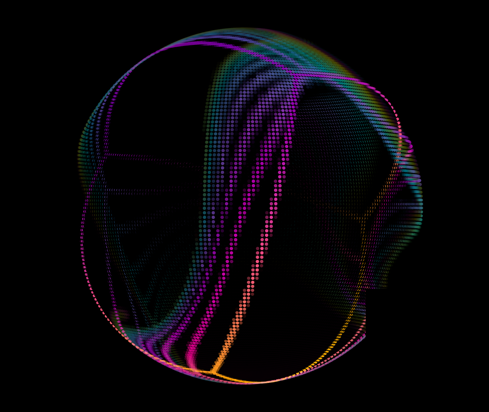</a></td>
<td valign="top">

#### MeshFeedback

Platonic solid mesh faces rendered with `Plot::Mesh`, given a noise-distorted, feedback-loop appearance via `Filter::Pixel::Feedback`. Cycles through the Platonic solid library, crossfade-morphing between shapes with `Animation::MeshMorph`, while a `Presets` cycle hard-cuts the feedback/distortion style parameters.

</td></tr></table>

<table border="0"><tr>
<td width="300"><a href="https://woundedlion.github.io/daydream/?effect=Liquid2D" target="_blank">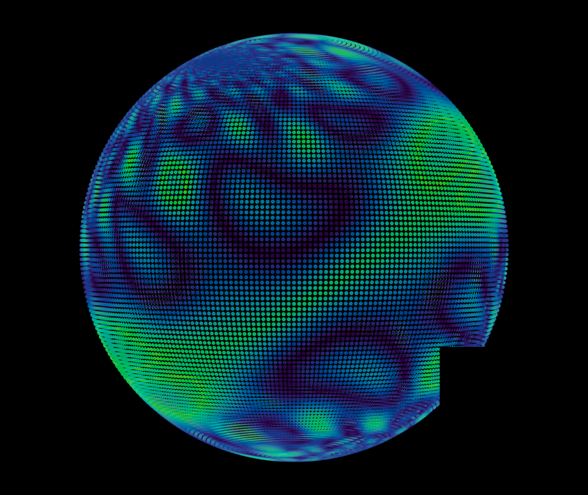</a></td>
<td valign="top">

#### Liquid2D

Stereographic-projection shader (extends `Effect` directly) that samples world-space through a configurable glitch lens (hemisphere mirror + squish/warp). Dual random-walk orientations animate the view and global rotation independently, producing flowing liquid distortion. Uses `Scan::Shader::draw` for full-screen pixel shading and `StaticPalette` with a `BreatheModifier` for animated palette cycling.

**Parameters**: Warp Scale, Warp Strength, Pattern Freq, Time Speed, Complexity, Pole Fade, Cycle Speed

</td></tr></table>

<table border="0"><tr>
<td width="300"><a href="https://woundedlion.github.io/daydream/?effect=MindSplatter" target="_blank">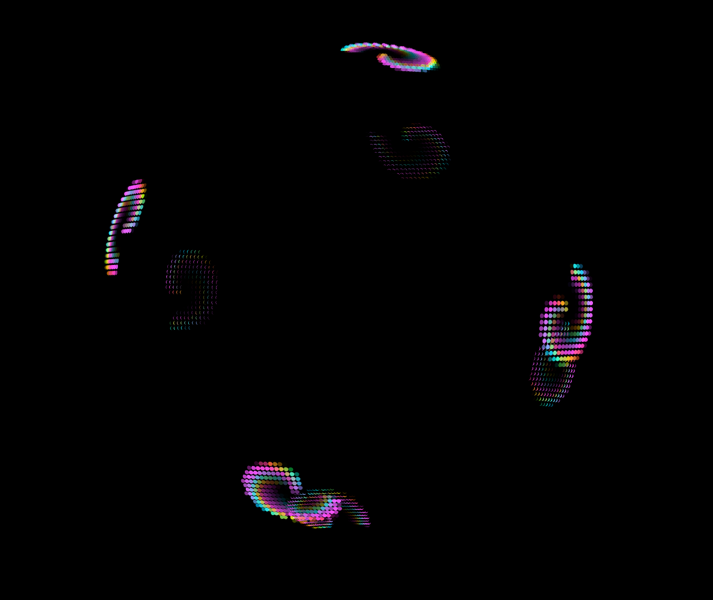</a></td>
<td valign="top">

#### MindSplatter

Random-walk particle system with Möbius warp bursts.

**Parameters**: Friction, Well Str, Init Spd, Ang Spd, Particles

</td></tr></table>

<table border="0"><tr>
<td width="300"><a href="https://woundedlion.github.io/daydream/?effect=Dynamo" target="_blank">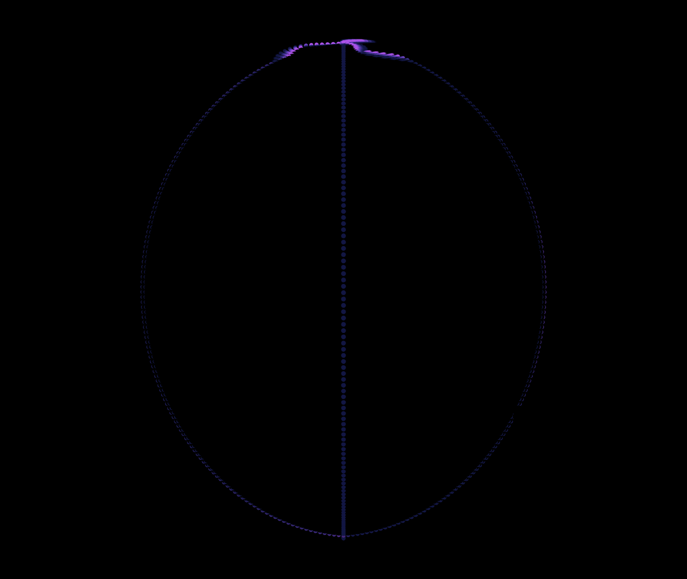</a></td>
<td valign="top">

#### Dynamo

A vertical strand of points — one per latitude row — drifts horizontally around the sphere, each row dragging the next under a gap constraint so the chain wavers like a wind-blown curtain. The strand leaves motion trails, is replicated three times around the sphere, periodically reverses direction, and tumbles under random-axis rotations, while periodic color wipes sweep freshly generated analogous palettes across it.

**Parameters**: Speed, Gap, Trail Len, Wipe Dur

</td></tr></table>

<table border="0"><tr>
<td width="300"><a href="https://woundedlion.github.io/daydream/?effect=Thrusters" target="_blank">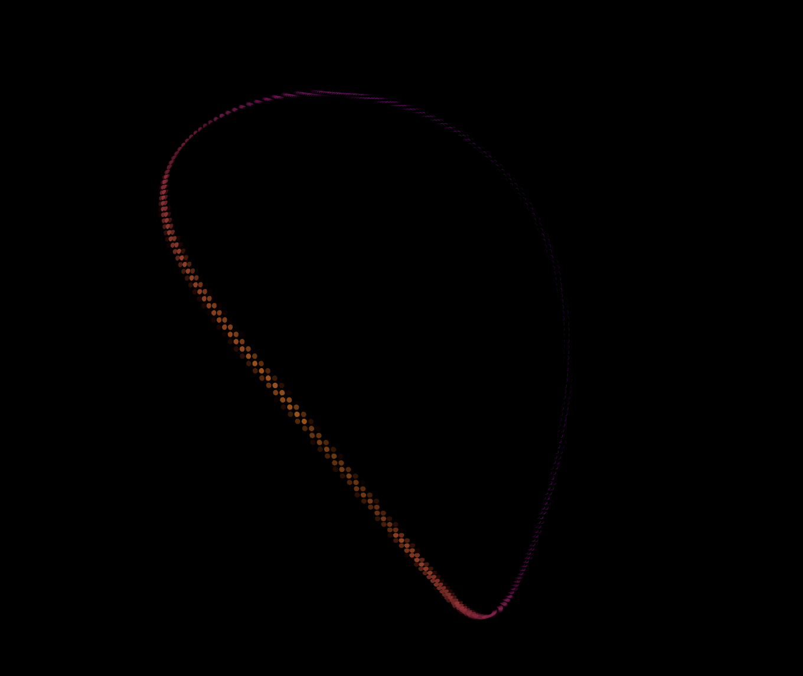</a></td>
<td valign="top">

#### Thrusters

A central distorted ring (`Plot::DistortedRing`) warps and spins; periodic random "fires" kick it onto a new axis and bloom a pair of opposed thrust rings (`Plot::Ring`) that expand from zero and fade out.

**Parameters**: Radius, Alpha

</td></tr></table>

<table border="0"><tr>
<td width="300"><a href="https://woundedlion.github.io/daydream/?effect=GnomonicStars" target="_blank">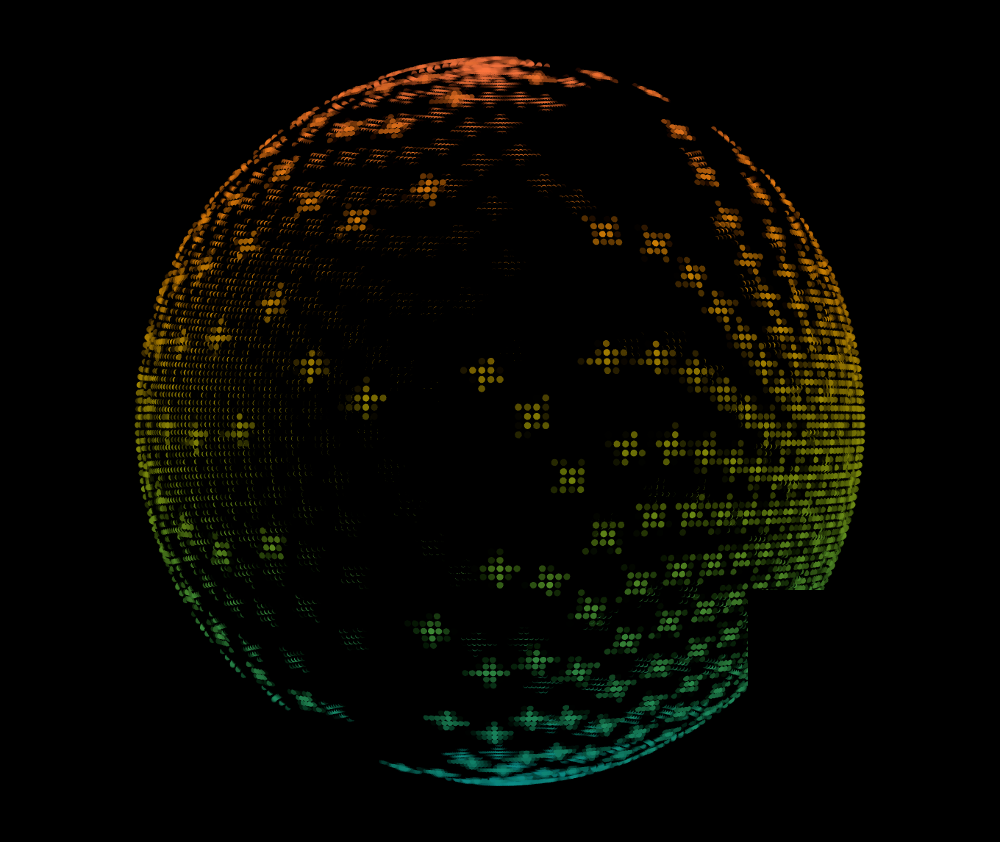</a></td>
<td valign="top">

#### GnomonicStars

A Fibonacci-spiral field of star-polygon SDFs, continuously deformed by an evolving Möbius warp (built on a gnomonic-projection transformer) and slowly tumbled by a Languid random walk.

**Parameters**: Points, Radius, Sides, Debug BB, Warp Speed

</td></tr></table>

<table border="0"><tr>
<td width="300"><a href="https://woundedlion.github.io/daydream/?effect=Raymarch" target="_blank">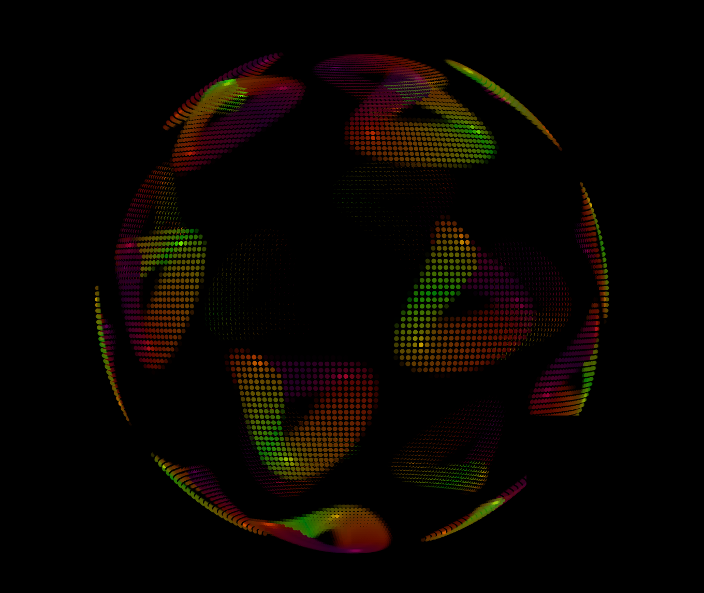</a></td>
<td valign="top">

#### Raymarch

Volumetric raymarcher that renders twisted tori at the 20 vertices of a dodecahedron. Each torus is ray-marched with `Scan::Volume::draw` and lit with metallic Blinn-Phong shading (half-Lambert diffuse, specular highlights, Fresnel rim). A random-walk animation drives the camera orientation.

**Parameters**: Pulse Speed, Core Size, Max Steps, Diffuse, Specular, Fresnel, Twist, AA Width

</td></tr></table>

<table border="0"><tr>
<td width="300"><a href="https://woundedlion.github.io/daydream/?effect=Flyby" target="_blank">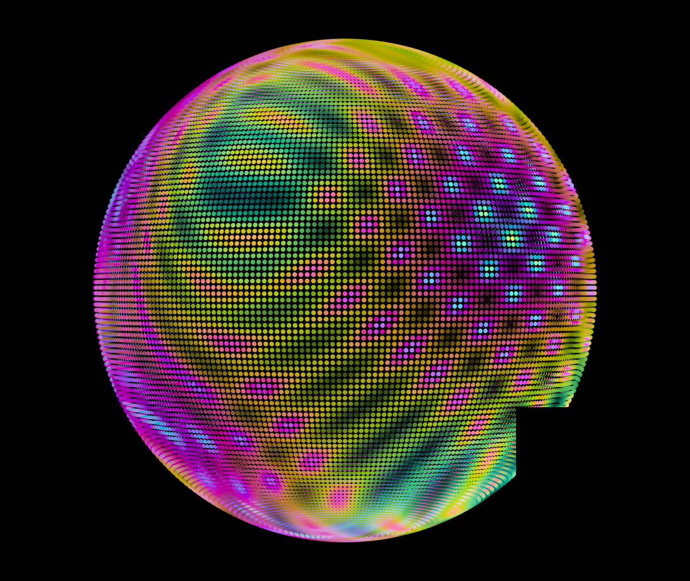</a></td>
<td valign="top">

#### Flyby

Stereographic-projection shader (extends `Effect` directly) with noise-driven warp distortion. A single `Rotation` animation continuously rotates the tangent plane around the Y-axis, producing a fly-through effect on the sphere surface. Uses `Scan::Shader::draw` for full-screen pixel shading with a baked palette.

**Parameters**: Warp Scale, Warp Strength, Pattern Freq, Speed, Pole Fade, Drift, Hue Shift

</td></tr></table>

<table border="0"><tr>
<td width="300"><a href="https://woundedlion.github.io/daydream/?effect=SplineFlow" target="_blank">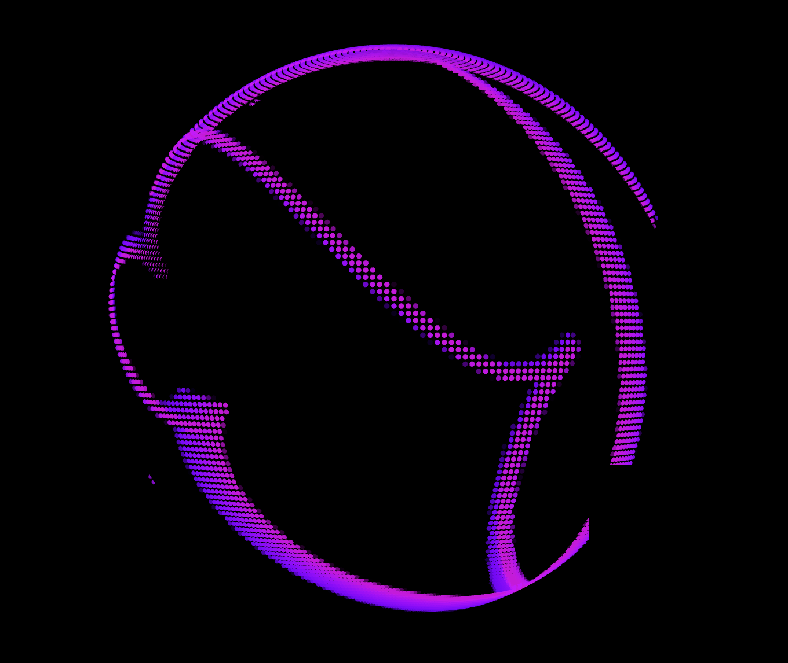</a></td>
<td valign="top">

#### SplineFlow

Catmull-Rom spline curves whose control points drift via independent random walks. Drawn with `Plot::SplineChain` in closed-loop mode through `World::Trails` for persistent trails, producing flowing organic ribbon paths.

**Parameters**: Tension, Speed, Drift, Num Pts, Alpha

</td></tr></table>

<table border="0"><tr>
<td width="300"><a href="https://woundedlion.github.io/daydream/?effect=DistortedRing" target="_blank">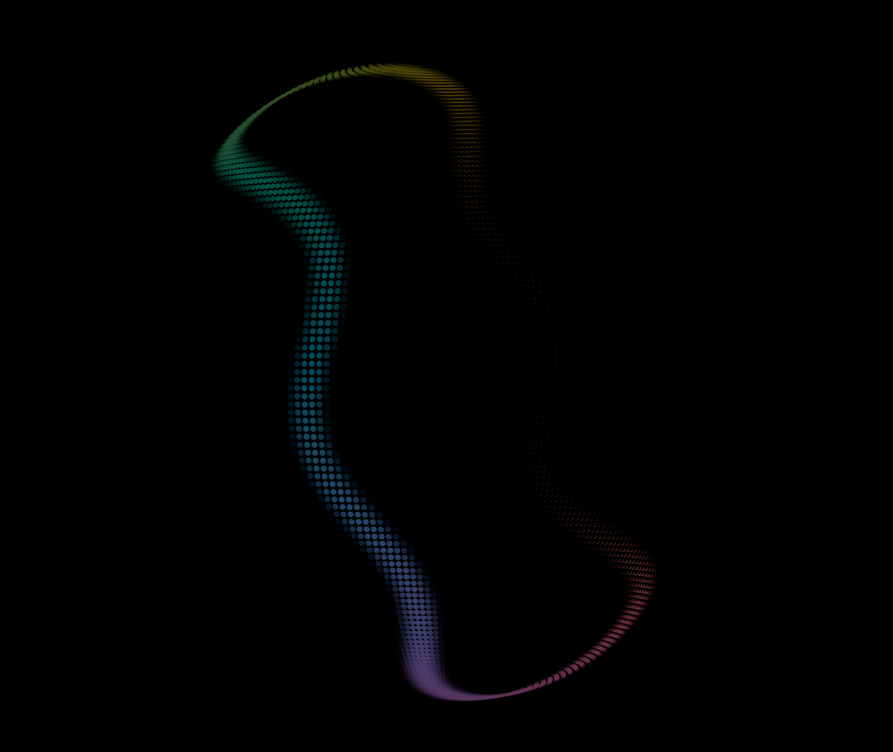</a></td>
<td valign="top">

#### DistortedRing

Concentric rings built from per-azimuth distorted ring SDFs, their radii oscillating via a sine-wave amplitude mutation while a random walk slowly reorients the stack.

**Parameters**: Alpha, MaxAmplitude, Thickness, Rings, Show Bounding

</td></tr></table>

<table border="0"><tr>
<td width="300"><a href="https://woundedlion.github.io/daydream/?effect=ShapeShifter" target="_blank">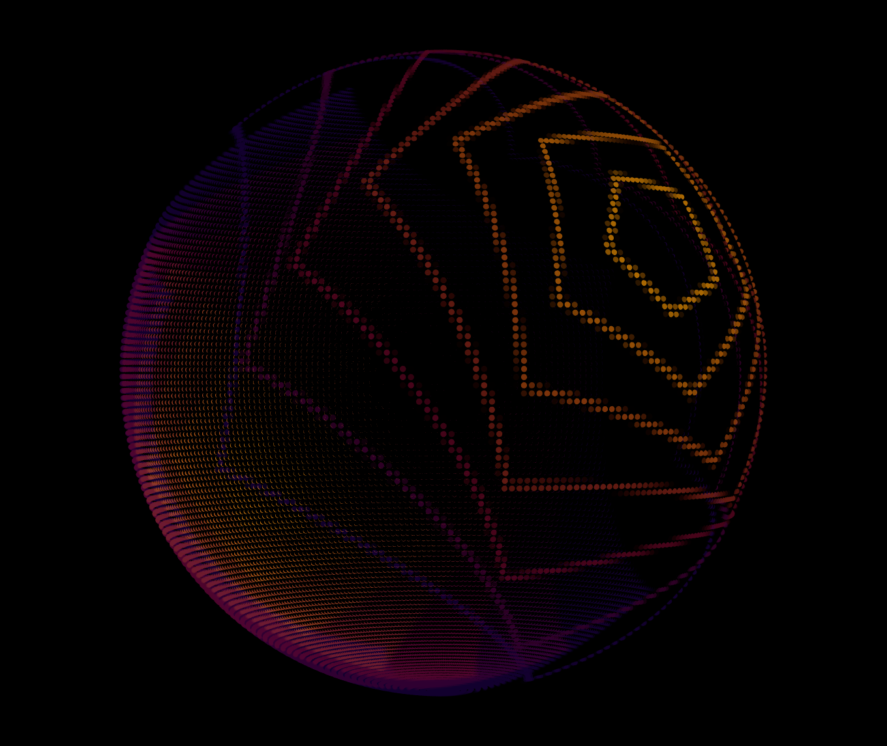</a></td>
<td valign="top">

#### ShapeShifter

Layered polygon, star, and flower rings (planar and spherical polygon variants) drawn through both the `Plot` and `Scan` rasterizers at once. The shape type hard-cuts to the next of four (planar polygon, spherical polygon, flower, star) every 48 frames while a twist Mutation shears the layers. All `Plot` rings share one tumbling orientation and all `Scan` rings share another, so layer Count scales with the raster budget rather than the timeline.

**Parameters**: Alpha, Count, Radius, Sides, Twist, Debug BB

</td></tr></table>

### Legacy Effects (`effects_legacy.h`)

TheMatrix, ChainWiggle, RingRotate, RingTwist, Curves, Kaleidoscope, StarsFade, DotTrails, Burnout, Fire, Spinner, Spiral, WaveTrails, RingTrails — built before the current engine and using an older rendering API. Functional but not representative of current architecture.

---

## 10. The Web Simulator (Daydream)

The [`daydream`](https://github.com/woundedlion/daydream) repo is a static web app that wraps the WASM build from this repo in a Three.js scene. The C++ rendering engine is unchanged — the same effect classes, the same arenas, the same per-frame `Pixel16[]` buffer. Daydream's job is to:

1. Drive the WASM engine one frame at a time at a fixed cadence.
2. Map each `(x, y, color)` pixel to a position on a 3D sphere and render it as an instanced dot mesh.
3. Provide a UI for switching effects, tuning parameters, sweeping resolutions, recording video, and exercising the segmented-POV multi-board mode.
4. Host five standalone geometry tools that reuse the engine's `MeshOps` for interactive design work.

### 10.1 Process and Threading Model

```
Main thread                                Web Workers (segment mode only)
─────────────                              ──────────────────────────────
index.html → vendor-importmap.js           segment_worker.js × N
              ↓ (resolves three/lil-gui    each owns its own WASM module
              ↓  to local or CDN)
            daydream.js (entry)            engine.setClip(x0,x1,y0,y1)
              ├─ createHolosphereModule()  engine.drawFrame()  → pixel slice
              ├─ Daydream (driver.js)      postMessage(Transfer pixels)
              │    ├─ Three.WebGLRenderer
              │    ├─ instanced dot mesh
              │    ├─ OrbitControls
              │    └─ PiP camera
              ├─ AppState + URLSync
              ├─ EffectSidebar
              ├─ lil-gui (params + global)
              └─ VideoRecorder (MediaRecorder)
```

A normal page load creates one WASM instance on the main thread. The dot mesh has one instance per LED pixel; the per-frame work is `instanceColor.needsUpdate = true` after the WASM buffer view is refreshed. When the user enables Segmented POV (§10.5), `daydream.js` spawns N Web Workers, each holding its own WASM module so the four-Teensy Phantasm layout can be exercised in software.

### 10.2 The WASM Bridge

`wasm.cpp` compiles to `holosphere_wasm.js` + `.wasm` and exposes a single `HolosphereEngine` class:

| Method | Description |
|---|---|
| `setResolution(w, h)` → `bool` | Switch active resolution (96×20 or 288×144); returns `false` on an unsupported size |
| `setEffect(name)` → `bool` | Instantiate a new effect by string name; resets all arenas to defaults; returns `false` on an unknown name |
| `drawFrame()` | Advance one frame and copy pixels to the output buffer |
| `getPixels()` | Return a zero-copy `Uint16Array` view into WASM linear memory |
| `getBufferLength()` → `int` | Length of the pixel buffer (`W × H × 3`) for sizing the view |
| `setParameter(name, value)` → `bool` | Update a live effect parameter; returns `false` if the write was not applied (no active effect, unknown name, read-only param, or non-finite value) |
| `setAnimationsPaused(paused)` | Freeze/resume the current effect's animation drivers (the GUI "Pause Animation" toggle) |
| `getParameterDefinitions()` | Return the parameter list; each entry is `{name, value, animated, readonly}`, and float params additionally carry `{min, max}` (bool params omit `min`/`max` and return `value` as a JS boolean) |
| `getParamValues()` | Return current parameter values (including animation-driven updates) |
| `getArenaMetrics()` | Memory usage stats for geometry, scratch, and tooling arenas, plus the stack high-water mark (see below) |
| `getEffectSizes()` | Return `sizeof` for every registered effect at the current resolution |
| `getSupportedResolutions()` → `[[w, h], …]` | *(static)* List the resolutions the build supports, as `[width, height]` pairs |
| `setClip(x0, x1, y0, y1)` → `bool` | Restrict rendering to a sub-rectangle (used by segment workers) |
| `getRenderUs()` → `double` | Last frame's rasterization time in microseconds (per-frame profiling) |
| `strobeColumns()` → `bool` | Whether the current effect renders as discrete strobed columns (dark inter-column gaps) rather than a continuous smeared band; `false` when no effect is set. Daydream reads it to decide whether to fill the inter-column gap |

The bridge also exposes a `MeshOps` class — used by the `solids.html` geometry tool — with dedicated tooling arenas (an 8 MB persistent arena plus two 4 MB scratch arenas — 16 MB total, separate from the engine's 330 KiB arena) for interactive solid manipulation.

Alongside the classes, the bridge exports a few free spline-evaluation functions — `spline_cubic_fast`, `spline_cubic_slerp`, and `spline_catmull_rom_tangents` — used by the `splines.html` tool so its Bézier / Catmull-Rom curves are evaluated by the same engine code the firmware uses rather than a JavaScript reimplementation.

The WASM bridge includes stack high-water-mark instrumentation: `stack_paint_canary()` fills the stack with a known pattern at init time, and `stack_high_water_mark()` scans for the deepest overwrite. This is reported via `getArenaMetrics()` and logged on every effect switch to catch stack-hungry template instantiations early.

Pixel data is 16-bit linear light (`uint16_t` per channel). The zero-copy `Uint16Array` view is bound directly as the instanced dot-mesh's `instanceColor` attribute, declared `normalized` so Three.js scales 0–65535 → 0–1 linear **on the GPU** — there is no per-pixel divide or float copy in JavaScript (Three.js expects linear color when `THREE.ColorManagement.enabled = true`):

```js
let wasmPixels = wasmEngine.getPixels();     // Uint16Array view, zero-copy
// The `true` flag marks the attribute normalized, so the GPU divides by 65535 on
// read. No JS-side divide or Float32 copy.
dotMesh.instanceColor =
    new THREE.InstancedBufferAttribute(wasmPixels, 3, /*normalized=*/ true);
// → instanced dot-mesh per-instance colors → WebGL renderer
```

The view aliases WASM linear memory and is **not** bound once: with
`ALLOW_MEMORY_GROWTH` (e.g. the lazy 16 MB MeshOps allocation) any later heap
growth detaches the `ArrayBuffer` and leaves the cached view zero-length. Re-fetch
it after anything that may allocate — a resolution/effect change, and defensively
each frame — rebinding `instanceColor` to a fresh `getPixels()` view when the old
one has detached (`wasmPixels.byteLength === 0`), mirroring `daydream.js`'s
`refreshPixelView`. Copying the snippet without this guard ships a latent
black-frame-after-growth bug.

### 10.3 The Three.js Renderer (`driver.js`)

The `Daydream` class owns the entire render side. Features:

| Feature | Details |
|---|---|
| **Instanced dot mesh** | One `InstancedMesh` of `W × H` small spheres. Per-instance position is precomputed in `setupDots()` from `pixelToVector(x, y)`; per-instance color is updated each frame from the WASM pixel buffer. Single draw call per frame. |
| **Linear color pipeline** | `THREE.ColorManagement.enabled = true` and `setPixelRatio(min(devicePixelRatio, 1))`. Colors arriving from WASM are already linear, so no extra conversion. |
| **OrbitControls camera** | A normal `PerspectiveCamera` at `(0, 0, 220)` with FOV 20°, plus `OrbitControls` for mouse/touch navigation. |
| **Picture-in-picture** | A clone of the main camera at a fixed orientation renders to a 30%-sized bottom-right viewport so the front and back of the sphere are visible simultaneously. Suppressed when `isMobile` or `navigator.webdriver` (§ headless capture). |
| **Axes overlay** | Three `THREE.Line`s for X/Y/Z visible on toggle, plus a `CSS2DRenderer`-backed `LabelPool` for "+X / +Y / +Z" labels with zero allocation per frame. |
| **Resize observer** | `ResizeObserver` on the canvas container recomputes camera aspect, viewport, and `isMobile` (width ≤ 900). |
| **Fixed-rate stepping** | The simulation ticks at `1/FPS` seconds independent of the actual render rate, with a time accumulator to keep effects deterministic. |

### 10.4 Application State (`state.js`)

Daydream uses a tiny pub/sub state container plus a URL-syncing wrapper:

```js
const appState = new AppState({ effect: 'IslamicStars', resolution: 'Phantasm (144x288)' });
new URLSync(appState, ['effect', 'resolution']);  // mirrors keys to query string

appState.subscribe((key, value, old) => {
  if (key === 'effect') applyEffect();
  else if (key === 'resolution') applyResolution();
});
```

- **`AppState`** — flat key→value store with a `subscribe(callback)` API. Setting a key fires the callback only if the value actually changed. The sidebar and lil-gui both write through `appState.set(...)`, so they stay in sync without explicit coupling.
- **`URLSync`** — reads tracked keys from `window.location.search` on construction (URL beats default), then debounces writes back to the query string via `history.replaceState`. Shareable links like `?effect=Raymarch&resolution=Phantasm%20(144x288)` work out of the box.

### 10.5 The Effect Sidebar (`sidebar.js`)

The left-edge effect list is a small custom widget:

- **Persistent button references**: re-sorting by name or size (live `sizeof` from `getEffectSizes()`) re-appends the existing button nodes in the new order without recreating them; `setEffects()` itself rebuilds the list from scratch.
- **Keyboard navigation**: arrow keys move the focused button; Enter or Space selects.
- **Mobile horizontal scroll**: when laid out as a horizontal strip, scroll arrows fade in/out based on scroll position via a `ResizeObserver` + scroll listener.
- **Per-resolution filtering**: each resolution has its own curated effect list, shown in the sidebar. An effect that is not in the active resolution's list — including one hydrated from a `?effect=…` link — is replaced with that list's first effect, so only curated effects load at a given resolution.

### 10.6 GUI Auto-Generation

The effect parameter panel is entirely driven by what C++ registers via `registerParam()`. When an effect is loaded, the simulator calls `getParameterDefinitions()` and builds `lil-gui` controls:

```js
params.forEach(p => {
    const controller = gui.add(state, p.name, p.min, p.max);
    controller.onChange(v => wasmEngine.setParameter(p.name, v));
});
```

`getParamValues()` is polled each frame to sync the GUI with parameter values that the animation system has changed autonomously. The sync skips any control the user is currently interacting with to avoid fighting the slider. A per-effect **Reset** rebuilds the GUI from defaults, and **Export** copies the current `{ name, value }` set as a C++-formatted initializer suitable for `Presets<…>` arrays.

### 10.7 Segmented POV Workers (`segment_worker.js`)

Phantasm in hardware is four Teensys each rendering a quadrant of the canvas — one arm's half-width crossed with a Y-band, computed by the engine's `segment_map()`/`segment_x_col()` (`pov_segment_map.h`). Daydream reproduces the *partitioning* in software — its `computeSegmentRange()` (`segment_layout.js`) mirrors the engine's arm/Y-band split (a general even-N tiler that also drives the 2–8-way preview), though it does not model the bottom segment's reversed strip direction (`y_step = -1`) or the hardware's power-of-two segment-count constraint — so the band partition, not the full strip wiring, is exercised before fabrication. A `SegmentController` (`segment_controller.js`) owns the worker pool — dispatching renders (`renderParallel()`), fencing stale frames by generation, and compositing results (`composite()`) — while each `segment_worker.js` hosts one WASM instance:

```
Main thread                  Workers (one WASM each)
───────────                  ──────────────────────────
drawFrame() {                postMessage({type:'render'})
  if (pendingSegmentFrame)
    controller.composite();    worker N:
  controller.renderParallel();   engine.setClip(xN0, xN1, yN0, yN1)
}                                engine.drawFrame()
                                 postMessage({type:'frame', pixels:Transferable})
```

Key properties:
- **Isolated WASM instances per worker** — each segment has its own arena, its own random seed (`Pcg32(1337)` is deterministic, so all workers produce the same result), and its own effect state.
- **`setClip(x0, x1, y0, y1)`** — for a non-stateful effect the WASM engine restricts *rendering* to the worker's quadrant: the rasterizer's scanline culling skips out-of-clip rows and columns, so out-of-band pixels are never shaded. The pixel readback in `drawFrame()` still copies the full canvas buffer; `segment_worker.js` then extracts just the quadrant rectangle from it (the `pixelsCopy` loop in the render handler) before transferring the result back, so only the quadrant crosses the worker boundary.
- **Cross-segment stateful effects render full-frame** — an effect whose per-frame state reads pixels *outside* the worker's band (`MeshFeedback`'s feedback warp samples the previous frame at unbounded offsets; `Dynamo`/`SplineFlow` reproject `World::Trails` under rotation) cannot be band-clipped: a clipped worker would have stale/zero history outside its band, so cross-band trails read as black and seams appear. Those effects report `Effect::needs_full_frame()` (derived from a compile-time `any_crosses_segments` filter-pipeline trait), and `setClip` leaves their clip at the full canvas — every worker computes the bit-identical full frame and `segment_worker.js` slices its quadrant from the full readback. This mirrors the device exactly, where each board independently renders the whole canvas; only non-stateful effects keep segmented rendering's clipping win. Design: `docs/segmented_stateful_effects_spec.md`.
- **One-frame pipeline** — frame N's render is dispatched fire-and-forget; frame N-1's results are composited synchronously when they arrive. Wall-clock time is measured against the slowest worker — exactly what the multi-Teensy hardware sees.
- **Boundary overlay** — a "Show Boundaries" toggle paints cyan markers on the segment edges in the composite buffer to make the partition visible.

### 10.8 Vendor Importmap (Local-First / CDN Fallback)

`vendor-importmap.js` is loaded as a regular (non-module) `<script>` in every HTML page. At parse time it:

1. Locates itself via `document.currentScript.src`, so it works whether called as `./vendor-importmap.js` (root) or `../vendor-importmap.js` (a tool page).
2. Reads a build-time-baked `VENDOR` decision (per library, `'cdn'` or `'local'`).
3. Builds a `<script type="importmap">` with local page-relative URLs for any `'local'` library, otherwise jsdelivr URLs pinned to versions from `package.json`.
4. Injects that importmap into `<head>` before any module loads.

The local-vs-CDN choice is **baked at build time**, not probed at runtime — there is no main-thread-blocking synchronous XHR and nothing 404s on the CDN-only Pages deploy. The committed default is all-CDN, which is what the deploy and a fresh checkout serve. For offline / local dev with a populated `three.js/` and `node_modules/`, run `npm run importmap:local` (detects vendored dirs and rewrites the `VENDOR` block); `npm run importmap` reverts to all-CDN. The generated `local` block must not be committed — it would break the live deploy.

A page-specific local import (e.g. `solids.html` referencing `../solids.js`) is added by setting `window.__DAYDREAM_EXTRA_IMPORTS` before the helper script.

### 10.9 Video Recording (`recorder.js`)

A `VideoRecorder` wraps `MediaRecorder` over `canvas.captureStream(0)` — the manual-frame-request mode where frames are taken on demand instead of on wall-clock. After every simulation tick, `recorder.captureFrame()` requests a frame from the stream; this means recorded video is locked to the effect's simulation rate (16 FPS by default) regardless of how fast the browser actually renders. The result is byte-perfect repeatability between recordings.

Codec priority is MP4/H.264 → WebM/VP9 → WebM/VP8, with optional offscreen-canvas downscaling to a target height for size-controlled exports.

### 10.10 Resolution Presets

| Name | Width × Height | Notes |
|---|---|---|
| `Holosphere (20x96)` | 96 × 20 | Matches the original Holosphere hardware |
| `Phantasm (144x288)` | 288 × 144 | Matches Phantasm; default in the web simulator |

Switching presets does a full WASM reset: `setResolution(w, h)` updates the active width/height and drops the current effect — the pixel buffer is pre-sized to `MAX_W × MAX_H` and deliberately never resized (a realloc could move its backing store under `ALLOW_MEMORY_GROWTH` and detach every outstanding `getPixels()` view), so `getPixels()` returns a view over just the active prefix. `setEffect(name)` then rebuilds the effect at the new template instantiation. The sidebar swaps to the matching favorites list (§10.5).

### 10.11 Geometry Tools (`daydream/tools/`)

Five standalone HTML pages. Four render with their own Three.js scene; `palettes.html` renders with 2D canvas contexts. `solids.html` and `splines.html` are backed by the engine's WASM build so their geometry stays identical to the C++ engine — `solids.html` via the `MeshOps` class, `splines.html` via the exported spline evaluators (`spline_cubic_fast` / `spline_cubic_slerp` / `spline_catmull_rom_tangents`); the other three implement their geometry math directly in JavaScript:

| Tool | What it does |
|---|---|
| `lissajous.html` | Designs spherical Lissajous curves with live frequency / phase / amplitude sliders; outputs a C++ `LissajousParams` initializer for the engine's Lissajous effects (`ChaoticStrings`, `Comets`). |
| `mobius.html` | Visualizes Möbius transformations on the sphere via stereographic projection; lets you sweep the four complex coefficients and see the warp on a latitude-longitude grid. |
| `palettes.html` | Tunes `ProceduralPalette` cosine coefficients and `GenerativePalette` harmony rules and exports the C++ initializer; renders its swatches and graphs on 2D canvas contexts rather than a Three.js scene. |
| `solids.html` | Conway operator playground — chain `truncate`, `kis`, `ambo`, `dual`, etc. on Platonic / Archimedean / Catalan / Islamic-pattern seeds and visualize the result. Backed by the WASM `MeshOps` bridge with dedicated tooling arenas (16 MB, separate from the engine's 330 KiB arena). |
| `splines.html` | Dual-mode (Bézier / Catmull-Rom) spherical spline designer with closed-loop and open-chain modes; click to add control points, drag to edit, export the control points as a `constexpr std::array<Vector>` or as `Fragment` positions. Spline evaluation runs through the engine's exported WASM spline functions (the tool's single source of truth). |

All five reuse `vendor-importmap.js`, so they resolve from the CDN by default or from the local `three.js/` after `npm run importmap:local`.

---

## 11. Building

The two repos should be checked out as siblings so the WASM install step can write directly into the simulator tree:

```
work/
├── Holosphere/          (this repo — C++ engine + firmware + WASM build)
└── daydream/            (web simulator — receives WASM artifacts)
```

### Firmware (Arduino / Teensy 4.x) — Holosphere repo

Each hardware target has its own `.ino` entry point in `targets/`:

1. Install [Arduino IDE](https://www.arduino.cc/en/software) with Teensyduino (or use [Visual Micro](https://www.visualmicro.com/) for Visual Studio).
2. Install the `FastLED` library.
3. Open `targets/Holosphere/Holosphere.ino` (or `targets/Phantasm/Phantasm.ino`).
4. Set **Additional Include Directories** to: `../../core;../../effects;../../hardware`
5. Select **Board: Teensy 4.0**, **CPU Speed: 600 MHz**.
6. Upload.

> **Optional — headless size/layout gate (CI parity).** A PlatformIO build
> (`just teensy-size`, needs `pip install platformio`) compiles both firmware
> images on a stock machine and checks image size and memory-region layout
> against committed budgets — closing the device-only `#ifdef ARDUINO`
> compile/size blind spot VMicro alone leaves uncovered. It coexists with VMicro
> (it owns `.pio/`, never `__vm/`) and asserts the images *fit*, not byte-identity
> with the bench build. See [`docs/teensy_ci_gate_spec.md`](docs/teensy_ci_gate_spec.md).

Target-specific constants are defined in each `.ino` file (not a global `constants.h`):
```cpp
// targets/Holosphere/Holosphere.ino
static constexpr int NUM_PIXELS = 40;
static constexpr unsigned int RPM = 480;
```

Pin assignments are in `core/led.h` (also included by `hardware/pov_single.h`):
```cpp
static constexpr int PIN_DATA   = 11;
static constexpr int PIN_CLOCK  = 13;
static constexpr int PIN_RANDOM = 15;
```

### WASM Build — Holosphere repo (installs into daydream)

The build is driven by **CMake presets** ([`CMakePresets.json`](CMakePresets.json)) so the same commands work on any platform with CMake ≥ 3.29, Ninja, and [Emscripten](https://emscripten.org/). Set up the Emscripten environment once (`emsdk_env`, which exports `EMSDK`), then:

```bash
cmake --preset wasm-release                     # configure (Emscripten toolchain)
cmake --build  --preset wasm-release            # build holosphere_wasm.{js,wasm}
cmake --build  --preset wasm-release-install    # build + install into ../daydream/
```

Use `wasm-debug` for an unoptimized build with assertions (`-sASSERTIONS=1`). Build outputs go to `build/<preset>/`. The `justfile` provides cross-platform shortcuts that forward to these presets: `just build` (release), `just build-debug`, and `just install` (release + install into `../daydream`).

The WASM target (`CMakeLists.txt`, `EMSCRIPTEN` branch) configures:
- Source paths: `targets/wasm/wasm.cpp`, `core/memory.cpp`, `core/reaction_graph.cpp`
- Include paths: project root (for `effects/`, `hardware/`) and `core/` (for engine headers)
- `-sALLOW_MEMORY_GROWTH=1` — WASM heap can grow for large meshes
- `-sMODULARIZE=1 -sEXPORT_ES6=1` — ES6 module output
- `-sSTACK_SIZE=8192` — minimal stack (effects use arena allocation, not deep recursion)
- `-O3 -ffast-math -fno-finite-math-only -flto -msimd128` for release, `-O0 -g -sASSERTIONS=1` for debug (`-fno-finite-math-only` must follow `-ffast-math`, which otherwise folds `std::isfinite()` to true and lets the compiler assume no NaN/Inf — the render sink relies on real finite semantics)

The install step also writes `README.md` and `docs/screenshots/` so the daydream repo always serves the same documentation as Holosphere.

### Tests — Holosphere repo

The unit suite is a native (non-WASM) Clang build with asserts enabled, also driven by a preset:

```bash
cmake --preset tests          # configure (cmake/toolchain-native-clang.cmake)
cmake --build --preset tests  # build the run_tests executable
ctest --preset tests          # run the suite (or: just test)
```

The suite must use Clang — the engine relies on GCC/Clang `__attribute__` extensions MSVC rejects. The native toolchain file ([`cmake/toolchain-native-clang.cmake`](cmake/toolchain-native-clang.cmake)) locates Clang via `EMSDK` (or a sibling `../emsdk`) and, on Windows, transparently handles the resource compiler and `lld-link` so no Visual Studio Developer Prompt is required. Tests build with `-DHS_TEST_BUILD`, which only widens a couple of test-build buffer budgets (MSVC-STL `std::function` is larger than the device's `inplace_function`) — the firmware/WASM footprint is unchanged.

Coverage spans the math/geometry/memory core, color, easing/waves, the reaction-diffusion graph integrity, filters, the plot samplers and the Scan/mesh rasterizer, solids-registry invariants, the Conway/Hankin mesh operators, and animation. Beyond those unit checks the suite also runs: an effect smoke harness that constructs and renders every effect at 288×144 with asserts on, plus a cross-run determinism pass that re-renders each effect under a fixed clock and diffs the frames; a death harness that spawns subprocesses to confirm each `HS_CHECK` invariant traps; the Phantasm multi-board sync core (`hardware/pov_sync.h`, spec §12); the HD107S SPI wire-format and color-correction tests; the POV driver tiling proofs (each LED write covers the canvas exactly once); and the WASM param-marshaling coverage (the JS definition/value streams stay index-aligned). `tests/run_tests.cpp` is the driver; add a `tests/test_<module>.h`, then `#include` it and call its entry point there (two lines) to extend it.

#### Continuous testing

Three layers run the same suite so a regression can't reach the live demo:

- **Local pre-commit hook** ([`.githooks/pre-commit`](.githooks/pre-commit)) — builds + runs the suite before each commit. **On by default (opt-out):** configuring the `tests` preset points `core.hooksPath` at `.githooks` automatically. Skip a single commit with `HS_SKIP_TESTS=1 git commit …` (or `--no-verify`); disable the auto-enable with `-DHS_INSTALL_GIT_HOOKS=OFF`. Doc-only commits skip the suite.
- **Presubmit CI** (`.github/workflows/ci.yml`, Holosphere repo) — on every push and pull request, runs the native suite on both Linux (clang-18) and Windows (emsdk Clang, which exercises the `lld-link` / rc.exe toolchain branch from a plain shell), and builds the WASM module. It then **smoke-tests the WASM at runtime** ([`scripts/wasm_smoke.mjs`](scripts/wasm_smoke.mjs)) — instantiating the module the way the browser does and driving every registered effect at every enumerated resolution, so a SIMD-codegen fault, an embind signature mismatch, a stack overflow, or an `ALLOW_MEMORY_GROWTH` detachment fails here rather than riding a green build to deploy — and **verifies the install provenance trio** (`holosphere_wasm.wasm` + `.sha` + `.wasm.sha256`, the same artifacts the daydream deploy gate consumes), asserting the recorded `sha256` verifies and a clean checkout records no `-dirty` marker. The native suite there runs with `HS_SMOKE_FRAMES=120` to reach effect-lifecycle transitions the default short run skips.
- **Gated deploy** (`.github/workflows/deploy.yml`, **daydream repo**) — daydream's GitHub Pages source is *GitHub Actions*. On a push to daydream's `master` (or manual dispatch), the engine's native unit suite runs as a **gate** (`deploy` `needs: gate`, checking out the engine repo); only if it passes does the workflow publish the simulator to Pages. The engine's WASM is whatever is committed in daydream (built + installed from Holosphere). If the engine repo is private, add a `POV_TOKEN` secret (a read-access PAT) for the gate's checkout.

### Running the Simulator — daydream repo

The simulator is a static web app. Serve the daydream directory from any HTTP server:

```bash
python3 -m http.server 8080
# open http://localhost:8080
```

URL parameters control the initial state (mirrored back by `URLSync`, §10.4):
```
?effect=IslamicStars&resolution=Phantasm%20(144x288)
```

**Optional local vendor checkout.** The simulator runs against jsdelivr CDN by default. To work offline (and to get the WebGPU renderer file, which isn't in npm), populate the local vendor dirs:

```bash
cd daydream
npm install              # populates node_modules/lil-gui/
git clone --depth 1 https://github.com/mrdoob/three.js.git
```

After populating them, run `npm run importmap:local` to point [`vendor-importmap.js`](https://github.com/woundedlion/daydream/blob/master/vendor-importmap.js) at the local copies (don't commit the result); `npm run importmap` reverts to all-CDN (§10.8).

**Live demo.** The `master` branch of daydream is published to <https://woundedlion.github.io/daydream/> via GitHub Pages. The CDN-fallback path is what powers it.

---

## License

This project is split-licensed: the rendering engine and the visual effects carry different terms.

**Engine — non-commercial.** The core infrastructure (the rendering engine, math, scan/raster, hardware drivers, and test harness — everything outside `effects/`) is licensed under the [PolyForm Noncommercial License 1.0.0](https://polyformproject.org/licenses/noncommercial/1.0.0/) (see [`LICENSE`](LICENSE)). You may use, modify, and distribute it for any non-commercial purpose; commercial use is not granted.

**Effects — proprietary.** The visual effects in `effects/` are Copyright 2025 Gabriel Levy. All rights reserved. They are not covered by the PolyForm license — no rights to use, copy, modify, or distribute them are granted.

**Third-party.** `FastNoiseLite.h` is under the MIT License (Auburn / Jordan Peck).
