# Holosphere

### [▶ Play with the live WebAssembly simulator](https://woundedlion.github.io/daydream/)

### [📖 API documentation (Doxygen)](https://woundedlion.github.io/pov/)

---

<p align="center">
  <a href="https://woundedlion.github.io/daydream/?effect=IslamicStars" target="_blank"></a>
</p>

A persistence-of-vision (POV) LED sphere and its real-time simulator. The device spins a strip of LEDs at 480 RPM while a Teensy microcontroller fires pixels at microsecond intervals to paint full-color imagery on the surface of a virtual sphere. The simulator renders the same effects in a browser window at up to 288×144 resolution using the identical C++ code compiled to WebAssembly.

The project spans **two repositories** that ship as one product:

| Repo | Role | What lives here |
|---|---|---|
| [**Holosphere**](https://github.com/woundedlion/pov) | C++ engine + firmware | All rendering code, effects, hardware drivers (`pov_single.h`, `pov_segmented.h`), the Emscripten/WASM target, unit tests, and this README. |
| [**daydream**](https://github.com/woundedlion/daydream) | Web simulator | Three.js renderer, the compiled `holosphere_wasm.{js,wasm}` artifacts (output of Holosphere's WASM build), GUI/sidebar, recorder, segmented-POV Web Workers, and standalone design tools. |

Building the WASM target in Holosphere installs `holosphere_wasm.js`, `holosphere_wasm.wasm`, `hardware/pov_segment_map.json`, this README, and `docs/screenshots/` into the sibling `daydream/` checkout — so both repos always serve the same README. The live demo is daydream served from GitHub Pages.

---

## Table of Contents

1. [Hardware](#1-hardware)
   - [Holosphere (2015)](#holosphere-2015)
   - [Phantasm](#phantasm)
2. [Engineering Philosophies](#2-engineering-philosophies)
   - [Why 16-bit Linear Color?](#why-16-bit-linear-color)
   - [Why Compile-Time Resolution?](#why-compile-time-resolution)
   - [Why Arena Allocation?](#why-arena-allocation)
   - [Why the ISR Double Buffer?](#why-the-isr-double-buffer)
   - [Why Fail-Fast (`HS_CHECK`)?](#why-fail-fast-hs_check)
   - [Coordinate Conventions](#coordinate-conventions)
3. [Repository Map](#3-repository-map)
   - [Holosphere (engine + firmware)](#holosphere-engine--firmware)
   - [daydream (web simulator)](#daydream-web-simulator)
4. [Architecture Overview](#4-architecture-overview)
   - [Compile-Time Resolution Parameterization](#compile-time-resolution-parameterization)
5. [Data Flow: Frame Lifecycle](#5-data-flow-frame-lifecycle)
   - [Hardware Path](#hardware-path)
   - [WASM Path](#wasm-path)
6. [The Rendering Pipeline](#6-the-rendering-pipeline)
   - [End-to-End Flow](#end-to-end-flow)
   - [Pipeline Domain Transitions](#pipeline-domain-transitions)
   - [The Canvas](#the-canvas)
   - [The Filter Pipeline](#the-filter-pipeline)
7. [Core Subsystems](#7-core-subsystems)
   - [7.0 The Shader Interface](#70-the-shader-interface)
     - [The Fragment](#the-fragment)
     - [Shader Signatures](#shader-signatures)
     - [Register Conventions by Rasterizer](#register-conventions-by-rasterizer)
   - [7.1 SDF Shapes and the Scan Rasterizer](#71-sdf-shapes-sdfh-and-the-scan-rasterizer-scanh)
     - [SDF Shape Primitives](#sdf-shape-primitives-sdfh)
     - [Volumetric Shapes](#volumetric-shapes-sdfvolumeh)
     - [CSG Operations](#csg-operations-sdfh)
     - [Scan Rasterization Primitives](#scan-rasterization-primitives-scanh)
     - [Near-Pole Azimuthal LOD](#near-pole-azimuthal-lod)
   - [7.2 The Curve Rasterizer](#72-the-curve-rasterizer-ploth)
     - [Sampling Policy](#sampling-policy)
     - [Plot Primitives](#plot-primitives)
   - [7.3 The Animation System](#73-the-animation-system-animationh)
     - [Animation Types](#animation-types)
     - [Orientation and Motion Blur](#orientation-and-motion-blur)
     - [OrientationTrail](#orientationtrail)
     - [VectorTrail and QuantizedVectorTrail](#vectortrail-and-quantizedvectortrail)
     - [`tween` and `deep_tween`](#tween-and-deep_tween)
     - [Animations and Mutable State](#animations-and-mutable-state)
   - [7.4 Geometry Transformers](#74-geometry-transformers-transformerh)
     - [Displacement Fields](#displacement-fields)
     - [Pool Lifecycle](#pool-lifecycle)
     - [Standalone Utilities](#standalone-utilities)
   - [7.5 Memory Architecture](#75-memory-architecture-memoryh-memorycpp)
     - [Compaction with `Persist<T>`](#compaction-with-persist)
     - [Additional Data Structures](#additional-data-structures)
   - [7.6 The Color System](#76-the-color-system-colorh)
     - [Palette Types](#palette-types)
     - [OKLCH Perceptual Color](#oklch-perceptual-color)
     - [The Gamut Boundary Grid](#the-gamut-boundary-grid)
     - [Palette Modifiers](#palette-modifiers)
     - [Additional Palette Types](#additional-palette-types)
   - [7.7 The Mesh System](#77-the-mesh-system-coremesh)
     - [Core MeshOps](#core-meshops-meshh)
     - [Conway Operators](#conway-operators-conwayh)
     - [Hankin Pattern System](#hankin-pattern-system-hankinh)
     - [Solids Library](#solids-library-solidsh-solid_generatorsh)
   - [7.8 Generators](#78-generators-memoryh)
   - [7.9 The Preset System](#79-the-preset-system-controlchoreographyh)
   - [7.10 Hardware Drivers](#710-hardware-drivers-dma_ledh-pov_singleh-pov_segmentedh)
     - [DMA LED Controller](#dma-led-controller-dma_ledh)
     - [Single-Teensy POV Driver](#single-teensy-pov-driver-pov_singleh)
     - [Multi-Teensy Segmented POV Driver](#multi-teensy-segmented-pov-driver-pov_segmentedh)
     - [Frame Sync Protocol: 1-Wire Signal Datasheet](#frame-sync-protocol-1-wire-signal-datasheet)
8. [The Effect System](#8-the-effect-system)
   - [Self-Registering Factory](#self-registering-factory-controlregistryh)
   - [Parameter Registration](#parameter-registration)
   - [The `EffectConfig` Flags](#the-effectconfig-flags)
9. [Effects Reference](#9-effects-reference)
   - [Core Effects (Modern Engine)](#core-effects-modern-engine)
     - [BZReactionDiffusion](#bzreactiondiffusion)
     - [GSReactionDiffusion](#gsreactiondiffusion)
     - [HopfFibration](#hopffibration)
     - [IslamicStars](#islamicstars)
     - [HankinSolids](#hankinsolids)
     - [SphericalHarmonics](#sphericalharmonics)
     - [MobiusRings](#mobiusrings)
     - [Voronoi](#voronoi)
     - [PetalFlow](#petalflow)
     - [DreamBalls](#dreamballs)
     - [Comets](#comets)
     - [AlienBrain](#alienbrain)
     - [KaleidoscopeHexSoft](#kaleidoscopehexsoft)
     - [AlienOcean](#alienocean)
     - [AlienCore](#aliencore)
     - [KaleidoscopeMandala](#kaleidoscopemandala)
     - [GridSpace](#gridspace)
     - [HyperLattice](#hyperlattice)
     - [LatticeMelt](#latticemelt)
     - [AshCloud](#ashcloud)
     - [KaleidoscopePentBright](#kaleidoscopepentbright)
     - [KaleidoscopeHexOil](#kaleidoscopehexoil)
     - [KaleidoscopeStainedGlass](#kaleidoscopestainedglass)
     - [KaleidoscopeSmooth](#kaleidoscopesmooth)
     - [KaleidoscopeHexBright](#kaleidoscopehexbright)
     - [KaleidoscopeFlowers](#kaleidoscopeflowers)
     - [CosmicEyeball](#cosmiceyeball)
     - [MobiusGrid](#mobiusgrid)
     - [RingSpin](#ringspin)
     - [RingShower](#ringshower)
     - [Fishbowl](#fishbowl)
     - [MeshFeedback](#meshfeedback)
     - [MindSplatter](#mindsplatter)
     - [Dynamo](#dynamo)
     - [Thrusters](#thrusters)
     - [GnomonicStars](#gnomonicstars)
     - [Raymarch](#raymarch)
   - [Shader Authoring Workbench](#shader-authoring-workbench)
     - [Composed-effect roster](#composed-effect-roster)
     - [Authoring vocabulary](#authoring-vocabulary)
     - [DisplacementField](#displacementfield)
     - [ShapeShifter](#shapeshifter)
   - [Legacy Effects (`effects_legacy.h`)](#legacy-effects-effects_legacyh)
10. [The Web Simulator (Daydream)](#10-the-web-simulator-daydream)
    - [10.1 Process and Threading Model](#101-process-and-threading-model)
    - [10.2 The WASM Bridge](#102-the-wasm-bridge)
    - [10.3 The Three.js Renderer](#103-the-threejs-renderer-driverjs)
    - [10.4 Application State](#104-application-state-statejs)
    - [10.5 The Effect Sidebar](#105-the-effect-sidebar-sidebarjs)
    - [10.6 GUI Auto-Generation](#106-gui-auto-generation)
    - [10.7 Segmented POV Workers](#107-segmented-pov-workers-segment_workerjs)
    - [10.8 Vendor Importmap](#108-vendor-importmap-cdn-by-default--local-opt-in)
    - [10.9 Video Recording](#109-video-recording-recorderjs)
    - [10.10 Resolution Presets](#1010-resolution-presets)
    - [10.11 Standalone Design Tools](#1011-standalone-design-tools-daydreamtools)
11. [Building](#11-building)
    - [Firmware (Arduino / Teensy 4.x)](#firmware-arduino--teensy-4x--holosphere-repo)
    - [WASM Build](#wasm-build--holosphere-repo-installs-into-daydream)
    - [Tests](#tests--holosphere-repo)
      - [Continuous testing](#continuous-testing)
    - [Documentation](#documentation--holosphere-repo)
    - [Running the Simulator](#running-the-simulator--daydream-repo)

- [License](#license)

---

## 1. Hardware

Two physical targets share the same rendering engine:

### Holosphere (2015)

| Component | Detail |
|---|---|
| Controller | Teensy 4.0 (600 MHz ARM Cortex-M7) |
| LEDs | 40-pixel addressable strip (20 per half-arm, two-arm rotation) |
| Protocol | SPI via FastLED (WS2801 at 6 MHz) or DMA (HD107S at 12 MHz) |
| Rotation | 480 RPM (8 revolutions/second) |
| Virtual resolution | 96 × 20 |
| Driver | `POVDisplay<40, 480>` in `pov_single.h` |
| Pin assignments | DATA: pin 11, CLOCK: pin 13, RANDOM seed: analog pin 15 |

### Phantasm

| Component | Detail |
|---|---|
| Controllers | 4× Teensy 4.0 by default; optional 8× firmware profile (600 MHz ARM Cortex-M7) |
| LEDs | 288 total: 72 per segment at N=4, 36 per segment at N=8 |
| Protocol | DMA (HD107S at 24 MHz) |
| Rotation | 480 RPM (8 revolutions/second), 16 FPS from 2 sides of the ring |
| Virtual resolution | 288 × 144 |
| Driver | `POVSegmented<288, N, 480>` in `pov_segmented.h`, power-of-two `N ≤ 8` |
| Synchronization | 1-wire: count-coded sync symbols from segment 0 discipline a per-board flywheel timebase (`hardware/pov_sync.h`) |
| Pin assignments | ID: pins 21–22 at N=4, plus pin 23 at N=8; Sync: pin 3 (shared — master drives, downstream receive), master-enable: pin 5, SPI: pins 11 + 13 |

The POV effect works because each revolution takes ~125 ms and a new column is painted every `1,000,000 / (RPM/60) / width` microseconds (on Holosphere the IntervalTimer ISR advances one column per fire; on Phantasm each board's flywheel ISR derives the column from the CPU cycle counter — see §7.10). The LED strip is mounted on both sides of a rotating arm: the top half of the strip handles one hemisphere and the bottom half handles the opposite hemisphere, and the two arms sit half a turn apart in azimuth, so half a revolution paints a complete sphere and each revolution delivers two frames — one per side.

---

## 2. Engineering Philosophies

The five design decisions below account for much of the engine's structure; the rest of the document assumes them.

### Why 16-bit Linear Color?

Most LED art codebases use gamma-corrected 8-bit values throughout and blend in sRGB space. This produces muddy mixes: red + blue = dark purple instead of magenta. Holosphere blends in linear light (16-bit precision), then gamma-encodes only at the hardware output. The improvement is most visible in soft gradients and multi-layer alpha compositing. Palette interpolation goes a step further into the OKLCH perceptual color space, with shortest-arc hue interpolation that avoids the red→green→blue detour.

### Why Compile-Time Resolution?

Templating on `<W, H>` means every pixel coordinate transform, bounding box computation, and LUT index is resolved at compile time. The hardware target `<96, 20>` runs with no runtime overhead from generality. The simulator builds separate specializations for `<288, 144>`. Each supported resolution is a separate instantiation, so binary size increases in exchange.

### Why Arena Allocation?

The Teensy heap fragments under heavy mesh subdivision. The single-block partitioned arena design (persistent + scratch A + scratch B, 298 KiB total) gives deterministic memory behavior: persistent data allocated once and kept; scratch data RAII-scoped to the function that needed it. The `configure_arenas()` function allows effects to repartition the fixed block based on their needs — mesh-heavy effects can claim more persistent space, while subdivision-heavy effects can expand their scratch pools. The geometry families take explicit `Arena&` parameters — Conway operators take `(Arena& target, Arena& temp)`, generators take `(Arena& a, Arena& b)` — so the memory layout during heavy geometric operations is explicit at every call site. The animation carriers that own arena lifetime are the exception: `MeshCarousel::compact_*` and `OpLeg` reach for the global arenas directly.

### Why the ISR Double Buffer?

POV display requires pixel data to be ready before each column interval fires — roughly 434 µs to 1.3 ms depending on resolution at 480 RPM (the per-column period is `1,000,000 / (RPM/60) / W` µs, i.e. ~434 µs for Phantasm's 288 columns and ~1302 µs for Holosphere's 96). A naive approach (rendering in the ISR) would block the main loop. Instead, the main loop renders freely into a back buffer while the ISR reads from a separate front buffer. `queue_frame()` / `advance_display()` synchronize with minimal interrupt-disabled critical sections.

### Why Fail-Fast (`HS_CHECK`)?

On hardware there is no debugger attached and no console to read — a corrupted arena that ships garbage to the LEDs is the worst possible outcome, because the failure is silent and the cause is already gone by the time it shows on the sphere. So invariant violations *trap at the violation site* rather than being masked by bounded fallbacks. `HS_CHECK(cond, ...)` (`platform.h`) is variadic: the condition is mandatory, and an optional printf-style format string with its arguments says *what* went wrong. That message is the point of the design — on a headless board the breadcrumb is the entire post-mortem, so a bare `HS_CHECK(cond)` (which delegates through a no-message overload) is the degenerate case, not the intended one. On failure the macro calls `hs::check_fail(__FILE__, __LINE__, #cond, ...)`, which formats the message into a fixed 256-byte stack buffer — no heap, so it is safe from a corrupted-arena or OOM context, and the device path uses newlib's integer-only `vsniprintf` to keep the float formatter out of ITCM — logs `HS_CHECK failed: <basename>:<line>: (<cond>) <message>`, **flushes** the log so a release build actually emits it before dying, then calls `__builtin_trap()`. When the condition holds it is a single predicted-not-taken branch. Unlike `assert()` it is **not** stripped by `NDEBUG` — it still fires in the optimized device build, where `NDEBUG` is defined only to keep newlib's `__assert_func`→`fprintf` (and all of stdio) out of the image.

The rule is deliberate about *where* it goes: `HS_CHECK` guards seams where a violation is a logic or sizing bug with no valid recovery — container growth, arena OOM, capacity and bounds guards at allocation/registration/config sites, plus checked accessors like `StaticCircularBuffer::operator[]`, which runs **per control point** (a trail snapshot, a scanline span), not per pixel. It is kept out of the per-pixel loop, which indexes the raw storage directly — `sdf.h` takes `&buf[0]` once per row and walks the array — and hot paths that need a check use a stripped `assert` backed by a cold trap at the corresponding bind/setup site. Only one exception pays per pixel, and it is named and deliberate: `angle_between()` (`3dmath.h`) checks both input lengths on every call, and it is reached per pixel — up to four times — from `SDF::Line::distance`, and once per plotted point from `Filter::World::Hole::plot`. The check guards the `sqrtf(m1 * m2)` it immediately divides by, and neither call site has a bind seam that could carry it instead: `Line`'s endpoints are public fields and `Hole::set_origin` does not renormalize, so an effect can move either between frames. Dropping the check would turn a degenerate input into a NaN angle that clamps silently to 0 — a soft degrade, which is the outcome the rule exists to prevent. Two more sit inside per-pixel code without adding a branch to it: `lenses::polyhedral_kaleidoscope_lens` and `lenses::dodecahedral_kaleidoscope_lens` (`lenses.h`) trap only where their bounded reflection loop falls through unconverged — the exhaustion path the loop bound already tests — and the shader chain's `kaleidoscope` sphere stage reaches both. Genuinely *transient* conditions (a DMA overrun, a dropped frame) are not invariant violations and get bounded/soft handling instead. The native test suite includes a death harness that asserts these traps actually fire (`SIGILL` / `STATUS_ILLEGAL_INSTRUCTION`), so the safety net is verified rather than assumed.

### Coordinate Conventions

- **Y-up Cartesian**: `Vector(x, y, z)` — `y` is the vertical axis
- **Spherical**: `theta` = azimuth (longitude), `phi` = polar angle from +Y (co-latitude)
- **Pixel mapping**: `x ∈ [0, W)` → `theta ∈ [0, 2π)`, `y ∈ [0, H)` → `phi = y·π / (H + H_OFFSET − 1)`
- **`hs::H_OFFSET`** (`platform.h`): virtual rows below the physical LED ring. It is 3 on device, so the bottom physical row lands short of π — the image is clipped, not stretched, where the LEDs stop short of the south pole — and 0 on the host/sim build, which maps the full `[0, π]`. Callers pass the logical `H`; `y_to_phi<H>()` / `phi_to_y<H>()` add the offset internally. `tests/h_offset_renorm_check.cpp` recompiles the engine with the hardware value so the device path is exercised on host
- **SDF distances**: in radians on the unit sphere (matching `angle_between()`)
- All geometry LUTs (`PhiLUT<H>`, `TrigLUT<W,H>`) are pre-computed eagerly via `init_geometry_luts()` at engine setup

```
   Side view (looking down −Z):          Top view (looking down −Y):

         +Y (φ=0, north pole)                   +Z (θ=π/2)
          │                                      │
          │  ╱ point P                           │
          │ ╱φ                                   │  ╱ point P
          │╱                                    │ ╱θ
  ────────●────────  equator (φ=π/2)    ────────●────────  +X (θ=0)
          │                                      │
          │                                      │
         −Y (φ=π, south pole)                   −Z (θ=3π/2)

   Pixel canvas → sphere:
      x ∈ [0, W)  →  θ ∈ [0, 2π)    column wraps around the equator (x=0 at +X)
      y ∈ [0, H)  →  φ ∈ [0, π]     row descends from north pole (y=0) to south pole
```

---

## 3. Repository Map

Both trees are gated against their repository's tracked file list: every row must name a path that exists, and a directory that names any of its children must name them all. A directory drawn as a single summary row names no children and so is exempt — nothing forces `effects/`, `tests/`, `docs/`, `.githooks/`, or `.github/workflows/` to enumerate their contents here. On top of that, `tools/docs_check.py` carries a short `_TREE_UNMAPPED` allowlist of tracked paths no row has to name at all: the VCS metadata files (`.gitattributes`, `.gitignore`, `hardware/phantasm/.gitignore`), this document itself, and everything under `tests/`.

### Holosphere (engine + firmware)

<!-- docs-check: tree exhaustive -->
```
├── core/                       Rendering engine
│   ├── platform/               Target abstraction and build-time configuration
│   │   ├── platform.h              HS_CHECK trap + Arduino vs. WASM vs. Desktop abstraction layer
│   │   ├── attributes.h            Placement and optimization attribute macros
│   │   ├── diagnostics.h           hs::log / hs::flush_log sink + HS_OS_CYCLES cycle read
│   │   ├── profiling.h             Cycle counters + HS_PROFILE / scan-metric macros
│   │   ├── inplace_function.h      Fixed-capacity in-place callable storage behind Fn
│   │   ├── rng.h                   Deterministic random number generation
│   │   ├── arduino_mocks.h         Host-side FastLED / Arduino mock surface
│   │   ├── build_features.h        Canvas size, build-time feature and instrumentation switches
│   │   └── constants.h             MAX_W, MAX_H, star ratio, pole-LOD tuning
│   ├── control/                An effect's control surface (registry, params +
│   │                            apply_if_changed, presets, choreography, transition)
│   ├── containers/             Reusable fixed-capacity containers
│   │   ├── static_circular_buffer.h Fixed-capacity non-allocating circular buffer
│   │   └── triangular_bitset.h     Upper-triangular unordered-pair bitset
│   ├── engine/                 Machinery: memory, callables, rosters, effect support
│   │   ├── engine.h                Engine API umbrella — included by every effect
│   │   ├── effects.h               Effect roster (includes each effect + HS_EFFECT_LIST)
│   │   ├── effects_legacy.h        Pre-engine effects (TheMatrix, Spiral, etc.)
│   │   ├── concepts.h              FunctionRef/Fn callable wrappers, PipelineRef type erasure, Tweenable concept
│   │   ├── memory.h / memory.cpp   Arena allocator, ScratchScope, Persist<T>, generate()
│   │   ├── static_storage.cpp      Definitions of the framebuffer/timeline statics (DMAMEM placement)
│   │   └── styles.h                Feedback::Style named presets + space/color transform functions
│   ├── math/                   Vector/quaternion math and scalar curves
│   │   ├── 3dmath.h                Vector, Quaternion, Spherical, Complex primitives, fast-math approximations, value noise, Snorm3
│   │   ├── rotate.h                Quaternion projection helpers
│   │   ├── geometry.h              wrap()/fast_wrap()/shortest_distance, PhiLUT/TrigLUT, pixel ↔ vector mapping, pole_wrap, Orientation, Basis
│   │   ├── spherical_field.h       Latitude-ring field layout + bilinear sphere sampling
│   │   ├── spherical_harmonics.h   Real spherical harmonics in Cartesian form on the unit sphere
│   │   ├── noise_field.h           Shared scalar/vector noise-field sampling kernels
│   │   ├── projections.h           Bonne / Peirce quincuncial / Airocean sphere → plane kernels (PROJ-derived, MIT)
│   │   ├── stereographic.h         Stereographic / gnomonic / Möbius sphere ↔ plane maps, pole attenuation, pattern normalization
│   │   ├── lenses.h                Glitch fold, twist, kaleidoscope and polyhedral reflection-group sphere lenses
│   │   ├── easing.h                Easing functions (cubic, sine, elastic, expo, etc.)
│   │   ├── interpolate.h           Per-domain interpolators: scalar, positive scale, periodic angle, unit vector
│   │   └── waves.h                 sin_wave / tri_wave / square_wave generators
│   ├── mesh/                   Polyhedral meshes and their operators
│   │   ├── mesh.h                  PolyMesh, HalfEdgeMesh, MeshOps (compile, clone, etc.)
│   │   ├── mesh_class_types.h      Congruence-class id space + the record structs the rasterizer reads
│   │   ├── mesh_classes.h          Congruence-class clustering + canonical distance-LUT bake
│   │   ├── mesh_state.h            Arena-backed MeshState, the flat mesh format the renderer reads
│   │   ├── conway.h                Conway operators (dual, kis, ambo, truncate, etc.)
│   │   ├── conway_graph.h          Constexpr solid-to-solid operator edge graph + walk helpers
│   │   ├── recipe.h                Recipe lowering to primitive Conway steps + replay
│   │   ├── hankin.h                Hankin pattern compilation and update system
│   │   ├── solid_generators.h     Platonic vertex/face tables, SolidBuilder, and the named solid generators
│   │   ├── solids.h                Solid registries, Recipe mirrors, and the name/index lookups
│   │   └── relax_bakes_generated.h Baked relaxed-mesh vertices (from tools/relax_bakes.py)
│   ├── spatial/                Spatial indexing and spherical graph structures
│   │   ├── kd_tree.h               KDTree k-nearest-neighbor search
│   │   └── reaction_graph.h / reaction_graph.cpp  Precomputed Fibonacci-lattice K-NN graph (90 KiB / 92,160-byte table)
│   ├── color/                  Color math and palettes
│   │   ├── color.h                 Pixel (16-bit linear), Color4, blend helpers, palettes
│   │   ├── composition.h           Palette modifiers + StaticPalette composition (via color.h)
│   │   ├── color_luts.h            Precomputed sRGB ↔ linear LUTs
│   │   ├── srgb_decode.h           Branchless linear16 → sRGB8 encode from DTCM split tables
│   │   ├── srgb_decode_lut.h       Generated split-decode tables behind srgb_decode.h
│   │   ├── gamut_lut.h             Generated sRGB gamut-boundary chroma table for OKLab clipping
│   │   ├── generative_palette.h    GenerativePalette + PaletteRecipe compilation (via color.h)
│   │   ├── noise_hue_palette.h     Sphere-noise hue LUTs + reusable NoiseHuePalette wrapper
│   │   ├── palette_cycler.h        PaletteCycler: dwell-and-fade display LUT over a palette sequence
│   │   ├── effect_palette_recipes.h Per-effect authored PaletteRecipe constructors
│   │   ├── triadic_palette_luts.h  Generated bank of 256 triadic palette LUTs, one per base hue (from tools/mindsplatter_palette_gen.cpp)
│   │   └── palettes.h              Named ProceduralPalette instances + shared MeshPaletteBank
│   ├── render/                 Canvas, rasterizers, and the filter pipeline
│   │   ├── canvas.h                Effect base class + Canvas RAII write-buffer guard
│   │   ├── clip.h                  ClipRegion segment clip rectangle + cylindrical render band
│   │   ├── pullback.h              Typed inverse-render pipeline: umbrella over pullback/'s ten stage headers
│   │   ├── pullback/               Per-stage pullback headers (contract, fields, surface,
│   │   │                            lens, projection, warp, source, material, color,
│   │   │                            stage), the operator layer (operator_model,
│   │   │                            operator_table, operators, operators_common,
│   │   │                            operators_field, operators_project, operators_sample,
│   │   │                            operators_sphere, operators_warp), the chain
│   │   │                            interpreter (interpreter) with its catalog export
│   │   │                            (catalog_export), the shared runtime seeds
│   │   │                            (runtime_seeds), plus the composed-effect base
│   │   │                            (composed_effect)
│   │   ├── scan.h                  Scanline rasterizer: umbrella over scan/
│   │   ├── scan/                   Per-family scan headers (raster, shapes, mesh,
│   │   │                            shader, volume)
│   │   ├── plot.h                  Curve rasterizer: umbrella over plot/
│   │   ├── plot/                   Per-family plot headers (cull, raster, shapes,
│   │   │                            mesh, particles)
│   │   ├── filter.h                Composable render pipeline + all Filter::World/Screen/Pixel:
│   │   │                            umbrella over filter/
│   │   ├── filter/                 Pipeline composition (pipeline) and the shared splat
│   │   │                            helper (splat), plus one header per stage
│   │   │                            (world_orient, world_orient_slice, world_hole,
│   │   │                            world_replicate, world_vertex_replicate, world_mobius,
│   │   │                            world_trails, screen_anti_alias,
│   │   │                            screen_direct_aa_sink, screen_trails, screen_blur,
│   │   │                            pixel_chromatic_shift, pixel_feedback)
│   │   ├── sdf.h                   SDF shapes, CSG operators and volumes: umbrella over sdf/
│   │   ├── sdf/                    Per-family SDF headers (common, shapes, rings,
│   │   │                            csg, face, volume)
│   │   ├── shading.h               Fragment + mesh-topology shading helpers, null shaders
│   │   └── led.h                   LED pin constants + color-correction RAII guards (driver in hardware/pov_single.h)
│   ├── animation/              Timeline scheduler + the animation type families
│   │   ├── animation.h             IAnimation/AnimationBase contract + umbrella over the fragments below
│   │   ├── timers.h                RandomTimer / PeriodicTimer callback timers
│   │   ├── params.h                Parameter-writing animations (Transition, Mutation, Driver, Lerp, ColorWipe, Mobius*, Ripple, Noise)
│   │   ├── motion.h                Path/ProceduralPath + the Orientation drivers (Motion, Rotation, RandomWalk)
│   │   ├── trails.h                OrientationTrail/VectorTrail/QuantizedVectorTrail history + tween/deep_tween traversal
│   │   ├── sprites.h               Sprite draw envelope, Particle/ParticleSystem
│   │   ├── timeline.h              TimelineEvent inline storage + the Timeline scheduler
│   │   ├── opleg.h                 Conway-chain morph legs: OpLeg
│   │   ├── segue.h                 Mesh-to-mesh transition policies: the Segue library
│   │   ├── carousel.h              Double-buffered mesh slot pair: MeshCarousel
│   │   └── transformer.h           Ripple, Noise, Möbius warp and displacement-field transformer pools
│   └── vendor/                 Third-party code
│       ├── FastNoiseLite.h         Single-header noise library
│       └── FastNoiseLite_config.h  FastNoiseLite build configuration
│
├── effects/                    40 headers covering 39 effects, all firmware — BZReactionDiffusion.h,
│                                HopfFibration.h, IslamicStars.h, Raymarch.h, … — plus
│                                shared base ReactionDiffusionBase.h; the
│                                composed-effect base is
│                                core/render/pullback/composed_effect.h — see §9
│
├── workbench/                  Simulator-only shader authoring surfaces, outside the firmware
│                                roster; their HS_ENABLE_* gates #error under ARDUINO — see §9
│   ├── ShaderWorkbench.h       Slot-configured shader with dynamic dispatch: registered as Shader
│   └── ShaderChain.h           Interpreter for a compiled operator chain: registered as ShaderChain
│
├── hardware/                   Hardware drivers
│   ├── dma_led.h               Non-blocking DMA LED controller for HD107S (Teensy 4.x)
│   ├── dma_led_controller.h    Double-buffered controller templated on its transport (host-testable)
│   ├── dma_led_core.h          Pure double-buffer / transfer-length / stale-transfer math (host-testable)
│   ├── hd107s_frame.h          HD107S protocol buffer + inline color correction (host-testable)
│   ├── pov_segment_map.h       Pure segment index math (host-testable)
│   ├── pov_segment_map.json    Segment→canvas golden emitted from that header; read by daydream's cross-check
│   ├── pov_single.h            Single-Teensy POV driver (Holosphere)
│   ├── pov_single_map.h        Pure single-board strip index math (host-testable)
│   ├── pov_sync.h              Phantasm per-board sync engine over the layers below (host-testable)
│   ├── pov_sync_protocol.h     Sync ring math, Config, symbol alphabet, flip gate, edge mailbox, telemetry
│   ├── pov_sync_flywheel.h     Layer 1: position-from-time flywheel and its snap discipline
│   ├── pov_sync_content.h      Layer 3: index-beacon codec and the per-board content tracker
│   ├── pov_sync_emitter.h      Master-side symbol generation with late-burst self-censoring
│   ├── pov_handoff.h           Pure effect-handoff state machine for POVSegmented (host-testable)
│   ├── pov_submit_gate.h       Pure LED-submit accept/drop and sync-pulse width decisions for the POVSegmented ISR (host-testable)
│   ├── pov_segmented.h         Multi-Teensy segmented POV driver (Phantasm)
│   └── phantasm/               KiCad 10 project for the per-segment carrier board
│       ├── README.md               Project entry point and validation matrix
│       ├── phantasm.kicad_sch      Schematic — parts, values, footprints, full connectivity
│       ├── phantasm.kicad_pcb      Routed PCB (fabrication source of truth)
│       ├── phantasm.kicad_pro      KiCad project configuration
│       ├── phantasm.kicad_sym      Project symbol library
│       ├── phantasm.pretty/        Project footprint library and 3D model
│       ├── fp-lib-table / sym-lib-table  KiCad library mappings
│       ├── quilter_incremental/    Independently tracked incremental-router board project
│       ├── unplaced/               Net-assigned, unrouted board staged for an autoplacer
│       └── gen/                    Python design/fabrication tools (`just pcb` runs `fab.py` only)
│
├── targets/                    Per-target entry points
│   ├── Holosphere/
│   │   └── Holosphere.ino      Holosphere entry — NUM_PIXELS=40, RPM=480
│   ├── Phantasm/
│   │   ├── Phantasm.ino        Phantasm entry — 4×Teensy playlist, per-effect seeds, sync config
│   │   ├── phantasm_playlist.h HS_PHANTASM_EFFECT_LIST — device show order, per-entry durations, roster drift guards
│   │   └── phantasm_target.h   Shared Phantasm-class boilerplate — TOTAL_PIXELS=288, RPM=480, LED transport, geometry, boot, effect construction
│   ├── Profile/
│   │   └── Profile.ino         Single-effect HS_PROFILE harness on segment 0 of the segmented rig
│   └── wasm/
│       ├── wasm.cpp            Emscripten binding TU — includes the binding headers below
│       ├── engine_bindings.h   Render bridge — HolosphereEngine JS class, readback buffers, embind registration
│       ├── mesh_ops_bindings.h Mesh editor bridge — MeshOps JS class, tooling arenas, Conway/Goldberg operators
│       ├── mesh_op_bounds.h    Pure mesh-operator roster + growth factors behind the MeshOps guards (host-testable)
│       ├── palette_bindings.h  Palette bridge — PaletteOps JS class, generative palette LUT bake
│       ├── math_exports.h      Free color/palette/geometry exports the JS tool ports cross-check against
│       ├── arena_metrics.h     Arena metrics report shared by the render and mesh editor bridges
│       ├── effect_factory.h    Pure per-resolution effect factory + HS_RESOLUTIONS dispatch (host-testable)
│       ├── param_marshal.h     Pure parameter definition/value marshaling, single ordering source (host-testable)
│       └── wasm_predicates.h   Pure embind boundary validation/clamping predicates (host-testable)
│
├── CMakeLists.txt              Emscripten build (outputs holosphere_wasm.js + .wasm)
├── CMakePresets.json           Canonical presets: wasm-release, wasm-debug, wasm-strict-fp, tests
├── cmake/
│   ├── prune_mirrored_screenshots.cmake  Removes obsolete engine-owned gallery PNGs during install
│   └── toolchain-native-clang.cmake  Native Clang toolchain behind the tests preset
├── platformio.ini              Teensy envs: the two shipping images plus the compile/profiling profiles
├── tests/                      Unit tests (CMake subdirectory)
│   ├── mindsplatter_whitebox.h  White-box MindSplatter accessor shared by its tests and the replay tools
│   ├── mindsplatter_replay_metrics.h  Difference metrics + clip geometry shared by the replay generator and comparator
│   └── mindsplatter_replay_corpus.h  Generated golden replay corpus (emitted by tools/mindsplatter_replay_gen.cpp)
├── patterns/                   Shader workbench source documents
├── scripts/                    Build + CI tooling
│   ├── generate_luts.py        sRGB ↔ linear LUT generator of record (emits core/color/color_luts.h)
│   ├── generate_reaction_graph.py K-NN lattice generator of record (emits core/spatial/reaction_graph.cpp)
│   ├── generate_srgb_decode.cpp Split-decode generator of record (emits core/color/srgb_decode_lut.h)
│   ├── effect_roster.mjs       Shared HS_EFFECT_LIST / REGISTER_EFFECT parser for the roster tools
│   ├── effect_roster.test.mjs  Node unit test for both roster parsers
│   ├── check_effect_roster.mjs Cross-checks HS_EFFECT_LIST against the REGISTER_EFFECT calls (CI)
│   ├── shader_workbench.mjs    Chain-document validation and canonical identity
│   ├── shader_workbench_cli.mjs Command-line validator for shader workbench documents
│   ├── shader_workbench.test.mjs Node contract tests for the shader workbench
│   ├── generate_promoted_shader_documents.mjs Generates canonical promoted-effect documents
│   ├── promoted_digests.test.mjs Pins each promoted header's descriptor/preset-bank digest to its document
│   ├── engine_catalog.json     Source operator catalog behind native chain validation
│   ├── export_engine_catalog.mjs Exports the installed WASM module's operator catalog
│   ├── sha256.mjs              Shared SHA-256 implementation for shader documents
│   ├── engine_bindings_contract.test.mjs Node contract tests for WASM engine binding invariants
│   ├── wasm_smoke.mjs          Runtime WASM smoke: drives every effect at both resolutions (CI)
│   ├── wasm_smoke_predicates.mjs Module-free smoke decisions: dark band, stack creep budget, param zip
│   ├── wasm_smoke_predicates.test.mjs Node unit test for those three decisions
│   ├── capture_screenshots.mjs Headless gallery capture for docs/screenshots/
│   ├── screenshot_capture_config.mjs Per-effect capture offsets shared by capture and the CI gate
│   ├── screenshot_capture_config.test.mjs Node unit test for the capture-offset table
│   ├── screenshot_resolution.mjs Browser-free resolution descent: picks the first resolution the app honors
│   ├── screenshot_resolution.test.mjs Node unit test for that descent (fallback, empty list, prefix names)
│   ├── png_probe.mjs           Dependency-free PNG chunk/CRC/inflate validator behind the gallery gate
│   ├── png_probe.test.mjs      Node unit test for the PNG validator (corrupt/empty fixtures)
│   ├── check_screenshots.mjs   Asserts docs/screenshots/ matches the effect roster and decodes (CI)
│   ├── check_profiles.mjs      Validates indexed timing reports against their rosters and document contract (CI)
│   ├── check_profiles.test.mjs Node regression tests for timing report structure and set discovery
│   ├── run_tests.mjs           `npm test`: runs the .test.mjs suite and rejects empty cases/files
│   ├── run_tests.test.mjs      Node regression test for the empty-case rejection
│   ├── count_assertions.mjs    NODE_OPTIONS shim counting node:assert calls and zero-delta cases
│   └── report_cases.mjs        node:test reporter tallying per-file case counts
├── tools/                      Firmware gates, device profiling, and asset bakes
│   ├── build_pins.py           Shared external-tool version pins for CI and `just`
│   ├── check_coverage.py       Catastrophic llvm-cov line-floor gate
│   ├── check_domain_ratchets.py  Relax-bake and death-harness coverage ratchets
│   ├── require_test_files.sh   Non-empty guard for glob-discovered test suites (CI)
│   ├── check_test_dir_pins.sh  Asserts every Python test-suite directory is discovered by CI
│   ├── teensy_gate.py          Size + memory-layout gate parser/classifier (toolchain-free)
│   ├── teensy_gate_extra.py    PlatformIO post-build glue that runs the gate on every link
│   ├── teensy_budgets.json     Per-env FLASH/RAM1/RAM2 budgets the gate enforces
│   ├── teensy_size_table.py    `just teensy-size` wrapper: builds every env + prints the region table
│   ├── teensy_size_trail.py    Per-commit firmware size trail: ELF section parser, recorder, regression report
│   ├── teensy_warnings.py      Cold-build first-party warning gate
│   ├── teensy_warning_baseline.txt  Intentionally empty local-tool default
│   ├── teensy_pre.py / teensy_isystem.py / teensy_map.py / teensy_nano.py  PlatformIO build hooks
│   ├── phantasm.ld             Phantasm linker script (memory-region layout)
│   ├── profile_one.sh / profile_sweep.sh  On-device HS_PROFILE flash + capture runs
│   ├── profile_islamic_big.sh  Focused profiling loop for IslamicStars' largest mesh
│   ├── profile_capture.py      Serial capture of the profiling image's readout
│   ├── parse_profile.py        Capture-log parser behind the per-window/per-preset reports
│   ├── pullback_profile_build.py  Profile-image Git-SHA build hook for pullback telemetry
│   ├── generate_pullback_manifest_header.py  Pullback manifest validator and native-test header generator
│   ├── pullback_operations.def                Shared capture operation codes and preset count
│   ├── pullback_capture.py / pullback_capture_native.cpp  Canonical producer + native/WASM backend
│   ├── pullback_crosscheck.py  Isolated base/candidate pullback capture runner and comparator
│   ├── device_lock.sh          Host-global per-board lock every device path takes
│   ├── pov_segment_map_export.cpp  Generator for the committed segment-map golden
│   ├── relax_bakes.py / relax_bake_harness.cpp  Relaxed-mesh bake generator of record
│   ├── gen_gamut_lut.py        sRGB gamut-boundary generator of record (emits core/color/gamut_lut.h)
│   ├── mindsplatter_palette_gen.cpp  MindSplatter palette-LUT bank generator of record
│   ├── mindsplatter_replay_gen.cpp  Golden-corpus generator of record (emits tests/mindsplatter_replay_corpus.h)
│   ├── mindsplatter_replay_main.cpp  Replay comparator over that corpus (its fixtures live under tests/)
│   ├── docs_check.py           Markdown fence/link/anchor/path validator (CI)
│   ├── docs_images.py          Resolves every documented ``; `--stage` copies them into the Doxygen output (CI)
│   ├── license_check.py        Checks every tracked C/C++ source against the terms LICENSE grants it (CI)
│   └── *_tests/                Host unit tests for the gate, build + git hooks, profile parser, bakes, build pins, docs and license checks
├── docs/                       Design specs, perf ledgers, and the docs/screenshots/ gallery
├── Doxyfile                    Doxygen config for the published API reference
├── package.json                npm entry points for the scripts/*.mjs tools (ESM; Node ≥ 22, CI pinned via tools/build_pins.py)
├── package-lock.json           Pinned dependency set behind those entry points
├── requirements/               Dependabot-visible Python toolchain pins used by CI
├── .clang-format               LLVM-derived C++ style; CI enforces it with clang-format 22
├── ruff.toml                   Python lint rules (defect classes only, no formatter) — the ci.yml lint job
├── eslint.config.mjs           JavaScript lint rules for scripts/*.mjs (recommended set) — the same job
├── .githooks/                  Fast staged-file pre-commit checks and a reference-transaction guard keeping master fast-forward-only
├── .github/dependabot.yml      Monthly grouped bump pull request for the SHA-pinned actions in those workflows
├── .github/workflows/          ci.yml (native, WASM, format, Teensy, provenance), docs.yml (Doxygen → Pages)
├── .github/actions/            Composite steps both workflows run: pinned-doxygen (Doxygen install + theme)
├── LICENSE                     PolyForm Noncommercial 1.0.0 (engine); effects/, workbench/ and core/engine/effects_legacy.h reserved
├── CONTRIBUTING.md             Landing model, gates, and the tool pins a contributor has to match
└── justfile                    Task runner: `just build` / `test` / `smoke` / `docs` / `install` (`just --list` for the rest)
```

### daydream (web simulator)

<!-- docs-check: tree daydream exhaustive -->
```
├── index.html                  Main simulator page
├── favicon.svg                 Sphere-mark favicon for the simulator pages
├── site_manifest.txt           Repo-relative path list deploy.yml publishes to Pages
├── LICENSE                     PolyForm Noncommercial 1.0.0 (engine); effects reserved
├── vendor-importmap.js         CDN-by-default importmap helper, local opt-in
├── holosphere_wasm.js          Installed from Holosphere's WASM build
├── holosphere_wasm.wasm        Installed from Holosphere's WASM build
├── holosphere_wasm.sha         Engine commit + tree state the module was built from
├── holosphere_wasm.wasm.sha256 `sha256sum -c` manifest over the installed .wasm and .js — verified by the deploy gate
├── holosphere_wasm.toolchain   emsdk + clang versions and the build configuration that produced the module
├── holosphere_wasm.d.ts        Hand-written declarations for the installed glue — what the typecheck sees
├── file_system_access.d.ts     Save-picker declarations lib.dom omits, for recorder.js's streaming sink
├── pov_segment_map.json        Firmware segment→canvas golden, installed from Holosphere — read by the segment cross-check
├── README.md                   Installed from Holosphere (this file)
├── docs/screenshots/           Installed from Holosphere
├── shader/                     Installed shader documents, migration manifest, and validator
│
├── main.js                     index.html's entry module: starts the simulator, once
├── bootstrap.js                Dynamic-import boot of daydream.js + failure overlay
├── daydream.js                 App entry: WASM loader, state wiring, GUI/sidebar
├── app_lifecycle.js            Composition-root frame adapter, display-alias heal, Test All
│                                  ticker, segmented spawn epoch, and teardown
├── engine_host.js              Owns the main-thread WASM engine + its reassignable display state
├── effect_gui.js               Effect panel lifecycle: build, mount, value sync, Export, teardown
├── shader_stages.js            DOM-free shader stage taxonomy: schema detection, stage assignment, control labels
├── legacy_shader_import.js     Versioned ShaderWorkbench URL/save-state migration importer
├── effect_sequencing.js        DOM-free effect/resolution apply-order and preset rules
├── param_sync.js               DOM-free param-stream rules: slider adopt/coerce and skew guards
├── pixel_view.js               DOM-free zero-copy pixel-view detach/re-fetch contract
├── frame_constants.js          Simulation FPS and the slow-frame threshold derived from it
├── driver.js                   Three.js scene: sphere mesh, dots, OrbitControls,
│                                  axes overlay, picture-in-picture camera, resize
├── geometry.js                 Sphere-pixel position math (pixelToSpherical, etc.)
├── state.js                    AppState (pub/sub) + URLSync (query-string mirror)
├── gui.js                      lil-gui wrapper used by the main page and tools
├── sidebar.js                  Effect list + sort + keyboard navigation
├── sidebar_logic.js            DOM-free sidebar sort, keyboard-index and scroll-arrow math
├── recorder.js                 MediaRecorder pipeline (mp4 / webm), sim-synced
├── global_stats_view.js        Single-engine stats bar: frame draw duration and per-arena usage
├── module_warmer.js            Epoch-fenced shared-WASM compilation and warm-cache state
├── segment_controller.js       Orchestrates the segmented-POV worker pool:
│                                  dispatch, generation fence, and compositing
├── segment_worker.js           Web Worker that hosts one WASM instance per
│                                  Phantasm hardware segment (parallel render)
├── segment_layout.js           Pure segment-layout math (Node-unit-testable, no WASM/Worker)
├── segment_stats_view.js       Per-segment timing/arena stats overlay + spawn and fault states
├── worker_protocol.js          JSDoc @typedef contract plus the runtime protocol version
├── styles/                     CSS for the main page and tools
│
├── tools/                      Standalone design tools (own HTML pages)
│   ├── lissajous.html          Spherical Lissajous curve designer
│   ├── mobius.html             Möbius transformation visualizer
│   ├── mobius.css              Möbius page layout and control styling
│   ├── palettes.html           Procedural palette tuner
│   ├── palettes.css            Palette page layout and control styling
│   ├── shader.html             Pullback Shader authoring workbench
│   ├── shader.css              Shader workbench layout and control styling
│   ├── shader_documents.js     Document loading, validation, matching, and engine application
│   ├── shader_deeplink.js       Encodes and restores the workbench's complete state in the page URL
│   ├── chain_apply.js          Applies a compiled chain document: setShaderChain, then the preset values
│   ├── chain_document_store.js v2 chain document store: span replacement, legality, reconciliation, undo
│   ├── chain_strip.js          Pipeline strip: the chain as stage chips banded by carrier
│   ├── solids.html             Conway operator playground (uses MeshOps bridge)
│   ├── solids.css              Solids page layout and control styling
│   ├── shared.js               Three.js scene boilerplate for the 3D tool pages
│   ├── banner.js               Dependency-free page + fatal-error banners (no Three.js)
│   ├── clipboard.js            Dependency-free copy-to-clipboard helpers
│   ├── copy_text.js            Clipboard API write with a textarea fallback, wrapped by clipboard.js
│   ├── slider.js               Labelled range-slider factory with a live readout
│   ├── color.js                sRGB ↔ linear math mirroring the engine's transfer function
│   ├── cpp_format.js           C++ float-literal formatter shared by the code generators
│   ├── engine_halt.js          Shared halted-engine predicate: the HS_MODULE_DEAD flag or a WebAssembly trap
│   ├── export_params.js        Formatter behind the GUI's Export action
│   ├── flyout.js               Button-controlled flyout with outside-click and Escape dismissal
│   ├── kb_format.js            Dependency-free kilobyte formatter shared by the stat readouts
│   ├── lissajous_math.js       Pure Lissajous curve math from lissajous.html
│   ├── lissajous_page.js       Page module extracted from lissajous.html's inline script
│   ├── mobius_page.js          Controller for the Möbius tool page
│   ├── mobius_transforms.js    Pure Möbius coefficient presets from mobius.html
│   ├── page_lifecycle.js       Animation-frame recompute coalescer + bfcache-aware teardown hook
│   ├── pointer_drag.js         Pointer-drag lifecycle shared by standalone tools
│   ├── palette_canvas.js       Gradient-strip and RGB-wave canvas painters for palettes.html
│   ├── palette_controls.js     DOM-free zoom history and locked-slider delta capping for palettes.html
│   ├── palette_math.js         ProceduralPalette / GenerativePalette mirror + the PaletteOps bridge
│   ├── palette_wheel.js        Hue-key wheel raster, markers and pointer arithmetic for palettes.html
│   ├── palettes_page.js        Controller for the palette tuner page
│   ├── solid_build.js          Mesh construction and validation for solids.html
│   ├── solid_codegen.js        Op dispatch, codegen, and op-chain sequencing for solids.html
│   ├── solid_op_rows.js        DOM construction for one op-chain row of solids.html
│   ├── solid_registry_codegen.js  Registry-paste emitter: the solids.h Entry, OpStep table, Recipe, and (when solids.h declares none) the seed's SEED_* constant
│   ├── solid_render.js         Scene construction for solids.html: faces, vertices, edges, normals, index labels
│   ├── solids_page.js          Controller for the Conway operator tool page
│   ├── tailwind.css            Prebuilt utility classes the five tool pages use, served same-origin
│   └── tools.css               Shared design tokens and control styling for the tool pages
│
├── scripts/
│   ├── browser-smoke.mjs       Headless-Chrome smoke for every manifest-served page
│   ├── browser.mjs             Browser resolution (CHROME_PATH, else the standard Chrome locations) and the launch flags the headless scripts share
│   ├── generate-importmap.mjs  Bakes the local-vs-CDN decision into vendor-importmap.js
│   ├── generate-shader-v2-documents.mjs  Regenerates the v2 pattern documents and digest-migration table from the v1 fixtures
│   ├── record-module-loads.mjs NODE_OPTIONS shim recording loaded test modules
│   ├── require-tests.mjs       `pretest` guard against empty globs, unreachable tests, and shadow installs
│   ├── serve-manifest.mjs      Local static server constrained to the published site manifest
│   ├── verify-ci-green.mjs     Verifies every CI job is covered by the required aggregate check
│   ├── workbench-probe.mjs     Headless pointer-level probe of the shader workbench's pipeline strip; run it for any tools/ UI change
│   ├── panel-probe.mjs         Headless probe of the effect panel's real scroll clamping and scroll restore across a rebuild
│   ├── solids-probe.mjs        Headless pointer-level probe of the solids page's op-chain row reordering
│   ├── palettes-probe.mjs      Headless pointer-level probe of the palette page's strip zoom and hue-key wheel
│   ├── mobius-probe.mjs        Headless pointer-level probe of the Möbius page's complex-plane pads
│   └── run-tests.mjs           `test` script: runs the suite and checks first-party module reachability
│
├── tests/                      Node unit tests (`npm test`)
├── tsconfig.json               checkJs settings for the worker-protocol module set
├── eslint.config.mjs           JavaScript lint rules (recommended set) — the js-unit-suite.yml lint step
├── .githooks/                  staged pre-commit checks, a pre-push mirror of the JS/browser suites, and the master fast-forward guard
├── .github/workflows/          ci.yml (PR aggregate), deploy.yml (engine gate → Pages), js-unit-suite.yml + browser-smoke.yml (reusable suites)
├── .github/dependabot.yml      Monthly grouped bump pull requests for the SHA-pinned actions and the locked Node dependencies
│
├── three.js/                   Optional vendored Three.js checkout
├── vendor/                     Optional self-hosted fonts (CDN fallback)
├── node_modules/lil-gui/       Optional local lil-gui (npm install)
├── package.json
├── package-lock.json           Committed dependency pin (the optional trees above are gitignored)
├── .gitattributes              Text and generated-binary attribute rules
└── .gitignore                  Local dependency, build, and installed-engine exclusions
```

[`vendor-importmap.js`](https://github.com/woundedlion/daydream/blob/master/vendor-importmap.js) resolves libraries from jsdelivr, which is the committed default the Pages deploy and a fresh checkout serve; `npm run importmap:local` switches it to the vendored copies for offline dev. See [§10.8](#108-vendor-importmap-cdn-by-default--local-opt-in).

---

## 4. Architecture Overview

Three build targets share a common engine:

```
┌──────────────────────────────────────────────────────────────────────────┐
│                            C++ Codebase                                 │
│                                                                         │
│  ┌──────────────┐   ┌──────────────────────────────────────────────┐    │
│  │   targets/   │   │          core/  (Rendering Engine)           │    │
│  │              │   │                                              │    │
│  │ Holosphere/  │   │  Effects → Canvas → Filter Pipeline          │    │
│  │  .ino        │   │      → SDF/Plot → Pixel Buffer               │    │
│  │              │   │                                              │    │
│  │ Phantasm/    │   │  effects/  (39 visual algorithms)            │    │
│  │  .ino        │   │                                              │    │
│  │              │   ├──────────────────────────────────────────────┤    │
│  │ wasm/        │   │          hardware/  (Drivers)                │    │
│  │  wasm.cpp   │   │  pov_single.h — single-Teensy POV            │    │
│  │              │   │  pov_segmented.h — multi-Teensy segmented POV │    │
│  │              │   │  dma_led.h — HD107S DMA SPI pipeline          │    │
│  └──────┬───────┘   └──────────────────────────────────────────────┘    │
│         │                              ↑                                │
└─────────┼──────────────────────────────┼────────────────────────────────┘
          │                              │
   ┌──────┴──────┐              ┌────────┴────────┐
   │  Teensy 4.x │              │   Emscripten    │
   │  ISR + DMA  │              │   WASM build    │
   │  480 RPM    │              │                 │
   └──────┬──────┘              └────────┬────────┘
    Physical LED strip            daydream/
    (Holosphere/Phantasm)         Three.js + WASM
```

### Compile-Time Resolution Parameterization

Every rendering-related class is templated on `<int W, int H>`:

```cpp
template <int W, int H> class HopfFibration : public Effect { ... };
template <int W, int H, typename... Filters> struct Pipeline { ... };
```

This means the compiler generates fully specialized, zero-overhead versions of the entire pipeline for each supported resolution. The original Holosphere runs `<96, 20>` (96 columns × 20 rows). The new art piece runs `<288, 144>`. The simulator supports both resolutions.

The `platform.h` header abstracts all target-specific differences:

| Symbol | Arduino/Teensy | WASM/Desktop |
|---|---|---|
| `DMAMEM` | Teensy DMA-accessible RAM segment | No-op macro |
| `hs::log()` | `Serial.println()` | `vprintf`/`printf` |
| `hs::millis()` | `::millis()` | `std::chrono` |
| `hs::rand_f()` | `Pcg32(1337)` | `Pcg32(1337)` |
| `hs::disable_interrupts()` | `noInterrupts()` | No-op |
| `CRGB`, `CHSV` | FastLED types | Struct mocks |

The host-side mock implementations — the `CRGB`/`CHSV` structs plus the rest of the emulated Arduino/FastLED surface (`random8`, `beatsin8`, `SerialMock`, …) — live in `platform/arduino_mocks.h`, included from `platform.h`'s non-Arduino branch.

---

## 5. Data Flow: Frame Lifecycle

### Hardware Path

```
Main Loop (draw_frame)                    ISR (show_col, fires every N µs)
─────────────────────────────────         ─────────────────────────────────
                                          Timer fires at column interval
POVDisplay<S,RPM>::show<Effect>()
  IntervalTimer::begin(show_col, interval)

  effect->draw_frame():
    Canvas canvas(*effect)               ISR reads from bufs[prev]
      ↓ advance_buffer()                 for y in 0..S/2:
      ↓ (copies prev if persist_pixels)    leds[S/2 - y - 1] = get_pixel(x, y)
      ↓                                    leds[S/2 + y]     = get_pixel(x±W/2, y)
    [effect renders to bufs[cur]]
      ↓                                  FastLED.show()
    ~Canvas():                           if strobe_columns(): FastLED.showColor(black)
      queue_frame()                      x = (x+1) % width
      ↓ next = cur (interrupt-safe)      if x==0 || x==width/2:
                                           advance_display()  (prev = next)
                                           [new frame begins displaying]
```

Three `std::atomic<int>` indices manage the double buffer:

| Index | Role |
|---|---|
| `cur` | Which buffer the main loop is currently writing |
| `next` | The last completed frame (queued by `queue_frame()`) |
| `prev` | The frame the ISR is currently reading |

The ISR never touches `cur`. The main loop atomically updates `next` inside `queue_frame()` with interrupts disabled. `advance_display()` is called by the ISR at every half-revolution to flip `prev` to `next`.

The two framebuffers are placed in Teensy DMAMEM (OCRAM) for capacity — at `MAX_W * MAX_H` 16-bit pixels they are far too large for the tightly-coupled DTCM that holds the stack and hot data. They are software render targets, read by the ISR and packed into the LED controller's protocol frame; they are never DMA'd themselves (the eDMA TX buffer is `HD107SFrame::buffer`, in the controller, which is the buffer that actually clocks out over SPI):

```cpp
static DMAMEM Pixel buffer_a[MAX_W * MAX_H];
static DMAMEM Pixel buffer_b[MAX_W * MAX_H];
```

### WASM Path

In the simulator there is no ISR. `HolosphereEngine::drawFrame()` calls `draw_frame()` then `advance_display()` directly. The pixel buffer is a flat 16-bit array that is read back by JavaScript as a zero-copy `typed_memory_view`:

```
C++: wasmEngine.drawFrame()
       → currentEffect->draw_frame()
       → currentEffect->advance_display()
       → copy Pixel(r,g,b) into pixelBuffer as uint16_t triples

JS:  wasmEngine.getPixels()
       → Uint16Array view into WASM linear memory (no copy)
       → bound as the instanced dot-mesh's `instanceColor` attribute, declared
         `normalized` so the GPU scales 0–65535 → 0–1 (no JS-side divide)
       → WebGL renderer
```

---

## 6. The Rendering Pipeline

### End-to-End Flow

A typical effect frame follows a four-stage pipeline. Not every effect uses every stage — some skip generation entirely, others skip transformations, and full-screen shader effects such as the composed pullback roster and Raymarch extend `Effect` directly and bypass the filter pipeline altogether — but the available primitives compose along this flow:

```
┌─────────────┐     ┌──────────────┐     ┌──────────────┐     ┌──────────────┐
│  Generate   │     │  Transform   │     │  Rasterize   │     │   Filter     │
│             │ ──▸ │              │ ──▸ │              │ ──▸ │   Pipeline   │
│ geometry.h  │     │transformer.h │     │ sdf.h/scan.h │     │  filter.h    │
│ solids.h    │     │              │     │ plot.h       │     │              │
│ memory.h    │     │              │     │              │     │              │
└─────────────┘     └──────────────┘     └──────────────┘     └──────────────┘

  Solids::get()      MeshOps::transform    Scan::Mesh::draw     Pipeline<W,H,
  MeshOps::hankin    RippleTransformer      Scan::Ring::draw       Orient,
  generate(arena,fn) NoiseTransformer       Plot::Multiline        AntiAlias,
  ParticleSystem     OrientTransformer      Scan::Shader::draw     Feedback>
```

**Generate**: Create or update geometry — mesh from the solids registry, Hankin pattern compilation, Fibonacci lattice for reaction-diffusion, or particle positions from physics. The `generate()` wrapper manages arena lifecycle.

**Transform**: Deform geometry in world space — ripple wavelets, noise displacement, Möbius warps, quaternion rotation. `MeshOps::transform()` chains transformers: `transform(input, output, arena, ripple, orient)`.

**Rasterize**: Convert geometry to pixels. Two families:
- **SDF path** (`sdf.h` → `scan.h`): analytic shapes with scanline intervals and `quintic_kernel` anti-aliasing
- **Plot path** (`plot.h`): line/curve rasterization with adaptive step size from full 2-D screen-velocity tracking for uniform sampling
- **Shader path** (`Scan::Shader`): full-screen per-pixel evaluation with optional SSAA

**Filter**: The `Pipeline<W, H, Filters...>` variadic template processes each plotted point through a chain of filter stages before it reaches the canvas.

### Pipeline Domain Transitions

The filter pipeline operates across three stage domains. Each filter declares its domain; the pipeline converts world to screen coordinates at compile time and orders the stages by domain:

```
          World Space                Screen Space             Pixel Space
     (3D unit-sphere vectors)     (fractional x, y)      (fractional x, y)
    ┌──────────────────────┐    ┌─────────────────┐    ┌─────────────────┐
    │ World::Orient        │    │ Screen::AntiAlias│    │ Pixel::Feedback │
    │ World::Trails        │──▸ │ Screen::Blur     │──▸ │ Pixel::Chromatic│
    │ World::Replicate     │    │ Screen::Trails   │    │   Shift         │
    │ World::Mobius        │    │                  │    │                 │
    │ World::Hole          │    │                  │    │                 │
    └──────────────────────┘    └─────────────────┘    └─────────────────┘
    Coordinate: Vector(x,y,z)   Coordinate: float x,y   Coordinate: float x,y

         vector_to_pixel() ──▸       (no conversion) ──▸
    ◂── pixel_to_vector()
```

**World → Screen**: `vector_to_pixel()` projects a 3D unit-sphere vector to fractional pixel coordinates near `(theta / 2π * W, phi / π * H)`, deriving `theta`/`phi` with the approximate `fast_atan2`/`fast_acos`. The approximation makes the projection sub-pixel inexact, so `vector → pixel → vector` does not exactly invert the exact-trig `pixel_to_vector()`.

**Screen → Pixel**: no coordinate conversion — a `Pixel::` stage takes the same `float x, y` a `Screen::` stage does, and the stage's `domain_rank` only fixes its position in the chain. What lands the coordinate on pixel centers is `AntiAlias`, which distributes it to its 4 nearest integer pixels as a `quintic_kernel`-eased 2×2 splat.

**Pixel → Canvas**: The base `Pipeline<W,H>` (the identity terminal) rounds the coordinate to the nearest pixel, wraps the column into `[0, W)`, and composites the final color into `canvas(x, y)` with straight-alpha (`src * α + dst * (1-α)`) in linear light.

**World filters** operate on the 3D vector before projection — they can rotate, replicate, or warp geometry in spherical coordinates without loss. **Screen filters** operate after projection but before integer snapping — they distribute sub-pixel energy for anti-aliasing and blur. **Pixel filters** operate per-frame on the full canvas — feedback and chromatic aberration read from the previous frame buffer.

### The Canvas

`Canvas` is a RAII scope guard for one frame of rendering. Constructing it acquires the next write buffer; destroying it queues the finished frame for display.

```cpp
void MyEffect::draw_frame() override {
    Canvas canvas(*this);   // advance_buffer() — grab write buffer
                            // clear buffer if !persist_pixels
    // ... render here using canvas(x, y) = pixel ...
}                           // ~Canvas() — queue_frame()
```

The clear covers only the current display clip unless a filter declares
`reads_outside_band`. Rendering a full frame and sampling old framebuffer
contents outside the band are separate properties: `World::Trails` needs the
former, while `Pixel::Feedback` needs both. The margin-expanded render band is
otherwise write-only scratch; its width comes from the pipeline's
`total_segment_margin` sum of each filter's `segment_margin` (how far the
stage's output lands from the plotted position), floored at 1. Filtered effects
derive all three from their pipelines.

`canvas(x, y)` is a direct array subscript into the write buffer (`bufs[cur][y * width + x]`). No bounds checking, no virtual dispatch.

### The Filter Pipeline

The **filter pipeline** is a variadic template that chains filter stages:

```cpp
Pipeline<W, H,
    Filter::World::Trails<MAX_ITEMS>,   // 3D world-space trail decay
    Filter::World::Orient,              // quaternion rotation + motion blur
    Filter::Screen::AntiAlias<W, H>        // quintic-eased 2×2 splat AA
> filters;
```

`Pipeline<W, H, Filters...>` is a recursive template that chains filter stages. Each stage receives a `plot()` call and can transform it before forwarding downstream:

```
filters.plot(canvas, world_position, color, age, alpha)
    → World::Trails: store for later decay, pass through
    → World::Orient: rotate by current quaternion, adjust age
    → Screen::AntiAlias: distribute to 4 nearest pixels
    → Pipeline<W,H> (base): vector_to_pixel → canvas(x,y) = blend(color, alpha)
```

The pipeline handles the 3D/2D coordinate mismatch automatically at compile time: if a 3D filter receives a 2D coordinate it lifts it via `pixel_to_vector`; if a 2D filter receives a 3D vector it projects via `vector_to_pixel`.

The tables below are the library surface, deliberately wider than the set of stages the shipping effects instantiate; a stage with no current user is composable inventory, not dead code.

#### World-Space Filters

| Filter | Effect |
|---|---|
| `World::Orient` | Rotates every incoming 3D point by the current `Orientation` quaternion. Uses the orientation history to distribute motion-blur age values across a SLERP-interpolated sweep. |
| `World::Trails<Capacity>` | Stores world-space points in an arena-allocated ring buffer with a TTL countdown. On `flush()`, re-draws aged points through a `WorldTrailFn` color function. Trail items are quantized to 8 bytes each (int16 xyz + uint8 TTL); once saturated, compaction means eviction may select a point of arbitrary age. |
| `World::Replicate<W>` | Clones geometry N times around the Y-axis by re-plotting each point rotated by `2π/N`. |
| `World::VertexReplicate<N>` | Replicates geometry onto the N vertices of a solid by precomputing rotation quaternions from vertex[0] to each other vertex. |
| `World::Mobius` | Applies a Möbius transformation via stereographic projection: sphere → complex plane → Möbius(z) → back to sphere. |
| `World::Hole` | Masks out a spherical cap by attenuating points within a radius via quintic falloff. Its origin and radius can be retuned at runtime. |
| `World::OrientSlice` | Selects from a list of orientations based on each point's projection along an axis — enables per-hemisphere rotation effects. |

#### Screen-Space Filters

| Filter | Effect |
|---|---|
| `Screen::AntiAlias<W,H>` | Distributes a sub-pixel coordinate to its 4 nearest integer pixels as a `quintic_kernel`-eased 2×2 splat, applied uniformly on both axes in framebuffer space — no `sin(φ)` density compensation, because anti-aliasing is a property of the pixel grid, not of where the columns map on the sphere. |
| `Screen::Blur<W, H>` | Applies a parameterized 3×3 Gaussian convolution kernel at plot time. |
| `Screen::Trails<MAX_PIXELS>` | Screen-space variant of trail decay; stores 2D coordinates with TTL and redraws via a trail color function. Uses arena-allocated storage (`MAX_PIXELS` capacity, default 1024); once saturated, compaction means eviction may select a point of arbitrary age. |
| `Screen::DirectAntiAliasSink<W, H>` | Terminal stand-in for `Pipeline<W, H, AntiAlias<W, H>>` when no downstream filter is needed: the same four-tap splat and q16 source-over blend, written straight into the framebuffer with row, column and clip resolution hoisted out of the per-sample path. Call `prepare(canvas)` once per frame before the first plot — it caches the framebuffer base and the clip's visible row/column masks. |

#### Pixel-Space Filters

| Filter | Effect |
|---|---|
| `Pixel::Feedback<W, H>` | Style-driven full-screen feedback loop. During `flush()` iterates the full canvas, samples the previous frame from the Canvas front buffer with bilinear interpolation, applies the bound `Feedback::Style`'s spatial transform and color transform with fade, then blends into the back buffer. Frames come from Canvas double-buffering, so the filter holds no frame storage of its own, but it does keep a persistent warp cache: call `init_storage(Arena&)` from the effect's `init()` to reserve `STORAGE_BYTES` from the persistent arena — without it every `flush()` rebuilds the whole control field. The spatial transform is evaluated on a spherical control lattice — latitude rings spaced `DS = style.downsample` rows apart, each carrying a `sin(φ)`-scaled sample count (`W/DS` at the equator) — except in the pole infill bands, the first `DS` rows and the last `max(DS - H_OFFSET, 0)`, which take one ring per row at the full `W/DS` count; ring count, `sample_count()` and `STORAGE_BYTES` therefore all sit above what a flat `(W/DS)×(H/DS)` grid would need. The lattice is then expanded by longitude interpolation into a `W/DS`-column offset field, one row per ring, and bilinearly upsampled while compositing. See `Feedback::Style` below for preset selection. |
| `Pixel::ChromaticShift<W, Spread>` | Emits four taps to simulate chromatic aberration: the unmodified source pixel at its sub-pixel `x`, plus single-channel R, G and B copies offset by `Spread`, `2*Spread` and `3*Spread` columns (`Spread` defaults to 1). Roughly doubles emitted energy — the source tap is kept, not replaced. The three fringe taps are snapped to the rounded integer column while the source tap keeps its sub-pixel `x`. The fringe subtends `3*Spread/W` of a turn, so raising `Spread` with `W` holds its angular width across resolutions. Requires `W > 3*Spread`. |

#### Feedback Styles (`styles.h`)

`Feedback::Style` bundles spatial transform, color transform, and scalar parameters into a single POD-copyable struct with named presets. `Filter::Pixel::Feedback<W,H>` (see Pixel-Space Filters above) takes a `Style&` directly — no template parameters for transform types, no adapter boilerplate.

```cpp
// Declare a style member and use it in the pipeline:
Feedback::Style style = Feedback::Style::Smoke();
Pipeline<W, H, Filter::World::Orient, Filter::Screen::AntiAlias<W, H>,
         Filter::Pixel::Feedback<W, H>> filters(
    ..., Filter::Pixel::Feedback<W, H>(style));
```

The Filter auto-syncs from the Style every frame — when the Style lerps between presets, the function pointers snap at the midpoint while scalars interpolate smoothly.

| Preset | Description |
|---|---|
| `Style::ArcingLightning()` | Branching, fast-moving distortion with pronounced hue rotation. |
| `Style::SlowFire()` | Broad, slowly evolving turbulence with gentle color drift. |
| `Style::EnergeticFire()` | Broad, quickly evolving turbulence with gentle color drift. |
| `Style::Smoke()` | Gentle drifting haze with slow noise. Classic smoke look. |
| `Style::SlowDust()` | Fine, slowly drifting turbulence with gentle color rotation. |
| `Style::WavyTrails()` | Fine, rapidly moving distortion with pronounced color trails. |
| `Style::MeltingHi()` | Strong downward melt with slow drift and pronounced hue rotation. |
| `Style::MeltingLo()` | Gentle downward melt with slow drift and pronounced hue rotation. |
| `Style::Miasma()` | Drifting toxic haze — medium turbulence with slow drift and strong per-frame hue cycling. |
| `Style::LooseWormhole()` | Static high-amplitude twist over a medium scale — a loose swirling tunnel, no drift. |
| `Style::TightWormhole()` | Static high-amplitude twist over a tight scale — a tight swirling tunnel, no drift. |
| `Style::WigglingWormhole()` | Static twist over a broad scale — a wide wormhole with wandering arms, no drift. |

Available transform functions:

| Space Transform | Description |
|---|---|
| `Feedback::noise_warp` (default) | 3D simplex noise distortion via `noise_transform()` |
| `Feedback::melt_warp` | Downward melt — slerps samples toward the north pole (image drips south) plus noise wobble |

| Color Transform | Description |
|---|---|
| `Feedback::hue_fade` (default) | Multiplies by fade, then rotates hue by `style.hue_shift * -log(style.fade)` per frame. `hue_shift` is the rotation per e-fold decrease in feedback brightness, so equal brightness levels have equal hues at any fade. |

Custom presets can use any function matching the `Feedback::SpaceFn` / `Feedback::ColorFn` signatures.

#### Combining Filters

Filters compose freely. The order matters — world-space filters must precede screen-space filters if both are present. Some common combinations:

```cpp
// Rotating geometry with anti-aliasing
Pipeline<W, H, Filter::World::Orient, Filter::Screen::AntiAlias<W, H>>

// Particle trails in world space with orientation
Pipeline<W, H,
    Filter::World::Trails<50000>,
    Filter::World::Orient,
    Filter::Screen::AntiAlias<W, H>>

// Orientation + anti-aliasing + feedback with Smoke style
Pipeline<W, H,
    Filter::World::Orient,
    Filter::Screen::AntiAlias<W, H>,
    Filter::Pixel::Feedback<W, H>>
```

---

## 7. Core Subsystems

### 7.0 The Shader Interface

All rasterizers — SDF scanline, curve plotting, mesh, volumetric, and full-screen shader — share a common shading model based on the `Fragment` struct and two function signatures.

#### The Fragment

A `Fragment` (`render/shading.h`) is the data packet exchanged between rasterizers and shaders. It carries the pixel position, four general-purpose float registers, and the output color:

```cpp
struct Fragment {
  Vector pos;              // Position (typically a unit vector on the sphere)
  float v0 = 0.0f;        // Register 0: normalized progress t (0–1)
  float v1 = 0.0f;        // Register 1: arc length / distance
  float v2 = 0.0f;        // Register 2: stroke coverage / face ID
  float v3 = 0.0f;        // Register 3: auxiliary
  float size = 1.0f;      // Size metric for normalization
  float age = 0.0f;       // Age (for trail decay / motion blur)
  Color4 color = Color4(0, 0, 0, 0); // Output: shader writes RGBA here; defaults to transparent black (alpha 0.0)
};
```

The registers are *inputs* — populated by the rasterizer before the shader runs. The shader reads them and writes `color`. The rasterizer then forwards the color through the filter pipeline to the canvas.

#### Shader Signatures

Two shader types are defined as zero-allocation `FunctionRef` callables (`concepts.h`):

| Signature | Type | Role |
|---|---|---|
| `FragmentShaderFn` | `void(const Vector &, Fragment &)` | Per-pixel/per-sample shader. Receives the world position and a pre-populated Fragment; writes `color`. Called for every rasterized point. |
| `VertexShaderRef` | `void(Fragment &)` | Per-vertex or per-pixel-center shader. Runs once before sub-sampling to set up expensive shared state in the Fragment registers. Optional on the `Plot::` primitives (a null callable is skipped); required by `Scan::Shader::draw`'s split vertex/fragment overload, which traps on a null one. |

`FunctionRef` is a non-owning, non-allocating type-erased callable (similar to `std::function_ref` from C++26). It captures a pointer to any lambda, functor, or function pointer with zero heap allocation — critical for ISR-safe code on Teensy.

Effects pass lambdas that capture their state:

```cpp
auto shader = [&](const Vector &p, Fragment &f) {
    float t = f.v0;           // read: normalized progress from rasterizer
    f.color = palette.get(t); // write: color from palette lookup
};
Scan::Ring::draw<W, H>(pipeline, canvas, basis, radius, thickness, shader);
```

#### Register Conventions by Rasterizer

Each rasterizer family populates the Fragment registers with a consistent convention. Shaders can rely on these semantics:

**SDF Scanline Path** (`Scan::Ring`, `Scan::Star`, `Scan::PlanarPolygon`, `Scan::Flower`, `Scan::Line`, `Scan::Mesh`):

| Register | Source | Meaning |
|---|---|---|
| `v0` | `DistanceResult.t` | Normalized azimuth (0–1) for `Scan::Ring` and `Scan::Star`; normalized radial position for `Scan::PlanarPolygon`, `Scan::SphericalPolygon` and `Scan::Flower` (polar angle over the shape radius, so it passes 1 outside the body); unused (0) for `Scan::Line` and `Scan::Mesh` faces |
| `v1` | `DistanceResult.raw_dist` | Unsigned distance to shape centerline (for distance-based effects); `Scan::Mesh` faces carry the signed edge distance instead — negative inside the face, in gnomonic plane units on a small (`linear_dist`) face and in radians on a large one — which `fragment_edge_dist()` turns into normalized inward depth as `-v1 / size` |
| `v2` | Set by rasterizer | Stroke AA coverage (0–1, also applied by Scan at plot time), 0 for solid shapes, or face index for `Scan::Mesh` (but see the per-face setup note below) |
| `v3` | `DistanceResult.aux` | Auxiliary — shape-dependent secondary parameter (0 when unused, including faces) |
| `size` | `DistanceResult.size` | Stroke half-width for stroke shapes, or radius or apothem for filled shapes (mesh `Face` floors it at 0.25× the face circumradius, so on a sliver face — whose true inradius approaches zero — the reported size overstates it without bound) |

Given a per-face setup callback (`Scan::Mesh::draw`'s optional `face_shader_setup`, and `Scan::Mesh::draw_specialized`), the mesh path runs its minimal-fragment loop: only `v1` is refreshed per pixel, so `v2` stays 0 (`mesh_face_index()` reports face 0) and `size` stays 1 (`fragment_edge_dist()` returns an unnormalized distance). The face index and face size reach the shader through the setup callback instead.

The `DistanceResult` struct is returned by each SDF shape's `distance<ComputeUVs>()` method:

```cpp
struct DistanceResult {
  float dist;        // Signed distance (negative = inside)
  float t;           // Normalized parameter (0–1)
  float raw_dist;    // Unsigned / supplementary distance
  float aux;         // Auxiliary (barycentric, etc.)
  float size = 1.0f; // Size metric
};
```

**Curve Plot Path** (`Plot::Line`, `Plot::Multiline`, `Plot::Ring`, `Plot::Polygon`):

| Register | Meaning |
|---|---|
| `v0` | Path progress (0.0 → 1.0 along the full curve) |
| `v1` | Cumulative arc length in radians |
| `v2` | Index of the segment's start vertex, interpolated toward the next index across the segment — only the control points land on whole numbers, interior samples are fractional; `Plot::Ring` writes the strided grid index (stride up to W/8), `Plot::Line` has no interior vertices and writes 0 on every sample, and `Plot::Mesh` writes a constant edge index instead |
| `v3` | Inherited from control-point Fragment (user-defined) |

Plot primitives interpolate registers between control-point Fragments via `Fragment::lerp_registers()`. The vertex shader, if provided, runs once per control point before rasterization. For `Plot::Polygon<Plot::PlanarProjection>`, `Plot::Star<Plot::PlanarProjection>`, and `Plot::Flower`, the rasterizer re-derives `v0`/`v1` from the rendered azimuthal-equidistant arc — which bows longer than the great-circle chord between vertices — so both stay consistent with the drawn position.

**Full-Screen Shader Path** (`Scan::Shader`):

Registers are not pre-populated — the shader receives only `pos` (reconstructed from pixel coordinates). The single-callback overload provides a `Color4(const Vector &)` interface. The two-callback overload separates per-pixel vertex setup from per-subsample fragment evaluation.

**Volumetric Path** (`Scan::Volume`):

The fragment shader receives `pos` set to the closest local-space hit point (in the SDF's coordinate frame) and `size` set to the closest signed distance. No register convention — the shader computes lighting from the local-space position directly.

### 7.1 SDF Shapes (`sdf.h`) and the Scan Rasterizer (`scan.h`)

The rendering pipeline splits shape definitions from rasterization. `sdf.h` defines the SDF shape primitives, each implementing three methods:

1. **`get_vertical_bounds()`** — analytic tight bounding box in pixel-Y space (phi angle range). Only rows within this range are scanned.
2. **`get_horizontal_intervals(y, out)`** — analytic scanline intervals per row. Called per row to skip empty columns without evaluating the distance function.
3. **`distance<ComputeUVs>(p, result)`** — signed distance from a sphere-surface point `p` to the shape boundary, plus texture coordinate and auxiliary data in `DistanceResult`.

`scan.h` contains `Scan::rasterize()`, which drives the scanline loop and anti-aliasing, plus convenience wrappers that pair SDF shapes with the rasterizer.

`sdf.h` is an umbrella over the headers in `core/render/sdf/`: the substrate every shape shares (azimuth intervals, row bounds, `DistanceResult`, the cap/annular span-emission helpers) in `common.h`, the polygon, star, flower and line leaves in `shapes.h`, the ring leaves in `rings.h`, the CSG operators in `csg.h`, `SDF::Face` with its congruence-class LUT in `face.h`, and the volumetric family in `volume.h`. Including `sdf.h` pulls in all six, so nothing outside needs to name them.

The `process_pixel` function applies anti-aliasing based on shape type:
- **Solid shapes**: quintic smoothstep over a 2-pixel AA band centered on the edge (`-pixel_width <= d <= pixel_width`). Full interior pixels (`d < -pixel_width`) skip AA math entirely. `pixel_width` is the compile-time constant `2π/W` — the angular width of one *equatorial* pixel — so the band is a fixed angular thickness at every latitude, and near the poles (where columns converge) it spans more than two columns.
- **Strokes**: opacity falloff across the full stroke thickness.

#### SDF Shape Primitives (`sdf.h`)

| Shape | Description |
|---|---|
| `SDF::Ring` | Geodesic circle at a given radius and thickness |
| `SDF::DistortedRing` | Ring with per-azimuth radius perturbation via a callback |
| `SDF::PlanarPolygon` | Regular N-gon in the tangent plane of a basis vector |
| `SDF::SphericalPolygon` | Regular N-gon with geodesic (great-circle) edges |
| `SDF::Star` | N-pointed star using the standard inradius/circumradius construction |
| `SDF::Flower` | Inverted star (N-petal flower shape from the antipodal perspective) |
| `SDF::Line` | Geodesic line segment between two sphere-surface points |
| `SDF::Face` | Planar polygon face (used for mesh rendering) |

The table covers the effect-facing shapes. `sdf.h` also holds internal specializations that only the matching `scan.h` wrapper constructs — `SDF::FlatDistortedRing`, an undisplaced `DistortedRing` with an exact polar centerline distance, is instantiated by `Scan::DistortedRing::draw_flat` and never named by an effect.

#### Volumetric Shapes (`sdf/volume.h`)

The 3D family marched by `Scan::Volume` lives in its own header. It shares the `SDF` namespace but not the scanline contract above: these shapes return a plain `float` distance in Cartesian ray-space, have no vertical bounds or horizontal intervals, and are reached only from the march loop. Everything it declares is a struct or a template, so an effect that draws only 2D shapes emits none of it.

| Shape | Description |
|---|---|
| `SDF::Torus` | 3D volumetric torus SDF with configurable major/minor radii (Cartesian ray-space, not a 2D sphere-surface shape) |
| `SDF::Warp::Twist` | Domain warp composed with a volumetric SDF via `SDF::WarpedVolume<Shape, Warp>` — e.g. `WarpedVolume<Torus, Warp::Twist>` twists a torus by oscillating Y around the ring azimuth, with an analytic Lipschitz bound for safe sphere-tracing (used by Raymarch) |

#### CSG Operations (`sdf.h`)

Shapes can be combined using Constructive Solid Geometry:

```cpp
SDF::Union<Ring, Line>           // min(d_A, d_B)
SDF::SmoothUnion<Line, Line>     // smooth minimum with blending radius
SDF::Subtract<Ring, PlanarPolygon> // max(d_A, -d_B)
SDF::Intersection<Ring, Line>    // max(d_A, d_B) with interval intersection
SDF::AngularRepeat<Shape>        // N-fold angular repetition around an axis
```

`Union`, `SmoothUnion` and `Intersection` require both children to share
`is_solid`; a solid+stroke mix routes one winner through the wrong AA branch and
is rejected at compile time. `Subtract` tracks the minuend's solidity, so a
solid carved by a stroke (or the reverse) is legal. `SmoothUnion` adds a second
compile-time rule, `blends_smoothly`: its weld term needs a real signed distance
outside the surface, so `Ring`, `DistortedRing`, `FlatDistortedRing` and `Face`
— which clamp to a far sentinel past their reject band — cannot be its children,
directly or nested inside a combinator.

#### Scan Rasterization Primitives (`scan.h`)

Convenience structs that construct an SDF shape and rasterize in a single `draw()` call:

| Primitive | Description |
|---|---|
| `Scan::Ring` | Rasterizes a ring (from `SDF::Ring`) |
| `Scan::RingGroup` | Fused single-pass rasterizer for a small group of rings — one scan over the union band paints every member in slot order, so the per-row interval math runs once instead of per ring. Fragments carry position, stroke coverage and size only (no UVs, no raw distance) |
| `Scan::Circle` | Disc (ring with radius-wide thickness) — stroke coverage ramps quintically from center to rim, and the shader styles it from register 2 |
| `Scan::Point` | Dot at a sphere-surface position, with the same center-to-rim coverage ramp |
| `Scan::Line` | Geodesic line segment between two points |
| `Scan::Star` | N-pointed star shape |
| `Scan::Flower` | N-petal flower shape |
| `Scan::DistortedRing` | Ring with per-azimuth radius perturbation |
| `Scan::DistortedRingStack` | Fused single-pass rasterizer for an evenly spaced same-axis stack of distorted rings — the per-pixel frame every ring shares is computed once and the candidate rings fall out of its polar angle by arithmetic; the shader takes a ring slot alongside the fragment |
| `Scan::PlanarPolygon` | Regular N-gon in the tangent plane |
| `Scan::SphericalPolygon` | Regular N-gon with geodesic (great-circle) edges |
| `Scan::Mesh` | Rasterizes all faces of a `MeshState` |
| `Scan::Shader` | Full-screen per-pixel shaders with configurable SSAA (super-sample anti-aliasing), across three entry points. `draw(canvas, shader)` takes a single fragment shader. `draw(canvas, fragment_shader, vertex_shader)` separates a per-pixel vertex shader (called once at pixel center) from a per-subsample fragment shader (called SAMPLES×), so expensive per-pixel work is computed once — both callables are required, and a null one traps. No shipping effect takes this path; the SSAA reaction-diffusion effects use `draw_grid`. `draw_grid(canvas, vertex_shader, pixel_shader)` hands the seeded fragment and the row's sub-pixel grid to a templated pixel shader that owns the sampling and returns the finished pixel (used by BZReactionDiffusion). |
| `Scan::TransformedVolume` | Wraps an SDF shape with a world-space position and orientation quaternion for volumetric rendering |
| `Scan::Volume` | Volumetric ray-marcher that steps along the view direction through a `TransformedVolume`, applying a fragment shader at the hit point with configurable step count and AA width |

#### Near-Pole Azimuthal LOD

A row at colatitude φ has horizontal pixel pitch `sin(φ)` times the vertical, so `1/sin(φ)` columns share one physical LED footprint and need only one shade between them. The scan walk offers those columns as a block of `pole_lod_aggressiveness / sin(φ)` (`constants.h`, clamped to `POLE_LOD_MAX_RUN = 32`), and the sink settles the whole block from one probe wherever the probe can vouch for it. Only full canvas-aligned blocks are offered, so an offer never straddles two blocks and a settled column always takes its shade from its own block's anchor. A block truncated by a clip or span edge goes per column instead, so the columns beside a segment seam shade at full resolution rather than from the anchor the neighbouring segment would have used.

`pole_lod_aggressiveness` is a hardware-calibrated knob, not a derived constant: the true masking width depends on the LED's angular size and the per-column exposure. 1.0 tracks the footprint exactly; smaller values stay inside it; 0 makes every offer one column and the walk bit-identical to an undecimated one. It defaults to 0 (`HS_POLE_LOD_DEFAULT`). Firmware compiles it in as a `constexpr` with no setter — at the default, the decimation branches fold away entirely — while host and WASM builds keep it mutable so it can be tuned live (§10.2 `setPoleLod`).

The knob reaches the walk, not every primitive. `Scan::RingGroup` and `Scan::DistortedRingStack` replace the per-ring walk with one fused scan over the group's union band and shade every column of it, so raising the knob leaves them undecimated. Their equivalence to rasterizing the members one by one is stated at aggressiveness 0 for exactly that reason.

### 7.2 The Curve Rasterizer (`plot.h`)

For drawing lines, curves, and paths, the `Plot` namespace provides a geodesic/planar rasterizer with adaptive step size. Each sub-step is sized from the curve's full 2-D screen-space speed (`sqrt(vx² + vy²)`, combining longitudinal and latitudinal motion), so samples land roughly one pixel apart everywhere on the curve regardless of latitude. The step is clamped to keep the equator near one sample per column and floored near the poles — where screen speed diverges — so pole oversampling stays bounded.

```cpp
Plot::Line::draw<W, H>(pipeline, canvas, start, end, fragment_shader);
Plot::Multiline::draw<W, H>(pipeline, canvas, vertices, fragment_shader);
```

All `Plot` primitives accept a `Fragments` array (an arena-backed `ArenaVector<Fragment>`) where each fragment carries position, texture registers (v0–v3), age, and color.

- **Edge interpolation** — how consecutive fragments are joined. *Geodesic* (the default) walks the great-circle arc between endpoints; *planar* interpolates along an azimuthal-equidistant straight line in a basis's tangent plane (for effects that live in a 2D local space). This is selected by whether a **planar basis** is supplied to the draw call (`null` ⇒ geodesic).

#### Sampling Policy

`rasterize` takes its compile-time behavior as one `RasterConfig` NTTP (`rasterize<W, H, RasterConfig{.single_pass = true}>`), whose `sampling_policy` field sets the adaptive sample density. `DEFAULT` targets `SCREEN_STEP_PX` (0.9 px) and compiles the alternative away; `BALANCED` always trades samples for speed; `SELECTABLE` defers the choice to `RasterOptions::balanced_sampling`, so one instantiation serves both and the policy is picked per draw call. Only the single-pass rasterizer reads it — the cached-replay path always samples at the default density.

Balanced sampling stretches each adaptive step by `BALANCED_SCREEN_STEP_PX / SCREEN_STEP_PX` (1.25×), clamped to one base step (2π/W) and left exact below the pole floor (`MIN_POLE_SCALE * BALANCED_POLE_GUARD_SCALE` base steps), where spacing is already at its minimum. Two consequences:

- **Emitted alpha changes.** Sparser samples lay down less coverage per unit arc, so each fragment's alpha is scaled by `balanced_sample_alpha()` — gain `1 + (ratio - 1) * (0.88 - 0.20 * alpha)`, saturating at 1, with `ratio` the balanced step over the default step. The gain shrinks as alpha rises because opaque samples compound less; it is a linear fit to source-over accumulation, close to exact below alpha 0.4 and over-boosting above it, so a stroke past alpha ~0.85 saturates at 1 and loses its soft edge. A balanced draw is not pixel-identical to a default one.
- **Step evaluation is reused, on planar edges only.** Where the walk is locally straight and clear of the poles (tangent dot > 0.995, step change under 10%, step under 0.9 base steps), the next sample recomputes position only and carries the previous step forward, skipping the tangent and the screen-velocity step. The reuse needs the monotonic position-only entry that only `PlanarEdgeSampler` exposes; a geodesic edge takes the sparser steps and the alpha gain without it.

`ShapeShifter` is the sole caller: `SELECTABLE`, on for policy-selected stars at 32 or more contours and off for every other primitive. Of those, only the dense planar star's pole-crossing edges collect the step reuse; the spherical star's edges are geodesic.

#### Plot Primitives

| Primitive | Description |
|---|---|
| `Plot::Line` | Geodesic line segment between two points |
| `Plot::Multiline` | Connected line strip from a sequence of fragments |
| `Plot::Ring` | Circle rasterized as a plotted polyline |
| `Plot::Polygon<Plot::PlanarProjection>` | Regular N-gon in the tangent plane |
| `Plot::Polygon<Plot::GeodesicProjection>` | Regular N-gon with geodesic (great-circle) edges |
| `Plot::DistortedRing` | Ring with per-azimuth radius perturbation via callback |
| `Plot::Star<Projection>` | N-pointed star with planar or geodesic edges |
| `Plot::Flower` | N-petal flower shape |
| `Plot::Mesh` | Wireframe mesh rendering with edge deduplication. The dedup bitset holds `DEDUP_CAPACITY = 128` vertices; a larger mesh traps as its faces are walked — at setup for `extract_edges()`, but every frame at render time for `draw()`. Conway operators pass 128 vertices within two or three ops, so a wireframe fed from an `OpLeg` chain must keep its vertex count under the cap |
| `Plot::ParticleSystem` | Particle trail rendering from `QuantizedVectorTrail` history |

### 7.3 The Animation System (`animation.h`)

The `Timeline` class manages a list of running `IAnimation` objects. Each frame, `timeline.step(canvas)` advances all active animations. Finished animations are removed; repeating animations are rewound. All animation types inherit from `AnimationBase` and support method chaining via `.then()` for sequencing.

Animation pause is opt-in per timeline event, not a global stop. Effects schedule parameter drivers and preset choreography with `timeline.add_pausable(..., &anims_paused)`; while the flag is set, both the animation step and any pending start delay are frozen. Passing a pause pointer to an animation constructor freezes only its `step()` call, so the timeline event's start delay still elapses. Events added with `add()` and motion advanced directly by `draw_frame()` continue to run, which lets the GUI pause animated controls without stopping ambient motion.

`animation.h` defines the contract every animation implements — `IAnimation`, the CRTP `AnimationBase`, and `Animation::Space` — and then includes nine fragment headers grouped by what they animate:

| Header | Subject | Contents |
|---|---|---|
| `timers.h` | Callbacks on a clock | `RandomTimer`, `PeriodicTimer` |
| `params.h` | A caller-owned parameter, written each frame | `Transition`, `Mutation`, `Driver`, `Lerp`, `ColorWipe`, the `Mobius*` family, `Ripple`, `Noise`, `BallDrop`, `NoiseProduct` |
| `motion.h` | An `Orientation` driven through space | `Path`/`ProceduralPath`, `Motion`, `Rotation`, `RandomWalk` |
| `trails.h` | Recorded history | `Trail` and its `OrientationTrail`/`VectorTrail` aliases — index 0 is the oldest snapshot and `length()-1` the newest, the ordering the JS simulator mirrors — plus `QuantizedVectorTrail`, the `TrailBody` per-body aggregate, and the `tween`/`deep_tween` traversals |
| `sprites.h` | Visible things | `Sprite`, `Particle`/`ParticleSystem` |
| `timeline.h` | Scheduling | `TimelineEvent`, `Timeline` |
| `opleg.h` | One Conway-chain morph leg, swept per frame | `OpLeg` |
| `segue.h` | How one mesh hands the sphere to the next | the `Segue` policies |
| `carousel.h` | Two persistent mesh slots + arena compaction | `MeshCarousel` |

The fragments compile only inside `animation.h` (a direct include fails with an `#error`); consumers include `animation.h` alone. Their types span three scopes rather than one: the animations themselves are in `namespace Animation`; the transition policies are in `namespace Segue`; and `TimelineEvent`/`Timeline`, `MeshCarousel`, `Path`/`ProceduralPath`, and the `tween`/`deep_tween` traversals sit at global scope.

#### Animation Types

| Type | Description |
|---|---|
| `Rotation<W>` | Quaternion rotation of an `Orientation` around an axis, with optional repeat. Supports World and Local coordinate spaces. |
| `RandomWalk<W>` | Continuously perturbs an `Orientation` with smoothly changing random angular velocity driven by Perlin noise. Configurable via `Options` presets (Languid, Energetic). |
| `Motion<W, CAP>` | Moves an `Orientation` along a `Path` or `ProceduralPath` (the path is a constructor argument; `CAP` is the orientation sub-frame capacity, default 4) |
| `Sprite` | Calls a draw function over a duration with fade-in and fade-out envelopes |
| `PeriodicTimer` | Fires a callback at regular intervals (once or repeatedly) |
| `RandomTimer` | Fires a callback after a random delay within a min/max range |
| `Transition` | Smoothly interpolates a float variable from its current value to a target over a duration with easing |
| `Mutation` | Applies a custom scalar function to a float variable over time with easing |
| `Driver` | Continuously increments a float variable each frame (wraps at 0..1) |
| `Lerp` | Type-erased interpolation between any `T` that implements `lerp(start, target, t)`. The caller owns start, subject, and target data; Lerp holds pointers and a type-erased lerp function. |
| `ColorWipe` | Smoothly interpolates a `GenerativePalette` toward a target palette |
| `ParticleSystem<W>` | Physics simulation with emitters, attractors, friction, gravity. Particles have `QuantizedVectorTrail` history for trail rendering. |
| `Ripple` | Animates a `RippleParams` to expand a Ricker wavelet across the sphere |
| `MobiusWarp` | Animates `MobiusParams` to apply and release a Möbius transformation |
| `MobiusWarpCircular` | Animates `MobiusParams` for a circular warp that stays warped throughout, suitable for repeating effects |
| `MobiusWarpEvolving` | Continuously modulates `MobiusParams` over multiple frequencies for a non-repeating, evolving warp |
| `MobiusFlow` | Animates `MobiusParams` for a continuous loxodromic flow |
| `Noise` | Animates `NoiseParams` over time for flowing distortion fields |
| `BallDrop` | Animates a `BumpParams` to drop one spherical-cap bump from the north pole to the south along a fixed meridian, ramping the footprint envelope so the bump emerges from and vanishes into the poles |
| `NoiseProduct` | Integrates the time axis of a `NoiseProductParams` (`time += speed` per frame) to flow a two-octave product-noise field; perpetual |
| `OpLeg` | Animates one leg of a mesh operator chain: a Conway-operator parameter sweep along a `ConwayGraph` edge or recipe step, a hankin contact-angle sweep on a fixed seed, a relax or medial slerp, or a gated partition swap. Each frame it rebuilds the swept mesh in scratch, compiles it, attaches the leg's hoisted congruence classification, pre-blends the (from, to) palette ramps at the leg's crossfade weight, and hands the mesh to a draw callback — exactly one mesh drawn per frame. Each leg's `.then()` completion handler schedules the next, so a run of legs walks a whole morph path. |
| `MeshCarousel<SegueT>` | Double-buffered mesh transition system, parameterized on a compile-time segue policy (`namespace Segue`) that owns the transition's animation scheduling via `schedule_segue()` and shapes its rendering through phase-driven hooks (`opacity`/`fill`/`grade`, plus optional `warp`, per-face sweep ordering, and `retarget` for per-transition anchors). Manages a pair of `MeshState` buffers and exposes the front index (`front_index`/`set_front`); the flip itself belongs to the effect, which builds the incoming mesh into the back slot, calls `set_front` on it, and only then calls `schedule_segue` — so the sprite's captured slot index already names the new shape. `schedule_segue` enforces that ordering with an always-on `HS_CHECK` that the passed slot is already the front index, and forwards an optional pause gate to the policy's `schedule()` hook — a signature the `Segue::Schedulable` concept pins so no policy can shadow it with a shorter one. The concept sees the arity only; a policy taking the gate and never passing it on is caught by test (`test_segue_policies_forward_pause_gate`), which steps each policy's sprite under a set flag and requires the envelope to hold. `Segue::Crossfade` schedules one fading `Animation::Sprite` per transition and returns a next-transition delay that makes consecutive sprites **overlap**: each transition fades only its own incoming shape in (and back out), while the previous transition's sprite — still alive in its fade-out tail — keeps drawing the outgoing shape; no single call ever draws both meshes, but two are rasterized per overlap frame. The overlap length is configurable via the policy's `overlap` member (frames, clamped to the fade window; negative — the default — selects the full window, and `0` makes the schedule sequential so a single mesh renders per frame). `Segue::Dissolve` overlaps the same way but hands the two draws complementary `DissolveMask`s (same threshold and salt, opposite `invert`), so they partition the wireframe's edges and the overlap frame still costs one mesh's scan; it is the only policy that partitions rasterizer work rather than fragments in the shader, so effects pass its masks to `Plot::Mesh::draw`'s edge-list overload themselves — the only entry point that takes a mask, which is why a solid-mesh pair cannot dissolve. Every other segue is **sequential** (one mesh per frame): `IrisBloom` (faces contract to glowing center points, then the new tessellation blooms out), `Lace` (fill drains to a glowing edge band and floods back), `TerminatorSweep` (a day/night line pinned to the mesh sweeps across it at constant speed; once the line reaches a face, that face fades over a per-face random length in the live `fade_frames_min`/`fade_frames_max` range, fraying the front), `Shockwave` (an expanding wave erases outward from a point; its echo redraws), `Breakdown` (the pattern breaks down one topology class at a time — every face of a color family fades together, classes in a random order reshuffled per swap, each fully gone before the next starts), `SpinFlip` (rigid spin-up, swap hidden in POV motion blur), and `GoldConvergence` (palettes converge to molten gold around the swap). Used by IslamicStars (fixed to `Segue::TerminatorSweep`); HankinSolids keeps a single mesh and drives `OpLeg` directly instead, and DreamBalls uses `Segue::Crossfade` standalone with no carousel, at `overlap = 0` — the sequential case above, so its sprite hand-off never has two meshes on screen at once. |

#### Orientation and Motion Blur

`Orientation<CAP>` stores a history of up to `CAP` quaternions (default 4) accumulated during one frame step. The template parameter is the history *capacity*, not the display width — effects use a small value like `Orientation<16>`, never `Orientation<288>`. The `World::Orient` filter iterates over this history to distribute motion blur: each point is plotted once per orientation step, with the `age` field increasing backward in time. This means fast-rotating effects naturally show streak-like motion blur with no extra code.

```cpp
timeline.add(0, Animation::Rotation<W>(orientation, Y_AXIS, 2 * PI_F, 600, ease_linear, true));
// orientation.orientations[] now grows by 1 per sub-step
// World::Orient distributes all steps → motion blur
```

`Orientation::upsample(count)` resamples the orientation history to a higher resolution via SLERP. This is used to rewrite the history when combining multiple animations for accurate parallel sub-frame path tracing — ensuring that concurrent rotations, motions, and walks all contribute to a single coherent set of intermediate orientations.

#### OrientationTrail

`OrientationTrail<OrientationType, CAPACITY>` maintains a circular buffer of past `Orientation` snapshots, allowing effects to recall where an object was over previous frames. Each snapshot is a full `Orientation` (with its own sub-frame history).

#### VectorTrail and QuantizedVectorTrail

`VectorTrail<CAPACITY>` maintains a circular buffer of past world-space `Vector` positions — 12 B per sample, stored exactly. Used by HopfFibration for its per-fiber trails.

`QuantizedVectorTrail<CAPACITY>` is the unit-sphere variant: each sample is three snorm16 components (6 B, half of `Vector`), clamped to [-1, 1] on record and decoded by value on `get()`, so the round-trip error is at most 1/65534 per component. Used by `ParticleSystem` to record per-particle trajectories for trail rendering.

#### `tween` and `deep_tween`

Two traversal helpers linearize multi-level orientation history into a single callback loop:

| Function | Input | Description |
|---|---|---|
| `tween(orientation, callback)` | `Orientation<CAP>` | Iterates over the sub-frame quaternion history of a single orientation, calling `callback(quaternion, t)` for each step with `t ∈ (0, 1]`. Sub-frame 0 is the pose carried over from the previous frame's end and is skipped unless it is the only snapshot (which reads `t = 1`, age-neutral). Used by `World::Orient` to distribute motion blur. |
| `deep_tween(trail, callback)` | `OrientationTrail` (any `Tweenable`) | Flattens a trail of orientations into a single continuous traversal, calling `callback(quaternion, t)` with a global `t` spanning all frames and sub-frames. Used by the orientation-trail effects (Comets, Fishbowl, RingSpin) for rendering trails with full sub-frame accuracy. A bare `Orientation` has no per-frame structure to flatten and is rejected by the `Tweenable` concept — use `tween` for that. |

#### Animations and Mutable State

Animations do not render directly — they mutate external state that the rendering pipeline reads. Each animation type targets a specific kind of mutable variable:

| Animation | Target State | What It Mutates |
|---|---|---|
| `Rotation`, `RandomWalk`, `Motion` | `Orientation<CAP>` | Quaternion orientation — pushes sub-frame steps into the orientation history, which `World::Orient` reads for motion blur |
| `Transition` | `float*` | Smoothly interpolates any float parameter (e.g. `speed`, `alpha`, `twist`) from current value to target with easing |
| `Mutation` | `float*` | Applies an arbitrary scalar function `f(t)` to a float over time (more general than `Transition`) |
| `Driver` | `float*` | Continuously increments a float each frame, wrapping at 0..1 — used for phase accumulators |
| `Lerp` | `T*` (type-erased) | Interpolates any type with a `lerp()` function — `MeshState`, params structs, etc. The caller owns start, subject, and target; Lerp holds pointers |
| `ColorWipe` | `GenerativePalette*` | Interpolates palette keys toward a target palette in OKLCH along coherent hue arcs |
| `Ripple`, `MobiusWarp`, `Noise` | `TransformerParams` | Animate transformer parameters (expansion radius, warp strength, noise scale) which the transformer pool reads during `MeshOps::transform()` |
| `BallDrop` | `BumpParams` | Walks the bump center down a meridian and re-derives the push axis from the stack's orientation, ramping the footprint envelope; the field pool sums the caps during `field()` |
| `NoiseProduct` | `NoiseProductParams` | Advances the field time axis so the two-octave product noise keeps flowing under live speed edits; the field pool reads it during `field()` |
| `ParticleSystem` | `Vector[]` positions | Physics simulation updates particle positions; `QuantizedVectorTrail` records history for trail rendering |

This separation means effects declare *what state exists* (orientations, floats, palettes) and *what animations drive that state* (rotations, transitions, drivers), but never manually interpolate or update values per-frame. The `Timeline` handles all timing, easing, sequencing, and cleanup:

```cpp
// Effect declares mutable state:
Orientation<16> orientation;   // CAP is the sub-frame capacity, not the display width
float twist = 0.0f;
GenerativePalette palette;

// Timeline drives state via animations:
timeline.add(0, Animation::Rotation<W>(orientation, Y_AXIS, 2 * PI_F, 600, ease_linear, true));
timeline.add(0, Animation::Transition(twist, 2.5f, 1000, ease_in_out_cubic));
timeline.add(0, Animation::ColorWipe(palette, target_palette, 2000, ease_linear));

// Rendering reads state — no manual updates needed:
void draw_frame() {
    Canvas canvas(*this);
    timeline.step(canvas);  // all state updated automatically
    // orientation, twist, palette are now current-frame values
    filters.plot(canvas, v, palette.get(t), ...);
}
```

### 7.4 Geometry Transformers (`transformer.h`)

Transformers deform the sphere geometry before rendering. The `Transformer<ParamsT, AnimT, TransformFunc, CAPACITY>` class manages a pool of active transform instances, each with its own animated parameters:

```cpp
template <int CAPACITY>
using RippleTransformer = Transformer<Animation::RippleParams, Animation::Ripple,
                                      ripple_transform, CAPACITY>;
```

Available transformers:

| Transformer | Effect |
|---|---|
| `RippleTransformer` | Expands Ricker wavelets from a point, bending the sphere surface radially. Uses fast-reject dot-product heuristic — ~90-95% of vertices skip the slow `acosf` path. |
| `MobiusWarpTransformer` | Applies and releases a Möbius transformation |
| `MobiusWarpCircularTransformer` | Loops a Möbius warp continuously |
| `MobiusWarpGnomonicTransformer` | Möbius via gnomonic projection (preserves straight lines in hemisphere) |
| `NoiseTransformer` | Distorts surface positions with 3D simplex noise |

Transformers integrate with the `MeshOps::transform()` pipeline and can be chained: `MeshOps::transform(input, output, arena, ripple_transformer, orient_transformer)`. `transform()` takes any callable with a `transform(Vector)`, so a pool specialization and a plain adapter compose in the same call.

#### Displacement Fields

`FieldTransformer<ParamsT, AnimT, FieldFunc, CAPACITY>` is the scalar counterpart: entities superpose by summation instead of composing as warps, so an effect can feed the summed field into a displacement path (e.g. a `DistortedRing` shift LUT). `field(p)` sums the active entities; `field_bound()` returns a per-frame upper bound on `|field()|` for sizing conservative culls. Where overlapping bodies must dominate instead of stacking, feed the per-entity values through `DominantFieldAccumulator`, which blends them magnitude-weighted (`sum(s³)/sum(s²)`).

| Field | Effect |
|---|---|
| `BallDropTransformer` | Spherical-cap bumps that fall pole-to-pole through a frame, bowing the surface away from each cap |
| `NoiseProductTransformer` | Two-octave product noise where octave 1 envelopes octave 2, so perturbations bunch where the envelope runs strong |

#### Pool Lifecycle

Both classes derive from `TransformerPool`, which fixes the call order:

1. `init_storage(Arena&)` — from the effect's `init()`, after any `configure_arenas()` and before the first spawn.
2. `spawn(in_frames, args...)` — the returned pointer is transient; use it at the call site, not across frames.
3. `spawn_pinned(in_frames, args...)` — same, but the pointer may be retained (e.g. registered as a live GUI param). Valid only for an animation that never completes on its own — infinite, or repeating (it rewinds rather than reaching `done()`) — and is added before any finite timeline event, so compaction cannot shift it.
4. `prepare_frame()` — each frame before `transform()` / `field()`, whenever active params changed through animation or live config. The composition reads that prepared state but cannot verify it is current. Its per-entity hooks (`refresh_from(const ParamsT&)` for live config, `sync()` for derived state) are found by detection, so every `ParamsT` must declare one bool per hook — `static constexpr bool NEEDS_REFRESH_FROM` and `static constexpr bool NEEDS_SYNC` — each true only when that hook is carried. Either mismatch is its own `static_assert`, which is what turns a renamed or signature-drifted hook into a compile error instead of a silently unrefreshed entity.
5. `reclaim_storage(Arena&)` — from the after-reset callback of an arena that is compacted mid-effect (e.g. a mesh carousel). Spawned animations hold `Params` references into the slots, so the caller must replay the same allocation order after the reset as after `init_storage()`; the re-claimed blocks must land at their original addresses (asserted). A reset only rewinds the offset, so the untouched bytes carry live entities through.

#### Standalone Utilities

`OrientTransformer<CAP>` (`transformer.h`) is a plain adapter struct, not a `Transformer<>` specialization: it holds a reference to an `Orientation<CAP>` and applies `orientation.orient()` to each vertex. It has no pool, no params and no lifecycle — effects construct one on the stack at the call site (a deduction guide takes `CAP` from the orientation) and hand it straight to `MeshOps::transform()`.

### 7.5 Memory Architecture (`memory.h`, `memory.cpp`)

A single contiguous memory block (`GLOBAL_ARENA_SIZE`) is partitioned into three arena allocators. It is 298 KiB on Teensy; the WASM module widens it to 512 KiB (`HS_GLOBAL_ARENA_BYTES` in `CMakeLists.txt`), because the chain interpreter's two arenas plus `ShaderChain`'s shared color resources outgrow the device-mirrored default. Individual effects can call `configure_arenas()` to repartition the block at runtime.

| Arena | Default Size | Purpose |
|---|---|---|
| `persistent_arena` | 266 KiB | Long-lived compiled mesh data, persists across frames |
| `scratch_arena_a` | 16 KB | Short-lived intermediate geometry (RAII scoped) |
| `scratch_arena_b` | 16 KB | Secondary scratch for ping-pong subdivision passes |

The native effect harnesses use `HS_GLOBAL_ARENA_BYTES=8388608` — and with it the persistent default, which is whatever the two 16 KB scratch arenas leave — so they can render every effect without OOMing. The device budget stays reachable as `DEVICE_GLOBAL_ARENA_SIZE` / `DEVICE_PERSISTENT_BUDGET`, which the per-effect footprint `static_assert`s check against instead, so an effect that outgrows the device still fails in the host suite.

Effects that need more scratch memory can repartition at init time:

```cpp
// The three sizes must not exceed GLOBAL_ARENA_SIZE (298 KiB on device); an
// over-subscribed partition traps at init() via HS_CHECK rather than silently
// scaling down. Under-subscription is allowed (the surplus is just unused),
// but partitioning the full budget is the norm. Here scratch is doubled at the
// expense of persistent space:
configure_arenas(234 * 1024, 32 * 1024, 32 * 1024);  // 234 + 32 + 32 = 298 KiB
```

A global that caches a pointer into arena storage registers an `ArenaResetHook` beside itself, and drops the pointer from the callback. `configure_arenas()` and the mesh carousel's compaction run the whole list before handing the storage out again, so the owner never has to be named by the allocator:

```cpp
inline void release_gamut_lut() { g_gamut_lut = GamutLut{}; }
inline const ArenaResetHook GAMUT_LUT_RESET_HOOK(release_gamut_lut);
```

`ScratchScope` provides stack-like RAII lifetime:

```cpp
{
    ScratchScope scratch_a_guard(scratch_arena_a);  // save offset
    // ... allocate from scratch_arena_a ...
}                                        // restore offset — all allocations freed
```

All functions that require scratch memory take explicit `Arena&` parameters — there are no hidden arena references or implicit state:

```cpp
scratch_arena_a.reset();
scratch_arena_b.reset();
ScratchScope _a(scratch_arena_a);
ScratchScope _b(scratch_arena_b);
PolyMesh result = MeshOps::kis(mesh, scratch_arena_a, scratch_arena_b);
```

Conway operators take `(Arena& target, Arena& temp)`, generator functions take `(Arena& a, Arena& b)`, and `classify_faces_by_topology` takes `(Arena& scratch_a, Arena& scratch_b, Arena& persistent)`. This purely functional approach makes the memory layout during heavy geometric operations explicit at every call site.

<a id="compaction-with-persist"></a>

#### Compaction with `Persist<T>`

`Persist<T>` is an RAII class that safely evacuates live data from the persistent arena, allowing it to be reset and defragmented, then automatically restores the data on destruction:

```cpp
{
    Persist<MeshState> p(live_mesh, scratch_arena_a, persistent_arena);
    persistent_arena.reset();
    // ... allocate fresh data into persistent_arena ...
}   // ~Persist: clones backup back into persistent_arena
```

#### Additional Data Structures

| Type | Description |
|---|---|
| `ArenaVector<T>` | Arena-backed vector whose capacity is fixed between `bind()` calls — appending never grows it (`push_back` traps at capacity). A `bind()` that asks for more re-reserves and abandons the old block until the arena is reset. Copy-disabled, move-enabled. Debug builds detect use-after-free via arena generation tracking. |
| `ArenaSpan<T>` | Non-owning read-only view into an `ArenaVector` (explicit borrow) |

### 7.6 The Color System (`color.h`)

All internal color data is **16-bit linear light** (`uint16_t r, g, b` in range 0–65535). This avoids the precision loss and incorrect blending that occurs with gamma-encoded 8-bit values.

The conversion pipeline:
```
Input (sRGB 8-bit) → sRGB→linear LUT → Pixel (linear 16-bit) → blend ops
                                                                      ↓
FastLED output ← CRGB(gamma encode) ← linear→sRGB ← Pixel
```

`Color4` wraps `Pixel` with a float alpha channel. The canvas sink composites with a single straight-alpha "over" operation — `blend_alpha(α)`, i.e. `dst = src * α + dst * (1-α)`, applied in 16-bit linear light (see `filter.h`). There is no selectable blend-mode tag.

#### Palette Types

| Type | Description |
|---|---|
| `ProceduralPalette` | Cosine palette: `a + b*cos(2π*(c*t + d))` per channel. Defined by 4 vec3 coefficients. |
| `Gradient` | OKLCH interpolation between a sorted list of (position, color) stops. |
| `GenerativePalette` | Procedurally generated palette from harmony rules (triadic, analogous, etc.) combined with brightness/saturation profiles. Supports snapshot/lerp for animated transitions. |

Twenty-seven named `ProceduralPalette` instances are pre-defined in the `Palettes` namespace: `DARK_RAINBOW`, `BLOOD_STREAM`, `VINTAGE_SUNSET`, `RICH_SUNSET`, `UNDERSEA`, `LATE_SUNSET`, `MANGO_PEEL`, `ICE_MELT`, `LEMON_LIME`, `ALGAE`, `EMBERS`, `FIRE_GLOW`, `DARK_PRIMARY`, `MAUVE_FADE`, `LAVENDER_LAKE`, `DESERT_ROSE`, `BRUISED_MOSS`, `BRUISED_BANANA`, `BRIGHT_SUNRISE`, `FIRE_AND_ICE`, `PEACH_POP`, `POPPED_PEACH`, `BLUE_LAGOON`, `ORANGE_CRUSH`, `PLUM_SUNRISE`, `CORAL_BLUE`, and `BRUISED_MANGO`. Six of them — `EMBERS`, `RICH_SUNSET`, `BRIGHT_SUNRISE`, `BRUISED_MOSS`, `LAVENDER_LAKE`, `POPPED_PEACH` — are the slots of `MeshPaletteBank`, the shared baked bank the mesh effects draw from.

#### OKLCH Perceptual Color

Palette interpolation is performed in the OKLCH perceptual color space: both `Gradient` (color-stop interpolation) and `GenerativePalette` (harmony-key interpolation and animated transitions) build their tables in OKLCH by default. A `PaletteRecipe` setting `color_path` to `ColorPath::OKLAB_CARTESIAN` moves `GenerativePalette`'s key interpolation onto the rectangular OKLab path instead. The cosine `ProceduralPalette` is the exception — it evaluates its per-channel waveform directly in sRGB. The pipeline:

```
Pixel (linear 16-bit) → linear RGB float → OKLab (L, a, b) → OKLCH (L, C, h)
                                                                  ↓
                                              shortest-arc hue interpolation
                                                                  ↓
                                    OKLCH → OKLab → linear RGB → Pixel
                                                       ↓ (only if out of gamut)
                                              reduce chroma, hold hue + L
```

| Function | Description |
|---|---|
| `linear_rgb_to_oklab()` | Convert linear RGB to the OKLab perceptual space |
| `oklab_to_oklch()` | Convert OKLab (rectangular) to OKLCH (polar: Lightness, Chroma, Hue) |
| `lerp_oklch()` | Interpolate two OKLCH values with shortest-arc hue (avoids the red→green→blue detour) |
| `gamut_clip_preserve_chroma()` | Maps an out-of-gamut OKLab color back into the sRGB cube by reducing chroma while holding hue and lightness (walk-then-bisect on the chroma scale). The hue-preserving alternative to a per-channel RGB clip. Gated behind an in-gamut test (`oklab_to_linear_rgb_gamut`), so in-gamut colors — the vast majority — pay only the test and skip the search. |
| `hue_rotate()` | Perceptual hue rotation — rotates the (a,b) chroma plane in OKLab, preserving lightness and chroma. Forward nonlinearity uses `fast_cbrt` (hot per-pixel path); inverse is exact. Out-of-gamut results are chroma-reduced rather than per-channel clipped, which holds hue and stabilizes the feedback loop against saturated-color drift. Used by the feedback `hue_fade` transform and the pullback color stage's sphere-space hue noise. |

#### The Gamut Boundary Grid

The chroma clip brackets the sRGB boundary from a generated table (`core/color/gamut_lut.h`, emitted by `tools/gen_gamut_lut.py`) indexed by the diamond angle of (b, a) and by L. Each cell stores the minimum and maximum boundary chroma over the region it covers, so the true boundary of every ray in the cell lies inside the stored bracket at any resolution; the per-pixel path walks that bracket in `GAMUT_SCAN_STEPS` and bisects the straddling step `GAMUT_BRACKET_STEPS` times. Down to 128 × 64 grid resolution only sets how wide the bracket starts, and the bisection sets how far it is narrowed. Below that the generator measured the walk striding over a disconnected in-gamut interval and landing past the first exit — an oversaturation of up to 0.03 chroma that no amount of bisection recovers, since the wrong step is already selected.

The clip reads the 256 × 128 flash master by default. An effect that clips per pixel can arm an arena copy at the master's resolution or coarser, which buys read latency alone (RAM rather than QSPI flash):

| Function | Description |
|---|---|
| `init_gamut_lut(arena, angle_steps, l_steps)` | Downsamples the flash master into `arena` and points the clip at the copy. Both step counts must divide the master's 256 × 128 and stay at or above `GAMUT_LUT_MIN_ANGLE_STEPS` × `GAMUT_LUT_MIN_L_STEPS` (128 × 64), the coarsest grid the walk resolves — both trapped. Costs `gamut_lut_bytes(angle_steps, l_steps)`. Call from the effect's `init()`, after any `configure_arenas()`. |
| `release_gamut_lut()` | Drops the copy and points the clip back at the flash master. Registered as an `ArenaResetHook`, so `configure_arenas()` and the mesh carousel's compaction both run it before handing the storage out again. |

Four sites arm a copy: `MeshFeedback`, the Shader workbench, `ShaderChain`, and `Pullback::ComposedEffect::init()` — the last being the base class every one of the sixteen composed effects runs, so each of them arms one too. None downsamples: all four take the full 256 × 128 grid, `gamut_lut_bytes(256, 128)` = 131,072 B of persistent arena apiece. Every other effect clips against the flash master.

#### Palette Modifiers

Modifiers compose around any palette source at compile time via
`StaticPalette<Source, Coords<...>, Colors<...>, Wrap, Shade>`. There are two axes: a
**coordinate** chain that remaps the lookup parameter `t` *before* the source is
sampled, and a **color** chain that reshapes the resulting sample *after*, with
the original coordinate in hand. Both chains are inlined by fold expression with
zero runtime overhead. `Wrap` (default `true`) wraps the final coordinate into
`[0,1)` before the lookup — leave it on for cycling modifiers that overflow the
range; set it `false` for bounded remaps that must reach the source endpoints.
Both directions are `static_assert`ed: an unbounded modifier rejects
`Wrap=false`, and a bounded final modifier rejects `Wrap=true` (wrapping would
fold its 1.0 output to 0.0 and destroy the top endpoint). Only a modifier that
re-bounds *arbitrary* input (`WrapModifier`'s fold, `FoldModifier`'s triangle
wave, `InsetModifier`'s clamp) clears an unbounded predecessor; `ReverseModifier`
and `MirrorModifier` are bounded on `[0,1]` but pass an out-of-range coordinate
straight through — chaining one after a cycling modifier needs a `WrapModifier`
between them and `Wrap=false`.

`Shade` (a `ShadeCoord`, default `MATCH_WRAP`) selects which coordinate the
color chain receives:

| `ShadeCoord` | Coordinate handed to `shade()` |
|---|---|
| `MATCH_WRAP` | The lookup coordinate when `Wrap` is on, the raw input when it is off |
| `LOOKUP` | The coordinate the source was sampled at, whatever `Wrap` is |
| `RAW_INPUT` | The raw pre-modifier input, whatever `Wrap` is |

It is a separate knob rather than a second meaning of `Wrap` because the
coordinate chain can force `Wrap` through the `static_assert`s above: a shade
that must read the un-wrapped input still composes behind a cycling modifier.

Coordinate modifiers (`modify(float) -> float`):

| Modifier | Effect |
|---|---|
| `CycleModifier` | Shifts the lookup parameter by a continuously incrementing offset (palette scrolling) |
| `BreatheModifier` | Oscillates the lookup parameter with a sinusoidal "breathing" envelope |
| `RippleModifier` | Applies a wavelet distortion to the lookup parameter |
| `FoldModifier` | Folds the parameter space (mirror at edges) to create ping-pong patterns |
| `PinchModifier` | Non-linearly warps the lookup parameter toward a focal point; the per-sample `powf` suits bake-time sampling |
| `QuantizeModifier` | Posterizes the palette into discrete bands |
| `ScaleModifier` | Scales and offsets the lookup parameter |
| `ReverseModifier` | Mirrors the lookup parameter (1.0 - t) |
| `MirrorModifier` | Maps [0,1] to [0,1,0] for a seamless symmetric loop |
| `InsetModifier` | Compresses the source domain into an inset window, clamping outside |
| `WrapModifier` | Folds the lookup parameter into `[0,1)` mid-chain, so a bounded modifier can follow a cycling one |
| `NoiseWarpModifier` | Displaces the lookup parameter with smooth value noise — the aperiodic counterpart to `RippleModifier` |
| `DriftModifier` | Meanders the whole palette along a per-frame noise walk (wanders, hesitates, reverses) |

Color modifiers (`shade(Color4, float) -> Color4`):

| Modifier | Effect |
|---|---|
| `AlphaFalloffShade` | Scales alpha by a caller-supplied falloff curve over the coordinate |
| `EdgeFadeShade` | Fades the sample color to black near the edges (opaque vignette) |
| `EdgeAlphaShade` | Fades the sample alpha near the edges (transparent vignette) |
| `HueSpinShade` | Rotates every sample's hue in OKLab by a driver amount (continuous hue cycling); the rotation folds into a per-frame memoized 3×3 |
| `HueWobbleShade` | Rotates hue by an amount that varies along the domain (iridescent drift); per-sample cost suits bake-time sampling |
| `SparkleShade` | Ignites sparse traveling glints where an evolving noise field exceeds a threshold |
| `ChromaPulseShade` | Breathes OKLab chroma between pastel and vivid on a per-frame memoized pulse |
| `LightnessGrainShade` | Grains brightness with evolving noise; uniform linear-RGB gain, so hue is exact below the saturation point (a gain above 1 clips bright channels) |
| `IridescentShade` | Adds a thin-film cosine sheen with per-channel phase offsets, saturating at white |

The noise-driven modifiers sample the deterministic `value_noise_1d`/`value_noise_2d`
hash lattice (`3dmath.h`) with a per-instance seed, so two modifiers on the same
driver decorrelate by seed. Frame-constant work memoizes against the driver
value (`HueSpinShade`'s rotation matrix, `ChromaPulseShade`'s pulse factor,
`DriftModifier`'s walk offset). The OKLab shades still pay a per-sample
conversion, so they pair well with `BakedPalette::rebake`, which re-samples a
256-entry LUT once per frame; the noise and cosine shades are cheap enough for
live per-pixel paths.

```cpp
// Compose a baked palette with a breathing coordinate modifier
StaticPalette<BakedPalette, Coords<BreatheModifier>> palette;

// A transparent vignette: inset the source, fade alpha at the edges
StaticPalette<ProceduralPalette, Coords<InsetModifier>,
              Colors<EdgeAlphaShade>, /*Wrap=*/false> vignette;

// Psychedelic composite: noise-warped coordinate, continuously spinning hue,
// glints riding on top
StaticPalette<ProceduralPalette, Coords<NoiseWarpModifier>,
              Colors<HueSpinShade, SparkleShade>> lava;
```

#### Additional Palette Types

| Type | Description |
|---|---|
| `MutatingPalette` | Extends `ProceduralPalette` with continuous coefficient mutation between two procedural palettes |
| `SolidColorPalette` | Returns a single fixed color for every coordinate |
| `PaletteFacade<SP>` | Exposes a compile-time `StaticPalette` composition through the polymorphic `Palette` API, for preset tables and baking |
| `BakedPalette` | Precomputes any palette source (a `Palette` or a `StaticPalette`) into a fast 16-bit LUT for O(1) lookup. Arena-allocated. |
| `NoiseHuePalette<Source>` | Applies a sphere-domain noise field as a spatial OKLab hue rotation over any palette source. Its shared hue-rotation and cube-map noise LUT preparation is used by ordinary effects, composed shader effects, and the Shader workbench. Call `hue_shift(direction, amount)` once when a whole primitive shares a noise coordinate, `noise_uv(cos_u, sin_u, cos_v, sin_v)` for a seamless two-axis surface field, or `get(t, direction, amount)` directly per sample. |

#### Recipe-Compiled Palettes

`GenerativePalette` is not configured field by field — it is *compiled* from a
`PaletteRecipe`, a flat POD of authoring controls that canonicalizes into the
control keys the palette evaluates. The recipe is the persisted form, so it
carries a `schema_version` pinned to `PaletteRecipe::SCHEMA_VERSION`; a stored
recipe from another schema is rejected rather than silently misread.

| Field | Description |
|---|---|
| `input` | `PaletteInputWindow{offset, span}` — the sub-window of the source domain the recipe maps across |
| `domain` | `PaletteDomain`: `STRAIGHT`, `MIRROR` (ping-pong), `VIGNETTE` (fades in and out at both ends), `FALLOFF` (holds, then fades out), `LOOP` (seamless, whole-turn hue winding) |
| `easing` | `SegmentEase` between control keys: `LINEAR`, `COSINE`, `SMOOTHSTEP` |
| `color_path` | `ColorPath::OKLCH_ARC` (polar, shortest-arc hue) or `OKLAB_CARTESIAN` (rectangular, straight through the neutral axis) |
| `hue` | `HueControls`: `mode` (`HARMONY`, `SWEEP`, `CUSTOM`), `harmony` (`PaletteHarmony`), `direction` (`HueDirection`), `base_turns`, `spread_turns`, `sweep_turns`, `custom_turns[PALETTE_MAX_KEYS]` |
| `lightness` | `AxisControls`: `curve` (`AxisCurve`: `CONSTANT`, `ASCENDING`, `DESCENDING`, `BELL`, `CUP`, `CUSTOM`), `center`, `range`, `custom[]` |
| `chroma` | `ChromaControls`: the same curve/center/range/custom, plus `basis` (`ChromaBasis::LOCAL_GAMUT` or `ABSOLUTE`; `PATH_MINIMUM` holds its ordinal but is unimplemented and fails compilation) and `headroom` |
| `hue_torsion` | Shifts each key's hue by `hue_torsion * (L - 0.5)`, so the light and dark ends drift apart |
| `falloff_start` | Where the `FALLOFF` domain's fade reaches zero; must lie in `(2/3, 1)` under that domain, and is canonicalized back to its default under any other |

Compilation both validates and normalizes.
`GenerativePalette::try_compile(input, output, canonical, status)` returns false
on rejection and leaves `output` untouched; the constructor takes the same path
and fail-fast traps instead. `PaletteCompileStatus` carries the verdict:

| Member | Description |
|---|---|
| `code` | `PaletteCompileCode`: `OK`, `INVALID_SCHEMA`, `NON_FINITE`, `INVALID_ENUM`, `HUE_LIMIT`, `NON_INTEGER_LOOP_SWEEP`, `INVALID_FALLOFF_START` (`INCOMPATIBLE_OPTIONS` holds its ordinal but is never produced) |
| `field` | The `PaletteRecipeField` naming the offending control, so an authoring tool can point at it |
| `adjustments` | `PaletteAdjustments`: three `PaletteRecipeField` bitmasks — `wrapped_fields`, `clamped_fields`, `canonicalized_fields` — recording every silent normalization the compile applied |

A successful compile also hands back the `canonical` recipe: the normalized form
the palette was actually built from, which is what an authoring tool should
persist rather than the raw input.

The `PaletteRecipes` namespace collects the stock builders — `hue_turns()`,
`harmony()`, `balanced_analogous()`, `profile()`, `random_profile()`,
`from_oklch_keys()`, `from_colors()`, `isolight_spectral_loop()` and
`tonal_monochrome()` — and `core/color/effect_palette_recipes.h` holds the
per-effect recipes the roster renders.

#### Palette Cycling

`PaletteCycler` (`core/color/palette_cycler.h`) drives a display LUT through a
sequence of palettes over time: it dwells on an entry for `dwell_frames`, then
fades into the next over `fade_frames` (a zero dwell chains fades back to back).
Effects call `step()` once per frame and shade from `palette()`, a
`BakedPalette` — outside a fade the display is a bit-exact bake of the current
entry.

The fade mechanism is chosen per adjacent pair at `init()`. Two morph-compatible
`GenerativePalette`s fade by **key-space morph**, interpolating control keys for
perceptually coherent hue travel; every other pair — composed, prebaked, or
morph-incompatible — falls back to a **baked-LUT crossfade**. An `Entry`
accordingly accepts a `GenerativePalette`, any `Palette`, or a `BakedPalette`,
so a mixed sequence of up to `MAX_ENTRIES` cycles correctly. Entries are
caller-owned and must outlive the cycler; `Entry`'s rvalue overloads are deleted
so a temporary cannot bind.

`init_generated()` replaces the fixed entry array with a `NextPaletteFn`
provider that fills palette *n* on demand, for an endless non-repeating cycle;
successive palettes must stay morph-compatible and every retarget is fail-fast
checked. Arena cost is declared up front — `display_arena_bytes()`,
`crossfade_arena_bytes()`, `morph_arena_bytes()`, and the
`required_arena_bytes()` / `generated_arena_bytes()` worst cases — so an effect
sizes its arena without probing. `advance_without_display()` keeps the timeline
and the provider moving without rebuilding the LUT; a later `step()` rebuilds it
at the current phase.

### 7.7 The Mesh System (`core/mesh/`)

The mesh system is split across eleven files:

- **`mesh.h`** — Core data structures (`PolyMesh`, `HalfEdgeMesh`) and fundamental `MeshOps` (compile, clone, classify)
- **`conway.h`** — Conway mesh operators and vertex transformations
- **`conway_graph.h`** — Constexpr 23-edge morph graph over the 18 simple-registry solids: per-edge operator/seed/reseed specs, bridge-aware walk weighting, and the closed `ORDERED_TOUR`
- **`recipe.h`** — Lowers an authored recipe to primitive steps (`expand_to_primitives`), sizes that lowering at compile time (`lowered_step_count`, `max_lowered_step_count`), replays either form through `SolidBuilder` (`build_recipe`, `build_steps`), and decides which lowered steps a morph leg can sweep (`is_morphable_step`)
- **`hankin.h`** — Hankin pattern compilation and dynamic update
- **`mesh_classes.h`** — Congruence-class clustering plus one canonical distance-LUT bake per class, allocated by descending face count under an 18 KB per-mesh budget
- **`mesh_class_types.h`** — The class id space and the three record types the rasterizer binds per frame, split out so the clustering and bake machinery stays out of every rasterizer translation unit
- **`mesh_state.h`** — `MeshState`, the flat-array renderer format, split out so the mesh, Conway, Hankin and solids translation units need not compile `KDTree`
- **`solid_generators.h`** — Hardcoded Platonic vertex/face tables, the `SolidBuilder` operator chain, and the named Archimedean / Catalan / Islamic Star Pattern generators
- **`solids.h`** — The three solid registries, the authored `Recipe` mirrors of the generators, and the name/index lookups over them
- **`relax_bakes_generated.h`** — Baked relaxed-mesh vertices behind `MeshOps::relax_baked`, generated by `tools/relax_bakes.py`; never hand-edited, regenerate with `<build>/relax_bake_gen | python tools/relax_bakes.py emit --stdin`

`PolyMesh` stores vertices and face connectivity via `ArenaVector` arrays. `MeshState` (in `mesh_state.h`) is the flat compiled format consumed by the renderer. `HalfEdgeMesh` provides a half-edge traversal structure built from either a `PolyMesh` or `MeshState`.

#### Core MeshOps (`mesh.h`)

| Operation | Description |
|---|---|
| `MeshOps::compile` | Convert a `PolyMesh` to the flat-array `MeshState` format used by the renderer |
| `MeshOps::clone` | Arena-safe deep copy |
| `MeshOps::classify_faces_by_topology` | Group faces by vertex count, sorted whole-degree-rounded interior angles, and neighbor topology for palette assignment. The angle vector is the discriminator that separates faces of equal side count, so a solid whose interior angles straddle a rounding boundary classifies differently either side of it |

#### Conway Operators (`conway.h`)

All Conway *geometry* operators (`dual` through `bevel` below) take `(const PolyMesh& mesh, Arena& target, Arena& temp)` and return a `PolyMesh`; `truncate`, `expand`, `chamfer`, `snub` and `bevel` take a defaulted shape parameter `float t` after the arenas, and `snub` a `float twist` after that. `medial` takes the same two arenas but writes its two outputs through reference parameters — `(const PolyMesh& mesh, PolyMesh& out_a, ArenaVector<Vector>& out_b, Arena& target, Arena& temp)`. `ambo`, `truncate`, `expand`, `chamfer` and `snub` each carry a second overload taking a caller-built `const HalfEdgeMesh&` right after `mesh`: the output topology is the same at every `t`, so one connectivity build serves a whole parameter sweep instead of one per call. The one exception is `truncate` at exactly `t == 0.5`, which short-circuits to `ambo` and its different face census — a sweep that must hold one topology stops short of it (`ConwayGraph::T_EPS_AMBO`). `transform`, `transform_in_place`, `relax`, `relax_baked`, and `normalize` are listed in the same table but are mesh utilities with their own signatures. Every operator, primitive or composed, produces its `PolyMesh` into `target` and uses `temp` for intermediate computation; composed operators (`gyro`, `meta`, `needle`, `zip`, `bevel`) reuse the same internal ping-pong as their constituent ops, with an even-length composition starting its first step in `temp` so the last one lands in `target` (see the COMPOSITION POLARITY note in `conway.h`):

| Operation | Description |
|---|---|
| `MeshOps::transform` | Apply a chain of vertex transformers to produce a new `MeshState` |
| `MeshOps::transform_in_place` | Apply a chain of vertex transformers to a `MeshState`'s own vertices, leaving topology untouched |
| `MeshOps::dual` | Dual mesh (faces ↔ vertices) |
| `MeshOps::kis` | Raise a pyramid on each face |
| `MeshOps::ambo` | Truncate vertices to edge midpoints |
| `MeshOps::truncate` | Cut corners off the polyhedron (configurable depth) |
| `MeshOps::expand` | Separate faces (ambo of ambo) |
| `MeshOps::chamfer` | Bevel edges (hexagonal expansion) |
| `MeshOps::snub` | Chiral semi-regular polyhedron with twist (Newell-method face normals) |
| `MeshOps::gyro` | Gyro operator (= dual ∘ snub) |
| `MeshOps::meta` | Meta operator = kis ∘ dual ∘ ambo |
| `MeshOps::needle` | Needle operator = kis ∘ dual |
| `MeshOps::zip` | Zip operator = dual ∘ kis |
| `MeshOps::bevel` | Bevel operator = truncate ∘ ambo |
| `MeshOps::medial` | Both endpoint vertex sets of the dual morph on one shared medial (rectified) connectivity: `out_a` is `ambo(mesh)`, `out_b` the matching `ambo(dual(mesh))` positions |
| `MeshOps::relax` | Edge-length relaxation by spring forces on the unit sphere. |
| `MeshOps::relax_baked` | Substitute a flash-baked relax result for the pass. Its runtime checks catch a source/bake mismatch (dimensions, topology hash) and payload corruption (output hash, re-derived from the bake's own vertex bits) — they say nothing about freshness, since a positional retune that leaves connectivity intact passes every one of them. Freshness is the `relax_bake_verify` ctest's job: it re-runs the live `relax` and asserts bit-exact equality with the committed payload |
| `MeshOps::normalize` | Project all vertices onto the unit sphere |

#### Hankin Pattern System (`hankin.h`)

| Operation | Description |
|---|---|
| `MeshOps::compile_hankin` | Pre-compute topological data for fast Hankin pattern updates |
| `MeshOps::update_hankin` | Update dynamic vertices based on angle parameter (no new allocation when reusing a sufficiently-sized output mesh) |
| `MeshOps::hankin` | One-shot Hankin pattern generation (compile + update) |

`compile_hankin` produces a `CompiledHankin` struct containing base vertices, static midpoints, and dynamic instructions. `update_hankin` evaluates the dynamic vertices by sweeping the Hankin angle, producing the star polygon line intersections for each face. It re-binds the output mesh's vectors on every call, so it avoids new allocation only in the steady state — reusing the same output mesh against the same arena, already sized large enough.

#### Solids Library (`solids.h`, `solid_generators.h`)

`solid_generators.h` provides constexpr vertex/face data for all Platonic solids plus procedural generators for Archimedean, Catalan, and Islamic Star Pattern families; `solids.h` organizes them into three registries. A solid is built by name via `Solids::get_by_name(arena, a, b, name)` (the shared firmware and WASM entry point); the WASM geometry tools enumerate the registries by index with `Solids::get_entry(index)` to populate the picker, then build the selected solid by name:

| Registry | Count | Description |
|---|---|---|
| `simple_registry` | `PLATONIC_COUNT + ARCHIMEDEAN_COUNT` | 5 Platonic (tetrahedron through icosahedron) + 13 Archimedean solids |
| `catalan_registry` | `CATALAN_COUNT` | Duals of the Archimedean solids (triakisTetrahedron, rhombicDodecahedron, pentakisDodecahedron, etc.) |
| `islamic_registry` | `ISLAMIC_COUNT` | Complex multi-operator recipes producing Islamic star patterns from base solids |

Total: `Solids::NUM_ENTRIES`. Each count is a named constant in `solids.h`, `static_assert`ed against its registry's size (and their sum against `NUM_ENTRIES`), so the values live there rather than being restated here.

`Collections` namespace provides typed spans for iterating subsets: `get_platonic_solids()`, `get_archimedean_solids()`, `get_simple_solids()`, `get_catalan_solids()`, `get_islamic_solids()`.

`SolidBuilder` provides a fluent interface for chaining Conway operators with automatic arena swapping:

```cpp
return SolidBuilder(to_polymesh<Icosahedron>(a), a, b)
    .truncate()
    .dual()
    .build();
```

Islamic Star Pattern recipes chain multiple operators with Hankin pattern generation:

```cpp
SolidBuilder(dodecahedron(a, b), a, b)
    .hankin(54.0f * D2R).ambo().hankin(72.0f * D2R).build();
```

### 7.8 Generators (`memory.h`)

`memory.h` provides a single universal generation wrapper that manages arena lifecycle for all procedural geometry creation:

```cpp
namespace hs {
template <typename GenerateFn, typename... Args>
auto generate(Arena &target, GenerateFn &&fn, Args &&...args);
}
```

It resets and scopes both scratch arenas, then invokes `fn(target, scratch_a, scratch_b, args...)`. Direct registry lookups and effect geometry creation go through this wrapper for a deterministic arena lifecycle:

```cpp
auto mesh = hs::generate(persistent_arena, Solids::get_by_name, std::string_view("icosahedron"));
```

One deliberate exception: `SolidBuilder`'s fluent Conway chain (`solid_generators.h`) owns its own two-arena ping-pong, swapping the scratch arenas between operators, so it manages arena lifecycle directly rather than through `generate()`.

### 7.9 The Preset System (`control/choreography.h`)

`ChoreographedEffect<Derived, Params>` is the engine's one preset system: an `Effect` base owning the effect's live parameter set, its preset table, and the choreography that moves between presets. `Derived` declares its presets — a `PRESETS` table (`std::array<PresetEntry<Params>, N>`) and/or `PRESET_IDS` naming them — plus a `Segue` preset policy, a dwell, a parameter schema version, and a validity predicate:

```cpp
static constexpr Segue::Snap PRESET_SEGUE{};
static constexpr uint32_t PARAMETER_SCHEMA_VERSION = 1;
static constexpr uint16_t PRESET_DWELL_FRAMES = 241;
static constexpr std::array<PresetEntry<Params>, 12> PRESETS = {{ ... }};
static bool valid_params(const Params &p);
```

The effect calls `begin_choreography()` once from `init()` — it configures the engine preset controller from the table (or `PRESET_IDS`) and, under a `Segue::Fade` policy, arms the through-black envelope loop — and `step_choreography()` every frame, which retires the dwell and starts the next automatic transition. A single-preset effect compiles the dwell countdown out. An effect that clocks its own advancement (DreamBalls' sprite hand-off chain) skips the per-frame tick and calls `advancePreset()` from its own schedule instead.

Automatic transitions follow the policy — `Segue::Lerp` crossfades the live parameters into the target, `Segue::Snap` adopts immediately, `Segue::Fade` snaps inside the envelope's dark frame — while manual and synchronized selections always snap. Hooks specialize the mechanics: `preset_params(index)` (static, or a member when the effect patches entries at runtime, e.g. re-binding a noise pointer) overrides the `PRESETS[index]` lookup, and in its static form supplies the startup default too; `initial_params()` overrides whichever of `preset_params(0)` and `PRESETS[0]` would otherwise start the effect; shadowing `adopt_params(target)` re-derives dependent state after a snap; `blend_params(progress)` writes an in-flight Lerp; `set_preset_opacity(value)` receives a Fade envelope. The base also carries schema-versioned parameter snapshots: `serialize_parameters()` tags the live set with `PARAMETER_SCHEMA_VERSION`, and `restore_parameters()` rejects a snapshot taken under a different schema or failing `valid_params()`.

`control/presets.h` holds the table vocabulary: `PresetEntry<Params>` (the row type) and the free `constexpr` helper `all_presets_in_ranges(entries, in_ranges)`, which folds a slider-range predicate over an entry table so an effect can `static_assert` its whole preset table against its registered parameter ranges — a loop rather than an unrolled conjunction, so appended entries are covered automatically.

### 7.10 Hardware Drivers (`dma_led.h`, `pov_single.h`, `pov_segmented.h`)

Three hardware drivers form a layered stack.  `dma_led.h` handles the SPI wire protocol; `pov_single.h` and `pov_segmented.h` sit above it and manage the POV column sweep, differing only in how many Teensys share the work.

#### DMA LED Controller (`dma_led.h`)

Non-blocking DMA-based LED output for HD107S (APA102-compatible) LEDs on Teensy 4.x.  Enabled by `#define USE_DMA_LEDS` in the target's boilerplate header (`targets/Phantasm/phantasm_target.h`) before it includes the driver; `led.h` stays neutral and the default FastLED/WS2801 path remains as fallback. The FastLED fallback applies only to the single-board `POVDisplay`; the segmented `POVSegmented` driver `#error`s without `USE_DMA_LEDS` (FastLED's bit-bang `show()` masks IRQs for windows that break the sync symbol margins, which are derived from a mask window M ≈ 0), so DMA LEDs are mandatory on Phantasm.

| Class | Role |
|---|---|
| `HD107SFrame<N>` | Pre-formatted DMA buffer for the HD107S protocol. `packPixel()` writes `Pixel` values directly into the frame buffer with inline color correction (color correction → temperature → brightness), bypassing the CRGB intermediate. The buffer is 32-byte-aligned (`__attribute__((aligned(32)))`) and cleaned with `arm_dcache_flush()` (clean, no invalidate — the buffer is TX-only) for cache coherency. |
| `TeensySPIDMA` | Low-level DMA+SPI driver wired to LPSPI4. Configures a `DMAChannel` with completion interrupt for fully async byte-stream transmission. |
| `DMALEDController<N>` | Double-buffered high-level controller. The ISR packs pixels into `backFrame()`, then `submitFrame()` flushes it and triggers async DMA, returning immediately. If the previous transfer is still in flight, `submitFrame()` **drops** the new frame (bumping `getOverrunCount()`) rather than spinning — the in-flight DMA keeps showing the previous column; a transfer that never completes is surfaced as a wedged-channel fault. |

The 16-bit linear pipeline reaches from the canvas all the way to the SPI wire with no 8-bit intermediate:

```cpp
// ISR path (per column): fetch the display buffer once, index it directly
const Pixel* buf = effect->display_buffer();               // 16-bit linear pixels
// Physical LED index comes from the single-source-of-truth map (pov_single_map.h),
// which applies the top-arm reversal / bottom-arm offset — never the raw row index.
frame.packPixel(pov::strip_top_led(y, S), buf[y * width + x]); // Pixel → HD107S frame
ledController.submitFrame();                                // non-blocking DMA, drops on overrun
```

#### Single-Teensy POV Driver (`pov_single.h`)

`POVDisplay<S, RPM>` drives the Holosphere — one Teensy owns the entire LED strip.  An `IntervalTimer` ISR fires at `1,000,000 / (RPM/60) / width` µs intervals to advance one column:

```
Main Loop                              ISR (IntervalTimer)
──────────                             ───────────────────
effect->draw_frame()                   show_col() fires every N µs
  Canvas canvas(*this)                   for y in 0..S/2:
    render to bufs[cur]                    packPixel(strip_top_led(y,S),    get_pixel(x, y))                      // top arm
  ~Canvas → queue_frame()                  packPixel(strip_bottom_led(y,S), get_pixel(strip_opposite_col(x,W), y)) // bottom arm
                                         submitFrame() → async DMA
                                         x = (x+1) % width
                                         if x==0 || x==width/2: advance_display()
```

The top arm's physical LED ordering is reversed (LED 0 at the tip, descending in Y), and the bottom arm shows the opposite half of the image (x offset by W/2).

| Parameter | Value (Holosphere) |
|---|---|
| S (total pixels) | 40 |
| RPM | 480 |
| Column interval | ~1302 µs (= 125 ms / 96 columns) |
| ISR duration | ~20 µs on the DMA path (`holosphere_dma`, which packs the column and hands it to an async transfer). The shipping `holosphere` image takes the FastLED branch instead, where a blocking `FastLED.show()` clocks 40×24 bits at the configured 6 MHz — ~160 µs, and ~320 µs when `strobe_columns()` blanks straight after it |

#### Multi-Teensy Segmented POV Driver (`pov_segmented.h`)

`POVSegmented<S, N, RPM>` drives Phantasm — N Teensys (4 by default, up to 8) each control a contiguous Y-segment on one arm. IDs `[0, N/2)` map to arm A and `[N/2, N)` to arm B. Within an arm, northern bands advance in +Y and southern bands run from the S pole toward the junction in -Y.

**Physical strip layout (N=4, S=288):**

```
Arm A                               Arm B (x offset by W/2)
┌──────────────────────────┐        ┌──────────────────────────┐
│ Seg 0 (top)              │        │ Seg 2 (top)              │
│ LED 0 at N pole (y=0)    │        │ LED 0 at N pole (y=0)    │
│ → LED 71 at junction     │        │ → LED 71 at junction     │
├────────── junction ──────┤        ├────────── junction ──────┤
│ Seg 1 (bottom, reversed) │        │ Seg 3 (bottom, reversed) │
│ LED 0 at S pole (y=143)  │        │ LED 0 at S pole (y=143)  │
│ → LED 71 at junction     │        │ → LED 71 at junction     │
└──────────────────────────┘        └──────────────────────────┘
```

At N=8, each arm has four 36-pixel bands: north outer `0–35`, north inner
`36–71`, south outer `143–108`, and south inner `107–72`. Arm A uses IDs 0–3;
arm B uses IDs 4–7. The firmware profile is compile-tested, but an eight-board
480-RPM rotor requires a separately qualified mounting, balance, cable, and
swept-envelope design before operation.

**Hardware ID detection**: Each Teensy reads `log2(N)` active-low GPIO straps: pin 21 (ID0), pin 22 (ID1), and pin 23 (ID2, N=8 only). The ID is `(~raw) & (N-1)`, so grounding a strap sets its bit and all-floating selects ID 0 (sync master). The header supports power-of-two `N ≤ 8`.

**Branchless ISR**: All per-segment decisions are resolved at boot time into three precomputed values:

| Value | Description |
|---|---|
| `y_base` | Starting Y index for this segment's row band |
| `y_step` | +1 for northern bands, -1 for reversed southern bands |
| `arm_b` | Whether this segment is on arm B (x offset by W/2) |

The ISR loop has no branches:

```cpp
const Pixel* buf = effect->display_buffer();    // fast path: no per-pixel virtual dispatch
int y = y_base;
for (int i = 0; i < PPS; ++i, y += y_step) {
    frame.packPixel(i, buf[y * width + x_col]);
}
```

**Effect transparency**: Effects are written against the full 288×144 canvas with no per-segment code. Each board clips rendering to its half-width segment band for the current display window (`clip_to_segment`), except stateful effects (`needs_full_frame()` / `persists_pixels()`), which render the full canvas; the ISR then packs this board's LEDs. Every board reseeds the shared `Pcg32` at every effect build from `EFFECT_SEEDS[]`, which `Phantasm.ino` builds as `hs::stable_effect_seed(#name)` (`core/platform/rng.h`) so an entry's stream follows its name rather than its roster position; `hs::epoch_seed(effect index)` (epoch 0 is the identity seed `1337`) is the fallback for a board that supplies no seed table. Either way a board's canvas depends only on the beacon-synchronized index — a mid-show joiner renders bit-identically to boards that have been up for hours.

| Parameter | Value (qualified N=4 default unless noted) |
|---|---|
| S (total pixels) | 288 |
| N (segments) | 4 qualified default; 8 compile-tested firmware profile |
| PPS (pixels per segment) | 72 at N=4; 36 at N=8 |
| RPM | 480 (8 rev/s, ~125 ms/rev) |
| Frame rate | 16 FPS (2 frames/rev — one per side; each side draws W/2 = 144 cols per 62.5 ms frame) |
| Column frequency | 2304 Hz |
| Column interval | ~434 µs (= 125 ms / 288 = 62.5 ms / 144) |
| Flywheel wake period | ~54.25 µs (= column interval / `OVERSAMPLE` = 8) |
| ISR duration (N=4 72px pack + DMA trigger) | Read per build from the `HS_ISR_PROFILE` accumulators (`g_flywheel_wake_cycles`, `g_column_pack_cycles`, `g_dma_submit_cycles`) that the `Profile` target dumps. A column-boundary ISR outrunning the wake period coalesces the wakes it overruns; the column index is derived from the cycle counter, so the next wake resumes at the time-correct column |

#### Frame Sync Protocol: 1-Wire Signal Datasheet

Phantasm's boards stay coherent over **one wire**. Segment 0 (the **master**) is the conductor; segments 1 through N−1 (**downstream**) listen. Each board generates its own columns from a local **flywheel timebase** and snaps that timebase to count-coded pulse bursts the master broadcasts on the wire. Full design: `docs/specs/phantasm_frame_sync_spec.md`; host-tested protocol core: `hardware/pov_sync.h`.

The flywheel derives the column index from the free-running CPU cycle counter, never from counting timer interrupts:

```
x = ( x_boundary + (now − epoch) · (W/2) / cycles_per_half_rev )  mod W
                                                    └─ 64-bit intermediate
```

`epoch` is folded forward by exactly one half-revolution at every boundary crossing, so the 32-bit cycle counter's ~7.16 s wrap is structurally unobservable.  An interrupt-masked window (e.g. `FastLED.show()`) cannot drop columns — the ISR that runs after the mask reads the clock and resumes at the *time-correct* column.

**Pin / signal description.**

| Signal | Master (seg 0) | Downstream (segments 1–N−1) | Electrical | Direction |
|---|---|---|---|---|
| `SYNC` | pin 3 (GPIO out) | pin 3 (ext. interrupt in) | 3.3 V CMOS, active-high pulses, idle LOW | master → all |
| `MASTER_EN` | pin 5 (drive LOW) | pin 5 (drive HIGH) | 3.3 V CMOS, gates the external sync-out buffer | per-board strap out |
| `ID` straps | pins 21–23 (ID0–ID2 as required) | pins 21–23 (ID0–ID2 as required) | active-low, internal pull-ups; `ID_STRAPS = log2(N)` read | strap (board identity) |

The ID straps select the board: the build reads `ID_STRAPS = log2(N)` active-low bits and decodes `(~raw) & (N-1)`. N=4 reads ID0/pin 21 and ID1/pin 22; N=8 also reads ID2/pin 23. All-floating selects segment 0/master. `SYNC` is one shared pin 3 — the master drives it and downstream boards receive on its rising edge; `MASTER_EN` (pin 5) gates an external level shifter so only the master drives the shared bus. The former column-clock wire is **deleted** and pin 4 is freed — `SYNC` is the only inter-board connection. It is assumed physically reliable (a hard, soldered line); a severed wire is out of scope (boards free-run and precess apart at crystal rate, a slow smear, never an instant break).

**Signal levels & symbol waveforms.** The wire idles LOW.  A **symbol** is a burst of short active-high pulses at a fixed pitch; **the meaning is the count of rising edges — pulse width carries no information.**  Each pulse is HIGH for one ISR body (pin set HIGH at ISR entry, LOW at exit; ~8–13 µs on the rendering wake every scheduled pulse lands on, ~54 µs when a non-rendering wake defers the drop) and the rising edge is the only timed event.  Pulses are drawn narrow, to scale against the ~868 µs pitch:

```
 HALF — 1 pulse — marks boundary x = W/2 (144)
            ┌┐
 ───────────┘└──────────────────────────────────────────────────  idle LOW
            ▲
            └ boundary instant (x = W/2)

 ZERO — 3 pulses — marks boundary x = 0
            ┌┐      ┌┐      ┌┐
 ───────────┘└──────┘└──────┘└───────────────────────────────────
            ▲   └ 2-col pitch ┘
            └ boundary instant (x = 0)

 ZERO+EPOCH — 5 pulses — marks x = 0 AND advances the playlist
            ┌┐      ┌┐      ┌┐      ┌┐      ┌┐
 ───────────┘└──────┘└──────┘└──────┘└──────┘└───────────────────
            ▲
            └ boundary instant (x = 0)
```

A burst terminates when the wire stays quiet past the **gap timeout** (4 columns).  The consumer counts rising edges and classifies:

| Symbol | Edges | Marks | Carries | Rate |
|---|---|---|---|---|
| `HALF` | **1** | boundary `x = W/2` | half-rev phase + flip | 1 / rev |
| `ZERO` | **3** | boundary `x = 0` | half-rev phase + flip | 1 / rev |
| `ZERO+EPOCH` | **5** | boundary `x = 0` | phase + flip + **playlist advance** | 1 / effect (×R repeats) |
| `BEACON` | 5 base-8 digits @ `x ≈ W/4` | — (data channel) | absolute effect index + rev count, checksummed | rev ≡ 1 (mod 16) + first revs of an effect |
| *invalid* | any **even** count, or > 5 | — | discarded whole: no snap, no flip, no advance | — |

**Why count, not width:** on the i.MX RT each pin has a single latched interrupt flag, so an IRQ-mask window *delays* an edge's ISR but cannot lose the edge unless two edges fall inside one mask window.  With pulse pitch chosen **greater than the worst-case mask window M**, the edge *count* is exact even when `FastLED.show()` masks IRQs mid-symbol (on Phantasm's DMA LED path, M ≈ 0).  The alphabet is **odd-only, distance 2** — a single lost or spurious edge lands on an even (invalid) count and is discarded.  A glitch degrades to a *missed* symbol (covered by the local boundary crossing), **never** a *misclassified* one: *fail to "missed," never to "wrong."*

**AC timing characteristics.** At 480 RPM / 600 MHz / W = 288 (1 column = 434.03 µs = 260,417 cycles):

| Parameter | Symbol | Columns | Time | Cycles | Rule |
|---|---|---|---|---|---|
| Column period | T0 | 1 | 434.0 µs | 260,417 | `cycles_per_half_rev / (W/2)` |
| Boundary pulse pitch | t_PB | 2 | 868.1 µs | 520,833 | **pitch > M** ⇒ no edge lost to the latch |
| Beacon digit pitch | t_PD | 1 | 434.0 µs | 260,417 | checksum tolerates tighter pitch |
| Burst gap timeout | t_GAP | 4 | 1.736 ms | 1,041,667 | **> pitch + M** ⇒ a mask can't split one burst |
| Glitch filter (min edge spacing) | t_GF | — | 100 µs | 60,000 | edges closer than this are EMI — rejected |
| Master late-censor budget | t_LATE | ½ | 217 µs | 130,208 | first pulse later than this ⇒ skip whole symbol |
| ACQUIRE quiet-before guard | t_QB | 16 | 6.94 ms | 4,166,667 | a hard snap requires this much prior silence |
| Beacon interdigit timeout | t_BID | 24 | 10.4 ms | 6,250,000 | stale partial beacon frame dropped after this |
| Half-revolution | — | 144 | 62.5 ms | 37,500,000 | one image / one flip interval |
| Revolution | — | 288 | 125 ms | 75,000,000 | two flips, two boundary symbols |

All bursts are ≪ the 62.5 ms half-rev, so consecutive symbols never overlap. The table is nominal: cycle counts are the exact rational rounded, while `Config::cycles_per_column()` truncates its division (~2.6 ppm low). Only pitches and thresholds derive from it — flywheel position divides by the exact `cycles_per_half_rev`.

**One-revolution signal map.** Where each symbol lands across a single 125 ms revolution (beacon only on scheduled revolutions):

```
 column x →    0           72(W/4)        144(W/2)        216           288 ≡ 0
               │             │              │              │              │
 SYNC wire   ██ZERO     ░░░BEACON░░░      ██HALF                       ██ZERO
             (3 edges)  (5 digits, data)  (1 edge)                     (3 edges)
               │←─────────── half-rev = 62.5 ms ──────────→│
 display     flip A                       flip B                       flip A
 layer 1     snap φ                       snap φ                       snap φ
               │←──────────────────── revolution = 125 ms ────────────────────→│
```

Boundary symbols (`ZERO`/`HALF`) serve **two** layers at once: they snap the flywheel's column phase (Layer 1) *and* act as the exactly-once flip backstop (Layer 2).  The beacon rides the otherwise-quiet stretch at `x ≈ W/4`, separating the timing channel and the data channel **in time** on the same wire.

**The three disciplined layers.** Every layer reads the same flywheel timebase, so one snap corrects all three coherently; each also has an absolute reference on the wire that pulls it back if it drifts:

* **Layer 1 — Column phase.** Boundary symbols snap each flywheel twice per revolution; worst-case inter-snap crystal drift is **~0.006 column** at 40 ppm — far below a visible seam, which is the quantitative justification for deleting the column-clock wire.  In **LOCKED** a symbol is accepted only if its implied correction is **≤ G = 4 columns** and its boundary identity matches the flywheel's prediction (the plausibility gate).
* **Layer 2 — Buffer flip.** The local boundary crossing flips the display buffer; the symbol is a deduplicated backstop.  `try_flip`, keyed on boundary identity (boundaries strictly alternate `ZERO, HALF, …`), makes the flip **exactly-once** even when both the crossing and the symbol fire.  Losing both paths in one half-rev is the only glitch, and it self-heals the next half-rev.
* **Layer 3 — Content.** The playlist is **epoch-counted**, not `millis()`-gated.  Duration is **per roster entry**, not uniform: `HS_PHANTASM_EFFECT_LIST` carries a seconds column beside each name and `targets/Phantasm/Phantasm.ino` converts it to `EFFECT_REVOLUTIONS[]` at `seconds · RPM / 60`, spanning 38 s (304 revolutions) to 240 s (1,920 revolutions) across the 36-entry roster.  The master emits the `EPOCH` mark (plus R = 3 redundancy repeats) when the current entry's revolutions elapse; every board counts down to the same **absolute** commit boundary regardless of which copy it heard, constructs the next roster entry during the final K = 2-revolution **construction window** (display black on all boards simultaneously), and all swap to its frame 0 at the same boundary.  The beacon broadcasts the absolute effect index so a board that missed every epoch repeat corrects within ~2 s, and a rebooted board rejoins at the correct effect — **fail-dark, never fail-wrong** (a board with no established identity shows black rather than a guessed effect).  Every one of those revolution budgets is absolute, so on a 304-revolution entry the 25-revolution rejoin bound still costs 8% of the effect's airtime.

**Index beacon frame format.** The beacon is a **data** symbol (integrity by *rejection*, not by exactness).  Five base-8 digits at 1-column pitch, each digit a burst of `digit + 1` pulses, digits separated by 5 quiet columns (one past the gap timeout, so the decoder reliably terminates each digit):

```
 Frame = [ idx_hi  idx_lo  rev_hi  rev_lo  checksum ]   (5 digits, base-8)
           └── effect index 0–63 ──┘ └ rev mod 64 ┘  └ Σ(i+1)·dᵢ mod 8

 digit Dk transmitted as (Dk+1) pulses @ 1-col pitch, then a 5-col quiet gap:

         D0          D1               D2          …        D4
        ┌┐          ┌┐┌┐┌┐           ┌┐┌┐                 ┌┐┌┐┌┐
 ───────┘└──/ /─────┘└┘└┘└──/ /──────┘└┘└──/ /───────────┘└┘└┘└──────────
        │←Dk+1 pulses→│   │←5-col quiet (terminates digit)→│
        │←──────────── frame ≈ 26 ms worst case (≪ half-rev) ───────────→│
```

Any checksum mismatch, wrong digit count, out-of-range digit, or stale partial frame **drops the whole frame** — the next beacon is ≤ 2 s away.  Schedule: revolution 1 of every 16 (`rev ≡ 1 mod 16` — never rev 0, so a just-powered board meets clean isolated boundary symbols first), plus the first revs of a fresh effect; silent during a pending commit.

**Receiver state machine.** Each downstream board is in one of two states.  The master is born `LOCKED` with identity (effect 0, rev 0) — it *is* the reference and never snaps:

```
                  first accepted snap
   ┌──────────────┐ ──────────────────▶ ┌──────────────┐
   │   ACQUIRE    │                      │    LOCKED    │
   │  (display    │                      │ (disciplined,│
   │   black)     │ ◀────────────────── │  rendering)  │
   └──────────────┘  R = 4 consecutive   └──────────────┘
                     gate rejections
                     (~2 revolutions)

 ACQUIRE : accept any *valid* symbol unconditionally (hard snap), but only
           on a burst preceded by ≥ t_QB (16 col) of wire silence — so a
           beacon digit train can't capture a just-rebooted board mid-frame.
           The train's FIRST digit is preceded by silence exactly as a
           boundary symbol is, so it can still be mistaken once; the
           R-rejection fallback bounds the recovery (spec §9.1 mis-snap row).
           Renders black until it has BOTH phase (a snap) AND identity
           (epoch/beacon).
 LOCKED  : accept a valid symbol only if implied correction ≤ G (4 col) AND
           boundary identity matches the prediction. Else reject (telemetry,
           no snap, no flip). After R rejections the board concludes its OWN
           timebase is at fault and falls back to ACQUIRE (the escape hatch
           that stops a genuinely-lost board from rejecting good symbols
           forever).
```

**Epoch commit sequence.** `EPOCH` at ZERO boundary **B** schedules an absolute commit at **B + R + K** (R = 3 repeats, K = 2 construction revolutions).  A board hearing any repeat infers its position in the train from its own revolution count and lands on the *same* boundary:

```
 ZERO boundary:   B        B+1      B+2      B+3      B+4      B+5
 master emits:   ●EPOCH    ○rpt     ○rpt     ○rpt      —        —
                 (5 edges) (5)      (5)      (5)
 commit_in_revs:   5        4        3        2        1        0
                 │←─── announce: OLD effect still renders ────│
                                            │←── construct ──→│ swap → NEW
                 ░░░░░ display BLACK: envelope zero from B ░░░░░  frame 0
 all boards:     ░░ outgoing renders, but output is dark ░░░░░░── new effect
```

The construction window is identical (K revolutions) on every board because construction can't begin before B+R — only then is the window's start common knowledge regardless of which copy each board heard.  An effect that can't construct inside K revolutions trips `HS_CHECK` (fail-fast).  All boards reseed `hs::random()` per effect build from `EFFECT_SEEDS[]` — `hs::stable_effect_seed(#name)` in `core/platform/rng.h`, with `hs::epoch_seed(effect index)` the fallback when no seed table is supplied.  That seed is identical on every visit, so an entry replays the same stream each time it comes round, and the new instance is bit-identical across boards no matter what each board rendered — or whether it even existed — before the epoch.

**Output envelope.** Nothing on the strip cuts at the commit: the ISR scales every packed column by `effect_output_envelope` (`pov_sync_content.h`), a fade-through-clear driven from the synchronized `rev_in_effect` and the column index alone.  An entry fades up over its first two revolutions and back down over its last two, and once `rev_in_effect` reaches the entry's configured duration the envelope is **zero**.  That is exactly the revolution at which the master starts the EPOCH train, so the LEDs are already dark at **B** and stay dark through the announce phase as well as the construction window — R + K = 5 revolutions, ~0.63 s at 480 RPM — before the incoming entry fades up from its own frame 0.  The window itself, not the counter, is what forces the zero: the beacon carries only six bits of revolution, so a board that joined an entry longer than 64 revolutions counts congruent to the master rather than equal to it and would otherwise read full brightness at **B**.  It steps to black with everyone else and misses only the ramp into it.  Otherwise a pure function of already-synchronized state, it needs nothing extra on the wire and every board computes the same value for the same column; the pack loop tests for full brightness first, so a mid-effect revolution pays no multiply.

**Live-takeover join grid.** The epoch commit only aligns a *swap* between running boards; a board with nothing live yet — at boot, or after a reboot — reaches its first constructed effect whenever its own identity arrives, which is later downstream than on the master. It therefore does not take that effect live on arrival: it waits for a ZERO crossing whose revolution-in-effect is a multiple of `join_grid_revs` (4), marked by `TickActions::join_boundary`. The master sits on the same grid, so at boot every board goes live at the *same* crossing with aligned frame counters instead of the master leading by however long downstream identity took; a mid-show rejoin waits ≤ 4 revolutions, well inside the enforced 25-revolution rejoin budget. That budget is a `Config::valid()` relation, not prose: `rejoin_bound_revs()` is the widest beacon-to-beacon gap plus the join-grid wait — beacon period 16 + EPOCH repeats 3 + construction window 2 (beacons are suppressed for the whole commit window) + join grid 4 = 25 revolutions, ~3.1 s at 480 RPM — and `valid()` rejects any configuration whose bound exceeds `rejoin_budget_revs`. The 16-revolution figure is the beacon cadence alone. The grid must divide 64 so a beacon's mod-64 revolution count lands on the master's grid. Where the epoch commit traps on a missing effect, the join is conditional: `EffectHandoff::joinable` also requires the pending build generation to be unconsumed and to match the one the wire advertises, so a visibility lag just joins one grid step later. No join boundary is marked while a commit is pending — the epoch path owns that swap.

**Concurrency & failure modes.** Two ISRs per board, **single-writer** by construction.  The sync-wire RISING ISR is a pure *publisher* — glitch filter, edge count, first-edge timestamp into a small mailbox, nothing else.  The flywheel ISR (waking ~8× per column) is the sole *consumer/owner* of all sync state: it claims terminated bursts, classifies, gates, snaps, flips, and runs epoch scheduling.  The hot path is ~7-of-8 wakes doing one cycle-counter read and a 64-bit position compute (≈1 % CPU at 600 MHz); only a column change packs pixels and submits DMA.

| Event | Layer 1 (column) | Layer 2 (flip) | Layer 3 (content) |
|---|---|---|---|
| Masked-IRQ window (`FastLED.show()`) | resumes at time-correct column | unaffected | unaffected |
| 1 dropped boundary symbol | coasts ≤ 1 rev (~0.01 col); re-snaps next | local crossing still flips | unaffected |
| 1 spurious / EMI edge | even count discarded, or gate rejects | identity dedup no-ops it | epoch refractory + gate guard it |
| Late-emitted symbol | master self-censors; residual gate-rejected | crossing flips on time regardless | unaffected |
| 1 board renders slow (drops a frame) | — | shows prior frame for 1 period | stateless: heals next frame/beacon; stateful: heals next epoch |
| 1 dropped epoch symbol | — | — | R repeats; missed-all-R corrected by next beacon (~2 s) |
| Board reboots mid-show | re-acquires phase from next valid symbol | resumes flipping once LOCKED | rejoins correct effect via beacon, ≤ 25 revs (~3.1 s); dark until then |
| Sync wire severed (out of scope) | free-runs on own crystal; precesses ≥ 1 col in ~10–20 s | keeps flipping locally | holds last effect; slow drift, never an instant break |

The flywheel ISR maintains telemetry counters (symbols accepted / gate-rejected / discarded, beacons ok / rejected, index corrections, epochs refractory-ignored, lock transitions, flips, emissions censored / aborted, longest coast) that the foreground reports behind `hs::debug` at ≤ 1 Hz — so any degradation the protocol absorbs silently is still visible at a glance.

---

## 8. The Effect System

Every visual effect inherits from `Effect`:

```cpp
template <int W, int H>
class MyEffect : public Effect {
public:
    MyEffect() : Effect(W, H, {.strobe = true}), filters(...) {}

    void init() override {
        register_param("Speed", &speed, 0.0f, 10.0f);
    }

    void draw_frame() override {
        Canvas canvas(*this);       // acquire write buffer
        timeline.step(canvas);      // advance all animations
        // ... custom rendering ...
    }

private:
    Pipeline<W, H, ...> filters;
    Orientation<16> orientation;   // CAP is the sub-frame capacity, not the display width
    Timeline timeline;
    float speed = 1.0f;
};

REGISTER_EFFECT(MyEffect)
```

### Self-Registering Factory (`control/registry.h`)

Effects register themselves into a global registry using the `REGISTER_EFFECT(ClassName)` macro placed at the bottom of each effect header. This uses a static initializer pattern — each effect creates a small registrar struct whose static member calls `EffectRegistry::add()` during program initialization, eliminating the need for a hand-maintained factory array. The registry stores resolution-specific fill functions for each supported `<W,H>` pair (96×20 and 288×144).

### Parameter Registration

Effects expose live-adjustable parameters via `register_param()`. These are reflected into the WASM bridge and auto-generate GUI controls in the simulator:

```cpp
register_param("Twist",   &params.twist, -5.0f, 5.0f);        // float slider (min, max)
register_param("Enabled", &params.enabled);                   // boolean toggle (bool* overload takes no range)
register_param("Shape",   &params.shape, SHAPE_NAMES, 4);     // dropdown; float* index over [0, count-1]
register_animated_param("Speed", &params.speed, 0.0f, 2.0f);  // animation-driven slider
register_readonly_param("Particles", &params.active_count, 0.0f, 1024.0f);  // engine-written telemetry
```

The enum overload takes an array of option labels that must outlive the effect (string literals). `register_animated_param` marks the param as written by the animation system, so the GUI renders it as an auto-pausing slider that engages "Pause Animation" when touched; `register_readonly_param` marks it engine-written, so the GUI shows the live value but disables editing. The readonly flag can also be applied to an already-registered param via `mark_readonly(name)`, and `mark_global(name)` marks an already-registered param a global control rather than part of the effect's look, clearing the `preset` flag so preset exports skip it.

The parameter list (`ParamList`) is accessible via `getParameters()`, and `updateParameter(name, float)` sets values at runtime. Its default storage is a fixed `std::array<ParamDef, 32>`; an effect needing more calls `use_parameter_storage()` to swap in an arena-allocated array, as the Shader workbench does at 80 (both are fixed-capacity — the no-realloc memory-view invariant the WASM bridge depends on). Each `ParamDef` holds a plain `void *` target tagged by a `TargetType`: `FLOAT`, `BOOL`, or one of six integer widths (`INT_I8`/`INT_U8`/`INT_I16`/`INT_U16`/`INT_I32`/`INT_U32`). Every write arrives as a float and is converted on store, with automatic bool threshold at 0.5. The animation system can also write to these parameters, allowing effects to animate their own exposed controls.

### The `EffectConfig` Flags

An effect passes construction-time settings to its base as `Effect(W, H, {.strobe = ..., .persist = ...})`. `EffectConfig` (`core/render/canvas.h`) holds five members: four bools — `strobe`, `persist`, `full_frame`, `reads_outside_band` — all defaulting to false, and `int margin`, which defaults to the `ClipRegion` default of 1 rather than 0.

With `{.persist = true}`, `Canvas` copies the previous frame's buffer into the new write buffer before rendering, enabling trail/decay effects without explicit trail storage — each frame partially overwrites the last. When false (the default), the buffer is zeroed each frame. `.strobe` drives the POV column strobe (`strobe_columns()`) and `.full_frame` forces full-canvas rendering under segmented drivers (`needs_full_frame()`). `.reads_outside_band` declares that the effect samples framebuffer pixels outside the display band, so `Canvas` clears the whole buffer instead of just the display clip. `.margin` is the render-bound expansion past the display edges in pixels (`ClipRegion::margin`), raised to the `ClipRegion` default when a lower value is passed.

`pipeline_config<PipelineT>(base)` folds a filter pipeline's compile-time segment traits into the last three, so an effect stacking a filter that crosses segment boundaries, samples outside the band, or lands taps away from the plotted position need not restate those requirements at its base initializer. All three fold as "at least this much": the pipeline widens them and never clears what the effect asked for.

---

## 9. Effects Reference

All screenshots below were captured from the [live WebAssembly simulator](https://woundedlion.github.io/daydream/) — the Phantasm 288×144 preset for most, and the Holosphere 96×20 preset for RingShower, Dynamo and Thrusters.

The compile-time roster and tests carry 39 firmware-capable effects. Native and WASM builds add two simulator-only registry entries, the `Shader` workbench and the `ShaderChain` chain interpreter, for 41. The simulator sidebar exposes 35 effects at 288×144 and 34 at 96×20 (§10.5); both stay out of the card lists because they open through the standalone tool. The Phantasm firmware playlist (`HS_PHANTASM_EFFECT_LIST` in `targets/Phantasm/phantasm_playlist.h`) contains 36 effects, including all sixteen promoted fixed-pipeline effects and excluding the three Holosphere-96×20-only effects: Dynamo, MobiusRings, and Thrusters. Full-cycle Teensy measurements for that playlist are indexed in the [on-device effect profiles](https://github.com/woundedlion/pov/blob/master/docs/profiles/README.md).

### Core Effects (Modern Engine)

<table border="0"><tr>
<td width="300"><a href="https://woundedlion.github.io/daydream/?effect=BZReactionDiffusion" target="_blank"></a></td>
<td valign="top">

#### BZReactionDiffusion

Simulates the Belousov-Zhabotinsky reaction — a 3-species cyclic competition (A beats B, B beats C, C beats A) producing rotating spiral waves. The simulation runs on a spherical k-nearest-neighbor graph (`ReactionGraph`: 7680 nodes, 6 neighbors each, precomputed Fibonacci lattice) with configurable diffusion rate and time step. Spiral nuclei are seeded once at init; a stochastic nudge to a handful of nodes on every physics substep keeps the dynamics off the closed manifold so the waves sustain.

**Parameters**: Compete (cyclic-competition/predation coefficient), Diff (diffusion rate), Speed (time step)

</td></tr></table>

<table border="0"><tr>
<td width="300"><a href="https://woundedlion.github.io/daydream/?effect=GSReactionDiffusion" target="_blank"></a></td>
<td valign="top">

#### GSReactionDiffusion

Gray-Scott reaction-diffusion system (U + 2V → 3V, V → P) on a spherical mesh. Produces spots, stripes, and labyrinthine patterns depending on feed/kill rates. A reaction runs until its field has all but stopped moving, then dissolves off the sphere and reseeds at fresh cluster sites under a freshly rebaked palette, so every cycle grows a different form in new colors from the same constants; editing the constants dissolves the current field too.

**Parameters**: Feed, Kill, dA, dB, Speed

</td></tr></table>

<table border="0"><tr>
<td width="300"><a href="https://woundedlion.github.io/daydream/?effect=HopfFibration" target="_blank"></a></td>
<td valign="top">

#### HopfFibration

Visualizes the Hopf fibration — a map from S³ to S². Points on S² (the base space) are lifted to fibers on S³ via the quaternion parameterization `q = [cos(η)cos(φ+β), cos(η)sin(φ+β), sin(η)cos(β), sin(η)sin(β)]`, then stereographically projected to R³ and plotted on the sphere. A 4D tumble (R_xw × R_yz rotation) continuously rotates the fibration.

**Parameters**: Flow Spd, Tumble Spd, Folding, Twist, Alpha

</td></tr></table>

<table border="0"><tr>
<td width="300"><a href="https://woundedlion.github.io/daydream/?effect=IslamicStars" target="_blank"></a></td>
<td valign="top">

#### IslamicStars

Procedurally generates Islamic geometric patterns using Hankin's polygons-in-contact method over Platonic and Archimedean seed solids. Each face of a rotating solid is decorated with its characteristic star polygon, colored by face topology (triangles, pentagons, hexagons, etc.), with topology classes folded modulo the six-slot `MeshPaletteBank` so a mesh carrying more than six classes aliases two distinct classes onto one color. Shapes carrying a recipe are built on screen op by op: the seed solid segues in, then the lowered Conway chain (hankin, ambo, truncate, snub, chamfer, relax, kis, dual) sweeps it into the finished pattern. Most lowered steps are one animated leg, but the smooth bridges are not: a dual is a three-leg bridge (truncate to ambo, medial slerp, truncate down to the dual), a trailing dual + kis pair — a needle — spans both steps as a five-leg macro (truncate, dual bridge, reconcile onto the authored mesh), and a standalone kis runs eight legs (dual bridge, truncate, dual bridge, reconcile). Each shape then holds still, ripple waves distort the geometry, and it segues out into the next.

**Parameters**: Face Fade Lo, Face Fade Hi, Burst, Ripp Amp, Ripp Decay, Ripp Dur, Trans Speed

</td></tr></table>

<table border="0"><tr>
<td width="300"><a href="https://woundedlion.github.io/daydream/?effect=HankinSolids" target="_blank"></a></td>
<td valign="top">

#### HankinSolids

Hankin interlace patterns over the Platonic and Archimedean solids. The interlace angle sweeps continuously over the held solid, then a random walk along the Conway edge graph picks the next one: each leg sweeps the destination solid's own operator parameter, so faces visibly truncate, expand, and twist into it. Exactly one mesh is on screen at all times; faces are colored by topology class from shuffled mesh palettes that crossfade per leg.

**Parameters**: Intensity, Angle

</td></tr></table>


<table border="0"><tr>
<td width="300"><a href="https://woundedlion.github.io/daydream/?effect=SphericalHarmonics" target="_blank"></a></td>
<td valign="top">

#### SphericalHarmonics

Visualizes the real spherical harmonics Yˡₘ(θ, φ) as a colored scalar field over the sphere: the harmonic value drives a positive/negative palette split — negative lobes recolor the positive palette by swapping its red and blue channels and dimming its green — with ambient-occlusion shading. Continuously morphs between (l, m) modes.

**Parameters**: Amplitude

</td></tr></table>

<table border="0"><tr>
<td width="300"><a href="https://woundedlion.github.io/daydream/?effect=MobiusRings" target="_blank"></a></td>
<td valign="top">

#### MobiusRings

A latitude-longitude grid that undergoes live Möbius transformation animation via `MobiusWarpCircularTransformer`.

**Parameters**: Rings, Lines, Alpha

</td></tr></table>

<table border="0"><tr>
<td width="300"><a href="https://woundedlion.github.io/daydream/?effect=Voronoi" target="_blank"></a></td>
<td valign="top">

#### Voronoi

Spherical Voronoi diagram with animated seed positions. Cells are always filled with per-site palette colors (blended across the seam between the nearest two sites); an optional black border seam is painted between neighboring cells when **Border Thick** > 0 (off by default).

**Parameters**: Num Sites, Speed, Sharpness, Border Thick

</td></tr></table>

<table border="0"><tr>
<td width="300"><a href="https://woundedlion.github.io/daydream/?effect=PetalFlow" target="_blank"></a></td>
<td valign="top">

#### PetalFlow

Polyline rings drift pole-to-pole through an inverse stereographic projection, each wobbled into petal lobes and twisted by an angle that grows with its position; rasterized via Plot.

**Parameters**: Twist, Speed, Alpha, Density

</td></tr></table>

<table border="0"><tr>
<td width="300"><a href="https://woundedlion.github.io/daydream/?effect=DreamBalls" target="_blank"></a></td>
<td valign="top">

#### DreamBalls

Draws twisting wireframe knotted structures over a selectable Platonic, Archimedean, or Catalan base mesh. The `Base Mesh` dropdown exposes all 31 of them (`Solids::BaseMesh`), and its selection is stored with the other preset parameters. Edges render as an over/under weave whose crossing graph `Weave Topology` selects: `Automatic` (the default every preset carries) parallel-transports each crossing's outgoing frame to the hidden end of the incoming edge when the solid is four-regular and falls back to the medial graph when it is not, `Medial` forces that medial graph, and `Original with defects` keeps the source mesh's shared-vertex framing. `Weave Gap` is the fraction of each strand that fades out where it tucks under its crossing partner. Mesh vertices are displaced along per-vertex tangent frames to create orbiting knot patterns, and a Möbius warp is applied to the geometry. Multiple copies orbit simultaneously while the whole structure tumbles under a slow Languid random-walk view orientation punctuated by periodic full-sphere spins. Ten presets cycle every 320 frames, each carrying a solid and displacement settings — rhombicuboctahedron, rhombicosidodecahedron, truncated cuboctahedron, icosidodecahedron, snub cube, truncated dodecahedron, triakis icosahedron and disdyakis triacontahedron, the triakis icosahedron taking three of the ten slots at different displacements. Four fixed procedural palettes cover the ten: the first two presets share a blood-stream palette composed with an alpha falloff that ramps alpha linearly from full at the palette's near end to zero at its far end, the next two take rich sunset and lavender lake, and the last six take coral blue. The outgoing sprite fades out before the incoming one fades in, so exactly one mesh renders per frame.

**Parameters**: Base Mesh (source solid), Weave Topology (crossing graph), Weave Gap (under-strand fade), Copies (number of knot copies), Radius (displacement), Speed (orbit speed), Warp (Möbius warp scale), Alpha

</td></tr></table>

<table border="0"><tr>
<td width="300"><a href="https://woundedlion.github.io/daydream/?effect=Comets" target="_blank"></a></td>
<td valign="top">

#### Comets

A single head traces spherical Lissajous curves, cycling through a dozen configurations, trailed by a long 115-frame orientation tail and periodically wiping the palette to a fresh triadic scheme.

**Parameters**: Alpha, Thickness, Cycle Dur, Debug BB

</td></tr></table>

<table border="0"><tr>
<td width="300"><a href="https://woundedlion.github.io/daydream/?effect=AlienBrain" target="_blank">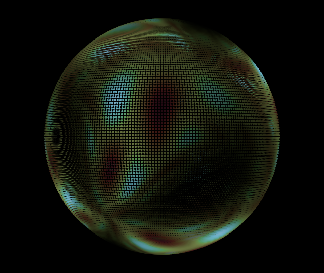</a></td>
<td valign="top">

#### AlienBrain

Glitch-folded stereographic grids pulled through an animated wave shear. Four presets morph the grid frequency, complexity, shear strength, and speed inside one composed pipeline.

**Parameters**: Pattern Freq, Speed, Complexity, Pattern Mix, Drift, Source Angle Speed, Singularity Fade, Projection Spin Speed, Projection Wander, Camera Wander, Planar Warp 1 Speed, Warp Strength, Warp Frequency, Warp Field Angle, Palette Chroma, Palette Mapping, Mapping Frequency, Mapping Phase, Phase Oscillation Depth, Phase Oscillation Speed, Value Opacity Low, Value Opacity High, Hue Shift Amount, Hue Noise Scale, Hue Noise Speed

</td></tr></table>

<table border="0"><tr>
<td width="300"><a href="https://woundedlion.github.io/daydream/?effect=KaleidoscopeHexSoft" target="_blank">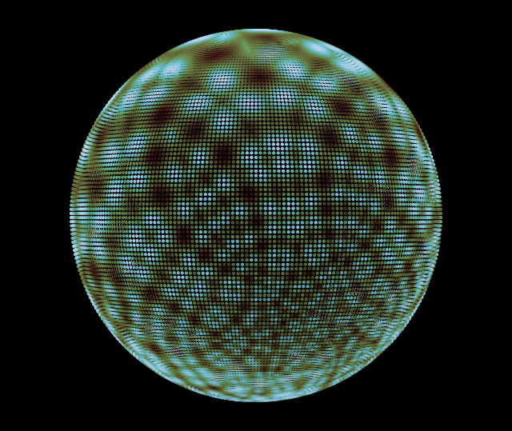</a></td>
<td valign="top">

#### KaleidoscopeHexSoft

A drifting twin-wave field reflected through a spherical kaleidoscope, projected stereographically, and repeated by an inner mirror tile.

**Parameters**: Pattern Freq, Speed, Drift, Source Angle Speed, Singularity Fade, Projection Spin Speed, Projection Wander, Camera Wander, Planar Warp 2 Speed, Mirror Rotation, Mirror Cell X, Mirror Cell Y, Mirror Offset X, Mirror Offset Y, Palette Chroma, Palette Mapping, Mapping Frequency, Mapping Phase, Phase Oscillation Depth, Phase Oscillation Speed, Value Opacity Low, Value Opacity High, Hue Shift Amount, Hue Noise Scale, Hue Noise Speed

</td></tr></table>

<table border="0"><tr>
<td width="300"><a href="https://woundedlion.github.io/daydream/?effect=AlienOcean" target="_blank">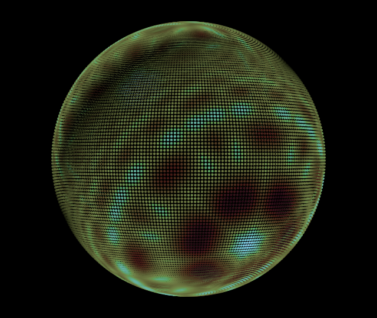</a></td>
<td valign="top">

#### AlienOcean

A broad folded gnomonic grid drifting inside a fixed mirror frame and a spherical kaleidoscope. Edge-fade coverage and a generated triadic palette give the field its soft, liquid boundary.

**Parameters**: Pattern Freq, Speed, Complexity, Pattern Mix, Drift, Source Angle Speed, Singularity Fade, Camera Wander, Planar Warp 1 Speed, Mirror Rotation, Mirror Cell X, Mirror Cell Y, Mirror Offset X, Mirror Offset Y, Edge Width, Palette Chroma, Palette Mapping, Mapping Frequency, Mapping Phase, Phase Oscillation Depth, Phase Oscillation Speed, Value Opacity Low, Value Opacity High, Hue Shift Amount, Hue Noise Scale, Hue Noise Speed

</td></tr></table>

<table border="0"><tr>
<td width="300"><a href="https://woundedlion.github.io/daydream/?effect=AlienCore" target="_blank">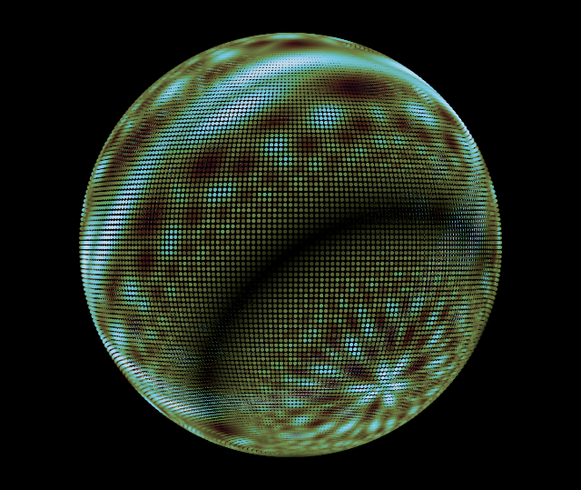</a></td>
<td valign="top">

#### AlienCore

A mirrored grid folded by the glitch lens and a folded gnomonic projection. Its high-contrast edge-fade material keeps the discontinuous facets legible while the grid drifts inside a fixed mirror frame.

**Parameters**: Pattern Freq, Speed, Complexity, Pattern Mix, Drift, Source Angle Speed, Singularity Fade, Camera Wander, Planar Warp 1 Speed, Mirror Rotation, Mirror Cell X, Mirror Cell Y, Mirror Offset X, Mirror Offset Y, Edge Width, Palette Chroma, Palette Mapping, Mapping Frequency, Mapping Phase, Phase Oscillation Depth, Phase Oscillation Speed, Value Opacity Low, Value Opacity High, Hue Shift Amount, Hue Noise Scale, Hue Noise Speed

</td></tr></table>

<table border="0"><tr>
<td width="300"><a href="https://woundedlion.github.io/daydream/?effect=KaleidoscopeMandala" target="_blank">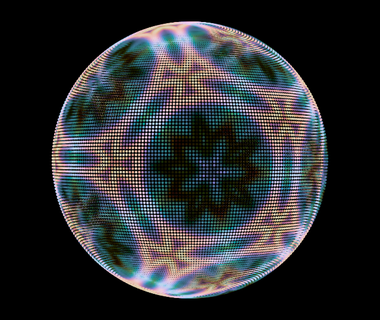</a></td>
<td valign="top">

#### KaleidoscopeMandala

A wave-sheared grid moving across a folded gnomonic dodecahedral kaleidoscope, then repeated through an inner mirror tile.

**Parameters**: Pattern Freq, Speed, Complexity, Pattern Mix, Drift, Source Angle Speed, Singularity Fade, Camera Wander, Planar Warp 1 Speed, Warp Strength, Warp Frequency, Warp Field Angle, Planar Warp 2 Speed, Mirror Rotation, Mirror Cell X, Mirror Cell Y, Mirror Offset X, Mirror Offset Y, Palette Chroma, Palette Mapping, Mapping Frequency, Mapping Phase, Phase Oscillation Depth, Phase Oscillation Speed, Value Opacity Low, Value Opacity High, Hue Shift Amount, Hue Noise Scale, Hue Noise Speed

</td></tr></table>

<table border="0"><tr>
<td width="300"><a href="https://woundedlion.github.io/daydream/?effect=GridSpace" target="_blank">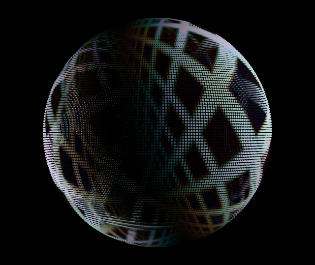</a></td>
<td valign="top">

#### GridSpace

An affine primitive lattice rendered as soft iso contours through a folded gnomonic projection. The affine frame scrolls the lattice by whole cell windings, so its drift repeats without a visible seam.

**Parameters**: Lattice Cell Scale, Lattice Shape, Lattice Softness, Lattice Radius, Singularity Fade, Projection Spin Speed, Projection Wander, Camera Wander, Planar Warp 1 Speed, Affine Rotation Rate, Affine Translation X, Affine Translation Y, Affine Scale X, Affine Scale Y, Affine Shear, Iso Level, Iso Width, Palette Chroma, Palette Mapping, Mapping Frequency, Mapping Phase, Phase Oscillation Depth, Phase Oscillation Speed, Value Opacity Low, Value Opacity High, Hue Shift Amount, Hue Noise Scale, Hue Noise Speed

</td></tr></table>

<table border="0"><tr>
<td width="300"><a href="https://woundedlion.github.io/daydream/?effect=HyperLattice" target="_blank">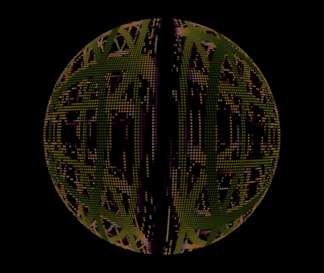</a></td>
<td valign="top">

#### HyperLattice

An analytic reflective flight through cubic and four-dimensional lattices under genuine SO(4) rotation. Dimension picks the lattice the flight reads: 3D holds the three spatial axes, Dimensional Rift blends part of the fourth in, and 4D Slice takes a full cross-section of the hypercubic lattice. Transparent integer-coordinate planes are walked analytically per axis rather than raymarched; Shells sets how many of them each axis cursor crosses, so raising it deepens the layering the reflection shows.

**Parameters**: Dimension (3D, Dimensional Rift, 4D Slice), Sphere Radius, Wire Radius, Softness, Far Cells, AA Strength, Speed, 3D Spin, 4D Spin, Chrome Warp, Reflection, Color, Shells

</td></tr></table>

<table border="0"><tr>
<td width="300"><a href="https://woundedlion.github.io/daydream/?effect=LatticeMelt" target="_blank">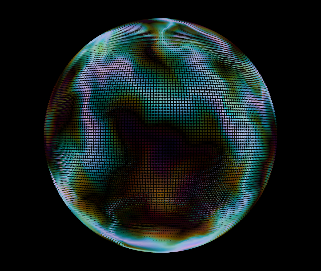</a></td>
<td valign="top">

#### LatticeMelt

A folded-sinusoidal sphere projection displaced by curl noise and shaded with a generated triadic palette. Its two presets share one composed pipeline and vary only the surface-noise scale.

**Parameters**: Lattice Cell Scale, Lattice Shape, Lattice Softness, Lattice Radius, Singularity Fade, Projection Spin Speed, Projection Wander, Camera Wander, Central Meridian, Surface Noise Scale, Surface Noise Strength, Surface Noise Speed, Palette Chroma, Palette Mapping, Mapping Frequency, Mapping Phase, Phase Oscillation Depth, Phase Oscillation Speed, Brightness Depth, Value Opacity Low, Value Opacity High, Hue Shift Amount, Hue Noise Scale, Hue Noise Speed

</td></tr></table>

<table border="0"><tr>
<td width="300"><a href="https://woundedlion.github.io/daydream/?effect=AshCloud" target="_blank">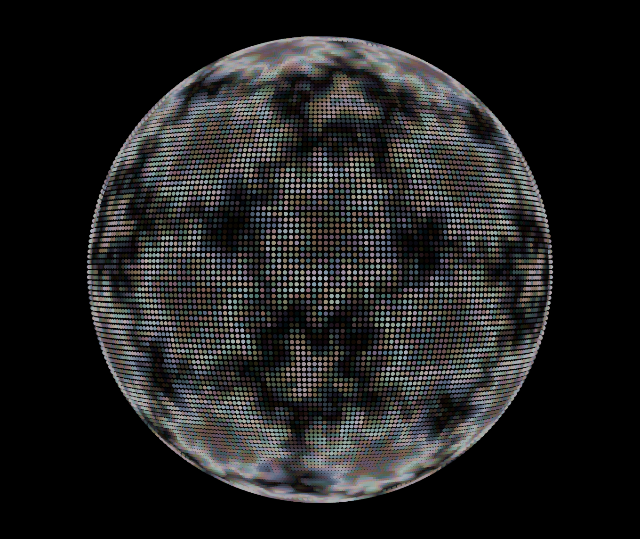</a></td>
<td valign="top">

#### AshCloud

A primitive lattice displaced by sphere-space curl noise, folded through a dodecahedral kaleidoscope and projected stereographically. A value cutout carves the lattice, so coverage follows the field rather than the projection alone.

**Parameters**: Lattice Cell Scale, Lattice Shape, Lattice Softness, Lattice Radius, Singularity Fade, Projection Spin Speed, Projection Wander, Camera Wander, Surface Noise Scale, Surface Noise Strength, Surface Noise Speed, Cutout Threshold, Cutout Softness, Palette Chroma, Palette Mapping, Mapping Frequency, Mapping Phase, Phase Oscillation Depth, Phase Oscillation Speed, Value Opacity Low, Value Opacity High, Hue Shift Amount, Hue Noise Scale, Hue Noise Speed

</td></tr></table>

<table border="0"><tr>
<td width="300"><a href="https://woundedlion.github.io/daydream/?effect=KaleidoscopePentBright" target="_blank">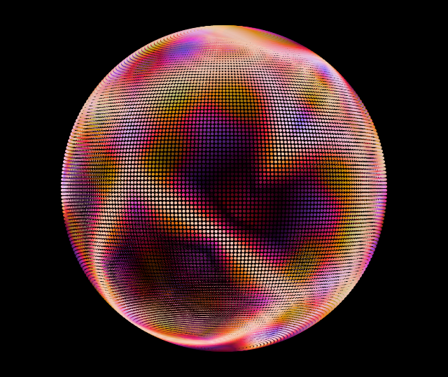</a></td>
<td valign="top">

#### KaleidoscopePentBright

A polar primitive lattice folded through a pentagonal-prism kaleidoscope and projected stereographically, its polar chart winding the angular phase one turn per cycle.

**Parameters**: Lattice Cell Scale, Lattice Shape, Lattice Softness, Lattice Radius, Singularity Fade, Projection Spin Speed, Projection Wander, Camera Wander, Planar Warp 1 Speed, Polar Radial Scale, Polar Radial Phase, Polar Angular Phase, Planar Warp 2 Speed, Warp Strength, Warp Frequency, Warp Field Angle, Palette Chroma, Palette Mapping, Mapping Frequency, Mapping Phase, Phase Oscillation Depth, Phase Oscillation Speed, Value Opacity Low, Value Opacity High, Hue Shift Amount, Hue Noise Scale, Hue Noise Speed

</td></tr></table>

<table border="0"><tr>
<td width="300"><a href="https://woundedlion.github.io/daydream/?effect=KaleidoscopeHexOil" target="_blank">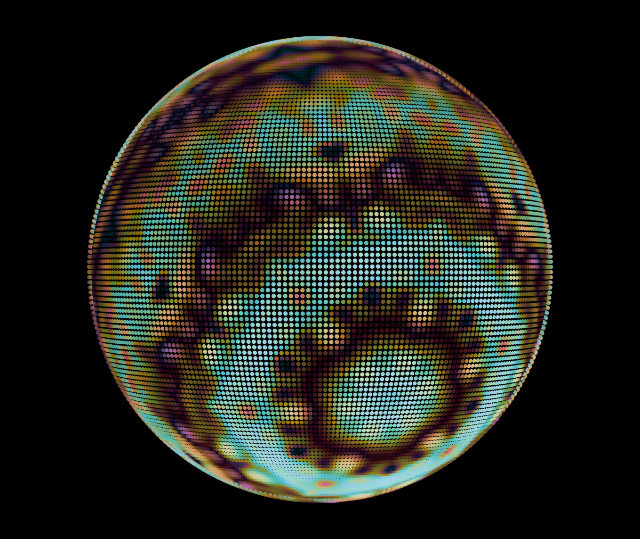</a></td>
<td valign="top">

#### KaleidoscopeHexOil

A rotating spiral folded through a hexagonal-prism kaleidoscope, projected stereographically, and displaced by direct surface noise whose path length drives the hue rotation.

**Parameters**: Pattern Freq, Speed, Source Angle Speed, Singularity Fade, Projection Spin Speed, Projection Wander, Camera Wander, Surface Noise Scale, Surface Noise Strength, Surface Noise Speed, Surface Noise Direction, Palette Chroma, Palette Mapping, Mapping Frequency, Mapping Phase, Phase Oscillation Depth, Phase Oscillation Speed, Value Opacity Low, Value Opacity High, Hue Shift Amount

</td></tr></table>

<table border="0"><tr>
<td width="300"><a href="https://woundedlion.github.io/daydream/?effect=KaleidoscopeStainedGlass" target="_blank">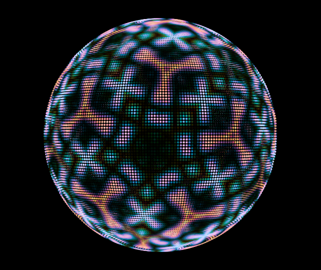</a></td>
<td valign="top">

#### KaleidoscopeStainedGlass

A vector-noise grid refracted across folded gnomonic dodecahedral facets and repeated through an inner mirror tile. A cup-shaped palette envelope emphasizes the warped cell interiors.

**Parameters**: Pattern Freq, Speed, Complexity, Pattern Mix, Drift, Source Angle Speed, Singularity Fade, Camera Wander, Planar Warp 1 Speed, Warp Strength, Warp Scale, Warp Vector Angle, Planar Warp 2 Speed, Mirror Rotation, Mirror Cell X, Mirror Cell Y, Mirror Offset X, Mirror Offset Y, Palette Chroma, Palette Mapping, Mapping Frequency, Mapping Phase, Phase Oscillation Depth, Phase Oscillation Speed, Brightness Depth, Value Opacity Low, Value Opacity High, Hue Shift Amount, Hue Noise Scale, Hue Noise Speed

</td></tr></table>

<table border="0"><tr>
<td width="300"><a href="https://woundedlion.github.io/daydream/?effect=KaleidoscopeSmooth" target="_blank">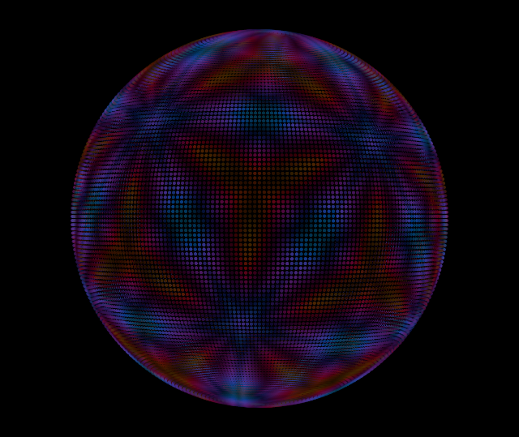</a></td>
<td valign="top">

#### KaleidoscopeSmooth

A generated analogous-palette grid folded through a dodecahedral kaleidoscope, then projected stereographically and repeated by an inner mirror tile. Its four presets share one composed pipeline and vary only continuous parameters.

**Parameters**: Pattern Freq, Speed, Complexity, Pattern Mix, Drift, Source Angle Speed, Singularity Fade, Projection Spin Speed, Projection Wander, Camera Wander, Planar Warp 2 Speed, Mirror Rotation, Mirror Cell X, Mirror Cell Y, Mirror Offset X, Mirror Offset Y, Palette Chroma, Palette Mapping, Mapping Frequency, Mapping Phase, Phase Oscillation Depth, Phase Oscillation Speed, Value Opacity Low, Value Opacity High, Hue Shift Amount, Hue Noise Scale, Hue Noise Speed

</td></tr></table>

<table border="0"><tr>
<td width="300"><a href="https://woundedlion.github.io/daydream/?effect=KaleidoscopeHexBright" target="_blank">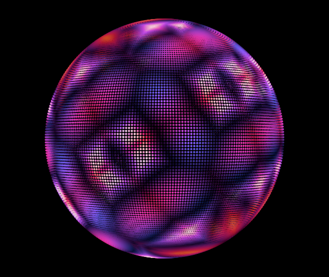</a></td>
<td valign="top">

#### KaleidoscopeHexBright

A mirrored twin-wave field folded through a hexagonal-prism kaleidoscope and projected stereographically, with an analogous generated palette.

**Parameters**: Pattern Freq, Speed, Drift, Source Angle Speed, Singularity Fade, Projection Spin Speed, Projection Wander, Camera Wander, Planar Warp 2 Speed, Mirror Rotation, Mirror Cell X, Mirror Cell Y, Mirror Offset X, Mirror Offset Y, Palette Chroma, Palette Mapping, Mapping Frequency, Mapping Phase, Phase Oscillation Depth, Phase Oscillation Speed, Value Opacity Low, Value Opacity High, Hue Shift Amount, Hue Noise Scale, Hue Noise Speed

</td></tr></table>

<table border="0"><tr>
<td width="300"><a href="https://woundedlion.github.io/daydream/?effect=KaleidoscopeFlowers" target="_blank">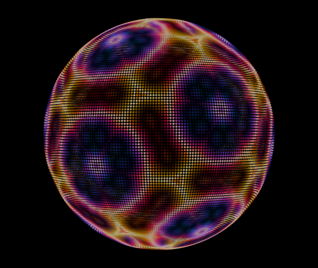</a></td>
<td valign="top">

#### KaleidoscopeFlowers

Dodecahedrally folded grids mapped continuously around an equirectangular equator and repeated through an inner mirror tile. Three presets morph density, coupling, and color mapping without changing structure.

**Parameters**: Pattern Freq, Speed, Complexity, Pattern Mix, Drift, Source Angle Speed, Singularity Fade, Projection Spin Speed, Projection Wander, Camera Wander, Central Meridian, Planar Warp 2 Speed, Mirror Rotation, Mirror Cell X, Mirror Cell Y, Mirror Offset X, Mirror Offset Y, Palette Chroma, Palette Mapping, Mapping Frequency, Mapping Phase, Phase Oscillation Depth, Phase Oscillation Speed, Value Opacity Low, Value Opacity High, Hue Shift Amount, Hue Noise Scale, Hue Noise Speed

</td></tr></table>

<table border="0"><tr>
<td width="300"><a href="https://woundedlion.github.io/daydream/?effect=CosmicEyeball" target="_blank">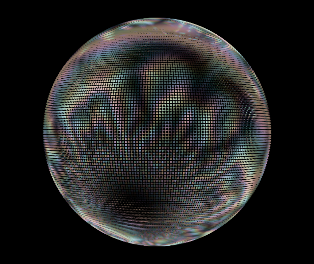</a></td>
<td valign="top">

#### CosmicEyeball

A high-contrast mirrored stereographic grid folded by the glitch lens. Hue follows total mirror displacement, producing the concentric color structure around the moving field.

**Parameters**: Pattern Freq, Speed, Complexity, Pattern Mix, Drift, Source Angle Speed, Singularity Fade, Camera Wander, Planar Warp 1 Speed, Mirror Rotation, Mirror Cell X, Mirror Cell Y, Mirror Offset X, Mirror Offset Y, Edge Width, Palette Chroma, Palette Mapping, Mapping Frequency, Mapping Phase, Phase Oscillation Depth, Phase Oscillation Speed, Value Opacity Low, Value Opacity High, Hue Shift Amount

</td></tr></table>

<table border="0"><tr>
<td width="300"><a href="https://woundedlion.github.io/daydream/?effect=MobiusGrid" target="_blank"></a></td>
<td valign="top">

#### MobiusGrid

A stereographic twin-wave field folded through an inner mirror tile and a live Möbius lens. The lens follows a continuous 160-frame circular warp cycle while a complementary palette tracks displacement through the fold. Its two presets share the same fixed graph.

**Parameters**: Pattern Freq, Speed, Drift, Source Angle Speed, Singularity Fade, Projection Spin Speed, Projection Wander, Camera Wander, Planar Warp 2 Speed, Mirror Rotation, Mirror Cell X, Mirror Cell Y, Mirror Offset X, Mirror Offset Y, Mobius A Re, Mobius A Im, Mobius B Re, Mobius B Im, Mobius C Re, Mobius C Im, Mobius D Re, Mobius D Im, Palette Chroma, Palette Mapping, Mapping Frequency, Mapping Phase, Phase Oscillation Depth, Phase Oscillation Speed, Brightness Depth, Value Opacity Low, Value Opacity High, Hue Shift Amount

</td></tr></table>

<table border="0"><tr>
<td width="300"><a href="https://woundedlion.github.io/daydream/?effect=RingSpin" target="_blank"></a></td>
<td valign="top">

#### RingSpin

Four great-circle rings tumble continuously under energetic random-walk rotation, each leaving a fading motion-blur trail of its recent orientations (drawn with `Scan::RingGroup`, which fuses a frame's near-coincident sub-rings into one scan pass; head and tail of the trail thickened). Each ring is colored by a baked vignette palette.

**Parameters**: Alpha, Thickness, Debug BB

</td></tr></table>

<table border="0"><tr>
<td width="300"><a href="https://woundedlion.github.io/daydream/?effect=RingShower&resolution=Holosphere%20(96x20)" target="_blank"></a></td>
<td valign="top">

#### RingShower

Rings bloom at random orientations and grow their radius from zero, fading in over the first few frames and then holding (no fade-out), colored by a generative mirrored analogous palette — a continuous shower of expanding rings drawn with `Plot::Ring`. Each ring's radius, fade, and lifetime are pure functions of its age driven directly from a recyclable slot rather than a per-ring `Sprite`.

**Parameters**: Alpha

</td></tr></table>

<table border="0"><tr>
<td width="300"><a href="https://woundedlion.github.io/daydream/?effect=Fishbowl" target="_blank"></a></td>
<td valign="top">

#### Fishbowl

A head traces a fixed 12:5 spherical Lissajous figure whose long trail is continuously warped by a noise transformer, over a slowly cycling gradient palette.

**Parameters**: Alpha, Cycle Dur, Speed, Jitter Amp, Noise Scale, Scale Factor, Cycle Speed, Duty Cycle

</td></tr></table>

<table border="0"><tr>
<td width="300"><a href="https://woundedlion.github.io/daydream/?effect=MeshFeedback" target="_blank"></a></td>
<td valign="top">

#### MeshFeedback

A selectable Platonic, Archimedean, or Catalan wireframe rendered with `Plot::Mesh`, given a noise-distorted, feedback-loop appearance via `Filter::Pixel::Feedback`. An orientation random-walk tumbles the solid while a `Segue::Snap` preset choreography hard-cuts both the base mesh and feedback/distortion style parameters.

**Parameters**: Base Mesh, Fade, Distort Amp, Distort Freq, Distort Speed, Noise Scale, Hue Shift, Feedback

</td></tr></table>

<table border="0"><tr>
<td width="300"><a href="https://woundedlion.github.io/daydream/?effect=MindSplatter" target="_blank"></a></td>
<td valign="top">

#### MindSplatter

Particles spray from emitters at the vertices of a selectable Platonic solid — each sweeping its own tangent-plane emission angle — and fall toward attractor wells at the vertices of its dual. The tetrahedron is self-dual; cube/octahedron and dodecahedron/icosahedron form the other pairs. Event-horizon kernels punch the particles out around each attractor. A random walk tumbles the view, periodic Möbius warp bursts distort the whole field, and a preset timer transitions the base mesh, friction, well strength, and speeds between eight presets.

**Parameters**: Base Mesh, Friction, Well Str, Init Spd, Ang Spd, Warp, Particles

</td></tr></table>

<table border="0"><tr>
<td width="300"><a href="https://woundedlion.github.io/daydream/?effect=Dynamo&resolution=Holosphere%20(96x20)" target="_blank"></a></td>
<td valign="top">

#### Dynamo

A vertical strand of points — one per latitude row — drifts horizontally around the sphere, each row dragging the next under a gap constraint so the chain wavers like a wind-blown curtain. The strand leaves motion trails, is replicated three times around the sphere, periodically reverses direction, and tumbles under random-axis rotations, while periodic color wipes sweep freshly generated analogous palettes across it.

**Parameters**: Speed, Gap, Trail Len, Trail Cap, Wipe Dur

</td></tr></table>

<table border="0"><tr>
<td width="300"><a href="https://woundedlion.github.io/daydream/?effect=Thrusters&resolution=Holosphere%20(96x20)" target="_blank"></a></td>
<td valign="top">

#### Thrusters

A central distorted ring (`Plot::DistortedRing`) warps and spins; periodic random "fires" kick it onto a new axis and bloom a pair of opposed thrust rings (`Plot::Ring`) that expand from a sub-pixel seed and fade out.

**Parameters**: Radius, Alpha

</td></tr></table>

<table border="0"><tr>
<td width="300"><a href="https://woundedlion.github.io/daydream/?effect=GnomonicStars" target="_blank"></a></td>
<td valign="top">

#### GnomonicStars

A Fibonacci-spiral field of star-polygon SDFs, continuously deformed by an evolving Möbius warp (built on a gnomonic-projection transformer) and slowly tumbled by a Languid random walk.

**Parameters**: Points, Radius, Sides, Warp Speed, Debug BB

</td></tr></table>

<table border="0"><tr>
<td width="300"><a href="https://woundedlion.github.io/daydream/?effect=Raymarch" target="_blank"></a></td>
<td valign="top">

#### Raymarch

Volumetric raymarcher that renders twisted tori at the vertices of a selectable placement solid. Its `uv-surface-noise` preset uses the 26-vertex disdyakis dodecahedron; the selector contains the 21 base solids that fit the 32-copy capacity. Each torus is ray-marched with `Scan::Volume::draw`, lit with metallic Blinn-Phong shading (half-Lambert diffuse, specular highlights, Fresnel rim), and independently tumbled by an energetic random walk. A separate random walk drives the camera orientation. A seamless two-axis UV noise field selects and hue-shifts the generated OKLCH palette across each torus surface through the shared `NoiseHuePalette` machinery also used by the shader effects.

**Parameters**: Base Solid, Pulse Speed, Fill, Max Steps, Diffuse, Specular, Fresnel, Twist, AA Width, Hue Shift, Hue Noise Scale, Hue Noise Speed

</td></tr></table>

<table border="0"><tr>
<td width="300"><a href="https://woundedlion.github.io/daydream/?effect=DisplacementField" target="_blank"></a></td>
<td valign="top">

#### DisplacementField

A stack of evenly spaced soft-stroked rings (`Scan::DistortedRingStack`) sharing one axis, each vertex displaced along the stack axis by a stack of displacement fields that alternate between two phases. In the ball phase, cap-shaped bumps spawn at the pole on random meridians and fall to the opposite pole at varying speeds, bowing the rings away from each falling ball; once the last ball lands, a two-octave world-space OpenSimplex noise field (octave 1 envelopes octave 2, so perturbations turn sparse wherever the envelope runs near zero) fades in from zero, dwells at full strength, then fades back out into the next ball phase. Ring colors sweep a circular analogous palette across the stack, with each fragment's hue rotated by the local displacement magnitude, and the palette slowly wipes to a freshly generated one every ~11 seconds.

**Parameters**: Alpha, Rings, Thickness, Ball Amp, Noise Amp, Scale 1, Scale 2, Hue Rotate, Flow Speed, Ball Min, Ball Max, Ball Rate, Speed Min, Speed Max

</td></tr></table>

<table border="0"><tr>
<td width="300"><a href="https://woundedlion.github.io/daydream/?effect=ShapeShifter" target="_blank"></a></td>
<td valign="top">

#### ShapeShifter

Concentric polygon, star, or flower outlines drawn through the `Plot` rasterizer. Dense planar stars use direct sampled edges, with pole-crossing edges routed through the shared rasterizer and the same pre-shaded fragment shader. The rings span the full sphere radius under a selectable spacing law — **Spacing** is either uniform steps in radius or screen-balanced, which redistributes the rings away from the poles (subject to a density floor) so their on-screen spacing stays even — and **Alpha Falloff** picks each ring's alpha profile: a flat half, or full at the poles fading toward the equator. A selectable animated waveform offsets each ring's phase to twist the stack back and forth while a global random walk reorients the stack. A periodic timer steps through the presets under a `Segue::Fade` choreography: the whole stack fades out to black, the parameter set snaps to a fresh arrangement of spherical polygons, flowers, or stars inside that dark frame, and the stack fades back in — so two parameter sets never render on the same frame.

**Parameters**: Alpha, Shape, Count, Sides, Function, Amplitude, Speed, Opposite, Alpha Falloff, Spacing

</td></tr></table>

### Shader Authoring Workbench

The standalone [Shader workbench](https://github.com/woundedlion/daydream/blob/master/tools/shader.html) provides the complete structural vocabulary and its pipeline-strip editor in a dedicated browser tab. Twenty-three retained legacy presets migrate to stable composed product effects; legacy preset 4 is retired, and unmatched custom configurations route to the workbench for editing. The firmware rosters contain only the promoted effects.

`ShaderWorkbench` is registered as `Shader`, with `ShaderBall` retained as a legacy alias. It owns structural editing and dynamic dispatch in WASM and native oracle tests only. `HS_ENABLE_SHADER_WORKBENCH` is rejected for Arduino builds, and release ELF inspection gates the dynamic backend, topology registry, and workbench symbols out of firmware.

`ShaderChain` is the second workbench-only registry entry, under its own `HS_ENABLE_CHAIN_INTERPRETER` gate, likewise rejected for Arduino builds. It interprets an arbitrary compiled operator chain from the pullback operator table instead of the workbench's fixed stage folders, and registers one parameter per chain field as `{instance}.{field-id}`. The bridge compiles a program shape onto it with `setShaderChain`, which the workbench's chain-document layer calls before replaying preset values.

Shipping composed effects are ordinary concrete `Effect` types. Each names one compile-time `Pullback::Pipeline`, a compact parameter and prepared-frame type, immutable stable preset IDs, and only the resources its graph uses. Its raster loop calls `Derived::shade(view, frame)` directly; there is no per-pixel function-pointer dispatch, topology lookup, family object, or universal Shader parameter block. The shared `Pullback::ComposedEffect` base contains only lifecycle work that is genuinely common: clocks, preset interpolation, parameter registration, palette/LUT ownership, narrow frame preparation, and the typed scan loop; its preset choreography and snapshot machinery come from the engine-level `ChoreographedEffect`. Generated palette evaluation remains in the shared `GenerativePalette` color stage rather than being copied into each effect.

Each editable source document lives under `patterns/*.shader.json`. The browser validates and canonicalizes a document before changing the live engine, matches its exact descriptor digest to a composed effect, and selects presets by immutable ID. Open/save preserves exhaustive chain, parameter, transition, and choreography data. Unknown or invalid semantics leave the current preview untouched. The migration manifest maps all 23 retained Shader preset positions to stable effect/preset identities; preset 4 is intentionally retired.

The shader is a *pullback*: it starts at a visible sphere point and walks backward through a chain of stages over four ranked carrier families — Sphere, Plane, Field, Color. A chain is any stage sequence that is non-decreasing in family rank with agreeing adjacent carriers, entering at `SphereSample` and exiting at `Color4`; each family boundary is crossed at most once. Both Shader preview and concrete effects call the same public kernels in `core/render/pullback.h`. Palette mapping is continuous preset state: a transition carries both mapping endpoints and interpolates their coordinates before the single palette sample, so changing Cup/Bell/Linear/Reverse does not require another pipeline or effect.

```
selection — once per frame

  Candidate Config ──> canonical TopologyKey ──> 15-entry program manifest
                       ├─ match ────> compiled shade + semantic ID
                       └─ no match ─> dynamic shade + NONE (simulator only)
                                      └──> PreparedEndpoint

shading — once per visible sample, through the shared Scan::Shader loop

  Rotate · Displace · Lens        (SPHERE endomorphisms)
       │ SphereSample
  Project                         (SPHERE → PLANE crossing)
       │ PlaneSample
  Warp × N                        (PLANE endomorphisms)
       │ PlaneSample
  Sample                          (PLANE → FIELD crossing)
       │ FieldSample
  Transfer · Coverage             (FIELD endomorphisms)
       │ FieldSample
  Colorize                        (FIELD → COLOR crossing)
       │ straight-alpha Color4
  Canvas
```

The core catalog owns the reusable surface, lens, projection, planar-warp, source, material, and generated-color policies. The `Project` crossing rotates into the projection frame, projects, and embeds the projection's provenance and the sample point into the plane carrier. Each `Warp` stage advances the working coordinate and path accumulator, leaving provenance and sample point immutable. The `Sample` crossing consumes the provenance: it weights the raw signed field, ramps it into [0, 1], and folds projected coverage and domain coverage into the field carrier; `Transfer` and `Coverage` stages then reshape value and coverage. The terminal Colorize crossing samples the selected generated harmony, optionally rotates its hue with sphere-space noise or total path length, and returns straight-alpha `Color4`; the scan sink performs the final premultiplication.

Two stages carry approved approximations. Fast square Peirce projection and the hue-rotation LUT each name a host reference oracle, exact non-floating fields, error domains, limits, and a final-framebuffer metric as part of the stage contract. The dynamic orchestration is compiled for the simulator and native oracle tests, where every authored preset is compared against it. Teensy preprocessing excludes it.

#### Composed-effect roster

| Effect ID | Concrete effect | Presets | Legacy source |
|---|---|---:|---|
| `alien-brain` | `AlienBrain` | 4 | 0, 21–23 |
| `kaleidoscope-hex-soft` | `KaleidoscopeHexSoft` | 1 | 1 |
| `alien-ocean` | `AlienOcean` | 1 | 2 |
| `alien-core` | `AlienCore` | 1 | 3 |
| `kaleidoscope-mandala` | `KaleidoscopeMandala` | 2 | 5, plus `cup-hue` |
| `grid-space` | `GridSpace` | 1 | 6 |
| `lattice-melt` | `LatticeMelt` | 2 | 7–8 |
| `ash-cloud` | `AshCloud` | 1 | — |
| `kaleidoscope-pent-bright` | `KaleidoscopePentBright` | 1 | 9 |
| `kaleidoscope-hex-oil` | `KaleidoscopeHexOil` | 2 | — |
| `kaleidoscope-stained-glass` | `KaleidoscopeStainedGlass` | 1 | 10 |
| `kaleidoscope-smooth` | `KaleidoscopeSmooth` | 4 | 11, 13–14, plus `stretched-grid` |
| `kaleidoscope-hex-bright` | `KaleidoscopeHexBright` | 2 | 12 |
| `kaleidoscope-flowers` | `KaleidoscopeFlowers` | 3 | 15–17 |
| `cosmic-eyeball` | `CosmicEyeball` | 1 | 18 |
| `mobius-grid` | `MobiusGrid` | 2 | 19–20 |

These sixteen effects form the product-only `shader-collection` group; family metadata is not part of runtime identity. Each effect's show window is derived from its preset count, giving every preset the shared 600-frame dwell and every transition the shared 480-frame segue. Ash Cloud and Kaleidoscope Hex Oil joined after the ShaderWorkbench migration from workbench-authored snapshots, so they carry no legacy preset index. Host tests pair each preset that carries a legacy source index with Shader's dynamic evaluator and require the two to agree to within one 16-bit count; Lattice Melt and Kaleidoscope Smooth run theirs in dedicated white-box equivalence suites. The presets authored after the migration have no legacy configuration to pair with, so nothing holds them against the evaluator: Ash Cloud's one, Kaleidoscope Hex Oil's two, Kaleidoscope Smooth's `stretched-grid`, Kaleidoscope Hex Bright's `hex-twin-wave-alt`, and Kaleidoscope Mandala's `cup-hue`.

The [shipping device captures](https://github.com/woundedlion/pov/blob/master/docs/profiles/README.md) report zero spilled frames for all sixteen promoted effects, with peaks from 23.30 ms for AlienCore to 52.39 ms for AshCloud. The composed effects let the compiler inline the exact typed pipeline and discard every unused stage. The shared runtime and `GenerativePalette` color stage keep common lifecycle and palette machinery from being duplicated without introducing type erasure in the per-pixel call. AshCloud's paired global-O3 capture peaks at 48.35 ms, but no paired capture isolates specialization from the other structural differences, so the archive does not claim a dispatch-only speedup.

#### Authoring vocabulary

The parameter schema exposes the broader Shader workbench vocabulary below. A menu entry describes a structurally possible field value, not a promise that its Cartesian combination is compiled for Teensy. The simulator renders valid unmatched combinations dynamically; sliders are active only when the selected schema uses them.

The gap is per value, not only per combination. The `ComposedEffect` derivation layer in `composed_effect.h` reaches a strict subset of the shipped operator catalog, so fourteen operators — Peirce, Peirce (Fast Square), Bonne, Airocean, Rings, Spherical Rings, Escape Fractal, Tessellation, both Noise Contours, Vortex, Curl Flow, Ridge and Smooth Bands — and 38 further values of the operators it does reach are workbench-only and can never appear in a composed effect: every non-simplex noise basis, the non-Euler curl integrators, the non-flat warp envelopes, the logarithmic polar chart and its harmonics 2–16, the front and back gnomonic hemispheres, and the None signal weight and Opaque coverage. Value Cutout is reachable and selected by Ash Cloud. `tests/test_composed_effect.h` pins that set against the live operator table, so a catalog addition stays classified.

The two planar warps run in their displayed pullback order: **Planar Warp 1** then **Planar Warp 2**, followed by the source function.

| Stage | Options | Produces or controls |
|---|---|---|
| **Function** | Twin Wave, Rings, Spiral, Grid, Noise Contour (Projected), Primitive Lattice, Noise Contour (Sphere), Spherical Rings, Escape Fractal, Tessellation | A signed scalar field. Projected fields sample final planar coordinates; sphere fields sample the post-lens direction in the inverse projection frame. Grid blends between coupled and direct patterns with dedicated mix and complexity controls. |
| **Projection** | Folded Sinusoidal, Stereographic, Gnomonic, Bonne, Peirce Quincuncial, Dymaxion / Airocean, Equirectangular | Planar coordinates plus region/component identity, projection weight, boundary traits, stable edge identity, and fade distance. |
| **Projection Frame** | Identity, Spin + Wander | Rotates the sphere before projection. Projection Spin Speed and Projection Wander exist only for Spin + Wander. |
| **Surface Noise** | None, Direct, Curl | Displaces the unit-sphere direction and adds that displacement to the path accumulator. Surface Noise Placement runs it Before Lens or After Lens. Scale, Strength, Speed and Basis exist for either active mode; Direct adds Surface Noise Direction and Curl adds Surface Noise Integrator. |
| **Lens** | None, Glitch, Twist, Kaleidoscope (Azimuthal 6-fold), Mobius, Kaleidoscope (Tetrahedral), Kaleidoscope (Octahedral / Cubic), Kaleidoscope (Dodecahedral / Icosahedral), and the Triangular, Square, Pentagonal, Hexagonal and Octagonal Prism kaleidoscopes | Distorts a unit-sphere direction before projection. Lens-specific controls exist only for an active lens. |
| **Planar Warp 1 / 2** | None, Affine Frame, Wave Shear, Vortex, Projected Vector Noise, Projected Curl Flow, Mirror Tile, Polar Chart | Sequentially pulls planar coordinates backward. Every active warp exposes Speed; the meaning of one phase cycle is listed below. |
| **Signal Weight** | None, Projection | Optionally multiplies the signed source signal by the projection's weight before remapping it to `[0, 1]`. It changes value, not alpha. |
| **Value Transfer** | None, Ridge, Iso Contour, Smooth Bands | Shapes the normalized value. Iso controls appear only for Iso Contour; Band Count and Band Phase only for Smooth Bands. |
| **Coverage** | Opaque, Projection Weight Squared, Value Cutout, Edge Fade, Projection Weight | Computes alpha independently from color value. Linear projection weight is softer and broader than the squared form. |
| **Colorize** | Palette: Generated Triadic, Generated Complementary, Generated Analogous. Brightness Envelope: Cup, Bell, Ascending, Descending. Hue Shift Mode: None, Noise, Total Warp Displacement | Converts shaped value and coverage into straight-alpha color. Envelope Frequency repeats the selected palette-coordinate profile 1-32 times without changing Value Transfer or coverage. Hue Shift Amount controls either sphere-space noise rotation or rotation proportional to the accumulated path length, which the surface-noise displacement and both planar warps all add to. |

Planar-warp **Speed** advances the stage's wrapped phase in cycles per frame. Affine Frame derives Primitive Lattice's exact planar period as `1 / Lattice Cell Scale`; Translation X/Y are signed whole-cell windings per cycle and therefore scroll continuously in one direction before resetting invisibly at the source. Fractional translation writes snap to the nearest whole winding. A translating Affine Frame requires Primitive Lattice, no later planar warp, and a hue mode other than Total Warp Displacement; incompatible cross-stage edits are rejected with a warning. Rotation is a signed angle in radians per phase cycle over `[-2π, 2π]`; its continuous angular rate is `Speed × Rotation`, and zero holds the frame still. Shear oscillates, and Scale X/Y move logarithmically between reciprocal extrema. Mirror Tile translates its mirror lattice by one local X cell, producing a seamless repeating scroll while its Y offset remains manual. Polar Chart advances only Angular Phase by one turn; Radial Phase remains manual. Wave Shear advances its wave, Vortex orbits its center, and the two projected-noise modes move through their periodic noise field.

Polyhedral kaleidoscope lenses contract animation-speed and warp/noise-frequency slider ranges to the linear size of one symmetry chamber. Grid Pattern Freq and Lattice Cell Scale retain their full source-density ceilings under every lens, so small dodecahedral and prismatic chambers can still hold dense patterns. The stored units and shader math do not change: frequency remains measured in the stage's native domain and Speed remains cycles per frame. Switching to a smaller chamber clamps affected authoring values into its displayed range; switching back restores the wider range, not the discarded out-of-range value.

**Hue Shift Mode** selects the Colorize input. Noise evaluates the post-lens sphere direction, so it works without a planar warp; **Hue Shift Amount** sets its maximum hue rotation, **Hue Noise Scale** sets its spatial frequency, and **Hue Noise Speed** moves through the periodic field within `-0.001` to `0.001` cycles per frame. Zero freezes the field at its current phase. Total Warp Displacement instead rotates hue by Hue Shift Amount times the shared path accumulator, which the surface-noise Displace step and both planar warps each add their applied distance to — so a displaced effect with no planar warp, such as Kaleidoscope Hex Oil, still rotates hue. It uses accumulated path length rather than net offset, so opposing warps both remain visible in the color.

Noise Contour (Projected) is available with Folded Sinusoidal,
Stereographic, Gnomonic, and Equirectangular projections. Noise Contour (Sphere)
and Spherical Rings work with every projection but reject non-None planar warps
because those warps have no sphere-space inverse.

**Camera Wander** sits outside that table: it is always registered, and scales
how much of a continuous random walk rotates the viewing direction before any
stage runs, drifting the whole look. The Spin + Wander frame's own
**Projection Wander** is a separate slider that drifts only the sphere's
pre-projection orientation.

Selector dependencies are explicit and deterministic:

```
Projection ─┬─ Bonne ─────────────> Hemisphere + standard parallel
            ├─ Peirce ────────────> Layout (scroll for strip layouts)
            ├─ Dymaxion/Airocean ─> Net layout
            ├─ Gnomonic ──────────> Hemisphere policy
            └─ any ───────────────> Meridian / scale / pole controls, where meaningful

Function ──────────> Function-specific source controls
Surface Noise ─────> Placement, basis, scale, strength, speed; direction or integrator
Lens ──────────────> Selected lens controls
Planar Warp 1 ─────> Selected stage controls
Planar Warp 2 ─────> Selected stage controls
Value Transfer ────> Iso or band controls
Coverage ──────────> Cutout threshold or edge width
Colorize ──────────> Palette + selected hue-shift source
```


Schema validity still enforces the cross-stage constraints that have a geometric reason. Noise Contour (Sphere) cannot follow a planar warp. Polar Chart must be the only planar warp, except that Planar Warp 1 Polar Chart may be followed by Wave Shear. It requires Grid or Primitive Lattice, and when it is the only planar warp its seam must land on a whole number of source periods: `Pattern Freq × Polar Harmonic` for Grid, `2π × Lattice Cell Scale × Polar Harmonic` for Primitive Lattice, which is periodic in its cell scale and ignores Pattern Freq. Seam-sensitive projected noise and warp stages cannot cross the cut topology of Bonne, Peirce, or Airocean. Unsafe coordinate bounds and excess noise resources are rejected as well. These incompatible combinations remain pending and report an actionable warning. Manifest availability is separate: the simulator routes valid unmatched combinations dynamically, while firmware exposes the sixteen promoted fixed descriptors rather than the workbench dispatcher.

Projection seams use topology supplied by the projection kernel rather than guessing from planar coordinates. **Edge Fade** gives both sides of a paired cut the same authored fade, so the seam closes flush without a subducted edge. Glued and periodic edges remain continuous and do not fade. **Singularity Fade** is projection weight; selecting either projection-weight coverage policy carries that attenuation into alpha as well as any separately selected signal weighting.

Admitted GUI edits apply immediately. Numeric writes clamp to their registered range, including stale subordinate values when a mode change narrows that range. Structurally incompatible stage combinations remain pending until another edit repairs them. Automatic preset choreography remains continuous: configurations with the same canonical topology morph one live parameter state, while topology changes use the sequential through-clear endpoints. Source, warp, projection, hue-shift noise, global-walk, and palette clocks keep advancing according to their named speeds. **Pause Animation** stops automatic preset selection; an in-flight preset transition still finishes.

### Legacy Effects (`effects_legacy.h`)

TheMatrix, ChainWiggle, RingRotate, RingTwist, Curves, Kaleidoscope, StarsFade, DotTrails, Burnout, Fire, Spinner, Spiral, WaveTrails, RingTrails — built before the current engine and using an older rendering API. Functional but not representative of current architecture.

---

## 10. The Web Simulator (Daydream)

The [`daydream`](https://github.com/woundedlion/daydream) repo is a static web app that wraps the WASM build from this repo in a Three.js scene. The C++ rendering engine is unchanged — the same effect classes, the same arenas, the same per-frame `Pixel[]` buffer. Daydream's job is to:

1. Drive the WASM engine one frame at a time at a fixed cadence.
2. Map each `(x, y, color)` pixel to a position on a 3D sphere and render it as an instanced dot mesh.
3. Provide a UI for switching effects, tuning parameters, sweeping resolutions, recording video, and exercising the segmented-POV multi-board mode.
4. Host five standalone design tools for interactive authoring, three of which drive engine facilities through WASM.

### 10.1 Process and Threading Model

```
Main thread                                Web Workers (segment mode only)
─────────────                              ──────────────────────────────
index.html → vendor-importmap.js           segment_worker.js × N
              ↓ (resolves three/lil-gui    each owns its own WASM instance
              ↓  to local or CDN)
            main.js (entry)                engine.setClip(x0,x1,y0,y1)
              └─ bootstrap.js              engine.drawFrame()  → pixel slice
                   ├─ failure overlay +    postMessage(Transfer pixels)
                   │  refreshModuleCache()
                   └─ import('./daydream.js')
                   ├─ createHolosphereModule()
                   ├─ Daydream (driver.js)
                   │    ├─ Three.WebGLRenderer
                   │    ├─ instanced dot mesh
                   │    ├─ OrbitControls
                   │    └─ PiP camera
                   ├─ AppState + URLSync
                   ├─ EffectSidebar
                   ├─ lil-gui (params + global)
                   └─ VideoRecorder (MediaRecorder)
```

`index.html` loads exactly one module, `main.js`, whose whole body is a call to `bootstrap.js`'s exported `bootstrap()`. Keeping the side effect in the entry module rather than in `bootstrap.js` itself is what lets `daydream.js` import the failure overlay without standing up a second simulator. `bootstrap()` dynamically imports `daydream.js` inside a `try`/`catch` — the only handler for a module-graph load failure. On failure it renders the error into the page's `loading-overlay` (as `role="alert"`, with a focused **Reload** button) and falls back to the shared fatal-error banner when no overlay exists. The Reload handler first runs `refreshModuleCache()`, which re-fetches every same-origin `.js` and `.wasm` the page has already loaded with `cache: 'reload'`. That is the remedy for the deploy-skew hazard: a plain browser reload only revalidates the top-level document, so modules cached from an earlier deploy stay stale and keep failing to link against freshly fetched importers — and the WASM binary is bound to its glue by content hash, so a stale binary against fresh glue is the canonical form of the skew.

A normal page load creates one WASM instance on the main thread. The dot mesh has one instance per LED pixel; the per-frame work is `instanceColor.needsUpdate = true` after the WASM buffer view is refreshed. When the user enables Segmented POV (§10.7), `daydream.js` spawns N Web Workers, each holding its own WASM instance — its own linear memory, arenas and effect state — so the four-Teensy Phantasm layout can be exercised in software. The *compilation* behind those instances is shared: the pool spawn hands every worker one `WebAssembly.Module` compiled once on the main thread (§10.7), and a `WebAssembly.Module` carries no state, so instances stay isolated. Only a worker that is handed no module fetches and compiles the binary itself.

### 10.2 The WASM Bridge

`wasm.cpp` compiles to `holosphere_wasm.js` + `.wasm` and exposes a single `HolosphereEngine` class. At most one instance may be live per module — its effect and arenas are shared module-global storage — so `delete()` the current engine before constructing another; the constructor traps otherwise. That trap is the bridge's one unrecoverable precondition, so a bootstrap that can run twice tests `HolosphereEngine.isLive()` first rather than constructing into it.

A trap is terminal for the whole module, not just for the call that tripped it. `HS_CHECK` ends in `__builtin_trap()`, which compiles to wasm `unreachable`; that unwinds nothing, so the shadow stack pointer keeps whatever the aborted frame left it at and every later call runs on a permanently shortened stack — the release link sets `-sASSERTIONS=0`, so the eventual write past its end is silent, and `drawFrame()` keeps handing back plausible frames until the module finally dies somewhere unrelated. Before trapping, the check sets `Module.HS_MODULE_DEAD`. A caller that wraps module calls in `try`/`catch` must read it and discard the instance — no call is a recovery path, `MeshOps.clearToolingMemory()` included.

| Method | Description |
|---|---|
| `setResolution(w, h)` → `ResolutionSetResult` | Switch active resolution (96×20 or 288×144). Returns `Module.ResolutionSetResult.RESIZED` when the switch took — tearing down the current effect, so `setEffect` and any clip must be re-applied — `ALREADY_ACTIVE` for a request matching the active resolution (a pure no-op; nothing is torn down), or `UNSUPPORTED` for a size the build cannot render (ignored, prior state kept). Compare against the enum values — never by truthiness |
| `setEffect(name)` → `EffectSetResult` | Instantiate a new effect by C++ class name or stable effect ID; `ShaderBall` remains an alias for `Shader`. The call resets all arenas to defaults. Returns `Module.EffectSetResult.INSTALLED` on success, else the rejection reason (`UNKNOWN_EFFECT`, or `UNSUPPORTED_RESOLUTION` when the active resolution has no factory); a rejection keeps the prior effect alive. Compare against the enum values — never by truthiness |
| `drawFrame()` | Advance one frame and copy pixels to the output buffer |
| `setShaderChain(entries)` → `{code, entryIndex}` | Program the loaded `ShaderChain` effect with an ordered `[{instance, operator}]` array — the chain's shape and nothing else, no values and no family tags. Alone among the engine results this is a plain JS object, not an embind enum, so compare `code` against the strings: `"APPLIED"` on commit, else the refusal's `ChainStatus` name (`NOT_CHAIN_EFFECT`, `MALFORMED_PAYLOAD`, `TOO_LONG`, `UNKNOWN_OPERATOR`, `CARRIER_MISMATCH`, …), with `entryIndex` naming the offending entry and `-1` a whole-chain refusal. `APPLIED` has already rebuilt the parameter definitions (named `instance.field-id`) and bumped `getParamGeneration()` by the time it returns, so the caller applies preset values by name straight after. Every refusal is transactional — the previous program, its definitions, the generation, and all instance state are left exactly as they were |
| `getShaderChainCatalog()` → `string` | *(static)* The chain interpreter's operator catalog as one JSON string — budgets, carriers, and every operator-table entry. Budgets, carriers, operator ids and parameter schemas match the catalog the native suite pins as its golden, which is what keeps an editor's stage library from drifting from the operator table the engine actually resolves against. The per-operator block sizes are the building ABI's and are **not** byte-identical to that golden: this module emits wasm32 figures, where a pointer-bearing `prepared` block is 4-byte-aligned and narrower than the 8-byte-aligned LP64 figure the native golden carries (7 of the 38 operators differ). The wasm32 figures are the ones an editor budgets arena bytes against, and the ones this module's own runtime allocates from; `scripts/shader_workbench.test.mjs` holds the two spellings to differing in nothing else |
| `getPixels()` | Return a zero-copy `Uint16Array` view into WASM linear memory, spanning the active resolution's prefix of the fixed backing buffer |
| `getBufferLength()` → `int` | Length of the pixel buffer (`W × H × 3`) for sizing the view, and the staleness test for a cached one: a `setResolution` moves this length without detaching the outstanding view |
| `getEffectPresetCounts()` → `object` | Map from every effect name available at the active resolution to its preset count; returns an empty object when the resolution is unsupported or uninitialized |
| `setParameter(name, value)` → `ParamSetResult` | Update a live effect parameter; returns `Module.ParamSetResult.APPLIED` on success, else the rejection reason (`NO_EFFECT`, `UNKNOWN_PARAM`, `READONLY`, or `NON_FINITE`). Compare against the enum values — never by truthiness. An `APPLIED` float may still have been clamped to the param's `[min, max]`; read the effective value back via `getParamValues()`. An `APPLIED` write to an *animated* param also engages the animation pause (the animation would otherwise overwrite the value on the next frame), and that pause survives `setEffect` — check `getAnimationsPaused()` afterwards |
| `setAnimationsPaused(paused)` | Freeze/resume the current effect's animation drivers (the GUI "Pause Animation" toggle) |
| `getAnimationsPaused()` → `bool` | Whether those drivers are currently frozen. The engine is the owner of this state — an `APPLIED` `setParameter` on an animated param engages the pause by itself — so read it back rather than mirroring the rule in JS |
| `getPresetCount()` → `uint32` | Number of presets the current effect exposes for manual navigation; `0` when no effect is set or the effect authored none, which is how a GUI decides whether to offer preset controls at all |
| `getPresetIndex()` → `uint32` | Index of the selected preset; `0` when no effect is set, so tell that apart with `getPresetCount() != 0`. An effect whose choreography advances its own presets moves this with no JS call, so poll it rather than tracking the index last written |
| `getPresetIds()` → `string[]` | Stable preset IDs in numeric navigation order. Composed-effect identities come from the WASM-only factory metadata, so this API adds no virtual method or firmware vtable cost |
| `selectPresetById(id)` → `bool` | Select a preset through its persisted identity and engage the animation pause like `selectPreset(index)`; `false` for an empty or unknown ID or an effect without stable preset metadata |
| `selectPreset(index)` → `bool` | Select a preset for manual navigation: applies it **and engages the animation pause**, exactly as `setAnimationsPaused(true)` would, so the preset's values are not overwritten by the animation on the next frame. `false` when no effect is set, the index is out of range, or the effect refused the preset. The pause survives `setEffect`, so read it back via `getAnimationsPaused()`; parameter values move with the preset, so re-read `getParamValues()` |
| `synchronizePreset(index)` → `bool` | Select a preset **without touching the pause state** — the call for following engine-driven advancement, which `selectPreset` would freeze. A request for the already-active index is a success no-op; `false` when no effect is set, the index is out of range, or the effect refused the preset |
| `nextPreset()` / `previousPreset()` → `bool` | Step one preset forward/back with wraparound, pausing animations like `selectPreset`; `false` when no effect is set, the effect has no presets, or it refused the preset |
| `setPoleLod(aggressiveness)` | Set near-pole azimuthal shading decimation (the GUI "Pole LOD" slider, `[0, 2]`); non-finite and negative inputs clamp to 0, and the value saturates at 8. The setting is a module-global of the WASM instance it is called on, and each worker loads its own instance — a segmented pool needs it re-sent to every worker (§10.7) |
| `getPoleLod()` → `float` | Current decimation aggressiveness |
| `getParameterDefinitions()` | Return the parameter list; each entry is `{name, value, requestedValue, acceptedValue, animated, readonly, preset}`, and float params additionally carry `{min, max}` (bool params omit `min`/`max` and return values as JS booleans). `value` is the displayed/rendered state and `requestedValue` is the writable target copied to another renderer. `acceptedValue` is the last value the effect admitted for rendering, which is the writable target for every effect except the Shader workbench, which vets slots and params as one configuration: there a refused request leaves `requestedValue` and `acceptedValue` apart, and the accepted one is what a segment worker or URL restore must replay. An entry whose requested value cannot safely render also carries an actionable `warning` string; other valid edits continue to apply while that value stays requested. Whole-number targets — enum and integer params — additionally carry `step: 1`, absent on a float one, so the GUI knows which controls admit only whole values. `preset` is a bool, `false` only for a param the effect excluded from preset exports (`mark_global`), so an export tool skips those alongside the readonly ones. Enum params (registered with option labels) also carry `options`, an array of label strings indexed by the param's value, which the GUI renders as a dropdown; an enum registered with export literals carries `exportOptions` as well — the C++ enum literals indexed the same way, which the export formatter emits in place of a numeric literal. `exportOptions` is absent on an enum registered without them, and on every non-enum param |
| `getParamValues()` | Return current parameter values (including animation-driven updates), as raw floats in definition order, as a zero-copy view over WASM linear memory on the same lifetime contract as `getPixels()`: consume it before the next call into the module, since heap growth detaches it. A bool param streams as `0.0`/`1.0` here even though `getParameterDefinitions()` reports its `value` as a JS boolean, so a consumer reads the type off the definition and thresholds this stream at 0.5 rather than testing `typeof` on it |
| `getParamGeneration()` → `int` | Generation identifying which loaded-effect or no-effect state the definition and value streams describe. Pin it beside a `getParameterDefinitions()` snapshot and re-read it with each `getParamValues()` call; a changed value means the snapshot is stale (parameter counts repeat across the roster, so a length check alone cannot detect the switch or teardown) |
| `getArenaMetrics()` | Memory usage stats for the three engine arenas, plus the stack high-water mark (see below). Read once per frame by the HUD, so it omits the tooling arenas an engine instance never moves; `MeshOps.getArenaMetrics()` reports all six on demand |
| `getEffectSizes()` | Return `sizeof` for every registered effect at the current resolution |
| `getSupportedResolutions()` → `[[w, h], …]` | *(static)* List the resolutions the build supports, as `[width, height]` pairs |
| `isLive()` → `bool` | *(static)* Whether an engine instance is currently constructed — true from the end of a successful construction until that instance's `delete()`. Every other precondition on this bridge answers a bad call with a rejection value; the singleton one traps and kills the module, so this is the guard a retrying bootstrap reads before `new HolosphereEngine()` |
| `setClip(x0, x1, y0, y1)` → `ClipSetResult` | Restrict rendering to a sub-rectangle (used by segment workers). Returns `Module.ClipSetResult.APPLIED` when the band is installed, `FULL_FRAME_KEPT` when the bounds are accepted but ignored because the effect reports `needs_full_frame()` (§10.7) and keeps the full-canvas clip, else the rejection reason (`NO_EFFECT` or `INVALID_BOUNDS`). Compare against the enum values — never by truthiness. Both `APPLIED` and `FULL_FRAME_KEPT` are successes, and a segment pool needs them apart to tell an N-way parallel speedup from N workers each computing the same full frame. The two rejections want opposite responses: `INVALID_BOUNDS` is a caller bug worth faulting on, while `NO_EFFECT` is the ordinary state between a `setResolution()` (or an `init` carrying no effect name) and the `setEffect()` that follows. A clip is dropped by any `INSTALLED` `setEffect()` or `RESIZED` `setResolution()` (an `ALREADY_ACTIVE` same-resolution call keeps the clip) and must be re-applied |
| `strobeColumns()` → `bool` | Whether the current effect renders as discrete strobed columns (dark inter-column gaps) rather than a continuous smeared band; `false` when no effect is set. Daydream reads it to decide whether to fill the inter-column gap |

Five further methods carry Shader's whole workbench configuration across a reload or into a segment worker, which the per-parameter stream above cannot. Replaying individual entries can walk through combinations the workbench refuses. None traps when the loaded effect is something else, so a caller may wire them unconditionally and hide the structural controls on the non-Shader answer.

| Method | Description |
|---|---|
| `getFullConfigSnapshot()` | Return the current Shader workbench's whole state as `{schemaVersion, accepted, requested, pendingFieldIds, hasRuntime, runtime}`, or `null` for another effect. `accepted` and `requested` are `CONFIG_FIELD_COUNT`-long arrays of field values encoded as `uint32`, in `ConfigFieldId` order; `pendingFieldIds` lists the indices of the fields carrying an unresolved edit; `runtime` is the animation clock state, meaningful only when `hasRuntime` |
| `restoreFullConfigSnapshot(snapshot)` → `FullConfigRestoreResult` | Install a current-schema snapshot atomically: `Module.FullConfigRestoreResult.APPLIED`, else `NOT_SHADER_WORKBENCH`, `UNSUPPORTED_VERSION`, `INVALID_LENGTH` (a missing snapshot, or an array whose length is not the field count), `INVALID_VALUE` (a field or runtime value outside what its slot admits), `INVALID_ACCEPTED` (fields each in range but a combination the effect will not render), or `INVALID_PENDING` (a pending list that is absent, that is not a set of in-range field indices, or that does not name exactly the fields where `accepted` and `requested` differ — retry with `[]`). Compare against the enum values — never by truthiness. Every rejection leaves the effect exactly as it was, so a failed restore needs no rollback. Only schema 8, the current field layout, is accepted; older layouts are intentionally rejected. |
| `getFullConfigFieldDefinitions()` | Return `[{id, name}]` for every field in the snapshot arrays — `id` is the index into `accepted`/`requested`/`pendingFieldIds`, `name` the stable dotted config path — or `null` when the loaded effect is not Shader. Read it to label a field rather than hardcoding an index, which moves when the schema gains a field |
| `getConfigImportNotice()` → `string` | Reserved compatibility accessor. It returns `""` for the current schema and when the loaded effect is not Shader. |
| `clearConfigImportNotice()` | Clear the reserved notice buffer. No-op when the loaded effect is not Shader. |

The bridge also exposes a `MeshOps` class — used by the `solids.html` geometry tool — with dedicated tooling arenas (an 8 MB persistent arena plus two 4 MB scratch arenas — 16 MB total, separate from the engine's 512 KiB arena) for interactive solid manipulation. `fromSolidName`, `getVertices`, `getFaces`, `classifyFaces` and the operator methods answer a rejected call with `null`; `MeshOps.getLastResult()` then names the reason as a `Module.MeshOpResult` value (`OK`, `UNKNOWN_NAME`, `CONNECTIVITY_OVERFLOW`, `FACE_DEGREE_OVERFLOW`, `ARENA_EXHAUSTED`, `NON_FINITE_ARG`, `ANGLE_OUT_OF_DOMAIN`, `STALE_WRAPPER`, or `ARENA_UNAVAILABLE`). Compare against the enum values — never by truthiness — and read it before the next such call, which overwrites it. The reasons demand opposite responses: an overflow means shrinking the op chain, `ARENA_EXHAUSTED` means calling `clearToolingMemory()`, `STALE_WRAPPER` — a wrapper used after a `clearToolingMemory()` reclaimed its storage — means rebuilding the mesh from its base solid, and `ARENA_UNAVAILABLE` — the 16 MB tooling block itself could not be allocated — means no MeshOps call can run at all, so the tool must stand down rather than retry. That last one is a reject rather than a trap for the same reason as the rest: an allocation failure in a long-lived tab must cost the page a null, not the module. A stale wrapper is rejected rather than trapped, so an interleaved wipe costs the page a null, not the module. A call that *succeeds* can still have moved what it was given: the fraction operators, `snub` and `relax` saturate a finite out-of-domain argument into the operator's domain and render from the saturated value, leaving `getLastResult()` at `OK`. `MeshOps.getLastAdjusted()` reports that, on the same read-it-before-the-next-call terms — a tool that only previews the mesh can ignore it, while one that exports the argument it passed must check it, or the exported value carries an out-of-domain bound into a firmware assert. Two class functions are pure table reads — no arenas, no wrapper, no `clearToolingMemory()` pairing: `MeshOps.getRegistry()` lists every registered solid as `{name, category}` for the editor's solid picker, and `MeshOps.getRecipe(name)` returns one entry's authored op chain as `{seed, ops: [{op, param, twist}]}` in engine-native units, answering `null` for an unknown name or for a known entry that carries no recipe. `getRegistry()` alone sits outside the `getLastResult()` contract; `getRecipe()` is inside it, clearing the channel on entry like every other entry point and recording `UNKNOWN_NAME` for the unknown-name null (the recipe-less null leaves it `OK`). A panel that refreshes a recipe therefore has to read `getLastResult()` for the preceding operator before it calls `getRecipe()`.

The bridge also exposes a `PaletteOps` class with versioned `compileAndBakeV4(recipe)` and `inspectV4(recipe)` methods. Both compile a V4 perceptual recipe and return a zero-copy view over a 256-entry sRGB LUT; inspection also returns the engine's `L`, `C`, `q`, gamut-boundary, hue-path, and fallback diagnostics. These views share the same read-before-next-call lifetime contract as `getPixels`. Recipe compilation is deterministic and does not touch global RNG. `effectPresetsV4()` completes the class: it returns the authored recipe behind each of the engine's own palette-driven effects as `[{name, randomHue, recipe}]`, which the palette tuner offers as starting points; `randomHue` marks the presets whose effect re-rolls the base hue at runtime, so the recipe's own hue is only one sample of the look.

It likewise exports the engine's color, procedural-palette, and geometry math as free functions so JavaScript tools can cross-check the real implementation: `srgb_to_linear_float`, `linear_to_srgb_float`, `srgb_to_linear_interp`, `linear_rgb_to_oklab`, `oklab_to_linear_rgb`, `hsv_to_rgb`, `procedural_palette_linear`, `named_procedural_palettes`, `lissajous`, and `mobius_transform`.

The WASM bridge includes stack high-water-mark instrumentation: `stack_paint_canary()` fills the stack with a known pattern at init time, and `stack_high_water_mark()` scans for the deepest overwrite. Every effect switch repaints the canary, so the live reading only ever describes the render path; the construction + `init()` depth measured just before that repaint is latched separately and reported as `getArenaMetrics().stack.init_high_water_mark`. `wasm_smoke.mjs` gates both against the same creep budget, so a stack-hungry template instantiation reds CI instead of only printing a number.

Pixel data is 16-bit linear light (`uint16_t` per channel). The zero-copy `Uint16Array` view is bound directly as the instanced dot-mesh's `instanceColor` attribute, declared `normalized` so Three.js scales 0–65535 → 0–1 linear **on the GPU** — there is no per-pixel divide or float copy in JavaScript (Three.js expects linear color when `THREE.ColorManagement.enabled = true`):

```js
let wasmPixels = wasmEngine.getPixels();     // Uint16Array view, zero-copy
// The `true` flag marks the attribute normalized, so the GPU divides by 65535 on
// read. No JS-side divide or Float32 copy.
dotMesh.instanceColor =
    new THREE.InstancedBufferAttribute(wasmPixels, 3, /*normalized=*/ true);
// → instanced dot-mesh per-instance colors → WebGL renderer
```

The view aliases WASM linear memory and is **not** bound once. Two independent
events invalidate it, and a cached view must be tested for both:

- **Heap growth** — with `ALLOW_MEMORY_GROWTH` (e.g. the lazy 16 MB MeshOps
  allocation) any later growth detaches the `ArrayBuffer` and leaves the cached
  view zero-length (`wasmPixels.buffer.byteLength === 0`).
- **A resolution change** — the backing buffer is pre-sized to `MAX_W × MAX_H`
  and never reallocated (§10.10), so `setResolution` detaches nothing. It moves
  the *active prefix* instead: the cached view stays live at the previous
  resolution's length, and a 96×20 view left bound to a 288×144 dot mesh renders
  the frame wrong rather than throwing. Only a length check catches it.

```js
if (wasmPixels.buffer.byteLength === 0 ||
    wasmPixels.length !== wasmEngine.getBufferLength()) {
  wasmPixels = wasmEngine.getPixels();
  dotMesh.instanceColor =
      new THREE.InstancedBufferAttribute(wasmPixels, 3, /*normalized=*/ true);
}
```

Run that check defensively each frame. A detachment-only guard ships a latent
wrong-resolution-view bug the moment a preset is switched.

### 10.3 The Three.js Renderer (`driver.js`)

The `Daydream` class owns the entire render side. Features:

| Feature | Details |
|---|---|
| **Instanced dot mesh** | One `InstancedMesh` of `W × H` small **hemi**spheres — `THREE.SphereGeometry` with `phiLength = π`, covering only the outward-facing half. `setupDots()` builds that geometry, the material, and the mesh; `precomputeMatrices()` fills each instance matrix from `pixelToSpherical(x, y)` (a `THREE.Spherical`, applied via `setFromSpherical`) and turns the dot radially outward with a `lookAt`, so the missing half never faces the camera and `THREE.FrontSide` suffices. `precomputeMatrices()` also allocates the shared `instanceColor` buffer that per-frame colors are written into. All `W × H` dots cost one draw call per render pass — two passes per frame while the PiP view below is up. |
| **Linear color pipeline** | `THREE.ColorManagement.enabled = true` and `setPixelRatio(min(devicePixelRatio, 1))`. Colors arriving from WASM are already linear, so no extra conversion. |
| **OrbitControls camera** | A normal `PerspectiveCamera` at `(0, 0, 220)` with FOV 20°, plus `OrbitControls` for mouse/touch navigation. |
| **Keyboard orbit** | A keyboard-focused canvas uses the arrow keys to orbit and `+`/`-` to dolly. Pointer focus does not claim those keys, preserving the paused-frame shortcut on the global handler. |
| **On-demand repaint** | The animation loop repaints only after a simulation step, camera movement, or `invalidate()`. Any caller that changes visible scene state without either of the first two must call `invalidate()`, especially for changes that must appear while paused. |
| **Context-loss recovery** | `webglcontextlost` stops GL work, aborts recording, and presents an accessible reload prompt; `webglcontextrestored` clears the lost state and schedules a repaint. |
| **Picture-in-picture** | A clone of the main camera, tracking its position and orientation each frame, renders the same view into a square 30%-sized bottom-right viewport. Suppressed when `isMobile`, under `navigator.webdriver` (§ headless capture), and while recording. |
| **Axes overlay** | Three `THREE.Line`s for X/Y/Z visible on toggle, plus a `CSS2DRenderer`-backed `LabelPool` for the six axis-direction labels ("X / Y / Z" and "-X / -Y / -Z") with zero allocation per frame. |
| **Resize observer** | `ResizeObserver` on the canvas container recomputes camera aspect, viewport, and `isMobile` (width ≤ 900). |
| **Fixed-rate stepping** | The simulation ticks at `1/FPS` seconds independent of the actual render rate, with a time accumulator to keep effects deterministic. |

### 10.4 Application State (`state.js`)

Daydream uses a tiny pub/sub state container plus a URL-syncing wrapper:

```js
const appState = new AppState({ effect: 'IslamicStars', resolution: 'Phantasm (288x144)' });
const urlSync = new URLSync(appState, ['effect', 'resolution'], {
  effect: (v) => knownEffects.has(v),                 // per-key validators gate
  resolution: (v) => Object.hasOwn(resolutionPresets, v),  // the initial URL read
});

appState.subscribe((key, value, old) => {
  if (key === 'effect') applyEffect();
  else if (key === 'resolution') applyResolution();
});
```

- **`AppState`** — flat key→value store with a `subscribe(callback)` API. Setting a key fires the callback only if the value actually changed. The sidebar and lil-gui both write through `appState.set(...)`, so they stay in sync without explicit coupling. `update(patch)` batches: every key in the patch is written first and only then are subscribers notified, one event per changed key, so a callback that reads a sibling batched key sees its post-batch value instead of a half-applied state.
- **`URLSync`** — reads tracked keys from `window.location.search` on construction (URL beats default), coercing each raw string to the seeded default's type. The third constructor argument is a per-key validator map applied to that raw string; a key whose predicate rejects keeps the validated default, so a hand-edited link cannot poison state and no consumer has to re-validate afterwards. A predicate that gates on a lookup table tests own keys (`Object.hasOwn`) and the table carries a `null` prototype, or `?resolution=constructor` passes on the prototype chain. Writes back to the query string are debounced 200 ms through `history.replaceState`. Shareable links like `?effect=Raymarch&resolution=Phantasm%20(288x144)` work out of the box.
- **URL write ownership** — `URLSync` is the app-wide single owner of URL writes, reachable as `getActiveURLSync()`; constructing a new one disposes the previous. `gui.js` routes each parameter change through `setParam(key, value)`, which buffers an ad-hoc entry (numbers rounded to 5 *significant digits* through the shared `roundUrlNumber`, `null` marking a deletion) rather than writing directly. Significant digits, not decimal places: a lil-gui slider's implicit step is a thousandth of its range, so the rule resolves every step at any magnitude, including a param whose whole range is a small fraction of 1. The debounced flush is a read-modify-write at fire time: it re-reads the live query string, overlays the tracked state keys, then overlays the ad-hoc buffer — so concurrent state and GUI updates merge into one `replaceState` instead of clobbering each other. `reset(excludedKeys)` drops every param outside the exclusion set through that same debounced flush, which re-asserts tracked state and surviving ad-hoc entries so a change still inside the window is not lost — an effect switch resets on every change, so a burst costs one write rather than one per switch. Every writer — both `URLSync` paths and the two standalone-page fallbacks in `gui.js` — emits through the exported `writeUrl(params)`, which assembles `pathname + ?query + location.hash` and calls `replaceState`, so no path can drop the fragment. Both it and the exported `replaceUrl(url)` under it swallow a refused write (browsers rate-limit `replaceState` and throw past the limit): the URL is cosmetic, and a throw escaping into a switch rollback would be reported as unrecoverable state.
- **Refused writes retry, bounded** — a refused flush leaves the URL as it was, so the ad-hoc buffer and any pending reset are held and the flush re-arms at `URL_FLUSH_RETRY_MS` (2 s, deliberately longer than the debounce so the ladder does not spend the write budget faster than the rate limit it is waiting out). Tracked keys need no such hold — every flush re-reads them from state. A shorter debounce never displaces an armed longer delay, or a concurrent GUI edit would pull the ladder forward into the window it is pacing. The ladder stops at `URL_FLUSH_MAX_RETRIES` (20): the product outlasts WebKit's 30 s rate-limit window, and a refusal that survives it is a standing one — a sandboxed iframe or a `file://` document refuses every write for the page's lifetime — so the buffer is dropped with a warning rather than held by a timer that re-arms forever.
- **`suspend()` / `resume()`** — bracket a multi-step state transaction so no URL is written from inside it; `daydream.js` uses this to hold the write while a legacy shader deep link is migrated to its replacement effect, releasing it once the migrated effect has been applied. `suspend()` disarms an already-armed flush (the constructor's canonicalization arms one before any caller can suspend) and carries its delay, so a suspension crossing a retry cannot let `resume()` pull the ladder's wait forward. Nesting is counted; the outermost `resume()` schedules the accumulated write.

### 10.5 The Effect Sidebar (`sidebar.js`)

The left-edge effect list is a small custom widget:

- **Persistent button references**: re-sorting by name or size (live `sizeof` from `getEffectSizes()`) re-appends the existing button nodes in the new order without recreating them; `setEffects()` itself rebuilds the list from scratch.
- **Keyboard navigation**: arrow keys move the focused button (wrapping at the ends), Home and End jump to the first and last; Enter or Space selects.
- **Mobile horizontal scroll**: when laid out as a horizontal strip, scroll arrows fade in/out based on scroll position via a `ResizeObserver` + scroll listener.
- **Per-resolution filtering**: each resolution has its own curated effect list, shown in the sidebar. An effect that is not in the active resolution's list — including one hydrated from a `?effect=…` link — is replaced with that list's first effect, so only curated effects load at a given resolution.

### 10.6 GUI Auto-Generation

The parameter controls in the effect panel are entirely driven by what C++ registers via `register_param()`; a fixed set of panel actions sits above them. When an effect is loaded, the simulator calls `getParameterDefinitions()` and builds `lil-gui` controls:

```js
params.forEach(p => {
    const controller = gui.add(state, p.name, p.min, p.max);
    controller.onChange(v => wasmEngine.setParameter(p.name, v));
});
```

`getParamValues()` is polled each frame to sync the GUI with parameter values that the animation system has changed autonomously. The sync skips any control the user is currently interacting with to avoid fighting the slider. A per-effect **Reset** rebuilds the GUI from defaults, and **Export** copies the current `{ name, value }` set as a C++-formatted initializer suitable for `PRESETS` tables. If a segmented-render parameter snapshot is temporarily unavailable after an edit, Export uses the values displayed by the current parameter schema. An effect that reports presets also gets a **Preset** dropdown over the zero-indexed live index — a live control, not a readout: choosing an entry selects that preset — flanked by **Previous Preset** / **Next Preset** buttons that step it, and each per-frame sync first mirrors the live preset into the engine that owns the definitions, skipping the rest of the update when that mirror fails.

Three behaviours the definitions loop above does not show. **Stage folders**: pullback-shaded effects are grouped rather than listed flat — the panel matches the registered names against a per-effect stage assignment and builds one folder per pipeline stage, in pullback order; a parameter no stage claims is still built, at the panel's top level, and the orphan is logged. **Warnings**: a definition carrying a `warning` — the engine's answer to a value it accepted as a request but will not render — renders that text into a node beside the control (a node, not a `title` attribute, which would be mouse-only), and the panel re-reads the warning set after each edit and rebuilds once the engine's warnings have moved off the ones it was built from. **Persistence**: the panel restores itself across a reload, storing accepted parameter values for an ordinary effect and, for one on the full-config path, `getFullConfigSnapshot()` as JSON — replayed through `restoreFullConfigSnapshot()`, which is atomic, so a snapshot that fails to parse or that the engine rejects is dropped rather than half-applied.

### 10.7 Segmented POV Workers (`segment_worker.js`)

Phantasm hardware uses N Teensys, each rendering one segment rectangle: an arm's half-width crossed with a Y-band computed by the engine's `segment_map()`/`segment_x_col()` (`pov_segment_map.h`). N=4 is the qualified default; N=8 is the compile-tested firmware profile. Daydream reproduces the *partitioning* in software — its `computeSegmentRange()` (`segment_layout.js`) mirrors the engine's arm/Y-band split (a general even-N tiler that also drives the 2–8-way preview), though it does not model southern segments' reversed strip direction (`y_step = -1`) or the hardware's power-of-two segment-count constraint — so the band partition, not the full strip wiring, is exercised before fabrication. A `SegmentController` (`segment_controller.js`) owns the worker pool — dispatching renders (`renderParallel()`), fencing stale frames by generation, and compositing results (`composite()`) — while each `segment_worker.js` hosts one WASM instance:

```
Main thread                  Workers (one WASM each)
───────────                  ──────────────────────────
drawFrame() {                postMessage({type:'render'})
  if (pendingSegmentFrame)
    controller.composite();    worker N:
  controller.renderParallel();   engine.setClip(xN0, xN1, yN0, yN1)
}                                engine.drawFrame()
                                 postMessage({type:'frame', pixels:Transferable})
```

Key properties:
- **Isolated WASM instances per worker** — each segment has its own arena, its own RNG stream, and its own effect state. The stream is *per effect load*: every `setEffect()` reseeds the shared `Pcg32` from `hs::stable_effect_seed(stable_id)`, mirroring the device's per-effect reseed. The seed is a pure function of the effect's stable id, so every instance loading the same effect derives the same stream locally — a pool rebuilt mid-session matches a main-thread engine that has already switched effects N times.
- **One shared compilation, warmed before the spawn** — `warmModules()` (`module_warmer.js`, exported as `pageWarmer`) re-fetches the worker's whole module graph — `segment_worker.js`, the WASM glue, `segment_layout.js`, `worker_protocol.js` and the binary — with `cache: 'no-cache'`, so a worker cannot load a module cached from an earlier deploy against freshly fetched peers. It also compiles the drained binary into the page-wide `ModuleWarmer`, and the spawn passes that `WebAssembly.Module` in each worker's `init`: an N-worker pool costs one compilation of the 2.7 MiB module instead of N. Warms are deduped per module graph over `WARM_INTERVAL_MS` (10 s), because lil-gui fires `onChange` per drag step and the segment-count slider would otherwise revalidate the graph several times a second. A binary the engine refuses drops the held module — reported by the worker as `engineRejected` with `sharedModule` — so the next spawn compiles per worker rather than reusing an artifact there is evidence is stale; the refusal is not latched, and a warm past the dedupe window re-fetches.
- **`setClip(x0, x1, y0, y1)`** — for a non-stateful effect the WASM engine restricts *rendering* to the worker's segment rectangle: the rasterizer's scanline culling skips out-of-clip rows and columns, so out-of-band pixels are never shaded. The pixel readback in `drawFrame()` still copies the full canvas buffer; `segment_worker.js` then extracts that rectangle with one `extractSegment()` call before transferring the result back, so only the segment crosses the worker boundary. That call lives in `segment_layout.js`, the module both ends share: the worker extracts with it and the main thread composites with its `compositeSegment()` counterpart, so one blit routine defines the segment rectangle for both directions.
- **Per-instance render settings must be re-sent** — `setPoleLod` writes `pole_lod_aggressiveness`, a module-global of the WASM instance it is called on. A worker's instance carries its own copy, so a value set on the main-thread engine does not reach the pool: the controller must forward the setting to every worker (a protocol message of its own, applied like `setAnimationsPaused`) or the composited preview renders undecimated while the slider reads non-zero.
- **Cross-segment stateful effects render full-frame** — an effect whose per-frame state reads pixels *outside* the worker's band (`MeshFeedback`'s feedback warp samples the previous frame at unbounded offsets; `Dynamo` reprojects `World::Trails` under rotation) cannot be band-clipped: a clipped worker would have stale/zero history outside its band, so cross-band trails read as black and seams appear. Those effects report `Effect::needs_full_frame()` (derived from a compile-time `any_crosses_segments` filter-pipeline trait), and `setClip` leaves their clip at the full canvas and reports `FULL_FRAME_KEPT` — every worker computes the bit-identical full frame and `segment_worker.js` slices its segment rectangle from the full readback. This mirrors the device exactly, where each board independently renders the whole canvas; only non-stateful effects keep segmented rendering's clipping win.
- **One-frame pipeline** — frame N's render is dispatched fire-and-forget; frame N-1's results are composited synchronously when they arrive. The stats overlay's `max` row — the slowest worker's own `drawFrame()` — is the comparable number, and is the closest stand-in for what the multi-Teensy hardware sees. It is not a bound on it: `computeSegmentRange()` pins each arm to a fixed column half, while the firmware's `segment_clip()` trades the two halves between the arms every half-revolution, so a segment's `Compute` — and the `max` over them — covers one of the two halves that board actually sweeps rather than the costlier one. The `round-trip` row below it spans dispatch to last worker response, so it also carries structured-clone, `ArrayBuffer` transfer and main-thread event-loop latency that the hardware has no analogue for.
- **Boundary overlay** — a "Show Boundaries" toggle paints cyan markers on the segment edges in the composite buffer to make the partition visible.
- **Protocol version handshake** — `worker_protocol.js` exports a `PROTOCOL_VERSION` that both ends stamp and check. Each worker posts a `booted` ping carrying it *before* instantiating WASM, and the controller's `init` message carries it back; either side faults on a mismatch — a stale cached worker or glue file against a newer peer — instead of drifting on reshaped message fields.
- **Watchdogs, bounded boot retry, and a latched fault** — a worker that hangs or fails to load without throwing fires no `onerror`, so three deadlines bound the pipeline: the `booted` ping (module fetch + evaluate), pool readiness (WASM instantiate), and render liveness. The render deadline is re-armed on every distinct segment frame, so a slow effect keeps extending it while a true stall still faults. A message-less `error` event before the pool is ready is a transient module-fetch failure and rebuilds the pool a bounded number of times with a short backoff; anything else latches. Latching terminates every worker and halts the pool with no auto-restart, replacing the per-segment stats table with a fault banner naming the segment and the reason — it stays down until a user-driven resolution or segmented-mode change rebuilds the pool.

### 10.8 Vendor Importmap (CDN by Default / Local Opt-In)

`vendor-importmap.js` is loaded as a regular (non-module) `<script>` by `index.html` and by the four tool pages that import bare specifiers. `palettes.html` imports none — every module it loads is page-relative — so it carries no importmap script at all. At parse time the helper:

1. Locates itself via `document.currentScript.src`, so it works whether called as `./vendor-importmap.js` (root) or `../vendor-importmap.js` (a tool page).
2. Reads a build-time-baked `VENDOR` decision (per library, `'cdn'` or `'local'`).
3. Builds a `<script type="importmap">` with local page-relative URLs for any `'local'` library, otherwise jsdelivr URLs pinned to versions from `package.json`.
4. Injects that importmap into `<head>` before any module loads.

The local-vs-CDN choice is **baked at build time**, not probed at runtime — there is no main-thread-blocking synchronous XHR and nothing 404s on the CDN-only Pages deploy. The committed default is all-CDN, which is what the deploy and a fresh checkout serve. For offline / local dev with a populated `three.js/` and `node_modules/`, run `npm run importmap:local` (detects vendored dirs and rewrites the `VENDOR` block); `npm run importmap` reverts to all-CDN. The generated `local` block must not be committed — it would break the live deploy.

The generated integrity map covers the top-level libraries and the two addons
the app imports directly. Relative sub-imports inside those modules bypass the
import map, so the exact package-version pin is the primary defense; the
available SRI entries are additional partial coverage. Import-map `integrity`
is Chromium-only — Firefox and Safari ignore the key entirely, so SRI is no
coverage at all there. A `Content-Security-Policy` meta tag, carried by
`index.html` and each of the five tool pages, bounds this on every browser
by origin: script loads are restricted to `'self'` plus the CDN origins that
page actually uses. It is an origin boundary, not an XSS one — every page
carries `'unsafe-inline'`, required by the four tool pages' inline module
blocks and by the import map `vendor-importmap.js` injects. Pages that load the WASM engine need `'wasm-unsafe-eval'`
for the module instantiation itself, but not the far broader `'unsafe-eval'`:
the module is linked `-sDYNAMIC_EXECUTION=0 -sEMBIND_AOT=1`, so embind's
per-binding invokers are emitted into the glue at link time instead of being
built with `new Function` at module-creation time, and the shipped glue
generates no code at runtime (asserted by `wasm_smoke.mjs`). `font-src` allows
`data:` for the woff2 lil-gui inlines in its stylesheet.

A page can add its own local imports by setting `window.daydreamExtraImports` to a `{ specifier: url }` map before the helper script; no page currently does.

### 10.9 Video Recording (`recorder.js`)

A `VideoRecorder` wraps `MediaRecorder` over an offscreen capture canvas's `captureStream(0)` — the manual-frame-request mode where frames are taken on demand instead of on wall-clock. On the single-engine path, every simulation tick calls `recorder.captureFrame()`, which blits the source canvas into the offscreen and requests a frame from the stream; recorded video is therefore locked to the effect's simulation rate (16 FPS by default) regardless of how fast the browser actually renders, with byte-perfect repeatability between recordings. The segmented path captures only ticks where `captureReady()` reports that a composite landed, so a pool overrun can drop a recorded frame and void both guarantees. The guarantees also require the captured track to expose `requestFrame`; on browsers lacking it the recorder falls back to a wall-clock timer.

Codec priority is MP4/H.264 → WebM/VP9 → WebM/VP8. Capture always goes through the offscreen canvas: it is either scaled to a target height for size-controlled exports, or pinned to the source's start-time size at native resolution. Either way the recorded track's frame size is fixed for the whole session, so a mid-recording resolution change cannot alter the encoded dimensions. The per-frame blit is a centered letterbox/pillarbox fit rather than a plain rescale: the source is scaled until it fills whichever offscreen dimension it reaches first, centered, and the leftover margin is cleared — so a source whose aspect no longer matches the pinned track is bordered, never stretched. A transient 0×0 source mid-resize is skipped and the offscreen keeps its last good frame.

Both save paths bound how much video may sit in RAM, and crossing either bound stops the recording rather than letting the tab climb to an OOM that would lose it outright; whatever was captured up to that point is still saved. A browser without the File System Access API (Firefox, Safari) has no streaming save and buffers the whole recording in memory, so that sink ends the session at **512 MB** (`MEMORY_BUFFER_LIMIT_BYTES`). On the streaming path the file handle comes from a Save dialog, and every chunk that arrives before the user answers it is held in memory; that backlog is capped at `PICKER_GRACE_SECONDS` (120 s) of video at the latched bitrate — **240 MB** at the default 16 Mbps — after which the session stops, and the queued chunks still reach the file as a clean prefix if one is eventually picked. Cancelling the Save dialog also ends the session, so the recorder never keeps capturing frames nothing will write.

### 10.10 Resolution Presets

| Name | Width × Height | Notes |
|---|---|---|
| `Holosphere (96x20)` | 96 × 20 | Matches the original Holosphere hardware |
| `Phantasm (288x144)` | 288 × 144 | Matches Phantasm; default in the web simulator |

Switching presets does a full WASM reset: `setResolution(w, h)` updates the active width/height and drops the current effect — the pixel buffer is pre-sized to `MAX_W × MAX_H` and deliberately never resized (a realloc could move its backing store under `ALLOW_MEMORY_GROWTH` and detach every outstanding `getPixels()` view), so `getPixels()` returns a view over just the active prefix. `setEffect(name)` then rebuilds the effect at the new template instantiation. The sidebar swaps to the matching favorites list (§10.5).

### 10.11 Standalone Design Tools (`daydream/tools/`)

Five standalone HTML pages. Four render with Three.js; `palettes.html` renders with 2D canvas contexts. Three are backed by the engine's WASM build so their math stays identical to the C++ engine — `shader.html` through the authoring-only `Shader` effect, `solids.html` via the `MeshOps` class, and `palettes.html` via `PaletteOps` — and all three hard-require it: a failed module load raises a fatal banner instead of falling back. `lissajous.html` and `mobius.html` implement their geometry math directly in JavaScript:

| Tool | What it does |
|---|---|
| `lissajous.html` | Designs spherical Lissajous curves with live frequency / phase sliders; outputs a C++ `LissajousParams` initializer for the engine's Lissajous effects (`Fishbowl`, `Comets`). |
| `mobius.html` | Visualizes Möbius transformations on the sphere via the engine's stereographic projection; lets you sweep the four complex coefficients, see the warp on a latitude-longitude grid, and copy a C++ `MobiusParams` initializer. |
| `palettes.html` | Tunes `ProceduralPalette` cosine coefficients and versioned `GenerativePalette` recipes, exports complete canonical C++ recipes, and renders engine-returned LUTs and diagnostics on 2D canvas contexts. |
| `shader.html` | Authors pullback shaders against the complete stage vocabulary with the live sphere preview. The chain is a pipeline strip of stage chips banded by carrier family, each stage tuned by parameters inline on its own chip; a band's `+` opens a popup listing the operators that band's gap accepts. It is the destination for unmatched legacy ShaderWorkbench documents and is deliberately absent from the normal effect-card roster. |
| `solids.html` | Conway operator playground — chain `truncate`, `kis`, `ambo`, `dual`, etc. on Platonic / Archimedean / Catalan / Islamic-pattern seeds and visualize the result. Backed by the WASM `MeshOps` bridge with dedicated tooling arenas (16 MB, separate from the engine's 512 KiB arena). |

The four Three.js pages reuse `vendor-importmap.js`, so they resolve from the CDN by default or from the local `three.js/` after `npm run importmap:local`. `palettes.html` imports only page-relative modules, so it carries no importmap script and its CSP `script-src` drops the `https://cdn.jsdelivr.net` origin the other four allow, keeping `'self' 'unsafe-inline' 'wasm-unsafe-eval'`; its `style-src` and `font-src` still name the Google Fonts origins the self-hosted-font fallback needs.

---

## 11. Building

The two repos should be checked out as siblings so the WASM install step can write directly into the simulator tree:

```
work/
├── Holosphere/          (this repo — C++ engine + firmware + WASM build)
└── daydream/            (web simulator — receives WASM artifacts)
```

Agent sessions that commit to this repo work under the ground rules in [`docs/agent_workflow.md`](https://github.com/woundedlion/pov/blob/master/docs/agent_workflow.md).

### Firmware (Arduino / Teensy 4.x) — Holosphere repo

Each hardware target has its own `.ino` entry point in `targets/`:

1. Install [Arduino IDE](https://www.arduino.cc/en/software) with Teensyduino (or use [Visual Micro](https://www.visualmicro.com/) for Visual Studio).
2. Install the `FastLED` library.
3. Open `targets/Holosphere/Holosphere.ino` (or `targets/Phantasm/Phantasm.ino`).
4. Set **Additional Include Directories** to: `../../core;../../effects;../../hardware`
5. Select **Board: Teensy 4.0**, **CPU Speed: 600 MHz**.
6. Upload.

> **Headless size/layout gate — an active CI job, optional locally.** A
> PlatformIO build (`just teensy-size`, needs `pip install platformio`) builds
> the two budgeted shipping images plus the `holosphere_dma`, `phantasm8`,
> `profile`, and `profile_o3` compile/link profiles
> on a stock machine. It checks shipping-image size and memory-region layout
> against committed budgets while closing the device-only `#ifdef ARDUINO`
> compile/size blind spot VMicro alone leaves uncovered. CI runs the same build
> and the same budgets on every master push and pull-request update as the
> `teensy-size` job, alongside `teensy-warnings` (a cold rebuild enforcing the
> first-party warning ratchet) and `teensy-gate-tests` (host-Python proofs that
> each budget and layout invariant fails on a broken fixture) — the firmware is
> compiled and gated in CI, and only running it on real hardware is manual.
> Locally it coexists with VMicro (it owns `.pio/`, never `__vm/`) and asserts
> the images *fit*, not byte-identity
> with the bench build.

Target-specific constants live with their target rather than in a global `constants.h` — the Holosphere entry defines its own, while the Phantasm-class targets share `targets/Phantasm/phantasm_target.h` (`TOTAL_PIXELS = 288`, `RPM = 480`):
```cpp
// targets/Holosphere/Holosphere.ino
static constexpr int NUM_PIXELS = 40;
static constexpr unsigned int RPM = 480;
```

Pin assignments are in `core/render/led.h` (also included by `hardware/pov_single.h`):
```cpp
inline constexpr int PIN_DATA   = 11;
inline constexpr int PIN_CLOCK  = 13;
inline constexpr int PIN_RANDOM = 15;
```

### WASM Build — Holosphere repo (installs into daydream)

The build is driven by **CMake presets** ([`CMakePresets.json`](https://github.com/woundedlion/pov/blob/master/CMakePresets.json)) so the same commands work on any platform with CMake ≥ 3.29, Ninja, and [Emscripten](https://emscripten.org/). Set up the Emscripten environment once (`emsdk_env`, which exports `EMSDK`), then:

```bash
cmake --preset wasm-release                     # configure (Emscripten toolchain)
cmake --build  --preset wasm-release            # build holosphere_wasm.{js,wasm}
cmake --build  --preset wasm-release-install    # build + install into ../daydream/
```

Use `wasm-debug` for an unoptimized build with assertions (`-sASSERTIONS=1`). Build outputs go to `build/<preset>/`. The `justfile` provides cross-platform shortcuts that forward to these presets: `just build` (release), `just build-debug`, and `just install` (smoke + install into `../daydream`). `just smoke` rebuilds and then drives the shipped module through [`scripts/wasm_smoke.mjs`](https://github.com/woundedlion/pov/blob/master/scripts/wasm_smoke.mjs) under Node — the same runtime gate CI's `wasm` job runs. The recipe graph is `install → smoke → build`, so the module and provenance markers written into daydream are exactly the ones the runtime gate exercised and a release build is never shipped un-exercised.

The WASM target (`CMakeLists.txt`, `EMSCRIPTEN` branch) configures:
- Source paths: `targets/wasm/wasm.cpp`, `core/engine/memory.cpp`, `core/engine/static_storage.cpp`, `core/spatial/reaction_graph.cpp`
- Include paths: project root (for `effects/`, `hardware/`) and `core/` (for engine headers)
- `-sALLOW_MEMORY_GROWTH=1` — WASM heap can grow for large meshes
- `-sMODULARIZE=1 -sEXPORT_ES6=1` — ES6 module output
- `-sSTACK_SIZE` — per build type: 8192 for release (minimal; effects use arena allocation, not deep recursion) and 65536 for debug, where `-O0` disables inlining and stack-slot coalescing and inflates frames past the release budget. Each build-type block sets it exactly once and the shared block never does, so the effective value cannot depend on link-line ordering
- `-O3 -ffast-math -fno-finite-math-only -flto -msimd128` for release, `-O0 -g -sASSERTIONS=1` for debug (`-fno-finite-math-only` must follow `-ffast-math`, which otherwise folds `std::isfinite()` to true and lets the compiler assume no NaN/Inf — the render sink relies on real finite semantics)

The install step also writes `hardware/pov_segment_map.json` — the segment→canvas golden the simulator's cross-check reads as the firmware reference — plus `README.md` and `docs/screenshots/` so the daydream repo always serves the same documentation as Holosphere.

### Tests — Holosphere repo

The unit suite is a native (non-WASM) Clang build with asserts enabled, also driven by a preset:

```bash
cmake --preset tests          # configure (cmake/toolchain-native-clang.cmake)
cmake --build --preset tests  # build the run_tests executable
ctest --preset tests          # run the suite (or: just test)
```

The suite must use Clang — the engine relies on GCC/Clang `__attribute__` extensions MSVC rejects. The native toolchain file ([`cmake/toolchain-native-clang.cmake`](https://github.com/woundedlion/pov/blob/master/cmake/toolchain-native-clang.cmake)) locates Clang via `EMSDK` (or a sibling `../emsdk`) and, on Windows, transparently handles the resource compiler and `lld-link` so no Visual Studio Developer Prompt is required. Reusable CMake interface targets select test capabilities and widen the host-only budgets: the inline type-erased animation slot (the 64-bit host inflates every embedded pointer past the 32-bit device footprint) and, most significantly, `GLOBAL_ARENA_SIZE` — **8 MiB for host effect harnesses against the device's 298 KiB**, so the effect smoke harness can render every effect without OOMing mid-run. The firmware/WASM footprint is unchanged: the real budget stays available as `DEVICE_GLOBAL_ARENA_SIZE`, which the device-budget `static_assert`s check even in the host suite. A high-water mark measured in the native suite is therefore *not* a device figure — it is a 64-bit measurement against an inflated ceiling.

Coverage spans the math/geometry/memory core, color, easing/waves, the reaction-diffusion graph integrity, filters, the plot samplers and the Scan/mesh rasterizer, solids-registry invariants, the Conway/Hankin mesh operators, and animation. Beyond those unit checks the suite also runs: an effect smoke harness that constructs and renders every effect with asserts on, plus a cross-run determinism pass that re-renders each effect under a fixed clock and diffs the frames — at the small-aspect 96×20 simulator/test resolution by default (the only firmware image that renders 96×20 is Holosphere — the `holosphere`/`holosphere_dma` PlatformIO envs build `-DCANVAS_W=96 -DCANVAS_H=20` and the sketch shows a single effect; the Phantasm image and every other env are 288×144), and additionally at the production 288×144 alongside a white-box correctness block when `HS_EFFECTS_FULL=1` is set. Pull requests use the quick tier; every master push runs the full IEEE correctness leg and the shipping fast-math smoke leg. The suite also includes a death harness that spawns subprocesses to confirm each `HS_CHECK` invariant traps; the Phantasm multi-board sync core (`hardware/pov_sync.h`, spec §12); the HD107S SPI wire-format and color-correction tests; the POV driver tiling proofs (each LED write covers the canvas exactly once); and the WASM param-marshaling coverage (the JS definition/value streams stay index-aligned). `tests/run_tests.cpp` is the driver. Extending it with a `tests/test_<module>.h` takes three edits, each pinned by its own CTest case:

1. `#include` the header in `run_tests.cpp`'s include block. The `unit_module_includes` test balances that block's size against the roster row count and requires every header in `tests/` outside a small non-module list to be included by name — so neither an orphaned include nor a test file nothing compiles survives.
2. Add an `X(name, entry_point)` row to `HS_TEST_MODULE_LIST`, the X-macro that expands into `MODULES[]`. `end_module()` rejects a module that runs no assertions, while the `unit_case_calls` CTest scans every `void test_*(` / `void check_*(` definition in `tests/` and requires a reference elsewhere in its own header (or in the shared corpus for cross-file helpers). There are no measured assertion floors or exact case-count pins to update when a test changes.
3. Add the module name to `_hs_test_modules` in [`tests/CMakeLists.txt`](https://github.com/woundedlion/pov/blob/master/tests/CMakeLists.txt), which generates the one-CTest-test-per-module the CI shards target. `run_tests --check-modules` (the `unit_module_roster` test) fails if the CMake list and the roster diverge either way, so a module added to one but not the other can never run silently.

#### Continuous testing

Three layers run the same suite so a regression can't reach the live demo:

- **Local pre-commit hooks** — both repositories reject staged whitespace errors and validate documentation from an isolated copy of the Git index. POV also runs clang-format over staged first-party C++, ruff/eslint over staged sources, and the fast license/build-pin checks. Daydream runs ESLint over staged JavaScript and validates the Pages manifest graph. A required tool missing for an applicable change fails the commit. Builds, typechecking, unit suites, browser probes, firmware budgets, and coverage remain pre-push or CI, keeping the normal hook near two seconds while protected-branch `CI green` remains authoritative.

- **Presubmit CI** (`.github/workflows/ci.yml`, Holosphere repo) — on master pushes and pull-request updates (a push to a branch with no open PR triggers nothing), runs the native suite on Linux (clang-22) and builds the WASM module. The Windows leg (emsdk Clang, which exercises the `lld-link` / rc.exe toolchain branch from a plain shell) runs on master pushes only, and is the one job `ci-green` accepts as `skipped` on a pull request. It then **smoke-tests the WASM at runtime** ([`scripts/wasm_smoke.mjs`](https://github.com/woundedlion/pov/blob/master/scripts/wasm_smoke.mjs)) and **verifies the install provenance set** consumed by Daydream. Native coverage is retained as HTML/LCOV and has a loose 70% line floor against a current baseline around 78%, so catastrophic loss fails without pinning normal refactors to an exact artistic implementation. The native suite also runs at `-O2`, under ASan + UBSan, and for concurrency modules under TSan. A `shard-coverage` job proves every registered CTest belongs to exactly one shard. Pull requests use the quick effect tier; master runs the production-resolution IEEE correctness leg and shipping fast-math smoke leg. The five lint legs check Python, JavaScript, shell, the `justfile`, and the profiling roster with defect-oriented rules.
- **Gated deploy** (`.github/workflows/deploy.yml`, **daydream repo**) — daydream's GitHub Pages source is *GitHub Actions*. On a push to daydream's `master` (or manual dispatch), the engine's native unit suite runs as a **gate** (checking out the engine repo) alongside daydream's own JS suite and its headless-Chrome job (`browser-smoke.yml`, which drives six probes in one runner: the page smoke over every `site_manifest.txt` entry, `workbench-probe.mjs` driving the workbench's pipeline strip with a real mouse, `panel-probe.mjs` scrolling the effect panel and requiring the offset to survive a rebuild, `solids-probe.mjs` dragging the solids page's op-chain rows into a new order, `palettes-probe.mjs` sweeping the palette strip's zoom and hue-key wheel, and `mobius-probe.mjs` pressing the Möbius page's complex-plane pads). Those six are the only checks that resolve the import map, instantiate the WASM module under a page's CSP and measure where an element actually lands — the unit suite runs over `daydream/tests/fake_dom.js`, which has neither layout nor pointer capture. `deploy` `needs: [gate, js-tests, browser-smoke]`, so only if all three pass does the workflow publish the simulator to Pages. The engine's WASM is whatever is committed in daydream (built + installed from Holosphere). If the engine repo is private, add a `POV_TOKEN` secret (a read-access PAT) for the gate's checkout.

The simulator's JavaScript lives in the daydream repo and carries its own suite there: `tests/*.test.js`, run by `npm test` (`node --test`), covering the driver and clock, the sidebar and GUI, the segment workers and layout, param marshaling, color/palette math, and the geometry tools' math modules. Its anti-vacuity checks reject an empty glob, unreachable test files, shadow dependency installs, and unexplained first-party modules without pinning file, case, or assertion totals. On every pull request, [Daydream CI](https://github.com/woundedlion/daydream/blob/master/.github/workflows/ci.yml) runs the reusable static/unit suite and all six real-browser probes, then reports one required `CI green` status. The deploy workflow calls the same suites before publishing.

### Documentation — Holosphere repo

```bash
just docs-check   # validate tracked Markdown (the ci.yml docs-markdown job)
just docs         # docs-check, then build the Doxygen reference into build/docs/html/
```

The design specs are outside the Doxygen reference and carry their own index:
[`docs/specs/README.md`](https://github.com/woundedlion/pov/blob/master/docs/specs/README.md)
lists each one with its status and says which spec owns which half where two
overlap.

`just docs-check` runs [`tools/docs_check.py`](https://github.com/woundedlion/pov/blob/master/tools/docs_check.py) and its own unit tests: it checks fence balance, link and anchor targets, and backticked repo paths across every tracked Markdown file. The `effects/` row of the file map above draws no subtree, so the exhaustive-tree gate cannot reach its counts; they get their own assertion instead — the header count against the tracked tree, the effect count against `HS_EFFECT_LIST`'s cardinality. The gate is **structural, not semantic**: it reads fences, targets and backticked repo paths, so a green run means the documentation's structure is intact, not that its prose is true. A wrong number in a sentence, a renamed symbol in a table, and any path written without backticks or a link are all outside what it can see; those are on the reader. `just docs` needs `doxygen` on `PATH`; it clones the pinned doxygen-awesome theme into `.doxygen-awesome/` on first run and synthesizes `Doxyfile.local` from `Doxyfile` plus [`docs/doxygen-theme.cfg`](https://github.com/woundedlion/pov/blob/master/docs/doxygen-theme.cfg) — the same combination `.github/workflows/docs.yml` publishes to <https://woundedlion.github.io/pov/>.

### Running the Simulator — daydream repo

The simulator is a static web app. Serve the daydream directory from any HTTP server:

```bash
python3 -m http.server 8080
# open http://localhost:8080
```

URL parameters control the initial state (mirrored back by `URLSync`, §10.4):
```
?effect=IslamicStars&resolution=Phantasm%20(288x144)
```

**Optional local vendor checkout.** The simulator runs against jsdelivr CDN by default. To work offline (and to get the WebGPU renderer file, which isn't in npm), populate the local vendor dirs:

```bash
cd daydream
npm install              # populates node_modules/lil-gui/
git clone --depth 1 https://github.com/mrdoob/three.js.git
```

After populating them, run `npm run importmap:local` to point [`vendor-importmap.js`](https://github.com/woundedlion/daydream/blob/master/vendor-importmap.js) at the local copies (don't commit the result); `npm run importmap` reverts to all-CDN (§10.8).

**Live demo.** The `master` branch of daydream is published to <https://woundedlion.github.io/daydream/> via GitHub Pages. It serves the committed all-CDN import map.

---

## License

This project is split-licensed: the rendering engine and the visual effects carry different terms.

**Engine — non-commercial.** The core infrastructure — the rendering engine, math, scan/raster, hardware drivers, and test harness, which in the Holosphere repository is everything outside `effects/` and `workbench/` — is licensed under the [PolyForm Noncommercial License 1.0.0](https://polyformproject.org/licenses/noncommercial/1.0.0/) (see [`LICENSE`](LICENSE)). You may use, modify, and distribute it for any non-commercial purpose; commercial use is not granted.

**Effects — proprietary.** The visual effects — the Holosphere repository's `effects/` and `workbench/` sources, and their compiled form in any distributed build artifact, including the `holosphere_wasm.wasm` module daydream ships — are Copyright 2025 Gabriel Levy. All rights reserved. They are not covered by the PolyForm license — no rights to use, copy, modify, or distribute them are granted.

**Per-file notices are a C++ convention only.** The `Required Notice` banner at the top of engine and effect sources is a courtesy for files that travel alone; it is not what grants or withholds rights. Build tooling, generator and gate scripts, and test files — Python, shell, and JavaScript in either repo — deliberately carry no banner, and `tools/license_check.py` gates the C/C++ ones only. Scope is decided by the terms above and by the file's location in the tree, banner or not.

**Third-party.** The engine vendors [FastNoiseLite](https://github.com/Auburn/FastNoiseLite) 1.1.1 as `core/vendor/FastNoiseLite.h` under the MIT License (Auburn / Jordan Peck), patched in tree as recorded in `core/vendor/FastNoiseLite_config.h` (first-party). `core/math/projections.h` carries map projections derived from [PROJ](https://proj.org) under the MIT License (Frank Warmerdam, Gerald I. Evenden, Kristian Evers, Toby C Wilkinson and the PROJ contributors); it sits outside `core/vendor/` because the engine's own projections are developed alongside them in the same header, and `LICENSE` names it as an exception. The simulator vendors one file: `daydream/tools/tailwind.css`, a prebuilt [Tailwind CSS](https://tailwindcss.com) 3.4.17 utility sheet (MIT, Tailwind Labs) served same-origin to the five tool pages, carrying its upstream MIT banner; its preflight reset derives from [modern-normalize](https://github.com/sindresorhus/modern-normalize) (MIT, Sindre Sorhus), itself derived from normalize.css (MIT, Nicolas Gallagher and Jonathan Neal). Everything else the simulator uses loads at runtime: [three.js](https://github.com/mrdoob/three.js) (MIT, three.js authors) and [lil-gui](https://github.com/georgealways/lil-gui) (MIT, George Michael Brower) come from the jsdelivr CDN at the versions pinned in `daydream/package.json` (currently three 0.183.1, lil-gui 0.21.0). The optional self-hosted fonts under `daydream/vendor/fonts/` (Inter and JetBrains Mono, both SIL OFL 1.1) are gitignored and distributed by neither repo.
