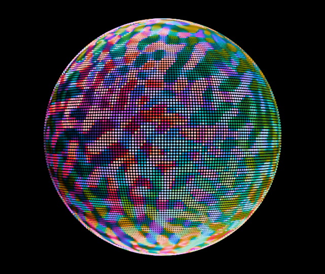
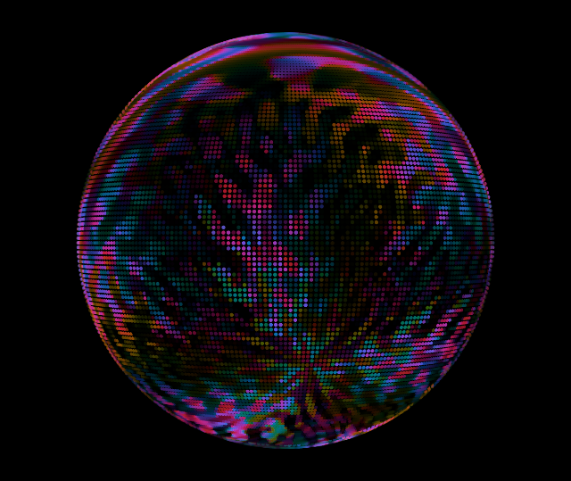

# Effects Reference

Section 9 of the [Holosphere README](https://github.com/woundedlion/pov/blob/master/README.md).

All screenshots below were captured from the [live WebAssembly simulator](https://woundedlion.github.io/daydream/) — the largest supported preset for each effect, either Phantasm 288×144 or Holosphere 96×20.

## Contents

- [Core Effects (Modern Engine)](#core-effects-modern-engine)
  - [BZReactionDiffusion](#bzreactiondiffusion)
  - [GSReactionDiffusion](#gsreactiondiffusion)
  - [HopfFibration](#hopffibration)
  - [IslamicStars](#islamicstars)
  - [HankinSolids](#hankinsolids)
  - [SphericalHarmonics](#sphericalharmonics)
  - [MobiusRings](#mobiusrings)
  - [Voronoi](#voronoi)
  - [PetalFlow](#petalflow)
  - [DreamBalls](#dreamballs)
  - [Comets](#comets)
  - [AlienBrain](#alienbrain)
  - [KaleidoscopeHexSoft](#kaleidoscopehexsoft)
  - [AlienOcean](#alienocean)
  - [AlienCore](#aliencore)
  - [KaleidoscopeMandala](#kaleidoscopemandala)
  - [GridSpace](#gridspace)
  - [HyperLattice](#hyperlattice)
  - [LatticeMelt](#latticemelt)
  - [MermaidSkin](#mermaidskin)
  - [ChromaticLichen](#chromaticlichen)
  - [AshCloud](#ashcloud)
  - [KaleidoscopePentBright](#kaleidoscopepentbright)
  - [KaleidoscopeHexOil](#kaleidoscopehexoil)
  - [KaleidoscopeStainedGlass](#kaleidoscopestainedglass)
  - [KaleidoscopeSmooth](#kaleidoscopesmooth)
  - [KaleidoscopeHexBright](#kaleidoscopehexbright)
  - [KaleidoscopeFlowers](#kaleidoscopeflowers)
  - [CosmicEyeball](#cosmiceyeball)
  - [MobiusGrid](#mobiusgrid)
  - [RingSpin](#ringspin)
  - [RingShower](#ringshower)
  - [Fishbowl](#fishbowl)
  - [MeshFeedback](#meshfeedback)
  - [MindSplatter](#mindsplatter)
  - [Dynamo](#dynamo)
  - [Thrusters](#thrusters)
  - [GnomonicStars](#gnomonicstars)
  - [Raymarch](#raymarch)
  - [DisplacementField](#displacementfield)
  - [ShapeShifter](#shapeshifter)
- [Shader Authoring Workbench](#shader-authoring-workbench)
  - [Composed-effect roster](#composed-effect-roster)
  - [Authoring vocabulary](#authoring-vocabulary)
- [Legacy Effects (`effects_legacy.h`)](#legacy-effects-effects_legacyh)

---

## Core Effects (Modern Engine)

<table border="0"><tr>
<td width="300"><a href="https://woundedlion.github.io/daydream/?effect=BZReactionDiffusion" target="_blank"></a></td>
<td valign="top">

### BZReactionDiffusion

Simulates the Belousov-Zhabotinsky reaction — a 3-species cyclic competition (A beats B, B beats C, C beats A) producing rotating spiral waves. The simulation runs on a spherical k-nearest-neighbor graph (`ReactionGraph`: 7680 nodes, 6 neighbors each, precomputed Fibonacci lattice) with configurable diffusion rate and time step. Spiral nuclei are seeded once at init; a stochastic nudge to a handful of nodes on every physics substep keeps the dynamics off the closed manifold so the waves sustain.

**Parameters**: Compete (cyclic-competition/predation coefficient), Diff (diffusion rate), Speed (time step)

</td></tr></table>

<table border="0"><tr>
<td width="300"><a href="https://woundedlion.github.io/daydream/?effect=GSReactionDiffusion" target="_blank"></a></td>
<td valign="top">

### GSReactionDiffusion

Gray-Scott reaction-diffusion system (U + 2V → 3V, V → P) on a spherical mesh. Produces spots, stripes, and labyrinthine patterns depending on feed/kill rates. A reaction runs until its field has all but stopped moving, then dissolves off the sphere and reseeds at fresh cluster sites under a freshly rebaked palette, so every cycle grows a different form in new colors from the same constants; editing the constants dissolves the current field too.

**Parameters**: Feed, Kill, dA, dB, Speed

</td></tr></table>

<table border="0"><tr>
<td width="300"><a href="https://woundedlion.github.io/daydream/?effect=HopfFibration" target="_blank"></a></td>
<td valign="top">

### HopfFibration

Visualizes the Hopf fibration — a map from S³ to S². Points on S² (the base space) are lifted to fibers on S³ via the quaternion parameterization `q = [cos(η)cos(φ+β), cos(η)sin(φ+β), sin(η)cos(β), sin(η)sin(β)]`, then stereographically projected to R³ and plotted on the sphere. A 4D tumble (R_xw × R_yz rotation) continuously rotates the fibration.

**Parameters**: Flow Spd, Tumble Spd, Folding, Twist, Alpha

</td></tr></table>

<table border="0"><tr>
<td width="300"><a href="https://woundedlion.github.io/daydream/?effect=IslamicStars" target="_blank"></a></td>
<td valign="top">

### IslamicStars

Procedurally generates Islamic geometric patterns using Hankin's polygons-in-contact method over Platonic and Archimedean seed solids. Each face of a rotating solid is decorated with its characteristic star polygon, colored by face topology (triangles, pentagons, hexagons, etc.), with topology classes folded modulo the six-slot `MeshPaletteBank` so a mesh carrying more than six classes aliases two distinct classes onto one color. Shapes carrying a recipe are built on screen op by op: the seed solid segues in, then the lowered Conway chain (hankin, ambo, truncate, snub, chamfer, relax, kis, dual) sweeps it into the finished pattern. Most lowered steps are one animated leg, but the smooth bridges are not: a dual is a three-leg bridge (truncate to ambo, medial slerp, truncate down to the dual), a trailing dual + kis pair — a needle — spans both steps as a five-leg macro (truncate, dual bridge, reconcile onto the authored mesh), and a standalone kis runs eight legs (dual bridge, truncate, dual bridge, reconcile). Each shape then holds still, ripple waves distort the geometry, and it segues out into the next.

**Parameters**: Face Fade Lo, Face Fade Hi, Burst, Ripp Amp, Ripp Decay, Ripp Dur, Trans Speed

</td></tr></table>

<table border="0"><tr>
<td width="300"><a href="https://woundedlion.github.io/daydream/?effect=HankinSolids" target="_blank"></a></td>
<td valign="top">

### HankinSolids

Hankin interlace patterns over the Platonic and Archimedean solids. The interlace angle sweeps continuously over the held solid, then a random walk along the Conway edge graph picks the next one: each leg sweeps the destination solid's own operator parameter, so faces visibly truncate, expand, and twist into it. Exactly one mesh is on screen at all times; faces are colored by topology class from shuffled mesh palettes that crossfade per leg.

**Parameters**: Intensity, Angle

</td></tr></table>


<table border="0"><tr>
<td width="300"><a href="https://woundedlion.github.io/daydream/?effect=SphericalHarmonics" target="_blank"></a></td>
<td valign="top">

### SphericalHarmonics

Visualizes the real spherical harmonics Yˡₘ(θ, φ) as a colored scalar field over the sphere: the harmonic value drives a positive/negative palette split — negative lobes recolor the positive palette by swapping its red and blue channels and dimming its green — with ambient-occlusion shading. Continuously morphs between (l, m) modes.

**Parameters**: Amplitude

</td></tr></table>

<table border="0"><tr>
<td width="300"><a href="https://woundedlion.github.io/daydream/?effect=MobiusRings&resolution=Holosphere%20(96x20)" target="_blank"></a></td>
<td valign="top">

### MobiusRings

A latitude-longitude grid that undergoes live Möbius transformation animation via `MobiusWarpCircularTransformer`.

**Parameters**: Rings, Lines, Alpha

</td></tr></table>

<table border="0"><tr>
<td width="300"><a href="https://woundedlion.github.io/daydream/?effect=Voronoi" target="_blank"></a></td>
<td valign="top">

### Voronoi

Spherical Voronoi diagram with animated seed positions. Cells are always filled with per-site palette colors (blended across the seam between the nearest two sites when **Sharpness** > 0); an optional black border seam is painted between neighboring cells when **Border Thick** > 0 (off by default).

**Parameters**: Num Sites, Speed, Sharpness, Border Thick

</td></tr></table>

<table border="0"><tr>
<td width="300"><a href="https://woundedlion.github.io/daydream/?effect=PetalFlow" target="_blank"></a></td>
<td valign="top">

### PetalFlow

Polyline rings drift pole-to-pole through an inverse stereographic projection, each wobbled into petal lobes and twisted by an angle that grows with its position; rasterized via Plot.

**Parameters**: Twist, Speed, Alpha, Density

</td></tr></table>

<table border="0"><tr>
<td width="300"><a href="https://woundedlion.github.io/daydream/?effect=DreamBalls" target="_blank"></a></td>
<td valign="top">

### DreamBalls

Draws twisting wireframe knotted structures over a selectable Platonic, Archimedean, or Catalan base mesh. The `Base Mesh` dropdown exposes all 31 of them (`Solids::BaseMesh`), and its selection is stored with the other preset parameters. Edges render as an over/under weave whose crossing graph `Weave Topology` selects: `Automatic` (the default every preset carries) parallel-transports each crossing's outgoing frame to the hidden end of the incoming edge when the solid is four-regular and falls back to the medial graph when it is not, `Medial` forces that medial graph, and `Original with defects` keeps the source mesh's shared-vertex framing. `Weave Gap` is the fraction of each strand that fades out where it tucks under its crossing partner. Mesh vertices are displaced along per-vertex tangent frames to create orbiting knot patterns. Multiple copies orbit simultaneously while the whole structure tumbles under a slow Languid random-walk view orientation punctuated by periodic full-sphere spins. Ten presets cycle every 320 frames, each carrying a solid and displacement settings — rhombicuboctahedron, rhombicosidodecahedron, truncated cuboctahedron, icosidodecahedron, snub cube, truncated dodecahedron, triakis icosahedron and disdyakis triacontahedron, the triakis icosahedron taking three of the ten slots at different displacements. Eight fixed procedural palettes cover the ten: the first two presets share a blood-stream palette composed with an alpha falloff that ramps alpha linearly from full at the palette's near end to zero at its far end; the remaining eight use rich sunset, lavender lake, mauve fade, coral blue, bruised moss, lavender lake, plum sunrise, and bruised mango, in order. The outgoing sprite fades out before the incoming one fades in, so exactly one mesh renders per frame.

**Parameters**: Base Mesh (source solid), Weave Topology (crossing graph), Weave Gap (under-strand fade), Copies (number of knot copies), Radius (displacement), Speed (orbit speed), Alpha

</td></tr></table>

<table border="0"><tr>
<td width="300"><a href="https://woundedlion.github.io/daydream/?effect=Comets" target="_blank"></a></td>
<td valign="top">

### Comets

A single head traces spherical Lissajous curves, cycling through a dozen configurations, trailed by a long 115-frame orientation tail and periodically wiping the palette to a fresh triadic scheme.

**Parameters**: Alpha, Thickness, Cycle Dur, Debug BB

Thickness 0 hides the comet.

</td></tr></table>

<table border="0"><tr>
<td width="300"><a href="https://woundedlion.github.io/daydream/?effect=AlienBrain" target="_blank"></a></td>
<td valign="top">

### AlienBrain

Glitch-folded stereographic grids pulled through an animated wave shear. Four presets morph the grid frequency, complexity, shear strength, and speed inside one composed pipeline.

**Parameters**: Pattern Freq, Speed, Complexity, Pattern Mix, Drift, Source Angle Speed, Singularity Fade, Projection Spin Speed, Projection Wander, Camera Wander, Planar Warp 1 Speed, Warp Strength, Warp Frequency, Warp Field Angle, Palette Chroma, Palette Mapping, Mapping Frequency, Mapping Phase, Phase Oscillation Depth, Phase Oscillation Speed, Opacity at Value 0, Opacity at Value 1, Hue Shift Amount, Hue Noise Scale, Hue Noise Speed

</td></tr></table>

<table border="0"><tr>
<td width="300"><a href="https://woundedlion.github.io/daydream/?effect=KaleidoscopeHexSoft" target="_blank"></a></td>
<td valign="top">

### KaleidoscopeHexSoft

A drifting twin-wave field reflected through a spherical kaleidoscope, projected stereographically, and repeated by an inner mirror tile.

**Parameters**: Pattern Freq, Speed, Drift, Source Angle Speed, Singularity Fade, Projection Spin Speed, Projection Wander, Camera Wander, Planar Warp 2 Speed, Mirror Rotation, Mirror Cell X, Mirror Cell Y, Mirror Offset X, Mirror Offset Y, Palette Chroma, Palette Mapping, Mapping Frequency, Mapping Phase, Phase Oscillation Depth, Phase Oscillation Speed, Opacity at Value 0, Opacity at Value 1, Hue Shift Amount, Hue Noise Scale, Hue Noise Speed

</td></tr></table>

<table border="0"><tr>
<td width="300"><a href="https://woundedlion.github.io/daydream/?effect=AlienOcean" target="_blank"></a></td>
<td valign="top">

### AlienOcean

A broad folded gnomonic grid drifting inside a fixed mirror frame and a spherical kaleidoscope. Edge-fade coverage and a generated triadic palette give the field its soft, liquid boundary.

**Parameters**: Pattern Freq, Speed, Complexity, Pattern Mix, Drift, Source Angle Speed, Singularity Fade, Camera Wander, Planar Warp 1 Speed, Mirror Rotation, Mirror Cell X, Mirror Cell Y, Mirror Offset X, Mirror Offset Y, Edge Width, Palette Chroma, Palette Mapping, Mapping Frequency, Mapping Phase, Phase Oscillation Depth, Phase Oscillation Speed, Opacity at Value 0, Opacity at Value 1, Hue Shift Amount, Hue Noise Scale, Hue Noise Speed

</td></tr></table>

<table border="0"><tr>
<td width="300"><a href="https://woundedlion.github.io/daydream/?effect=AlienCore" target="_blank"></a></td>
<td valign="top">

### AlienCore

A mirrored grid folded by the glitch lens and a folded gnomonic projection. Its high-contrast edge-fade material keeps the discontinuous facets legible while the grid drifts inside a fixed mirror frame.

**Parameters**: Pattern Freq, Speed, Complexity, Pattern Mix, Drift, Source Angle Speed, Singularity Fade, Camera Wander, Planar Warp 1 Speed, Mirror Rotation, Mirror Cell X, Mirror Cell Y, Mirror Offset X, Mirror Offset Y, Edge Width, Palette Chroma, Palette Mapping, Mapping Frequency, Mapping Phase, Phase Oscillation Depth, Phase Oscillation Speed, Opacity at Value 0, Opacity at Value 1, Hue Shift Amount, Hue Noise Scale, Hue Noise Speed

</td></tr></table>

<table border="0"><tr>
<td width="300"><a href="https://woundedlion.github.io/daydream/?effect=KaleidoscopeMandala" target="_blank"></a></td>
<td valign="top">

### KaleidoscopeMandala

A wave-sheared grid moving across a folded gnomonic dodecahedral kaleidoscope, then repeated through an inner mirror tile.

**Parameters**: Pattern Freq, Speed, Complexity, Pattern Mix, Drift, Source Angle Speed, Singularity Fade, Camera Wander, Planar Warp 1 Speed, Warp Strength, Warp Frequency, Warp Field Angle, Planar Warp 2 Speed, Mirror Rotation, Mirror Cell X, Mirror Cell Y, Mirror Offset X, Mirror Offset Y, Palette Chroma, Palette Mapping, Mapping Frequency, Mapping Phase, Phase Oscillation Depth, Phase Oscillation Speed, Opacity at Value 0, Opacity at Value 1, Hue Shift Amount, Hue Noise Scale, Hue Noise Speed

</td></tr></table>

<table border="0"><tr>
<td width="300"><a href="https://woundedlion.github.io/daydream/?effect=GridSpace" target="_blank"></a></td>
<td valign="top">

### GridSpace

An affine primitive lattice rendered as soft iso contours through a folded gnomonic projection. The affine frame scrolls the lattice by whole cell windings, so its drift repeats without a visible seam.

**Parameters**: Lattice Cell Scale, Lattice Shape, Lattice Softness, Lattice Radius, Singularity Fade, Projection Spin Speed, Projection Wander, Camera Wander, Planar Warp 1 Speed, Affine Rotation Rate, Affine Translation X, Affine Translation Y, Affine Scale X, Affine Scale Y, Affine Shear, Iso Level, Iso Width, Palette Chroma, Palette Mapping, Mapping Frequency, Mapping Phase, Phase Oscillation Depth, Phase Oscillation Speed, Opacity at Value 0, Opacity at Value 1, Hue Shift Amount, Hue Noise Scale, Hue Noise Speed

</td></tr></table>

<table border="0"><tr>
<td width="300"><a href="https://woundedlion.github.io/daydream/?effect=HyperLattice" target="_blank"></a></td>
<td valign="top">

### HyperLattice

An analytic flight through cubic and four-dimensional lattices under genuine SO(4) rotation. Dimension picks the lattice the flight reads: 3D holds the three spatial axes, Dimensional Rift blends part of the fourth in, and 4D Slice takes a full cross-section of the hypercubic lattice. Transparent integer-coordinate planes are walked analytically per axis rather than raymarched; Shells sets how many of them each axis cursor crosses, so raising it deepens the visible layering.

**Parameters**: Dimension (3D, Dimensional Rift, 4D Slice), Sphere Radius, Cell Size, Wire Radius, Softness, Far Distance, AA Strength, Speed, 3D Spin, 4D Spin, Color, Shells

</td></tr></table>

<table border="0"><tr>
<td width="300"><a href="https://woundedlion.github.io/daydream/?effect=LatticeMelt" target="_blank"></a></td>
<td valign="top">

### LatticeMelt

A folded-sinusoidal sphere projection displaced by curl noise and shaded with a generated triadic palette. Its two presets share one composed pipeline and vary only the surface-noise scale.

**Parameters**: Lattice Cell Scale, Lattice Shape, Lattice Softness, Lattice Radius, Projection Spin Speed, Projection Wander, Camera Wander, Central Meridian, Surface Noise Scale, Surface Noise Strength, Surface Noise Speed, Palette Chroma, Palette Mapping, Mapping Frequency, Mapping Phase, Phase Oscillation Depth, Phase Oscillation Speed, Brightness Bottom, Brightness Top, Opacity at Value 0, Opacity at Value 1, Hue Shift Amount, Hue Noise Scale, Hue Noise Speed

</td></tr></table>

<table border="0"><tr>
<td width="300"><a href="https://woundedlion.github.io/daydream/?effect=MermaidSkin" target="_blank"></a></td>
<td valign="top">

### MermaidSkin

A max-chroma analogous grid folded around the sphere and rippled by curl noise. Its cup palette mapping and slowly drifting noisy hue shift preserve the iridescent skin captured in the saved workbench preset.

**Parameters**: Pattern Freq, Speed, Complexity, Pattern Mix, Drift, Source Angle Speed, Projection Spin Speed, Projection Wander, Camera Wander, Central Meridian, Surface Noise Scale, Surface Noise Strength, Surface Noise Speed, Palette Chroma, Palette Mapping, Mapping Frequency, Mapping Phase, Phase Oscillation Depth, Phase Oscillation Speed, Opacity at Value 0, Opacity at Value 1, Hue Shift Amount, Hue Noise Scale, Hue Noise Speed

</td></tr></table>

<table border="0"><tr>
<td width="300"><a href="https://woundedlion.github.io/daydream/?effect=ChromaticLichen" target="_blank"></a></td>
<td valign="top">

### ChromaticLichen

A glitch-folded gnomonic grid displaced by sphere-space curl noise. An analogous generated palette paints the slow lichen-like branching with shifting chromatic bands.

**Parameters**: Pattern Freq, Speed, Complexity, Pattern Mix, Drift, Source Angle Speed, Singularity Fade, Projection Spin Speed, Projection Wander, Camera Wander, Surface Noise Scale, Surface Noise Strength, Surface Noise Speed, Palette Chroma, Palette Mapping, Mapping Frequency, Mapping Phase, Phase Oscillation Depth, Phase Oscillation Speed, Opacity at Value 0, Opacity at Value 1, Hue Shift Amount, Hue Noise Scale, Hue Noise Speed

</td></tr></table>

<table border="0"><tr>
<td width="300"><a href="https://woundedlion.github.io/daydream/?effect=AshCloud" target="_blank"></a></td>
<td valign="top">

### AshCloud

A primitive lattice displaced by sphere-space curl noise, folded through a dodecahedral kaleidoscope and projected stereographically. A value cutout carves the lattice, so coverage follows the field rather than the projection alone.

**Parameters**: Lattice Cell Scale, Lattice Shape, Lattice Softness, Lattice Radius, Singularity Fade, Projection Spin Speed, Projection Wander, Camera Wander, Surface Noise Scale, Surface Noise Strength, Surface Noise Speed, Cutout Threshold, Cutout Softness, Palette Chroma, Palette Mapping, Mapping Frequency, Mapping Phase, Phase Oscillation Depth, Phase Oscillation Speed, Opacity at Value 0, Opacity at Value 1, Hue Shift Amount, Hue Noise Scale, Hue Noise Speed

</td></tr></table>

<table border="0"><tr>
<td width="300"><a href="https://woundedlion.github.io/daydream/?effect=KaleidoscopePentBright" target="_blank"></a></td>
<td valign="top">

### KaleidoscopePentBright

A polar primitive lattice folded through a pentagonal-prism kaleidoscope and projected stereographically, its polar chart winding the angular phase one turn per cycle.

**Parameters**: Lattice Cell Scale, Lattice Shape, Lattice Softness, Lattice Radius, Singularity Fade, Projection Spin Speed, Projection Wander, Camera Wander, Planar Warp 1 Speed, Polar Radial Scale, Polar Radial Phase, Polar Angular Phase, Planar Warp 2 Speed, Warp Strength, Warp Frequency, Warp Field Angle, Palette Chroma, Palette Mapping, Mapping Frequency, Mapping Phase, Phase Oscillation Depth, Phase Oscillation Speed, Opacity at Value 0, Opacity at Value 1, Hue Shift Amount, Hue Noise Scale, Hue Noise Speed

</td></tr></table>

<table border="0"><tr>
<td width="300"><a href="https://woundedlion.github.io/daydream/?effect=KaleidoscopeHexOil" target="_blank"></a></td>
<td valign="top">

### KaleidoscopeHexOil

A rotating spiral folded through a hexagonal-prism kaleidoscope, projected stereographically, and displaced by direct surface noise whose path length drives the hue rotation.

**Parameters**: Pattern Freq, Speed, Source Angle Speed, Singularity Fade, Projection Spin Speed, Projection Wander, Camera Wander, Surface Noise Scale, Surface Noise Strength, Surface Noise Speed, Surface Noise Direction, Palette Chroma, Palette Mapping, Mapping Frequency, Mapping Phase, Phase Oscillation Depth, Phase Oscillation Speed, Opacity at Value 0, Opacity at Value 1, Hue Shift Amount

</td></tr></table>

<table border="0"><tr>
<td width="300"><a href="https://woundedlion.github.io/daydream/?effect=KaleidoscopeStainedGlass" target="_blank"></a></td>
<td valign="top">

### KaleidoscopeStainedGlass

A vector-noise grid refracted across folded gnomonic dodecahedral facets and repeated through an inner mirror tile. A cup-shaped palette envelope emphasizes the warped cell interiors.

**Parameters**: Pattern Freq, Speed, Complexity, Pattern Mix, Drift, Source Angle Speed, Singularity Fade, Camera Wander, Planar Warp 1 Speed, Warp Strength, Warp Scale, Warp Vector Angle, Planar Warp 2 Speed, Mirror Rotation, Mirror Cell X, Mirror Cell Y, Mirror Offset X, Mirror Offset Y, Palette Chroma, Palette Mapping, Mapping Frequency, Mapping Phase, Phase Oscillation Depth, Phase Oscillation Speed, Brightness Bottom, Brightness Top, Opacity at Value 0, Opacity at Value 1, Hue Shift Amount, Hue Noise Scale, Hue Noise Speed

</td></tr></table>

<table border="0"><tr>
<td width="300"><a href="https://woundedlion.github.io/daydream/?effect=KaleidoscopeSmooth" target="_blank"></a></td>
<td valign="top">

### KaleidoscopeSmooth

A generated analogous-palette grid folded through a dodecahedral kaleidoscope, then projected stereographically and repeated by an inner mirror tile. Its four presets share one composed pipeline and vary only continuous parameters.

**Parameters**: Pattern Freq, Speed, Complexity, Pattern Mix, Drift, Source Angle Speed, Singularity Fade, Projection Spin Speed, Projection Wander, Camera Wander, Planar Warp 2 Speed, Mirror Rotation, Mirror Cell X, Mirror Cell Y, Mirror Offset X, Mirror Offset Y, Palette Chroma, Palette Mapping, Mapping Frequency, Mapping Phase, Phase Oscillation Depth, Phase Oscillation Speed, Opacity at Value 0, Opacity at Value 1, Hue Shift Amount, Hue Noise Scale, Hue Noise Speed

</td></tr></table>

<table border="0"><tr>
<td width="300"><a href="https://woundedlion.github.io/daydream/?effect=KaleidoscopeHexBright" target="_blank"></a></td>
<td valign="top">

### KaleidoscopeHexBright

A mirrored twin-wave field folded through a hexagonal-prism kaleidoscope and projected stereographically, with an analogous generated palette.

**Parameters**: Pattern Freq, Speed, Drift, Source Angle Speed, Singularity Fade, Projection Spin Speed, Projection Wander, Camera Wander, Planar Warp 2 Speed, Mirror Rotation, Mirror Cell X, Mirror Cell Y, Mirror Offset X, Mirror Offset Y, Palette Chroma, Palette Mapping, Mapping Frequency, Mapping Phase, Phase Oscillation Depth, Phase Oscillation Speed, Opacity at Value 0, Opacity at Value 1, Hue Shift Amount, Hue Noise Scale, Hue Noise Speed

</td></tr></table>

<table border="0"><tr>
<td width="300"><a href="https://woundedlion.github.io/daydream/?effect=KaleidoscopeFlowers" target="_blank"></a></td>
<td valign="top">

### KaleidoscopeFlowers

Dodecahedrally folded grids mapped continuously around an equirectangular equator and repeated through an inner mirror tile. Three presets morph density and color mapping without changing structure. Pattern Mix stays at 1, so Complexity does not affect these presets.

**Parameters**: Pattern Freq, Speed, Complexity, Pattern Mix, Drift, Source Angle Speed, Singularity Fade, Projection Spin Speed, Projection Wander, Camera Wander, Central Meridian, Planar Warp 2 Speed, Mirror Rotation, Mirror Cell X, Mirror Cell Y, Mirror Offset X, Mirror Offset Y, Palette Chroma, Palette Mapping, Mapping Frequency, Mapping Phase, Phase Oscillation Depth, Phase Oscillation Speed, Opacity at Value 0, Opacity at Value 1, Hue Shift Amount, Hue Noise Scale, Hue Noise Speed

</td></tr></table>

<table border="0"><tr>
<td width="300"><a href="https://woundedlion.github.io/daydream/?effect=CosmicEyeball" target="_blank"></a></td>
<td valign="top">

### CosmicEyeball

A high-contrast mirrored stereographic grid folded by the glitch lens. Hue follows total mirror displacement, producing the concentric color structure around the moving field.

**Parameters**: Pattern Freq, Speed, Complexity, Pattern Mix, Drift, Source Angle Speed, Singularity Fade, Camera Wander, Planar Warp 1 Speed, Mirror Rotation, Mirror Cell X, Mirror Cell Y, Mirror Offset X, Mirror Offset Y, Edge Width, Palette Chroma, Palette Mapping, Mapping Frequency, Mapping Phase, Phase Oscillation Depth, Phase Oscillation Speed, Opacity at Value 0, Opacity at Value 1, Hue Shift Amount

</td></tr></table>

<table border="0"><tr>
<td width="300"><a href="https://woundedlion.github.io/daydream/?effect=MobiusGrid" target="_blank"></a></td>
<td valign="top">

### MobiusGrid

A stereographic twin-wave field folded through an inner mirror tile and a live Möbius lens. The lens follows a continuous 160-frame circular warp cycle while a complementary palette tracks displacement through the fold. Its two presets share the same fixed graph.

**Parameters**: Pattern Freq, Speed, Drift, Source Angle Speed, Singularity Fade, Projection Spin Speed, Projection Wander, Camera Wander, Planar Warp 2 Speed, Mirror Rotation, Mirror Cell X, Mirror Cell Y, Mirror Offset X, Mirror Offset Y, Mobius A Re, Mobius A Im, Mobius B Re, Mobius B Im, Mobius C Re, Mobius C Im, Mobius D Re, Mobius D Im, Palette Chroma, Palette Mapping, Mapping Frequency, Mapping Phase, Phase Oscillation Depth, Phase Oscillation Speed, Brightness Bottom, Brightness Top, Opacity at Value 0, Opacity at Value 1, Hue Shift Amount

</td></tr></table>

<table border="0"><tr>
<td width="300"><a href="https://woundedlion.github.io/daydream/?effect=RingSpin" target="_blank"></a></td>
<td valign="top">

### RingSpin

Four great-circle rings tumble continuously under energetic random-walk rotation, each leaving a fading motion-blur trail of its recent orientations (drawn with `Scan::RingGroup`, which fuses a frame's near-coincident sub-rings into one scan pass; head and tail of the trail thickened). Each ring is colored by a baked vignette palette.

**Parameters**: Alpha, Thickness, Debug BB

</td></tr></table>

<table border="0"><tr>
<td width="300"><a href="https://woundedlion.github.io/daydream/?effect=RingShower&resolution=Holosphere%20(96x20)" target="_blank"></a></td>
<td valign="top">

### RingShower

Rings bloom at random orientations and grow their radius from zero, fading in over the first few frames and then holding (no fade-out), colored by a generative mirrored analogous palette — a continuous shower of expanding rings drawn with `Plot::Ring`. Each ring's radius, fade, and lifetime are pure functions of its age driven directly from a recyclable slot rather than a per-ring `Sprite`.

**Parameters**: Alpha

</td></tr></table>

<table border="0"><tr>
<td width="300"><a href="https://woundedlion.github.io/daydream/?effect=Fishbowl" target="_blank"></a></td>
<td valign="top">

### Fishbowl

A head traces a fixed 12:5 spherical Lissajous figure whose long trail is continuously warped by a noise transformer, over a slowly cycling gradient palette.

**Parameters**: Alpha, Cycle Dur, Speed, Jitter Amp, Noise Scale, Scale Factor, Cycle Speed, Duty Cycle

Duty Cycle 0 hides the trail; positive values control its visible fraction.

</td></tr></table>

<table border="0"><tr>
<td width="300"><a href="https://woundedlion.github.io/daydream/?effect=MeshFeedback" target="_blank"></a></td>
<td valign="top">

### MeshFeedback

A selectable Platonic, Archimedean, or Catalan wireframe rendered with `Plot::Mesh`, given a noise-distorted, feedback-loop appearance via `Filter::Pixel::Feedback`. An orientation random-walk tumbles the solid while a `Segue::Preset::Snap` preset choreography hard-cuts both the base mesh and feedback/distortion style parameters.

**Parameters**: Base Mesh, Fade, Distort Amp, Distort Freq, Distort Speed, Noise Scale, Hue Shift, Feedback

</td></tr></table>

<table border="0"><tr>
<td width="300"><a href="https://woundedlion.github.io/daydream/?effect=MindSplatter" target="_blank"></a></td>
<td valign="top">

### MindSplatter

Particles spray from emitters at the vertices of a selectable Platonic solid — each sweeping its own tangent-plane emission angle — and fall toward attractor wells at the vertices of its dual. The tetrahedron is self-dual; cube/octahedron and dodecahedron/icosahedron form the other pairs. Event-horizon kernels punch the particles out around each attractor. A random walk tumbles the view, periodic Möbius warp bursts distort the whole field, and a preset timer transitions the base mesh, friction, well strength, speeds, and warp scale between eight presets.

**Parameters**: Base Mesh, Friction, Well Str, Init Spd, Ang Spd, Warp, Particles

</td></tr></table>

<table border="0"><tr>
<td width="300"><a href="https://woundedlion.github.io/daydream/?effect=Dynamo&resolution=Holosphere%20(96x20)" target="_blank"></a></td>
<td valign="top">

### Dynamo

A vertical strand of points — one per latitude row plus H_OFFSET virtual sub-pole nodes — drifts horizontally around the sphere, each row dragging the next under a gap constraint so the chain wavers like a wind-blown curtain. The strand leaves motion trails, is replicated three times around the sphere, periodically reverses direction, and tumbles under random-axis rotations, while periodic color wipes sweep freshly generated analogous palettes across it.

**Parameters**: Speed, Gap, Trail Len, Trail Cap, Wipe Dur

</td></tr></table>

<table border="0"><tr>
<td width="300"><a href="https://woundedlion.github.io/daydream/?effect=Thrusters&resolution=Holosphere%20(96x20)" target="_blank"></a></td>
<td valign="top">

### Thrusters

A central distorted ring (`Plot::DistortedRing`) warps and spins; periodic random "fires" kick it onto a new axis and bloom a pair of opposed thrust rings (`Plot::Ring`) that expand from a sub-pixel seed and fade out.

**Parameters**: Radius, Alpha

</td></tr></table>

<table border="0"><tr>
<td width="300"><a href="https://woundedlion.github.io/daydream/?effect=GnomonicStars" target="_blank"></a></td>
<td valign="top">

### GnomonicStars

A Fibonacci-spiral field of star-polygon SDFs, continuously deformed by an evolving Möbius warp (built on a gnomonic-projection transformer) and slowly tumbled by a Languid random walk.

**Parameters**: Points, Radius, Sides, Warp Speed, Debug BB

</td></tr></table>

<table border="0"><tr>
<td width="300"><a href="https://woundedlion.github.io/daydream/?effect=Raymarch" target="_blank"></a></td>
<td valign="top">

### Raymarch

Volumetric raymarcher that renders twisted tori at the vertices of a selectable placement solid. Its `uv-surface-noise` preset uses the 26-vertex disdyakis dodecahedron; the selector contains the 21 base solids that fit the 32-copy capacity. Each torus is ray-marched with `Scan::Volume::draw`, lit with metallic Blinn-Phong shading (half-Lambert diffuse, specular highlights, Fresnel rim), and independently tumbled by an energetic random walk. A separate random walk drives the camera orientation. A seamless two-axis UV noise field selects and hue-shifts the generated OKLCH palette across each torus surface through the shared `NoiseHuePalette` machinery also used by the shader effects.

**Parameters**: Base Solid, Pulse Speed, Fill, Max Steps, Diffuse, Specular, Fresnel, Twist, AA Width, Hue Shift, Hue Noise Scale, Hue Noise Speed

</td></tr></table>

<table border="0"><tr>
<td width="300"><a href="https://woundedlion.github.io/daydream/?effect=DisplacementField" target="_blank"></a></td>
<td valign="top">

### DisplacementField

A stack of evenly spaced soft-stroked rings (`Scan::DistortedRingStack`) sharing one axis, each vertex displaced along the stack axis by a stack of displacement fields that alternate between two phases. In the ball phase, cap-shaped bumps spawn at the pole on random meridians and fall to the opposite pole at varying speeds, bowing the rings away from each falling ball; once the last ball lands, a two-octave world-space OpenSimplex noise field (octave 1 envelopes octave 2, so perturbations turn sparse wherever the envelope runs near zero) fades in from zero, dwells at full strength, then fades back out into the next ball phase. Ring colors sweep a circular analogous palette across the stack, with each fragment's hue rotated by the local displacement magnitude, and the palette slowly wipes to a freshly generated one every ~11 seconds.

**Parameters**: Alpha, Rings, Thickness, Ball Amp, Noise Amp, Scale 1, Scale 2, Hue Rotate, Flow Speed, Ball Min, Ball Max, Ball Rate, Speed Min, Speed Max

</td></tr></table>

<table border="0"><tr>
<td width="300"><a href="https://woundedlion.github.io/daydream/?effect=ShapeShifter" target="_blank"></a></td>
<td valign="top">

### ShapeShifter

Concentric polygon, star, or flower outlines drawn through the `Plot` rasterizer. Dense planar stars use direct sampled edges, with pole-crossing edges routed through the shared rasterizer and the same pre-shaded fragment shader. The rings span the full sphere radius under a selectable spacing law — **Spacing** is either uniform steps in radius or screen-balanced, which redistributes the rings away from the poles (subject to a density floor) so their on-screen spacing stays even — and **Alpha Falloff** picks each ring's alpha profile: a flat half, or full at the poles fading toward the equator. A selectable animated waveform offsets each ring's phase to twist the stack back and forth while a global random walk reorients the stack. A periodic timer steps through the presets under a `Segue::Preset::Fade` choreography: the whole stack fades out to black, the parameter set snaps to a fresh arrangement of spherical polygons, flowers, or stars inside that dark frame, and the stack fades back in — so two parameter sets never render on the same frame.

**Parameters**: Alpha, Shape, Count, Sides, Function, Amplitude, Speed, Opposite, Alpha Falloff, Spacing

</td></tr></table>

## Shader Authoring Workbench

The standalone [Shader workbench](https://github.com/woundedlion/daydream/blob/master/tools/shader.html) provides the complete structural vocabulary and its pipeline-strip editor in a dedicated browser tab. Twenty-three retained legacy presets migrate to stable composed product effects; legacy preset 4 is retired, and unmatched custom configurations route to the workbench for editing. The firmware rosters contain only the promoted effects.

The registry entry is named `Shader`; the WASM `setEffect()` binding also accepts the legacy names `ShaderWorkbench` and `ShaderBall` and remaps them onto it. It owns structural editing and dynamic dispatch in WASM and native oracle tests only. `HS_ENABLE_SHADER_WORKBENCH` is rejected for Arduino builds, keeping the dynamic backend and workbench out of firmware.

`ShaderChain` is the second workbench-only registry entry, under its own `HS_ENABLE_CHAIN_INTERPRETER` gate, likewise rejected for Arduino builds. It interprets an arbitrary compiled operator chain from the pullback operator table instead of the workbench's fixed stage folders, and registers one parameter per chain field as `{instance}.{field-id}`. The bridge compiles a program shape onto it with `setShaderChain`, which the workbench's chain-document layer calls before replaying preset values. Its operator clocks and generated palette continue advancing while the shared animation-pause state is set because a chain has no authored preset animation for that state to gate.

Shipping composed effects are ordinary concrete `Effect` types. Each names one compile-time `Pullback::Pipeline`, a compact parameter and prepared-frame type, immutable stable preset IDs, and only the resources its graph uses. Its raster loop calls `Derived::shade(view, frame)` directly; there is no per-pixel function-pointer dispatch, topology lookup, family object, or universal Shader parameter block. The shared `Pullback::ComposedEffect` base contains only lifecycle work that is genuinely common: clocks, preset interpolation, parameter registration, palette/LUT ownership, narrow frame preparation, and the typed scan loop; its preset choreography and snapshot machinery come from the engine-level `ChoreographedEffect`. Generated palette evaluation remains in the shared `GenerativePalette` color stage rather than being copied into each effect.

Each editable source document lives under `patterns/*.shader.json`. The browser validates and canonicalizes a document before changing the live engine, matches its exact descriptor digest to a composed effect, and selects presets by immutable ID. Open/save preserves exhaustive chain, parameter, transition, and choreography data. Unknown or invalid semantics leave the current preview untouched. The migration manifest maps all 23 retained Shader preset positions to stable effect/preset identities; preset 4 is intentionally retired.

The shader is a *pullback*: it starts at a visible sphere point and walks backward through a chain of stages over four ranked carrier families — Sphere, Plane, Field, Color. A chain is any stage sequence that is non-decreasing in family rank with agreeing adjacent carriers, entering at `SphereSample` and exiting at `Color4`; each family boundary is crossed at most once. Both Shader preview and concrete effects call the same public kernels in `core/render/pullback.h`. Palette mapping is continuous preset state: a transition carries both mapping endpoints and interpolates their coordinates before the single palette sample, so changing Cup/Bell/Linear/Reverse does not require another pipeline or effect.

```
selection — once per frame

  Candidate Config ──> canonical TopologyKey ──> 15-entry program manifest
                       ├─ match ────> compiled shade + semantic ID
                       └─ no match ─> dynamic shade + NONE (simulator only)
                                      └──> PreparedEndpoint

shading — once per visible sample, through the shared Scan::Shader loop

  Rotate · Displace · Lens        (SPHERE endomorphisms)
       │ SphereSample
  Project                         (SPHERE → PLANE crossing)
       │ PlaneSample
  Warp × N                        (PLANE endomorphisms)
       │ PlaneSample
  Sample                          (PLANE → FIELD crossing)
       │ FieldSample
  Transfer · Coverage             (FIELD endomorphisms)
       │ FieldSample
  Colorize                        (FIELD → COLOR crossing)
       │ straight-alpha Color4
  Canvas
```

The core catalog owns the reusable surface, lens, projection, planar-warp, source, material, and generated-color policies. The `Project` crossing rotates into the projection frame, projects, and embeds the projection's provenance and the sample point into the plane carrier. Each `Warp` stage advances the working coordinate and path accumulator, leaving provenance and sample point immutable. The `Sample` crossing consumes the provenance: it weights the raw signed field, ramps it into [0, 1], and folds projected coverage and domain coverage into the field carrier; `Transfer` and `Coverage` stages then reshape value and coverage. The terminal Colorize crossing samples the selected generated harmony, optionally rotates its hue with sphere-space noise or total path length, and returns straight-alpha `Color4`; the scan sink performs the final premultiplication.

Two stages carry approved approximations. Fast square Peirce projection and the hue-rotation LUT each name a host reference oracle, exact non-floating fields, error domains, limits, and a final-framebuffer metric as part of the stage contract. The dynamic orchestration is compiled for the simulator and native oracle tests, where every authored preset except AshCloud's is compared against it. AshCloud pairs projection-weight coverage with a value cutout, a combination the workbench coverage policy cannot spell, so its cutout is pinned by a rendered-frame sweep in `tests/test_effects.h` instead. Teensy preprocessing excludes it.

### Composed-effect roster

| Effect ID | Concrete effect | Presets | Legacy source |
|---|---|---:|---|
| `alien-brain` | `AlienBrain` | 4 | 0, 21–23 |
| `kaleidoscope-hex-soft` | `KaleidoscopeHexSoft` | 1 | 1 |
| `alien-ocean` | `AlienOcean` | 1 | 2 |
| `alien-core` | `AlienCore` | 1 | 3 |
| `kaleidoscope-mandala` | `KaleidoscopeMandala` | 2 | 5, plus `cup-hue` |
| `grid-space` | `GridSpace` | 1 | 6 |
| `lattice-melt` | `LatticeMelt` | 2 | 7–8 |
| `chromatic-lichen` | `ChromaticLichen` | 1 | — |
| `mermaid-skin` | `MermaidSkin` | 1 | — |
| `ash-cloud` | `AshCloud` | 1 | — |
| `kaleidoscope-pent-bright` | `KaleidoscopePentBright` | 1 | 9 |
| `kaleidoscope-hex-oil` | `KaleidoscopeHexOil` | 2 | — |
| `kaleidoscope-stained-glass` | `KaleidoscopeStainedGlass` | 1 | 10 |
| `kaleidoscope-smooth` | `KaleidoscopeSmooth` | 4 | 11, 13–14, plus `stretched-grid` |
| `kaleidoscope-hex-bright` | `KaleidoscopeHexBright` | 2 | 12, plus `hex-twin-wave-alt` |
| `kaleidoscope-flowers` | `KaleidoscopeFlowers` | 3 | 15–17 |
| `cosmic-eyeball` | `CosmicEyeball` | 1 | 18 |
| `mobius-grid` | `MobiusGrid` | 2 | 19–20 |

These eighteen effects form the product-only `shader-collection` group; family metadata is not part of runtime identity. Each effect's show window is derived from its preset count, giving every preset the shared 600-frame dwell and every transition the shared 480-frame segue. Mermaid Skin, Chromatic Lichen, Ash Cloud, and Kaleidoscope Hex Oil were promoted from workbench-authored snapshots and have no migration-manifest row. Host tests compare every preset except AshCloud's with Shader's dynamic evaluator within one 16-bit count; presets without a legacy index are paired with a synthesized workbench topology. Lattice Melt and Kaleidoscope Smooth run their comparisons in dedicated white-box equivalence suites.

The [device profile archive](https://github.com/woundedlion/pov/blob/master/docs/profiles/README.md) contains 38 shipping selective-O3 captures and 38 global-O3 reference captures. The shipping set reports zero spilled frames; MermaidSkin peaks at 45.60 ms, ChromaticLichen at 42.87 ms, and AshCloud at 50.09 ms. AshCloud's global-O3 reference peaks at 79.81 ms with 100% spills. These measurements apply to the revisions and configurations recorded in those reports. The composed effects let the compiler inline the exact typed pipeline and discard every unused stage. The shared runtime and `GenerativePalette` color stage keep common lifecycle and palette machinery from being duplicated without introducing type erasure in the per-pixel call. No paired capture isolates specialization from the other structural differences, so the archive does not claim a dispatch-only speedup.

### Authoring vocabulary

The parameter schema exposes the broader Shader workbench vocabulary below. A menu entry describes a structurally possible field value, not a promise that its Cartesian combination is compiled for Teensy. The simulator renders valid unmatched combinations dynamically; sliders are active only when the selected schema uses them.

The gap is per value, not only per combination. The `ComposedEffect` derivation layer in `composed_effect.h` reaches a strict subset of the shipped operator catalog, so thirteen operators — Peirce, Peirce (Fast Square), Bonne, Airocean, Rings, Spherical Rings, Escape Fractal, Tessellation, Vortex, Curl Flow, Ridge, Smooth Bands and Generated Palette v2 — and further values of the operators it does reach remain workbench-only: every non-simplex noise basis, the non-Euler curl integrators, the non-flat warp envelopes, the logarithmic polar chart and its harmonics 2–16, the front and back gnomonic hemispheres, the None signal weight, and the Bell, Ascending and Descending brightness envelopes. Opaque coverage is supported by the composed layer although no shipped composed effect selects it. Both Noise Contours are reachable. Value Cutout is reachable and selected by Ash Cloud. `tests/test_composed_effect.h` pins that set against the live operator table, so a catalog addition stays classified.

The two planar warps run in their displayed pullback order: **Planar Warp 1** then **Planar Warp 2**, followed by the source function.

| Stage | Options | Produces or controls |
|---|---|---|
| **Function** | Twin Wave, Rings, Spiral, Grid, Noise Contour (Projected), Primitive Lattice, Noise Contour (Sphere), Spherical Rings, Escape Fractal, Tessellation | A signed scalar field. Projected fields sample final planar coordinates; sphere fields sample the post-lens direction in the inverse projection frame. Grid blends between coupled and direct patterns with dedicated mix and complexity controls. |
| **Projection** | Folded Sinusoidal, Stereographic, Gnomonic, Bonne, Peirce Quincuncial, Dymaxion / Airocean, Equirectangular | Planar coordinates plus region/component identity, projection weight, boundary traits, stable edge identity, and fade distance. |
| **Projection Frame** | Identity, Spin + Wander | Rotates the sphere before projection. Projection Spin Speed and Projection Wander exist only for Spin + Wander. |
| **Surface Noise** | None, Direct, Curl | Displaces the unit-sphere direction and adds that displacement to the path accumulator. Surface Noise Placement runs it Before Lens or After Lens. Scale, Strength, Speed and Basis exist for either active mode; Direct adds Surface Noise Direction and Curl adds Surface Noise Integrator. |
| **Lens** | None, Glitch, Twist, Kaleidoscope (Azimuthal 6-fold), Mobius, Kaleidoscope (Tetrahedral), Kaleidoscope (Octahedral / Cubic), Kaleidoscope (Dodecahedral / Icosahedral), and the Triangular, Square, Pentagonal, Hexagonal and Octagonal Prism kaleidoscopes | Distorts a unit-sphere direction before projection. Lens-specific controls exist only for an active lens. |
| **Planar Warp 1 / 2** | None, Affine Frame, Wave Shear, Vortex, Projected Vector Noise, Projected Curl Flow, Mirror Tile, Polar Chart | Sequentially pulls planar coordinates backward. Every active warp exposes Speed; the meaning of one phase cycle is listed below. |
| **Signal Weight** | None, Projection | Optionally multiplies the signed source signal by the projection's weight before remapping it to `[0, 1]`. It changes value, not alpha. |
| **Value Transfer** | None, Ridge, Iso Contour, Smooth Bands | Shapes the normalized value. Iso controls appear only for Iso Contour; Band Count and Band Phase only for Smooth Bands. |
| **Coverage** | Opaque, Projection Weight Squared, Value Cutout, Edge Fade, Projection Weight | Computes alpha independently from color value. Linear projection weight is softer and broader than the squared form. |
| **Colorize** | Palette: Generated Triadic, Generated Complementary, Generated Analogous. Brightness Envelope: None, Cup, Bell, Ascending, Descending. Hue Shift Mode: None, Noise, Total Warp Displacement | Converts shaped value and coverage into straight-alpha color. Mapping Frequency repeats the selected palette-coordinate profile 1-32 times without changing Value Transfer or coverage. Hue Shift Amount controls either sphere-space noise rotation or rotation proportional to the accumulated path length, which the surface-noise displacement and both planar warps all add to. |

Planar-warp **Speed** advances the stage's wrapped phase in cycles per frame. Affine Frame derives Primitive Lattice's exact planar period as `1 / Lattice Cell Scale`; Translation X/Y are signed whole-cell windings per cycle and therefore scroll continuously in one direction before resetting invisibly at the source. Fractional translation writes snap to the nearest whole winding. A translating Affine Frame requires Primitive Lattice, no later planar warp, and a hue mode other than Total Warp Displacement; incompatible cross-stage edits are rejected with a warning. Rotation is a signed angle in radians per phase cycle over `[-2π, 2π]`; its continuous angular rate is `Speed × Rotation`, and zero holds the frame still. Shear oscillates, and Scale X/Y move logarithmically between reciprocal extrema. Mirror Tile translates its mirror lattice by one local X cell, producing a seamless repeating scroll while its Y offset remains manual. Polar Chart advances only Angular Phase by one turn; Radial Phase remains manual. Wave Shear advances its wave, Vortex orbits its center, and the two projected-noise modes move through their periodic noise field.

Polyhedral kaleidoscope lenses contract animation-speed and warp/noise-frequency slider ranges to the linear size of one symmetry chamber. Grid Pattern Freq and Lattice Cell Scale retain their full source-density ceilings under every lens, so small dodecahedral and prismatic chambers can still hold dense patterns. The stored units and shader math do not change: frequency remains measured in the stage's native domain and Speed remains cycles per frame. Switching to a smaller chamber clamps affected authoring values into its displayed range; switching back restores the wider range, not the discarded out-of-range value.

**Hue Shift Mode** selects the Colorize input. Noise evaluates the post-lens sphere direction, so it works without a planar warp; **Hue Shift Amount** sets its maximum hue rotation, **Hue Noise Scale** sets its spatial frequency, and **Hue Noise Speed** moves through the periodic field within `-0.001` to `0.001` cycles per frame. Zero freezes the field at its current phase. Total Warp Displacement instead rotates hue by Hue Shift Amount times the shared path accumulator, which the surface-noise Displace step and both planar warps each add their applied distance to — so a displaced effect with no planar warp, such as Kaleidoscope Hex Oil, still rotates hue. It uses accumulated path length rather than net offset, so opposing warps both remain visible in the color.

Noise Contour (Projected) is available with Folded Sinusoidal,
Stereographic, Gnomonic, and Equirectangular projections. Noise Contour (Sphere)
and Spherical Rings work with every projection but reject non-None planar warps
because those warps have no sphere-space inverse.

**Camera Wander** sits outside that table: it is always registered, and scales
how much of a continuous random walk rotates the viewing direction before any
stage runs, drifting the whole look. The Spin + Wander frame's own
**Projection Wander** is a separate slider that drifts only the sphere's
pre-projection orientation.

Selector dependencies are explicit and deterministic:

```
Projection ─┬─ Bonne ─────────────> Hemisphere + standard parallel
            ├─ Peirce ────────────> Layout (scroll for strip layouts)
            ├─ Dymaxion/Airocean ─> Net layout
            ├─ Gnomonic ──────────> Hemisphere policy
            └─ any ───────────────> Meridian / scale / pole controls, where meaningful

Function ──────────> Function-specific source controls
Surface Noise ─────> Placement, basis, scale, strength, speed; direction or integrator
Lens ──────────────> Selected lens controls
Planar Warp 1 ─────> Selected stage controls
Planar Warp 2 ─────> Selected stage controls
Value Transfer ────> Iso or band controls
Coverage ──────────> Cutout threshold or edge width
Colorize ──────────> Palette + selected hue-shift source
```


Schema validity still enforces the cross-stage constraints that have a geometric reason. Noise Contour (Sphere) cannot follow a planar warp. Polar Chart must be the only planar warp, except that Planar Warp 1 Polar Chart may be followed by Wave Shear. It requires Grid or Primitive Lattice, and when it is the only planar warp its seam must land on a whole number of source periods: `Pattern Freq × Polar Harmonic` for Grid, `2π × Lattice Cell Scale × Polar Harmonic` for Primitive Lattice, which is periodic in its cell scale and ignores Pattern Freq. Seam-sensitive projected noise and warp stages cannot cross the cut topology of Bonne, Peirce, or Airocean. Unsafe coordinate bounds are rejected as well. These incompatible combinations remain pending and report an actionable warning. Manifest availability is separate: the simulator routes valid unmatched combinations dynamically, while firmware exposes the eighteen promoted fixed descriptors rather than the workbench dispatcher.

Projection seams use topology supplied by the projection kernel rather than guessing from planar coordinates. **Edge Fade** gives both sides of a paired cut the same authored fade, so the seam closes flush without a subducted edge. Glued and periodic edges remain continuous and do not fade. **Singularity Fade** is projection weight; selecting either projection-weight coverage policy carries that attenuation into alpha as well as any separately selected signal weighting.

Admitted GUI edits apply immediately. Numeric writes clamp to their registered range, including stale subordinate values when a mode change narrows that range. Structurally incompatible stage combinations remain pending until another edit repairs them. Automatic preset choreography remains continuous: configurations with the same canonical topology morph one live parameter state, while topology changes use the sequential through-clear endpoints. Source, warp, projection, hue-shift noise, global-walk, and palette clocks keep advancing according to their named speeds. **Pause Animation** stops automatic preset selection; an in-flight preset transition still finishes.

## Legacy Effects (`effects_legacy.h`)

TheMatrix, ChainWiggle, RingRotate, RingTwist, Curves, Kaleidoscope, StarsFade, DotTrails, Burnout, Fire, Spinner, Spiral, WaveTrails, RingTrails — built before the current engine and using an older rendering API. Functional but not representative of current architecture.
