# Effects Reference

Section 9 of the [Holosphere README](https://github.com/woundedlion/pov/blob/master/README.md).

All screenshots below were captured from the [live WebAssembly simulator](https://woundedlion.github.io/daydream/) — the largest supported preset for each effect, either Phantasm 288×144 or Holosphere 96×20.

## Contents

- [Core Effects (Modern Engine)](#core-effects-modern-engine)
  - [BZReactionDiffusion](#bzreactiondiffusion)
  - [GSReactionDiffusion](#gsreactiondiffusion)
  - [HopfFibration](#hopffibration)
  - [IslamicStars](#islamicstars)
  - [HankinSolids](#hankinsolids)
  - [SphericalHarmonics](#sphericalharmonics)
  - [MobiusRings](#mobiusrings)
  - [Voronoi](#voronoi)
  - [PetalFlow](#petalflow)
  - [DreamBalls](#dreamballs)
  - [Comets](#comets)
  - [AlienBrain](#alienbrain)
  - [KaleidoscopeHexSoft](#kaleidoscopehexsoft)
  - [AlienOcean](#alienocean)
  - [AlienCore](#aliencore)
  - [KaleidoscopeMandala](#kaleidoscopemandala)
  - [GridSpace](#gridspace)
  - [HyperLattice](#hyperlattice)
  - [LatticeMelt](#latticemelt)
  - [MermaidSkin](#mermaidskin)
  - [ChromaticLichen](#chromaticlichen)
  - [AshCloud](#ashcloud)
  - [KaleidoscopePentBright](#kaleidoscopepentbright)
  - [KaleidoscopeHexOil](#kaleidoscopehexoil)
  - [KaleidoscopeStainedGlass](#kaleidoscopestainedglass)
  - [KaleidoscopeSmooth](#kaleidoscopesmooth)
  - [KaleidoscopeHexBright](#kaleidoscopehexbright)
  - [KaleidoscopeFlowers](#kaleidoscopeflowers)
  - [CosmicEyeball](#cosmiceyeball)
  - [MobiusGrid](#mobiusgrid)
  - [RingSpin](#ringspin)
  - [RingShower](#ringshower)
  - [Fishbowl](#fishbowl)
  - [MeshFeedback](#meshfeedback)
  - [MindSplatter](#mindsplatter)
  - [Dynamo](#dynamo)
  - [Thrusters](#thrusters)
  - [GnomonicStars](#gnomonicstars)
  - [Raymarch](#raymarch)
  - [DisplacementField](#displacementfield)
  - [ShapeShifter](#shapeshifter)
- [Shader Authoring Workbench](#shader-authoring-workbench)
  - [Composed-effect roster](#composed-effect-roster)
  - [Authoring vocabulary](#authoring-vocabulary)
- [Legacy Effects (`effects_legacy.h`)](#legacy-effects-effects_legacyh)

---

## Core Effects (Modern Engine)

<table border="0"><tr>
<td width="300"><a href="https://woundedlion.github.io/daydream/?effect=BZReactionDiffusion" target="_blank">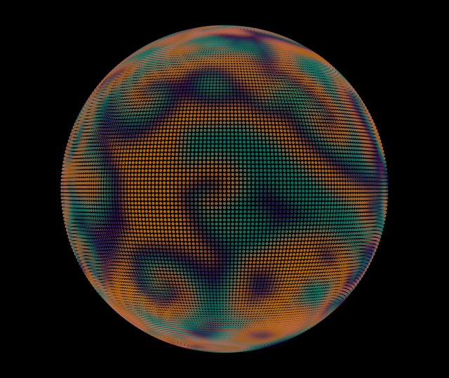</a></td>
<td valign="top">

### BZReactionDiffusion

Simulates the Belousov-Zhabotinsky reaction — a 3-species cyclic competition (A beats B, B beats C, C beats A) producing rotating spiral waves. The simulation runs on a spherical k-nearest-neighbor graph (`ReactionGraph`: 7680 nodes, 6 neighbors each, precomputed Fibonacci lattice) with configurable diffusion rate and time step. Spiral nuclei are seeded once at init; a stochastic nudge to a handful of nodes on every physics substep keeps the dynamics off the closed manifold so the waves sustain.

**Parameters**: Compete (cyclic-competition/predation coefficient), Diff (diffusion rate), Speed (time step)

</td></tr></table>

<table border="0"><tr>
<td width="300"><a href="https://woundedlion.github.io/daydream/?effect=GSReactionDiffusion" target="_blank">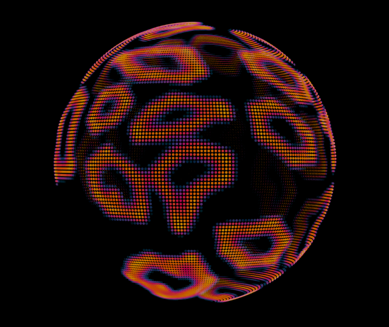</a></td>
<td valign="top">

### GSReactionDiffusion

Gray-Scott reaction-diffusion system (U + 2V → 3V, V → P) on a spherical mesh. Produces spots, stripes, and labyrinthine patterns depending on feed/kill rates. A reaction runs until its field has all but stopped moving, then dissolves off the sphere and reseeds at fresh cluster sites with per-seed generated palettes blended by B diffusion and pigment weight, plus shared noise-driven hue shift and shimmer; editing the constants dissolves the current field too.

**Parameters**: Feed, Kill, dA, dB, Speed, Noise Speed, Noise Scale, Hue Shift, Shimmer

</td></tr></table>

<table border="0"><tr>
<td width="300"><a href="https://woundedlion.github.io/daydream/?effect=HopfFibration" target="_blank">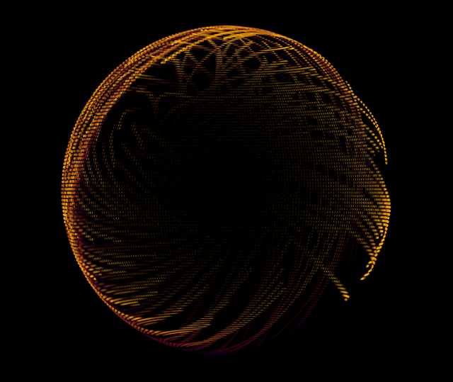</a></td>
<td valign="top">

### HopfFibration

Visualizes the Hopf fibration — a map from S³ to S². Points on S² (the base space) are lifted to fibers on S³ via the quaternion parameterization `q = [cos(η)cos(φ+β), cos(η)sin(φ+β), sin(η)cos(β), sin(η)sin(β)]`, then stereographically projected to R³ and plotted on the sphere. A 4D tumble (R_xw × R_yz rotation) continuously rotates the fibration.

**Parameters**: Flow Spd, Tumble Spd, Folding, Twist, Alpha

</td></tr></table>

<table border="0"><tr>
<td width="300"><a href="https://woundedlion.github.io/daydream/?effect=IslamicStars" target="_blank">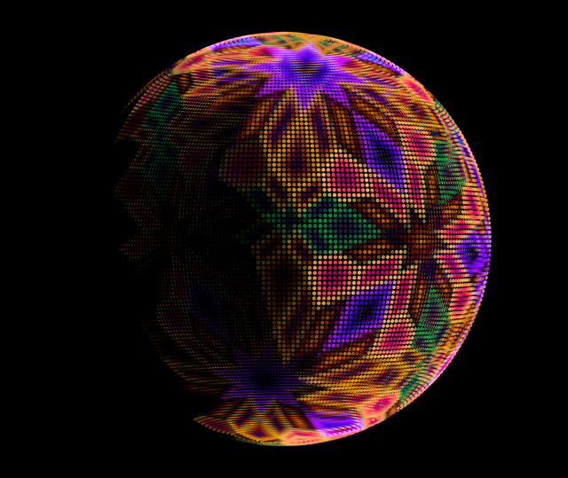</a></td>
<td valign="top">

### IslamicStars

Procedurally generates Islamic geometric patterns using Hankin's polygons-in-contact method over Platonic and Archimedean seed solids. Each face of a rotating solid is decorated with its characteristic star polygon, colored by face topology (triangles, pentagons, hexagons, etc.), with topology classes folded modulo the six-slot `MeshPaletteBank` so a mesh carrying more than six classes aliases two distinct classes onto one color. Shapes carrying a recipe are built on screen op by op: the seed solid segues in, then the lowered Conway chain (hankin, ambo, truncate, snub, chamfer, relax, kis, dual) sweeps it into the finished pattern. Most lowered steps are one animated leg, but the smooth bridges are not: a dual is a three-leg bridge (truncate to ambo, medial slerp, truncate down to the dual), a trailing dual + kis pair — a needle — spans both steps as a five-leg macro (truncate, dual bridge, reconcile onto the authored mesh), and a standalone kis runs eight legs (dual bridge, truncate, dual bridge, reconcile). Each shape then holds still, ripple waves distort the geometry, and it segues out into the next.

**Parameters**: Face Fade Lo, Face Fade Hi, Burst, Ripp Amp, Ripp Decay, Ripp Dur, Trans Speed

</td></tr></table>

<table border="0"><tr>
<td width="300"><a href="https://woundedlion.github.io/daydream/?effect=HankinSolids" target="_blank">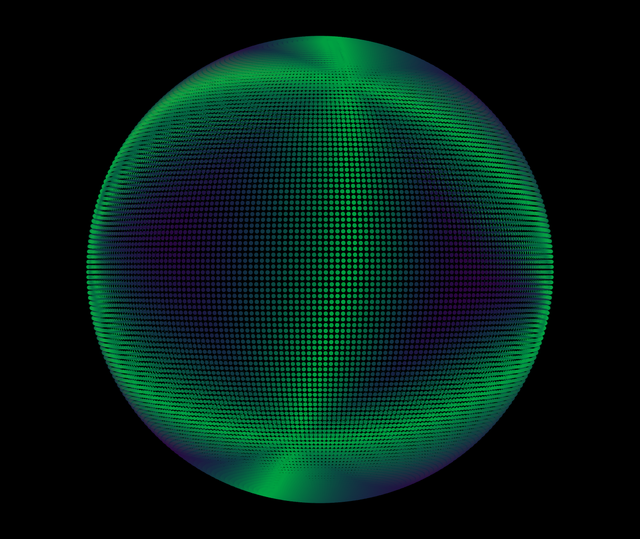</a></td>
<td valign="top">

### HankinSolids

Hankin interlace patterns over the Platonic and Archimedean solids. The interlace angle sweeps continuously over the held solid, then a random walk along the Conway edge graph picks the next one: each leg sweeps the destination solid's own operator parameter, so faces visibly truncate, expand, and twist into it. Exactly one mesh is on screen at all times; faces are colored by topology class from shuffled mesh palettes that crossfade per leg.

**Parameters**: Intensity, Angle

</td></tr></table>


<table border="0"><tr>
<td width="300"><a href="https://woundedlion.github.io/daydream/?effect=SphericalHarmonics" target="_blank">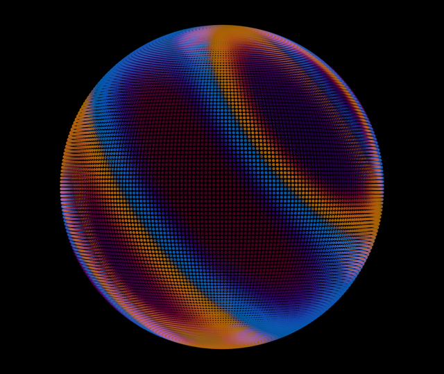</a></td>
<td valign="top">

### SphericalHarmonics

Visualizes the real spherical harmonics Yˡₘ(θ, φ) as a colored scalar field over the sphere: the harmonic value drives a positive/negative palette split — negative lobes recolor the positive palette by swapping its red and blue channels and dimming its green — with ambient-occlusion shading. Continuously morphs between (l, m) modes.

**Parameters**: Amplitude

</td></tr></table>

<table border="0"><tr>
<td width="300"><a href="https://woundedlion.github.io/daydream/?effect=MobiusRings&resolution=Holosphere%20(96x20)" target="_blank">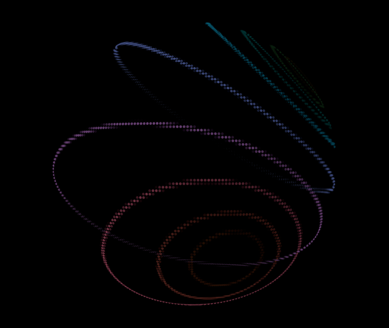</a></td>
<td valign="top">

### MobiusRings

A latitude-longitude grid that undergoes live Möbius transformation animation via `MobiusWarpCircularTransformer`.

**Parameters**: Rings, Lines, Alpha

</td></tr></table>

<table border="0"><tr>
<td width="300"><a href="https://woundedlion.github.io/daydream/?effect=Voronoi" target="_blank">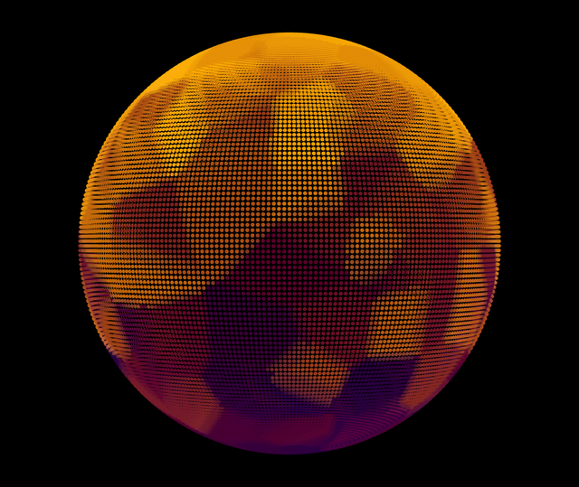</a></td>
<td valign="top">

### Voronoi

Spherical Voronoi diagram with animated seed positions. Cells are always filled with per-site palette colors (blended across the seam between the nearest two sites when **Sharpness** > 0; 0 gives hard edges, like infinite sharpness); an optional black border seam is painted between neighboring cells when **Border Thick** > 0 (off by default).

**Parameters**: Num Sites, Speed, Sharpness, Border Thick

</td></tr></table>

<table border="0"><tr>
<td width="300"><a href="https://woundedlion.github.io/daydream/?effect=PetalFlow" target="_blank">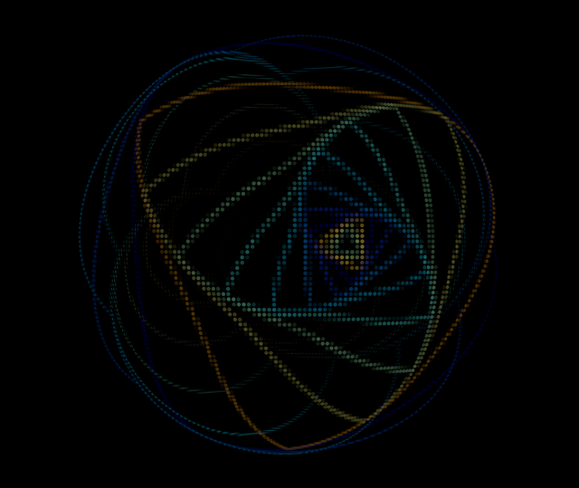</a></td>
<td valign="top">

### PetalFlow

Polyline rings drift pole-to-pole through an inverse stereographic projection, each wobbled into petal lobes and twisted by an angle that grows with its position; rasterized via Plot.

**Parameters**: Twist, Speed, Alpha, Density

</td></tr></table>

<table border="0"><tr>
<td width="300"><a href="https://woundedlion.github.io/daydream/?effect=DreamBalls" target="_blank">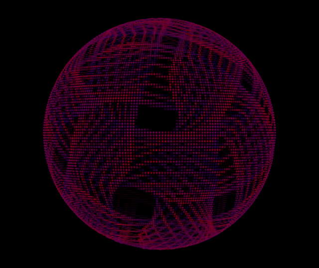</a></td>
<td valign="top">

### DreamBalls

Draws twisting wireframe knotted structures over a selectable Platonic, Archimedean, or Catalan base mesh. The `Base Mesh` dropdown exposes all 31 of them (`Solids::BaseMesh`), and its selection is stored with the other preset parameters. Edges render as an over/under weave whose crossing graph `Weave Topology` selects: `Automatic` (the default every preset carries) parallel-transports each crossing's outgoing frame to the hidden end of the incoming edge when the solid is four-regular and falls back to the medial graph when it is not, `Medial` forces that medial graph, and `Original with defects` keeps the source mesh's shared-vertex framing. `Weave Gap` is the fraction of each strand that fades out where it tucks under its crossing partner. Mesh vertices are displaced along per-vertex tangent frames to create orbiting knot patterns. Multiple copies orbit simultaneously while the whole structure tumbles under a slow Languid random-walk view orientation punctuated by periodic full-sphere spins. Ten presets cycle every 320 frames, each carrying a solid and displacement settings — rhombicuboctahedron, rhombicosidodecahedron, truncated cuboctahedron, icosidodecahedron, snub cube, truncated dodecahedron, triakis icosahedron and disdyakis triacontahedron, the triakis icosahedron taking three of the ten slots at different displacements. Eight fixed procedural palettes cover the ten: the first two presets share a blood-stream palette composed with an alpha falloff that ramps alpha linearly from full at the palette's near end to zero at its far end; the remaining eight use rich sunset, lavender lake, mauve fade, coral blue, bruised moss, lavender lake, plum sunrise, and bruised mango, in order. The outgoing sprite fades out before the incoming one fades in, so exactly one mesh renders per frame.

**Parameters**: Base Mesh (source solid), Weave Topology (crossing graph), Weave Gap (under-strand fade), Copies (number of knot copies), Radius (displacement), Speed (orbit speed), Alpha

</td></tr></table>

<table border="0"><tr>
<td width="300"><a href="https://woundedlion.github.io/daydream/?effect=Comets" target="_blank">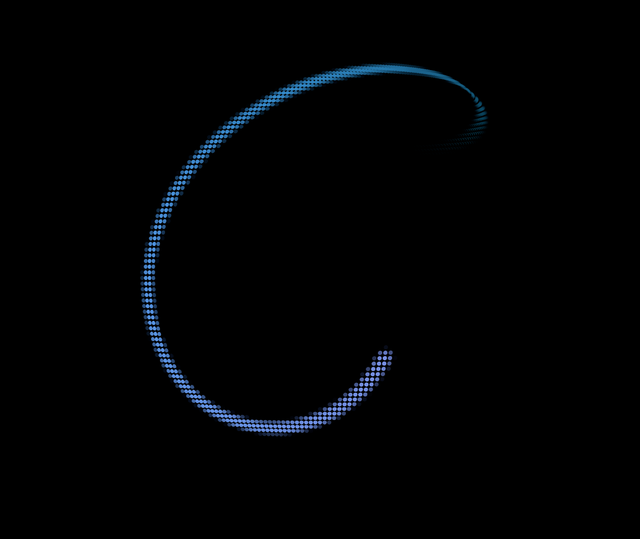</a></td>
<td valign="top">

### Comets

A single head traces spherical Lissajous curves, cycling through a dozen configurations, trailed by a long 115-frame orientation tail and periodically wiping the palette to a fresh triadic scheme.

**Parameters**: Alpha, Thickness, Cycle Dur, Debug BB

Thickness 0 hides the comet.

</td></tr></table>

<table border="0"><tr>
<td width="300"><a href="https://woundedlion.github.io/daydream/?effect=AlienBrain" target="_blank">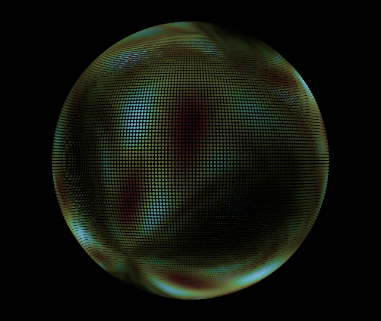</a></td>
<td valign="top">

### AlienBrain

Glitch-folded stereographic grids pulled through an animated wave shear. Four presets morph the grid frequency, complexity, shear strength, and speed inside one composed pipeline.

**Parameters**: Pattern Freq, Speed, Complexity, Pattern Mix, Drift, Source Angle Speed, Singularity Fade, Projection Spin Speed, Projection Wander, Camera Wander, Planar Warp 1 Speed, Warp Strength, Warp Frequency, Warp Field Angle, Palette Chroma, Palette Mapping, Mapping Frequency, Mapping Phase, Phase Oscillation Depth, Phase Oscillation Speed, Opacity at Value 0, Opacity at Value 1, Hue Shift Amount, Hue Noise Scale, Hue Noise Speed

</td></tr></table>

<table border="0"><tr>
<td width="300"><a href="https://woundedlion.github.io/daydream/?effect=KaleidoscopeHexSoft" target="_blank">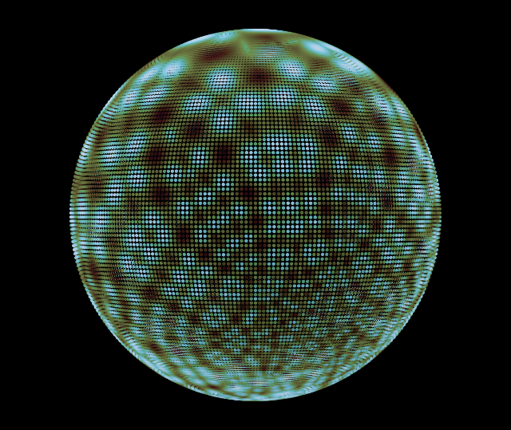</a></td>
<td valign="top">

### KaleidoscopeHexSoft

A drifting twin-wave field reflected through a spherical kaleidoscope, projected stereographically, and repeated by an inner mirror tile.

**Parameters**: Pattern Freq, Speed, Drift, Source Angle Speed, Singularity Fade, Projection Spin Speed, Projection Wander, Camera Wander, Planar Warp 2 Speed, Mirror Rotation, Mirror Cell X, Mirror Cell Y, Mirror Offset X, Mirror Offset Y, Palette Chroma, Palette Mapping, Mapping Frequency, Mapping Phase, Phase Oscillation Depth, Phase Oscillation Speed, Opacity at Value 0, Opacity at Value 1, Hue Shift Amount, Hue Noise Scale, Hue Noise Speed

</td></tr></table>

<table border="0"><tr>
<td width="300"><a href="https://woundedlion.github.io/daydream/?effect=AlienOcean" target="_blank">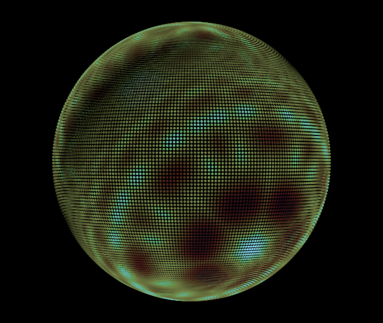</a></td>
<td valign="top">

### AlienOcean

A broad folded gnomonic grid drifting inside a fixed mirror frame and a spherical kaleidoscope. Edge-fade coverage and a generated triadic palette give the field its soft, liquid boundary.

**Parameters**: Pattern Freq, Speed, Complexity, Pattern Mix, Drift, Source Angle Speed, Singularity Fade, Camera Wander, Planar Warp 1 Speed, Mirror Rotation, Mirror Cell X, Mirror Cell Y, Mirror Offset X, Mirror Offset Y, Edge Width, Palette Chroma, Palette Mapping, Mapping Frequency, Mapping Phase, Phase Oscillation Depth, Phase Oscillation Speed, Opacity at Value 0, Opacity at Value 1, Hue Shift Amount, Hue Noise Scale, Hue Noise Speed

</td></tr></table>

<table border="0"><tr>
<td width="300"><a href="https://woundedlion.github.io/daydream/?effect=AlienCore" target="_blank">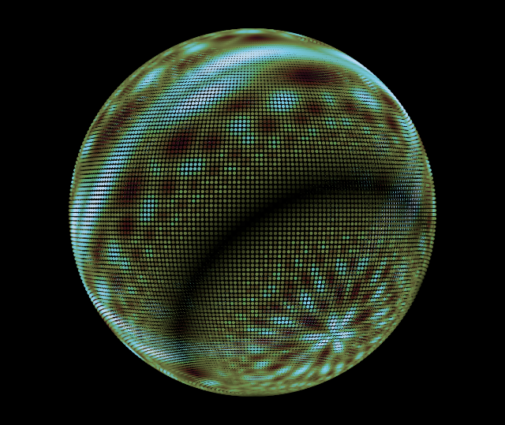</a></td>
<td valign="top">

### AlienCore

A mirrored grid folded by the glitch lens and a folded gnomonic projection. Its high-contrast edge-fade material keeps the discontinuous facets legible while the grid drifts inside a fixed mirror frame.

**Parameters**: Pattern Freq, Speed, Complexity, Pattern Mix, Drift, Source Angle Speed, Singularity Fade, Camera Wander, Planar Warp 1 Speed, Mirror Rotation, Mirror Cell X, Mirror Cell Y, Mirror Offset X, Mirror Offset Y, Edge Width, Palette Chroma, Palette Mapping, Mapping Frequency, Mapping Phase, Phase Oscillation Depth, Phase Oscillation Speed, Opacity at Value 0, Opacity at Value 1, Hue Shift Amount, Hue Noise Scale, Hue Noise Speed

</td></tr></table>

<table border="0"><tr>
<td width="300"><a href="https://woundedlion.github.io/daydream/?effect=KaleidoscopeMandala" target="_blank">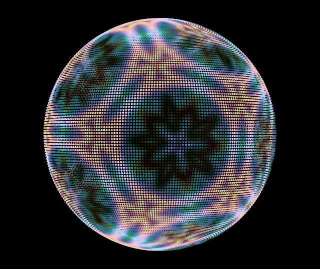</a></td>
<td valign="top">

### KaleidoscopeMandala

A wave-sheared grid moving across a folded gnomonic dodecahedral kaleidoscope, then repeated through an inner mirror tile.

**Parameters**: Pattern Freq, Speed, Complexity, Pattern Mix, Drift, Source Angle Speed, Singularity Fade, Camera Wander, Planar Warp 1 Speed, Warp Strength, Warp Frequency, Warp Field Angle, Planar Warp 2 Speed, Mirror Rotation, Mirror Cell X, Mirror Cell Y, Mirror Offset X, Mirror Offset Y, Palette Chroma, Palette Mapping, Mapping Frequency, Mapping Phase, Phase Oscillation Depth, Phase Oscillation Speed, Opacity at Value 0, Opacity at Value 1, Hue Shift Amount, Hue Noise Scale, Hue Noise Speed

</td></tr></table>

<table border="0"><tr>
<td width="300"><a href="https://woundedlion.github.io/daydream/?effect=GridSpace" target="_blank">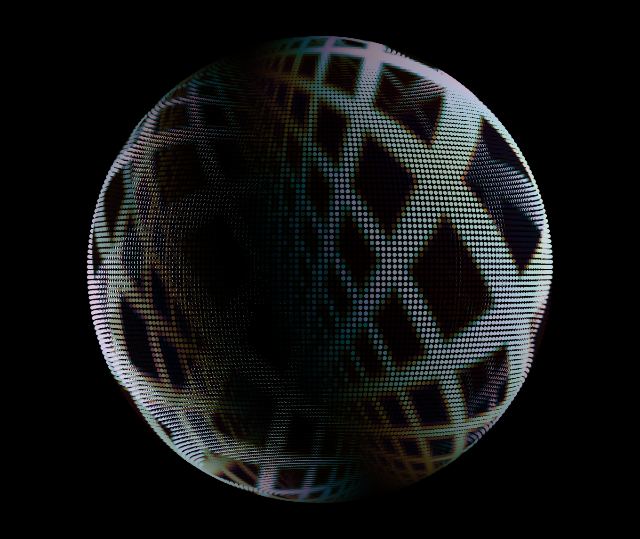</a></td>
<td valign="top">

### GridSpace

An affine primitive lattice rendered as soft iso contours through a folded gnomonic projection. The affine frame scrolls the lattice by whole cell windings, so its drift repeats without a visible seam.

**Parameters**: Lattice Cell Scale, Lattice Shape, Lattice Softness, Lattice Radius, Singularity Fade, Projection Spin Speed, Projection Wander, Camera Wander, Planar Warp 1 Speed, Affine Rotation Rate, Affine Translation X, Affine Translation Y, Affine Scale X, Affine Scale Y, Affine Shear, Iso Level, Iso Width, Palette Chroma, Palette Mapping, Mapping Frequency, Mapping Phase, Phase Oscillation Depth, Phase Oscillation Speed, Opacity at Value 0, Opacity at Value 1, Hue Shift Amount, Hue Noise Scale, Hue Noise Speed

</td></tr></table>

<table border="0"><tr>
<td width="300"><a href="https://woundedlion.github.io/daydream/?effect=HyperLattice" target="_blank">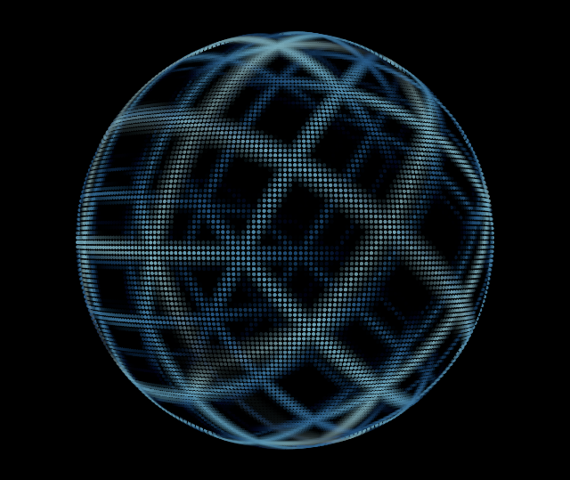</a></td>
<td valign="top">

### HyperLattice

A flight through periodic wire lattices and curved shells in 3D perspective or a rotating 4D slice. Schema 15 includes Cubic, Octet Truss, and Shells in regular builds, each supporting both views. Numeric pattern IDs remain 0, 1, and 6.

| Index | Preset ID |
| --- | --- |
| 0 | `cubic-flight` |
| 1 | `cubic-wide-flight` |
| 2 | `hypercube-flight` |
| 3 | `octet-flight` |
| 4 | `octet-wide-flight` |
| 5 | `octet-4d-flight` |
| 6 | `shell-flight` |
| 7 | `shell-close-flight` |
| 8 | `shell-4d-flight` |

**Parameters**: Pattern, View (3D perspective, 4D slice), Sphere Radius, Cell Size, Wire Radius, Softness, Near Fade, Far Distance, AA Strength, Speed, 3D Spin, 4D Spin, Lattice Planes. Shell Radius controls Shells; Wire Radius controls Cubic and Octet Truss.

</td></tr></table>

<table border="0"><tr>
<td width="300"><a href="https://woundedlion.github.io/daydream/?effect=LatticeMelt" target="_blank">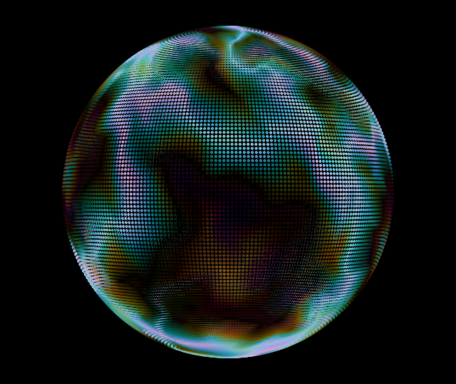</a></td>
<td valign="top">

### LatticeMelt

A folded-sinusoidal sphere projection displaced by curl noise and shaded with a generated triadic palette. Its two presets share one composed pipeline and vary only the surface-noise scale.

**Parameters**: Lattice Cell Scale, Lattice Shape, Lattice Softness, Lattice Radius, Projection Spin Speed, Projection Wander, Camera Wander, Central Meridian, Surface Noise Scale, Surface Noise Strength, Surface Noise Speed, Palette Chroma, Palette Mapping, Mapping Frequency, Mapping Phase, Phase Oscillation Depth, Phase Oscillation Speed, Brightness Bottom, Brightness Top, Opacity at Value 0, Opacity at Value 1, Hue Shift Amount, Hue Noise Scale, Hue Noise Speed

</td></tr></table>

<table border="0"><tr>
<td width="300"><a href="https://woundedlion.github.io/daydream/?effect=MermaidSkin" target="_blank">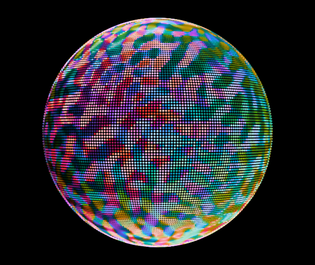</a></td>
<td valign="top">

### MermaidSkin

A max-chroma analogous grid folded around the sphere and rippled by curl noise. Its cup palette mapping and slowly drifting noisy hue shift preserve the iridescent skin captured in the saved workbench preset.

**Parameters**: Pattern Freq, Speed, Complexity, Pattern Mix, Drift, Source Angle Speed, Projection Spin Speed, Projection Wander, Camera Wander, Central Meridian, Surface Noise Scale, Surface Noise Strength, Surface Noise Speed, Palette Chroma, Palette Mapping, Mapping Frequency, Mapping Phase, Phase Oscillation Depth, Phase Oscillation Speed, Opacity at Value 0, Opacity at Value 1, Hue Shift Amount, Hue Noise Scale, Hue Noise Speed

</td></tr></table>

<table border="0"><tr>
<td width="300"><a href="https://woundedlion.github.io/daydream/?effect=ChromaticLichen" target="_blank">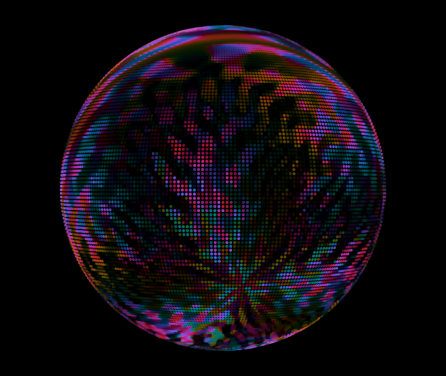</a></td>
<td valign="top">

### ChromaticLichen

A glitch-folded gnomonic grid displaced by sphere-space curl noise. An analogous generated palette paints the slow lichen-like branching with shifting chromatic bands.

**Parameters**: Pattern Freq, Speed, Complexity, Pattern Mix, Drift, Source Angle Speed, Singularity Fade, Projection Spin Speed, Projection Wander, Camera Wander, Surface Noise Scale, Surface Noise Strength, Surface Noise Speed, Palette Chroma, Palette Mapping, Mapping Frequency, Mapping Phase, Phase Oscillation Depth, Phase Oscillation Speed, Opacity at Value 0, Opacity at Value 1, Hue Shift Amount, Hue Noise Scale, Hue Noise Speed

</td></tr></table>

<table border="0"><tr>
<td width="300"><a href="https://woundedlion.github.io/daydream/?effect=AshCloud" target="_blank">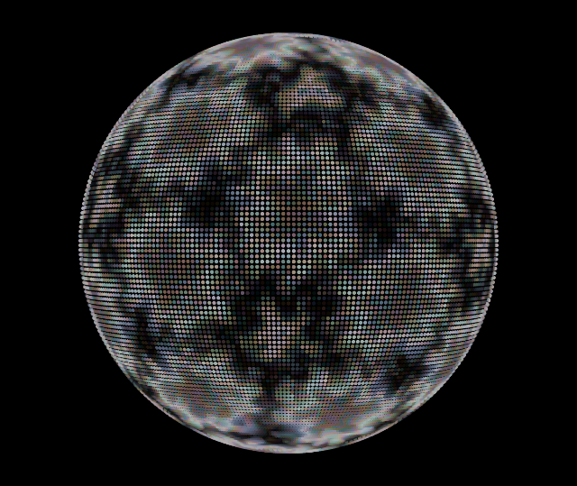</a></td>
<td valign="top">

### AshCloud

A primitive lattice displaced by sphere-space curl noise, folded through a dodecahedral kaleidoscope and projected stereographically. A value cutout carves the lattice, so coverage follows the field rather than the projection alone.

**Parameters**: Lattice Cell Scale, Lattice Shape, Lattice Softness, Lattice Radius, Singularity Fade, Projection Spin Speed, Projection Wander, Camera Wander, Surface Noise Scale, Surface Noise Strength, Surface Noise Speed, Cutout Threshold, Cutout Softness, Palette Chroma, Palette Mapping, Mapping Frequency, Mapping Phase, Phase Oscillation Depth, Phase Oscillation Speed, Opacity at Value 0, Opacity at Value 1, Hue Shift Amount, Hue Noise Scale, Hue Noise Speed

</td></tr></table>

<table border="0"><tr>
<td width="300"><a href="https://woundedlion.github.io/daydream/?effect=KaleidoscopePentBright" target="_blank">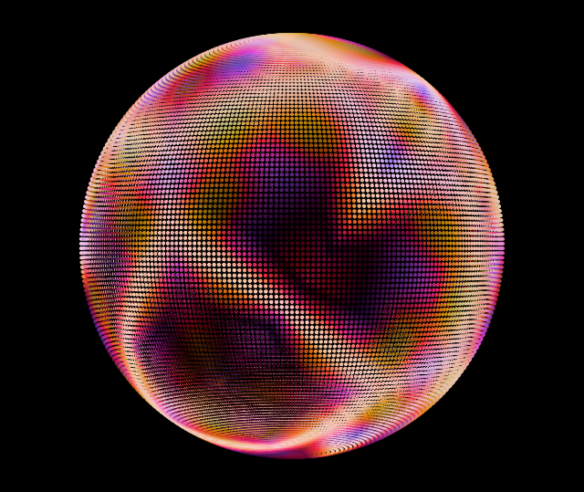</a></td>
<td valign="top">

### KaleidoscopePentBright

A polar primitive lattice folded through a pentagonal-prism kaleidoscope and projected stereographically, its polar chart winding the angular phase one turn per cycle.

**Parameters**: Lattice Cell Scale, Lattice Shape, Lattice Softness, Lattice Radius, Singularity Fade, Projection Spin Speed, Projection Wander, Camera Wander, Planar Warp 1 Speed, Polar Radial Scale, Polar Radial Phase, Polar Angular Phase, Planar Warp 2 Speed, Warp Strength, Warp Frequency, Warp Field Angle, Palette Chroma, Palette Mapping, Mapping Frequency, Mapping Phase, Phase Oscillation Depth, Phase Oscillation Speed, Opacity at Value 0, Opacity at Value 1, Hue Shift Amount, Hue Noise Scale, Hue Noise Speed

</td></tr></table>

<table border="0"><tr>
<td width="300"><a href="https://woundedlion.github.io/daydream/?effect=KaleidoscopeHexOil" target="_blank">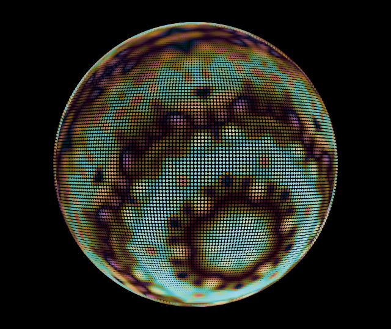</a></td>
<td valign="top">

### KaleidoscopeHexOil

A rotating spiral folded through a hexagonal-prism kaleidoscope, projected stereographically, and displaced by direct surface noise whose path length drives the hue rotation.

**Parameters**: Pattern Freq, Speed, Source Angle Speed, Singularity Fade, Projection Spin Speed, Projection Wander, Camera Wander, Surface Noise Scale, Surface Noise Strength, Surface Noise Speed, Surface Noise Direction, Palette Chroma, Palette Mapping, Mapping Frequency, Mapping Phase, Phase Oscillation Depth, Phase Oscillation Speed, Opacity at Value 0, Opacity at Value 1, Hue Shift Amount

</td></tr></table>

<table border="0"><tr>
<td width="300"><a href="https://woundedlion.github.io/daydream/?effect=KaleidoscopeStainedGlass" target="_blank">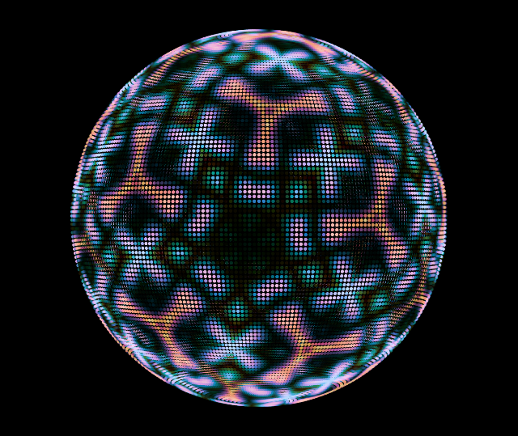</a></td>
<td valign="top">

### KaleidoscopeStainedGlass

A vector-noise grid refracted across folded gnomonic dodecahedral facets and repeated through an inner mirror tile. A cup-shaped palette envelope emphasizes the warped cell interiors.

**Parameters**: Pattern Freq, Speed, Complexity, Pattern Mix, Drift, Source Angle Speed, Singularity Fade, Camera Wander, Planar Warp 1 Speed, Warp Strength, Warp Scale, Warp Vector Angle, Planar Warp 2 Speed, Mirror Rotation, Mirror Cell X, Mirror Cell Y, Mirror Offset X, Mirror Offset Y, Palette Chroma, Palette Mapping, Mapping Frequency, Mapping Phase, Phase Oscillation Depth, Phase Oscillation Speed, Brightness Bottom, Brightness Top, Opacity at Value 0, Opacity at Value 1, Hue Shift Amount, Hue Noise Scale, Hue Noise Speed

</td></tr></table>

<table border="0"><tr>
<td width="300"><a href="https://woundedlion.github.io/daydream/?effect=KaleidoscopeSmooth" target="_blank">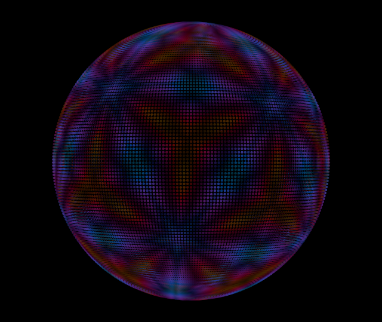</a></td>
<td valign="top">

### KaleidoscopeSmooth

A generated analogous-palette grid folded through a dodecahedral kaleidoscope, then projected stereographically and repeated by an inner mirror tile. Its four presets share one composed pipeline and vary only continuous parameters.

**Parameters**: Pattern Freq, Speed, Complexity, Pattern Mix, Drift, Source Angle Speed, Singularity Fade, Projection Spin Speed, Projection Wander, Camera Wander, Planar Warp 2 Speed, Mirror Rotation, Mirror Cell X, Mirror Cell Y, Mirror Offset X, Mirror Offset Y, Palette Chroma, Palette Mapping, Mapping Frequency, Mapping Phase, Phase Oscillation Depth, Phase Oscillation Speed, Opacity at Value 0, Opacity at Value 1, Hue Shift Amount, Hue Noise Scale, Hue Noise Speed

</td></tr></table>

<table border="0"><tr>
<td width="300"><a href="https://woundedlion.github.io/daydream/?effect=KaleidoscopeHexBright" target="_blank">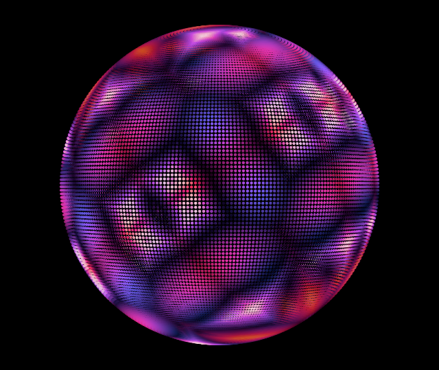</a></td>
<td valign="top">

### KaleidoscopeHexBright

A mirrored twin-wave field folded through a hexagonal-prism kaleidoscope and projected stereographically, with an analogous generated palette.

**Parameters**: Pattern Freq, Speed, Drift, Source Angle Speed, Singularity Fade, Projection Spin Speed, Projection Wander, Camera Wander, Planar Warp 2 Speed, Mirror Rotation, Mirror Cell X, Mirror Cell Y, Mirror Offset X, Mirror Offset Y, Palette Chroma, Palette Mapping, Mapping Frequency, Mapping Phase, Phase Oscillation Depth, Phase Oscillation Speed, Opacity at Value 0, Opacity at Value 1, Hue Shift Amount, Hue Noise Scale, Hue Noise Speed

</td></tr></table>

<table border="0"><tr>
<td width="300"><a href="https://woundedlion.github.io/daydream/?effect=KaleidoscopeFlowers" target="_blank">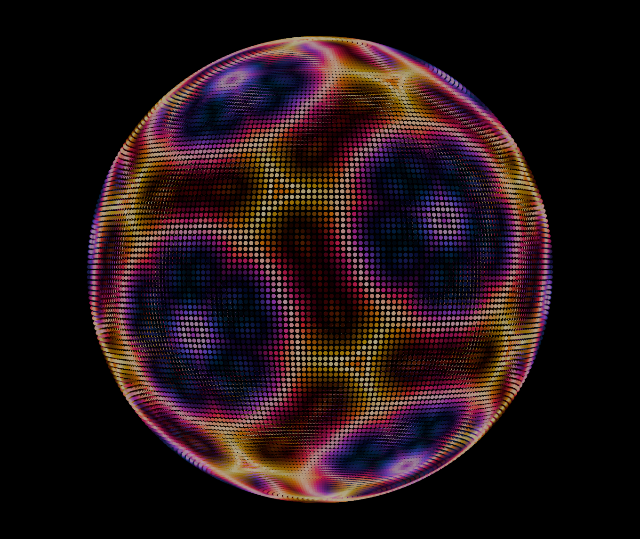</a></td>
<td valign="top">

### KaleidoscopeFlowers

Dodecahedrally folded grids mapped continuously around an equirectangular equator and repeated through an inner mirror tile. Three presets morph density and color mapping without changing structure. Pattern Mix stays at 1, so Complexity does not affect these presets.

**Parameters**: Pattern Freq, Speed, Complexity, Pattern Mix, Drift, Source Angle Speed, Singularity Fade, Projection Spin Speed, Projection Wander, Camera Wander, Central Meridian, Planar Warp 2 Speed, Mirror Rotation, Mirror Cell X, Mirror Cell Y, Mirror Offset X, Mirror Offset Y, Palette Chroma, Palette Mapping, Mapping Frequency, Mapping Phase, Phase Oscillation Depth, Phase Oscillation Speed, Opacity at Value 0, Opacity at Value 1, Hue Shift Amount, Hue Noise Scale, Hue Noise Speed

</td></tr></table>

<table border="0"><tr>
<td width="300"><a href="https://woundedlion.github.io/daydream/?effect=CosmicEyeball" target="_blank">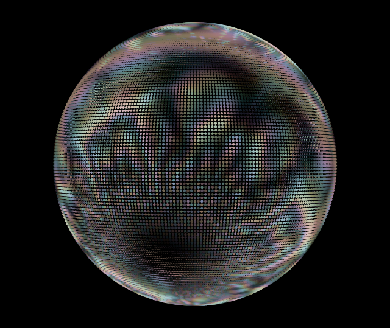</a></td>
<td valign="top">

### CosmicEyeball

A high-contrast mirrored stereographic grid folded by the glitch lens. Hue follows total mirror displacement, producing the concentric color structure around the moving field.

**Parameters**: Pattern Freq, Speed, Complexity, Pattern Mix, Drift, Source Angle Speed, Singularity Fade, Camera Wander, Planar Warp 1 Speed, Mirror Rotation, Mirror Cell X, Mirror Cell Y, Mirror Offset X, Mirror Offset Y, Edge Width, Palette Chroma, Palette Mapping, Mapping Frequency, Mapping Phase, Phase Oscillation Depth, Phase Oscillation Speed, Opacity at Value 0, Opacity at Value 1, Hue Shift Amount

</td></tr></table>

<table border="0"><tr>
<td width="300"><a href="https://woundedlion.github.io/daydream/?effect=MobiusGrid" target="_blank"></a></td>
<td valign="top">

### MobiusGrid

A stereographic twin-wave field folded through an inner mirror tile and a live Möbius lens. The lens follows a continuous 160-frame circular warp cycle while a complementary palette tracks displacement through the fold. Its two presets share the same fixed graph.

**Parameters**: Pattern Freq, Speed, Drift, Source Angle Speed, Singularity Fade, Projection Spin Speed, Projection Wander, Camera Wander, Planar Warp 2 Speed, Mirror Rotation, Mirror Cell X, Mirror Cell Y, Mirror Offset X, Mirror Offset Y, Mobius A Re, Mobius A Im, Mobius B Re, Mobius B Im, Mobius C Re, Mobius C Im, Mobius D Re, Mobius D Im, Palette Chroma, Palette Mapping, Mapping Frequency, Mapping Phase, Phase Oscillation Depth, Phase Oscillation Speed, Brightness Bottom, Brightness Top, Opacity at Value 0, Opacity at Value 1, Hue Shift Amount

</td></tr></table>

<table border="0"><tr>
<td width="300"><a href="https://woundedlion.github.io/daydream/?effect=RingSpin" target="_blank">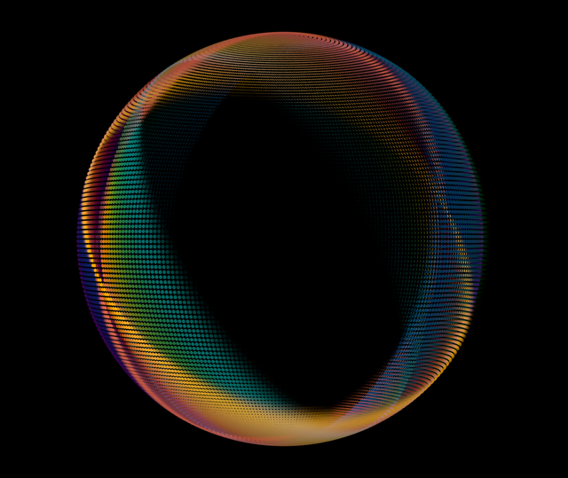</a></td>
<td valign="top">

### RingSpin

Four great-circle rings tumble continuously under energetic random-walk rotation, each leaving a fading motion-blur trail of its recent orientations (drawn with `Scan::RingGroup`, which fuses a frame's near-coincident sub-rings into one scan pass; head and tail of the trail thickened). Each ring is colored by a baked vignette palette.

**Parameters**: Alpha, Thickness, Debug BB

</td></tr></table>

<table border="0"><tr>
<td width="300"><a href="https://woundedlion.github.io/daydream/?effect=RingShower&resolution=Holosphere%20(96x20)" target="_blank">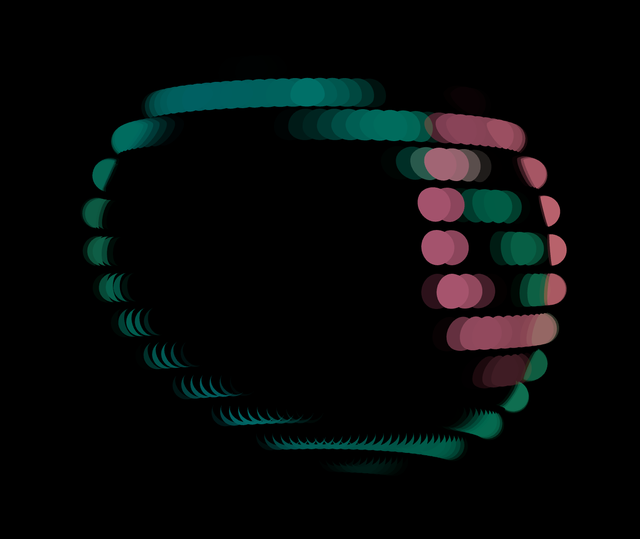</a></td>
<td valign="top">

### RingShower

Rings bloom at random orientations and grow their radius from zero, fading in over the first few frames and then holding (no fade-out), colored by a generative mirrored analogous palette — a continuous shower of expanding rings drawn with `Plot::Ring`. Each ring's radius, fade, and lifetime are pure functions of its age driven directly from a recyclable slot rather than a per-ring `Sprite`.

**Parameters**: Alpha

</td></tr></table>

<table border="0"><tr>
<td width="300"><a href="https://woundedlion.github.io/daydream/?effect=Fishbowl" target="_blank">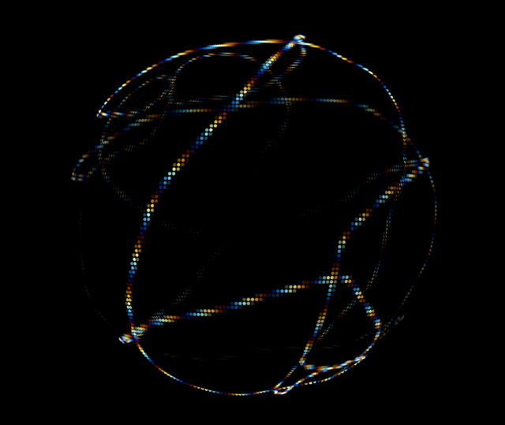</a></td>
<td valign="top">

### Fishbowl

A head traces a fixed 12:5 spherical Lissajous figure whose long trail is continuously warped by a noise transformer, over a slowly cycling gradient palette.

**Parameters**: Alpha, Cycle Dur, Speed, Jitter Amp, Noise Scale, Scale Factor, Cycle Speed, Duty Cycle

Duty Cycle 0 hides the trail; positive values control its visible fraction.

</td></tr></table>

<table border="0"><tr>
<td width="300"><a href="https://woundedlion.github.io/daydream/?effect=MeshFeedback" target="_blank">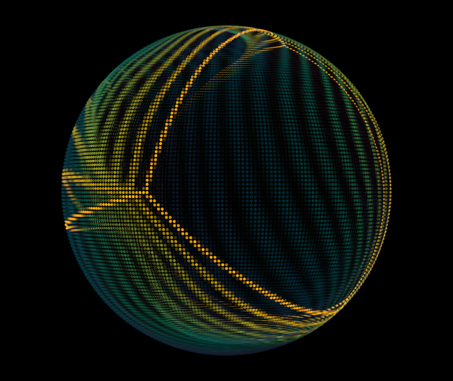</a></td>
<td valign="top">

### MeshFeedback

A selectable Platonic, Archimedean, or Catalan wireframe rendered with `Plot::Mesh`, given a noise-distorted, feedback-loop appearance via `Filter::Pixel::Feedback`. An orientation random-walk tumbles the solid while a `Segue::Preset::Snap` preset choreography hard-cuts both the base mesh and feedback/distortion style parameters.

**Parameters**: Base Mesh, Fade, Distort Amp, Distort Freq, Distort Speed, Noise Scale, Hue Shift, Feedback, Pole Half-Res

</td></tr></table>

<table border="0"><tr>
<td width="300"><a href="https://woundedlion.github.io/daydream/?effect=MindSplatter" target="_blank">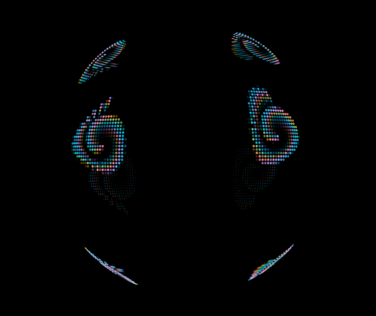</a></td>
<td valign="top">

### MindSplatter

Particles spray from emitters at the vertices of a selectable Platonic solid — each sweeping its own tangent-plane emission angle — and fall toward attractor wells at the vertices of its dual. The tetrahedron is self-dual; cube/octahedron and dodecahedron/icosahedron form the other pairs. Event-horizon kernels punch the particles out around each attractor. A random walk tumbles the view, periodic Möbius warp bursts distort the whole field, and a preset timer transitions the base mesh, friction, well strength, speeds, and warp scale between eight presets.

**Parameters**: Base Mesh, Friction, Well Str, Init Spd, Ang Spd, Warp, Particles

</td></tr></table>

<table border="0"><tr>
<td width="300"><a href="https://woundedlion.github.io/daydream/?effect=Dynamo&resolution=Holosphere%20(96x20)" target="_blank">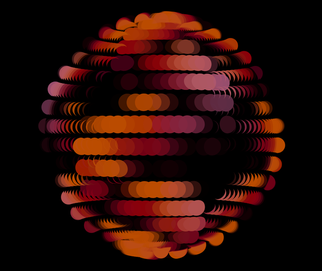</a></td>
<td valign="top">

### Dynamo

A vertical strand of points — spaced across the complete sphere, including hidden cap nodes — drifts horizontally around the sphere, each row dragging the next under a gap constraint so the chain wavers like a wind-blown curtain. The strand leaves motion trails, is replicated three times around the sphere, periodically reverses direction, and tumbles under random-axis rotations, while periodic color wipes sweep freshly generated analogous palettes across it.

**Parameters**: Speed, Gap, Trail Len, Trail Cap, Wipe Dur

</td></tr></table>

<table border="0"><tr>
<td width="300"><a href="https://woundedlion.github.io/daydream/?effect=Thrusters&resolution=Holosphere%20(96x20)" target="_blank">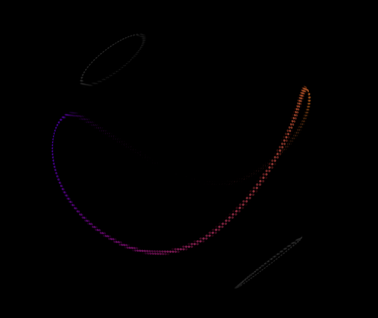</a></td>
<td valign="top">

### Thrusters

A central distorted ring (`Plot::DistortedRing`) warps and spins; periodic random "fires" kick it onto a new axis and bloom a pair of opposed thrust rings (`Plot::Ring`) that expand from a sub-pixel seed and fade out.

**Parameters**: Radius, Alpha

</td></tr></table>

<table border="0"><tr>
<td width="300"><a href="https://woundedlion.github.io/daydream/?effect=GnomonicStars" target="_blank">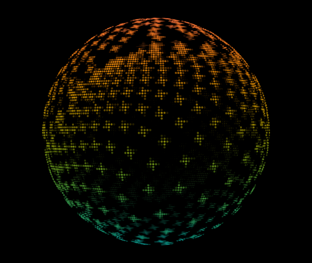</a></td>
<td valign="top">

### GnomonicStars

A Fibonacci-spiral field of star-polygon SDFs, continuously deformed by an evolving Möbius warp (built on a gnomonic-projection transformer) and slowly tumbled by a Languid random walk.

**Parameters**: Points, Radius, Sides, Warp Speed, Debug BB

</td></tr></table>

<table border="0"><tr>
<td width="300"><a href="https://woundedlion.github.io/daydream/?effect=Raymarch" target="_blank">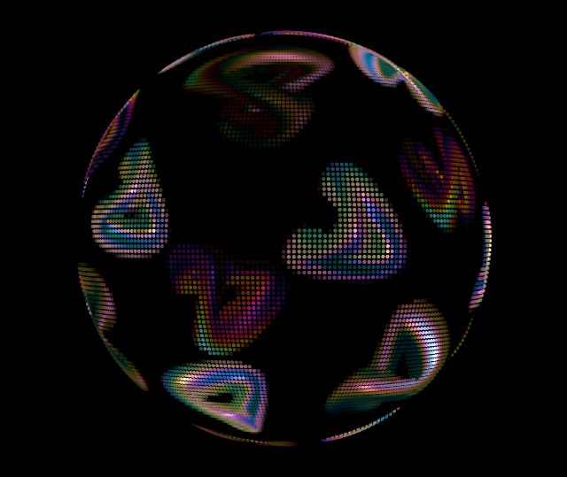</a></td>
<td valign="top">

### Raymarch

Volumetric raymarcher that renders twisted tori at the vertices of a selectable placement solid. Its `uv-surface-noise` preset uses the 26-vertex disdyakis dodecahedron; the selector contains the 21 base solids that fit the 32-copy capacity. Each torus is ray-marched with `Scan::Volume::draw`, lit with metallic Blinn-Phong shading (half-Lambert diffuse, specular highlights, Fresnel rim), and independently tumbled by an energetic random walk. A separate random walk drives the camera orientation. A seamless two-axis UV noise field selects and hue-shifts the generated OKLCH palette across each torus surface through the shared `NoiseHuePalette` machinery also used by the shader effects.

**Parameters**: Base Solid, Pulse Speed, Fill, Max Steps, Diffuse, Specular, Fresnel, Twist, AA Width, Hue Shift, Hue Noise Scale, Hue Noise Speed

</td></tr></table>

<table border="0"><tr>
<td width="300"><a href="https://woundedlion.github.io/daydream/?effect=DisplacementField" target="_blank">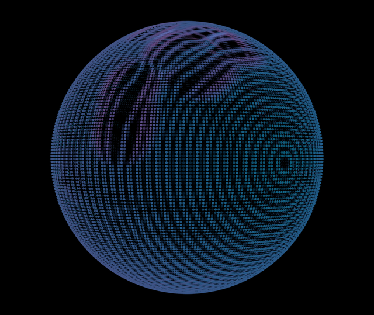</a></td>
<td valign="top">

### DisplacementField

A stack of evenly spaced soft-stroked rings (`Scan::DistortedRingStack`) sharing one axis, each vertex displaced along the stack axis by a stack of displacement fields that alternate between two phases. In the ball phase, cap-shaped bumps spawn at the world +Y pole on random meridians and fall to the world -Y pole at varying speeds, bowing the rings away from each falling ball; once the last ball lands, a two-octave world-space OpenSimplex noise field (octave 1 envelopes octave 2, so perturbations turn sparse wherever the envelope runs near zero) fades in from zero, dwells at full strength, then fades back out into the next ball phase. Ring colors sweep a circular analogous palette across the stack, with each fragment's hue rotated by the local displacement magnitude, and the palette slowly wipes to a freshly generated one every ~11 seconds.

**Parameters**: Alpha, Rings, Thickness, Ball Amp, Noise Amp, Scale 1, Scale 2, Hue Rotate, Flow Speed, Ball Min, Ball Max, Ball Rate, Speed Min, Speed Max

</td></tr></table>

<table border="0"><tr>
<td width="300"><a href="https://woundedlion.github.io/daydream/?effect=ShapeShifter" target="_blank">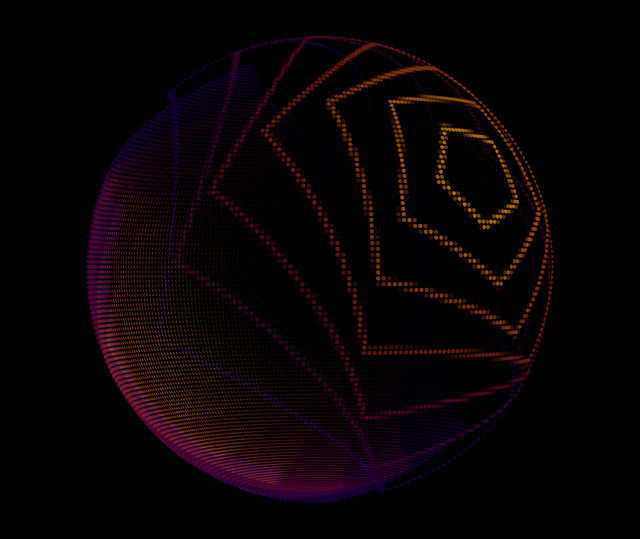</a></td>
<td valign="top">

### ShapeShifter

Concentric polygon, star, or flower outlines drawn through the `Plot` rasterizer. Dense planar stars use direct sampled edges, with pole-crossing edges routed through the shared rasterizer and the same pre-shaded fragment shader. The rings span the full sphere radius under a selectable spacing law — **Spacing** is either uniform steps in radius or screen-balanced, which redistributes the rings away from the poles (subject to a density floor) so their on-screen spacing stays even — and **Alpha Falloff** picks each ring's alpha profile: a flat half, or full at the poles fading toward the equator. A selectable animated waveform offsets each ring's phase to twist the stack back and forth while a global random walk reorients the stack. Each preset dwells, then departs through a `Segue::Preset::Fade`: the whole stack fades out to black, the parameter set snaps to a fresh arrangement of spherical polygons, flowers, or stars inside that dark frame, and the stack fades back in — so two parameter sets never render on the same frame.

**Parameters**: Alpha, Shape, Count, Sides, Function, Amplitude, Speed, Opposite, Alpha Falloff, Spacing

</td></tr></table>


## Shader Authoring Workbench

The standalone [Shader workbench](https://github.com/woundedlion/daydream/blob/master/tools/shader.html) provides the complete structural vocabulary and its pipeline-strip editor in a dedicated browser tab. The workbench opens current chain documents and offers the composed effects as editable sources. The firmware rosters contain only the promoted effects.

`ShaderChain` is the simulator authoring registry entry under
`HS_ENABLE_CHAIN_INTERPRETER`, which is rejected for Arduino builds. It
interprets an arbitrary compiled operator chain and registers parameters as
`{instance}.{field-id}`. `ShaderChainBindings` owns program admission, parameter
batches and complete versioned snapshots. Its operator clocks and generated
palette advance while the shared authored-animation pause is set. Current snapshots restore atomically; retired effect identities and snapshot formats are rejected.

Shipping composed effects are ordinary concrete `Effect` types. Each names one compile-time `Pullback::Pipeline`, a compact parameter and prepared-frame type, immutable stable preset IDs, and only the resources its graph uses. Its raster loop calls `Derived::shade(view, frame)` directly; there is no per-pixel function-pointer dispatch, topology lookup, family object, or universal Shader parameter block. The shared `Pullback::ComposedEffect` base contains only lifecycle work that is genuinely common: clocks, preset interpolation, parameter registration, palette/LUT ownership, narrow frame preparation, and the typed scan loop; its preset choreography and snapshot machinery come from the engine-level `ChoreographedEffect`. Generated palette evaluation remains in the shared `GenerativePalette` color stage rather than being copied into each effect.

Each editable source document lives under `patterns/*.shader.json`. The browser validates and canonicalizes a document before changing the live engine, matches its exact descriptor digest to a composed effect, and selects presets by immutable ID. Open/save preserves exhaustive chain, parameter, transition, and choreography data. Unknown or invalid semantics leave the current preview untouched. The current catalog maps each composed effect to its authoring document.

The shader is a *pullback*: it starts at a visible sphere point and walks backward through a chain of stages over four ranked carrier families — Sphere, Plane, Field, Color. A chain is any stage sequence that is non-decreasing in family rank with agreeing adjacent carriers, entering at `SphereSample` and exiting at `Color4`; each family boundary is crossed at most once. Both Shader preview and concrete effects call the same public kernels in `core/render/pullback.h`. Palette mapping is continuous preset state: a transition carries both mapping endpoints and interpolates their coordinates before the single palette sample, so changing Cup/Bell/Linear/Reverse does not require another pipeline or effect.

```
admission — when a document is applied

  Current document → validated chain → inactive program arena
                   → parameter/runtime validation → active ShaderChain program

shading — planar-source path through the shared Scan::Shader loop

  Rotate · Displace · Lens        (SPHERE endomorphisms)
       │ SphereSample
  Project                         (SPHERE → PLANE crossing)
       │ PlaneSample
  Warp × N                        (PLANE endomorphisms)
       │ PlaneSample
  Sample                          (PLANE → FIELD crossing)
       │ FieldSample
  Transfer · Coverage             (FIELD endomorphisms)
       │ FieldSample
  Colorize                        (FIELD → COLOR crossing)
       │ straight-alpha Color4
  Canvas
```

The core catalog owns the reusable surface, lens, projection, planar-warp, source, material, and generated-color policies. The `Project` crossing rotates into the projection frame, projects, and embeds the projection's provenance and the sample point into the plane carrier. Each `Warp` stage advances the working coordinate and path accumulator, leaving provenance and sample point immutable. The `Sample` crossing consumes the provenance: it weights the raw signed field, ramps it into [0, 1], and folds projected coverage and domain coverage into the field carrier; `Transfer` and `Coverage` stages then reshape value and coverage. The terminal Colorize crossing samples the selected generated harmony, optionally rotates its hue with sphere-space noise or total path length, and returns straight-alpha `Color4`; the scan sink performs the final premultiplication.

Two stages carry approved approximations. Fast square Peirce projection and the hue-rotation LUT each name a host reference oracle, exact non-floating fields, error domains, limits, and a final-framebuffer metric as part of the stage contract. Native tests compare LatticeMelt and KaleidoscopeSmooth presets with their document-built `ShaderChain` through `tests/composed_chain_fixture.h`. Operator parity lives in `tests/test_shader_chain.h`; `tests/test_effects.h` sweeps AshCloud's cutout kernel, and versioned chain snapshots have capture fixtures described in [the snapshot spec](specs/chain_snapshot_spec.md). Approximation capture tests compare the chain renderer with exact projection and color kernels. Teensy preprocessing excludes the interpreter.

### Composed-effect roster

| Effect ID | Concrete effect | Presets |
|---|---|---:|
| `alien-brain` | `AlienBrain` | 4 |
| `kaleidoscope-hex-soft` | `KaleidoscopeHexSoft` | 1 |
| `alien-ocean` | `AlienOcean` | 1 |
| `alien-core` | `AlienCore` | 1 |
| `kaleidoscope-mandala` | `KaleidoscopeMandala` | 2 |
| `grid-space` | `GridSpace` | 1 |
| `lattice-melt` | `LatticeMelt` | 2 |
| `chromatic-lichen` | `ChromaticLichen` | 1 |
| `mermaid-skin` | `MermaidSkin` | 1 |
| `ash-cloud` | `AshCloud` | 1 |
| `kaleidoscope-pent-bright` | `KaleidoscopePentBright` | 1 |
| `kaleidoscope-hex-oil` | `KaleidoscopeHexOil` | 2 |
| `kaleidoscope-stained-glass` | `KaleidoscopeStainedGlass` | 1 |
| `kaleidoscope-smooth` | `KaleidoscopeSmooth` | 4 |
| `kaleidoscope-hex-bright` | `KaleidoscopeHexBright` | 2 |
| `kaleidoscope-flowers` | `KaleidoscopeFlowers` | 3 |
| `cosmic-eyeball` | `CosmicEyeball` | 1 |
| `mobius-grid` | `MobiusGrid` | 2 |

These eighteen effects form the product-only `shader-collection` group; family metadata is not part of runtime identity. Each effect's show window is derived from its preset count, giving every preset the shared 600-frame dwell and every transition the shared 480-frame segue. Lattice Melt and Kaleidoscope Smooth run document-built chain comparisons in dedicated white-box equivalence suites.

The [device profile archive](https://github.com/woundedlion/pov/blob/master/docs/profiles/README.md) contains 38 shipping selective-O3 captures and 38 global-O3 reference captures. The eighteen composed shipping effects report zero spilled frames. GSReactionDiffusion's shipping capture peaks at 39.371 ms with no spilled frames; its global-O3 reference, which predates the October 5 optimization, peaks at 279.686 ms with every frame spilled. MermaidSkin peaks at 39.57 ms, ChromaticLichen at 35.773 ms, and AshCloud at 44.57 ms. AshCloud's global-O3 reference peaks at 79.81 ms with 100% spills. These measurements apply to the revisions and configurations recorded in those reports. The composed effects let the compiler inline the exact typed pipeline and discard every unused stage. The shared runtime and `GenerativePalette` color stage keep common lifecycle and palette machinery from being duplicated without introducing type erasure in the per-pixel call. No paired capture isolates specialization from the other structural differences, so the archive does not claim a dispatch-only speedup.

### Authoring vocabulary

The chain workbench selects ordered, labeled operator instances from the engine
catalog. Each instance registers its own `<label>.<field>` parameters. Rotation,
displacement and lenses are optional; planar warps may repeat within the chain
budgets and run in displayed order. Displacement before or after a lens is
expressed by that ordering. Camera motion is available on a selected rotation
operator; projection-frame spin and wander belong to the selected projection.
There is no universal camera parameter or pair of warp slots.

A sphere source crosses directly from Sphere to Field, omitting projection and
planar warps. For example, `sample.spherical-noise.v3` followed by
`colorize.generated-palette.v3` is a complete chain. A planar source consumes
Plane, so it follows a projection and any selected planar warps. Sphere sources
cannot follow a projection: that would move backward in carrier rank.

| Operator family | Options | Input → output and controls |
|---|---|---|
| **Rotation** | Spin + Wander | Sphere → Sphere; the instance's wander and spin speed |
| **Displacement** | Direct Noise, Curl Noise, Ripple | Sphere → Sphere; noise scale/strength/speed/basis, direct direction or curl integrator, or ripple controls |
| **Lens** | Glitch, Twist, Mobius, Kaleidoscope | Sphere → Sphere; lens-specific controls; kaleidoscope selects azimuthal, polyhedral or prism symmetry |
| **Projection** | Folded Sinusoidal, Stereographic, Gnomonic, Bonne, Peirce Quincuncial, Fast Square Peirce, Dymaxion / Airocean, Equirectangular | Sphere → Plane; coordinates, projection provenance, weight and available edge distance; instance-specific frame/layout controls |
| **Planar warp** | Affine Frame, Wave Shear, Vortex, Vector Noise, Curl Flow, Mirror Tile, Polar Chart | Plane → Plane; independent parameters and clocks for each ordered instance |
| **Planar source** | Twin Wave, Rings, Spiral, Grid, Projected Noise, Primitive Lattice, Escape Fractal, Tessellation | Plane → Field; source parameters, signal weighting and coverage choices |
| **Sphere source** | Spherical Noise, Spherical Rings | Sphere → Field; source-specific controls; no projection or planar warp |
| **Value transfer** | Ridge, Iso Contour, Smooth Bands | Field → Field; reshapes the normalized value; iso and band controls belong to their operator |
| **Coverage** | Value Cutout | Field → Field; cutout threshold and softness; projection-based coverage belongs to planar sources |
| **Colorize** | Generated Triadic, Complementary, Analogous | Field → Color; palette mapping, phase oscillation, brightness envelope, opacity and optional hue shift |

Planar-warp **Speed** advances its wrapped phase in cycles per frame. The chain
operator `warp.affine.v3` uses its explicit **Lattice Period** (1/64–100 plane
units) to scale Translation X/Y, which may be fractional. It neither derives
that period from a downstream source nor rounds translation writes. Rotation
Rate is in radians per phase cycle over `[-2π, 2π]`; its continuous rate is
`Speed × Rotation Rate`. Shear oscillates, and Scale X/Y move logarithmically
between reciprocal extrema.

For a seamless affine phase wrap over an unwarped Primitive Lattice, choose its
source period `1 / Lattice Cell Scale` and whole-cell translation windings.
Those are continuity conditions for that arrangement, not a chain admission
rule. A later warp or path-length hue shift can make the wrap visible.
Mirror Tile scrolls one local X cell while its Y offset remains manual.
Polar Chart advances Angular Phase by one turn while Radial Phase remains
manual. Wave Shear advances its wave, Vortex orbits its center, and the projected
noise warps advance their noise field.

Polar Chart may precede other compatible Plane operators, including Vortex,
and can feed planar sources other than Grid or Primitive Lattice. An authored
pattern's periodicity determines whether its angular seam is continuous; the
validator does not enforce a whole-period product or a special two-slot order.
Projected Noise may follow compatible projections, including Bonne, Peirce and
Airocean. Admission checks carrier agreement, field domains, budgets and
declared dependencies; there is no blanket cut-topology exclusion for noise.

Controls use their parameter declarations and catalog `gated_by` conditions.
For example, projection spin/wander require the spin-wander frame, edge width
requires edge-fade coverage or an edge-fade warp envelope, hue controls require
their selected hue mode, and brightness endpoints require a brightness
envelope. Deactivation dims the controls without removing their stored values.
The exact fields and ranges come from the selected operator instances.

**Hue Shift Mode** selects the colorizer's hue source. Noise samples the
sphere direction carried through the chain. Total Warp Displacement uses the
shared accumulated path length, to which selected displacement and warp
operators contribute. Opposing warps contribute both traveled distances rather
than canceling as a net offset. Hue controls belong to the colorizer instance.

Projection seams use provenance supplied by the projection kernel. **Edge
Fade** gives both sides of a paired cut the authored fade; glued and periodic
edges do not fade. Edge-fade coverage and warp envelopes require a projection
that supplies edge distance. **Singularity Fade** affects projection weight;
projection-weight coverage carries that attenuation into alpha independently
of signal weighting.

The document store validates candidate edits before committing them; parameter
edits also pass their engine-admission callback. A refused edit reports
diagnostics and retains the previous committed document and preview. It does not
keep an incompatible chain
pending. Ordinary effect parameter APIs separately report requested and accepted
values and warnings. Composed-effect preset choreography interpolates parameters
within each effect's fixed pipeline. For these composed effects, **Pause
Animation** stops automatic preset selection while an in-flight transition
finishes. The chain host's operator and palette clocks keep advancing while its
authored-animation pause is set.

The simulator interprets admitted chains even when they have no promoted
firmware match. Firmware exposes the eighteen promoted fixed descriptors; a
catalog choice alone does not promise a Teensy specialization.

The gap is per value, not only per combination. The `ComposedEffect` derivation layer in `composed_effect.h` reaches a strict subset of the shipped operator catalog, so the operators classified as unreachable in `DERIVATION_REACH` and further values of the operators it does reach remain workbench-only: every non-simplex noise basis, the non-Euler curl integrators, the non-flat warp envelopes, the logarithmic polar chart and its harmonics 2–16, the front and back gnomonic hemispheres, the None signal weight, and the Bell, Ascending and Descending brightness envelopes. Opaque coverage is supported by the composed layer although no shipped composed effect selects it. Both Noise Contours are reachable. Value Cutout is reachable and selected by Ash Cloud. `tests/composed_effect/derivation_reach.h` pins that set against the live operator table, so a catalog addition stays classified.

## Legacy Effects (`effects_legacy.h`)

TheMatrix, ChainWiggle, RingRotate, RingTwist, Curves, Kaleidoscope, StarsFade, DotTrails, Burnout, Fire, Spinner, Spiral, WaveTrails, RingTrails — built before the current engine and using an older rendering API. Functional but not representative of current architecture.
