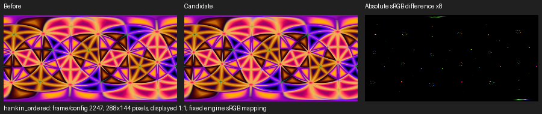
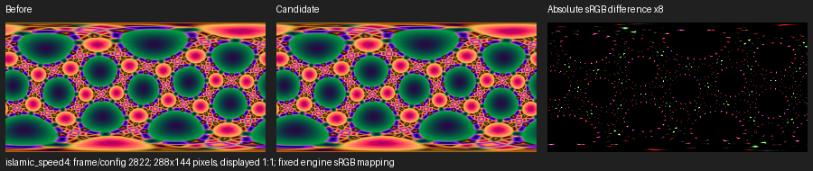

# Convex-face AA candidate: matched on-device profiles — 2026-09-28

**Candidate cost rejected; rendering change remains unlanded.** Current baseline
`0c02f3912a98677184d3cf43b31a5d468d4b8ba3` is compared with candidate
`d4b8d7b75f3e2a87ccd2801a946d0b8ad57e6cc6`. Standard profile reports and roster tables retain the
baseline; this document records both revisions. Raw captures, build logs,
compiler/environment hashes and ELF provenance are in the
[evidence archive](evidence/face_aa_2026-09-28/README.md).

Both use Teensy 4.0 at 600 MHz under the actual segmented driver, with live
flywheel/DMA interrupts. Shipping before/after runs use COM3; global O3
before/after runs use COM4. Window size is 16 and the epoch is stretched to
4000 revolutions. HankinSolids uses the ordered 30-leg tour over 18 nodes,
260 seconds. IslamicStars uses its 23 recipes at Trans Speed 4, 210 seconds.
TS4 changes both build/ripple sampling and dwell; the comparison holds it fixed.

## Peak render and spills

These are exact per-frame render peaks over matched frame numbers and shape
ownership. Setup frame 1 is excluded. Every other matched live frame remains,
including builds, transitions and trailing rows after the final scope window.
A spill is render over 62.5 ms; wall time includes synchronization idle and
is never substituted for render.

| Effect | Config | Frames | Baseline peak ms | Candidate peak ms | Peak delta | Baseline spills | Candidate spills |
|---|---|---|---:|---:|---:|---:|---:|
| HankinSolids | ship | 2–4138 | 34.837 | 40.643 | +5.806 ms (+16.67%) | 0/4137 | 0/4137 |
| HankinSolids | o3 | 2–4138 | 32.865 | 40.475 | +7.610 ms (+23.16%) | 0/4137 | 0/4137 |
| IslamicStars | ship | 2–3335 | 50.500 | 63.390 | +12.890 ms (+25.52%) | 0/3334 | 3/3334 |
| IslamicStars | o3 | 2–3337 | 49.112 | 62.988 | +13.876 ms (+28.25%) | 0/3336 | 1/3336 |

### Peak frame and phase

Phase evidence combines complete scope windows with raw build/arrival
markers. Mixed windows alone cannot identify a single frame's phase;
Islamic build-leg and completion markers provide the narrower attribution.

| Effect/config | Revision | Peak frame | Shape marker | Phase evidence |
|---|---|---:|---|---|
| HankinSolids/ship | before | 2252 | `truncatedIcosidodecahedron` | interlace sweep; window 2241–2256 |
| HankinSolids/ship | after | 2252 | `truncatedIcosidodecahedron` | interlace sweep; window 2241–2256 |
| HankinSolids/o3 | before | 2252 | `truncatedIcosidodecahedron` | interlace sweep; window 2241–2256 |
| HankinSolids/o3 | after | 2252 | `truncatedIcosidodecahedron` | interlace sweep; window 2241–2256 |
| IslamicStars/ship | before | 2811 | `truncatedIcosidodecahedron_truncate50d_ambo_dual` | recipe build after ambo (6 frames) marker at 2810; window 2801–2816 |
| IslamicStars/ship | after | 783 | `dodecahedron_hk35_ambo_hk62_ambo_relax_hk42` | recipe build after hankin (8 frames) marker at 782; window 769–784 |
| IslamicStars/o3 | before | 2811 | `truncatedIcosidodecahedron_truncate50d_ambo_dual` | recipe build after ambo (6 frames) marker at 2810; window 2801–2816 |
| IslamicStars/o3 | after | 2559 | `dodecahedron_hk35_ambo_hk62_ambo_relax_hk42` | recipe build after hankin (8 frames) marker at 2558; window 2545–2560 |

### Same-frame peak counterparts

Both revisions at each peak-setting frame separate a moved maximum from
its same-geometry counterpart; interrupt timing can still differ.

| Effect/config | Peak selected from | Frame | Baseline ms | Candidate ms | Delta ms |
|---|---|---:|---:|---:|---:|
| HankinSolids/ship | before | 2252 | 34.837 | 40.643 | +5.806 |
| HankinSolids/ship | after | 2252 | 34.837 | 40.643 | +5.806 |
| HankinSolids/o3 | before | 2252 | 32.865 | 40.475 | +7.610 |
| HankinSolids/o3 | after | 2252 | 32.865 | 40.475 | +7.610 |
| IslamicStars/ship | before | 2811 | 50.500 | 54.974 | +4.474 |
| IslamicStars/ship | after | 783 | 48.666 | 63.390 | +14.724 |
| IslamicStars/o3 | before | 2811 | 49.112 | 54.532 | +5.420 |
| IslamicStars/o3 | after | 2559 | 47.666 | 62.988 | +15.322 |

### First complete tour / carousel

This view ends before the first full-cycle return and avoids weighting
partially repeated tours differently. Hankin's earlier revisits do not count
as completion: all 30 legs and all 18 nodes are required.

| Effect/config | Frames | Before peak ms | After peak ms | Before/after spills |
|---|---|---:|---:|---|
| HankinSolids/ship | 2–3521 | 34.837 | 40.643 | 0/3520 → 0/3520 |
| HankinSolids/o3 | 2–3521 | 32.865 | 40.475 | 0/3520 → 0/3520 |
| IslamicStars/ship | 2–1775 | 50.023 | 63.390 | 0/1774 → 2/1774 |
| IslamicStars/o3 | 2–1775 | 48.157 | 61.959 | 0/1774 → 0/1774 |

## Matched per-shape peaks

Peaks retain transitions and build work attributed by each emitted marker.
Initial unmarked Hankin frames belong to tetrahedron; repeated visits are
merged. A shape peak may move to a different frame after the change.

### HankinSolids

| Shape | Ship before ms | Ship after ms | Delta | O3 before ms | O3 after ms | Delta |
|---|---:|---:|---:|---:|---:|---:|
| `tetrahedron` | 15.009 | 16.473 | +9.75% | 14.557 | 15.728 | +8.04% |
| `truncatedTetrahedron` | 19.656 | 24.063 | +22.42% | 19.718 | 24.191 | +22.68% |
| `octahedron` | 18.040 | 20.426 | +13.23% | 17.952 | 20.369 | +13.46% |
| `truncatedOctahedron` | 19.992 | 24.427 | +22.18% | 19.554 | 23.688 | +21.14% |
| `cuboctahedron` | 17.758 | 20.815 | +17.21% | 17.869 | 20.679 | +15.73% |
| `truncatedCuboctahedron` | 23.192 | 29.241 | +26.08% | 23.175 | 29.428 | +26.98% |
| `cube` | 17.418 | 19.485 | +11.87% | 17.814 | 20.095 | +12.80% |
| `rhombicuboctahedron` | 19.850 | 23.217 | +16.96% | 19.616 | 22.375 | +14.07% |
| `snubCube` | 23.182 | 27.269 | +17.63% | 23.052 | 27.613 | +19.79% |
| `truncatedCube` | 22.329 | 28.197 | +26.28% | 21.712 | 27.196 | +25.26% |
| `icosahedron` | 18.454 | 21.909 | +18.72% | 18.757 | 22.349 | +19.15% |
| `truncatedIcosahedron` | 22.594 | 27.884 | +23.41% | 22.533 | 27.754 | +23.17% |
| `icosidodecahedron` | 21.382 | 25.473 | +19.13% | 20.399 | 24.037 | +17.83% |
| `truncatedIcosidodecahedron` | 34.837 | 40.643 | +16.67% | 32.865 | 40.475 | +23.16% |
| `dodecahedron` | 18.732 | 22.272 | +18.90% | 18.292 | 21.827 | +19.33% |
| `rhombicosidodecahedron` | 23.198 | 28.752 | +23.94% | 22.968 | 27.844 | +21.23% |
| `snubDodecahedron` | 26.600 | 32.224 | +21.14% | 26.173 | 31.457 | +20.19% |
| `truncatedDodecahedron` | 23.192 | 30.143 | +29.97% | 23.749 | 30.787 | +29.63% |

### IslamicStars

| Shape | Ship before ms | Ship after ms | Delta | O3 before ms | O3 after ms | Delta |
|---|---:|---:|---:|---:|---:|---:|
| `dodecahedron_hk62_ambo_hk62` | 23.193 | 27.981 | +20.64% | 23.362 | 28.212 | +20.76% |
| `truncatedIcosahedron_hk58_chamfer63` | 29.832 | 35.022 | +17.40% | 28.550 | 33.688 | +18.00% |
| `dodecahedron_ambo_bevel33_relax_hk66` | 30.080 | 35.118 | +16.75% | 29.760 | 34.999 | +17.60% |
| `truncatedIcosahedron_ambo_relax_truncate33_hk64` | 33.075 | 41.168 | +24.47% | 34.244 | 41.368 | +20.80% |
| `dodecahedron_bevel2_relax_gyro` | 40.282 | 49.270 | +22.31% | 37.215 | 46.913 | +26.06% |
| `truncatedIcosidodecahedron_bevel5_relax_hk77` | 43.097 | 51.136 | +18.65% | 42.339 | 49.941 | +17.96% |
| `truncatedOctahedron_gyro_kis_hk17` | 44.549 | 55.284 | +24.10% | 43.563 | 53.750 | +23.38% |
| `truncatedIcosahedron_ambo_relax_truncate001_hankin59` | 41.868 | 41.804 | -0.15% | 39.429 | 39.481 | +0.13% |
| `truncatedIcosahedron_ambo_relax_truncate001_hankin73` | 40.246 | 45.514 | +13.09% | 39.769 | 45.150 | +13.53% |
| `icosahedron_ambo_truncate033_hankin59` | 23.258 | 27.289 | +17.33% | 22.792 | 27.883 | +22.34% |
| `dodecahedron_hk35_ambo_hk62_ambo_relax_hk42` | 49.443 | 63.390 | +28.21% | 47.666 | 62.988 | +32.14% |
| `octahedron_hk17_ambo_hk73` | 21.643 | 24.375 | +12.62% | 22.173 | 24.344 | +9.79% |
| `icosahedron_kis_gyro` | 31.822 | 44.683 | +40.42% | 27.851 | 36.983 | +32.79% |
| `truncatedIcosidodecahedron_truncate50d_ambo_dual` | 50.500 | 63.072 | +24.90% | 49.112 | 61.752 | +25.74% |
| `icosidodecahedron_truncate5d_ambo_dual` | 24.548 | 33.723 | +37.38% | 22.360 | 32.188 | +43.95% |
| `snubDodecahedron_truncate5d_ambo_dual` | 40.601 | 49.539 | +22.01% | 37.054 | 48.809 | +31.72% |
| `octahedron_hk34_ambo_hk72` | 19.914 | 22.544 | +13.21% | 22.186 | 23.810 | +7.32% |
| `rhombicuboctahedron_hk63_ambo_hk63` | 27.568 | 32.434 | +17.65% | 27.471 | 33.777 | +22.96% |
| `truncatedIcosahedron_hk54_ambo_hk72` | 38.062 | 46.632 | +22.52% | 36.290 | 40.224 | +10.84% |
| `dodecahedron_hk54_ambo_hk72` | 23.378 | 27.018 | +15.57% | 26.170 | 29.514 | +12.78% |
| `dodecahedron_hk72_ambo_dual_hk20` | 29.701 | 37.614 | +26.64% | 29.844 | 37.406 | +25.34% |
| `truncatedIcosahedron_truncate50d_ambo_dual` | 38.654 | 42.384 | +9.65% | 38.660 | 42.867 | +10.88% |
| `icosahedron_snub_relax_truncate033_hankin62` | 31.150 | 36.916 | +18.51% | 30.761 | 35.464 | +15.29% |

## Means and scope attribution

Mean render supplements the peak comparison. Scope means use identical
complete windows after startup, with per-pair ranges recorded in the JSON.
Inclusive shared counters are not additive exclusive costs.

| Effect/config | Measure | Before | After | Delta |
|---|---|---:|---:|---:|
| HankinSolids/ship | render ms/frame | 12.739 | 14.560 | +14.29% |
| HankinSolids/ship | `hk_timeline_step` ms/frame | 12.485 | 14.301 | +14.55% |
| HankinSolids/ship | `scan_mesh_raster` ms/frame | 11.777 | 13.596 | +15.45% |
| HankinSolids/ship | `scan_face_setup` ms/frame | 0.382 | 0.382 | +0.05% |
| HankinSolids/o3 | render ms/frame | 12.823 | 14.685 | +14.52% |
| HankinSolids/o3 | `hk_timeline_step` ms/frame | 12.570 | 14.428 | +14.78% |
| HankinSolids/o3 | `scan_mesh_raster` ms/frame | 11.853 | 13.695 | +15.54% |
| HankinSolids/o3 | `scan_face_setup` ms/frame | 0.372 | 0.374 | +0.37% |
| IslamicStars/ship | render ms/frame | 22.793 | 27.161 | +19.16% |
| IslamicStars/ship | `is_mesh_scan` ms/frame | 14.303 | 16.964 | +18.61% |
| IslamicStars/ship | `is_build_scan` ms/frame | 7.196 | 8.904 | +23.73% |
| IslamicStars/ship | `scan_mesh_raster` ms/frame | 18.215 | 22.587 | +24.00% |
| IslamicStars/ship | `scan_face_setup` ms/frame | 3.126 | 3.124 | -0.06% |
| IslamicStars/o3 | render ms/frame | 22.419 | 26.764 | +19.38% |
| IslamicStars/o3 | `is_mesh_scan` ms/frame | 14.114 | 16.770 | +18.82% |
| IslamicStars/o3 | `is_build_scan` ms/frame | 7.103 | 8.808 | +23.99% |
| IslamicStars/o3 | `scan_mesh_raster` ms/frame | 18.055 | 22.417 | +24.16% |
| IslamicStars/o3 | `scan_face_setup` ms/frame | 3.009 | 3.008 | -0.03% |

## Native visual assessment

The native effect images retain a very similar overall appearance. Enlarged
crops and amplified differences show corner coverage and color changes, but
these samples do not demonstrate a large overall visual improvement that
justifies the measured cost. The current candidate was rejected on cost.

These are full 288x144 native CPU renders at 33 ms per mock frame, with RNG
seed 1337 and fixed engine linear-to-sRGB conversion. The before/after toggle
isolates the new vertex-cone block in one diagnostic executable. Host frames
are zero-based and are not exact device poses: device profiling uses a
62.5 ms display window and segmented viewport. No exposure normalization was
applied. The third panel shows absolute sRGB differences amplified 8x.

The selected frames maximize total absolute linear-channel change among
45 ordered Hankin samples and 49 TS4 Islamic samples. Counts below use the
largest absolute sRGB channel change per pixel, out of 41,472 pixels.

| Effect / host frame | Changed sRGB pixels | Change >=8/255 | Change >=16/255 | Largest channel change |
|---|---:|---:|---:|---:|
| HankinSolids / 2247 | 437 (1.05%) | 182 (0.44%) | 94 (0.23%) | 90/255 |
| IslamicStars / 2822 | 4,258 (10.27%) | 1,340 (3.23%) | 752 (1.81%) | 102/255 |

The largest individual channel changes across the extended sweeps are 94/255
and 130/255 respectively, at potentially different frames. Small changes can
be spread across many pixels; isolated pixels can change substantially.
[Hankin enlargement](evidence/face_aa_2026-09-28/visuals/hankin_ordered_zoom_comparison.png)
and [Islamic enlargement](evidence/face_aa_2026-09-28/visuals/islamic_speed4_zoom_comparison.png)
make the corner differences easier to inspect.

The [acute white triangle](evidence/face_aa_2026-09-28/visuals/acute_zoom_comparison.png)
shows a visibly shortened inflated tip (31 linear-light pixels dim, with a
maximum channel decrease of 42.69%). The correction removes excess exterior
vertex coverage; cull bounds do not change and no previously culled light is
recovered. This synthetic stress case does not establish typical effect
visibility. These host images do not establish visibility on the physical
display. See the [method](evidence/face_aa_2026-09-28/visuals/METHOD.md) and
[complete sampled metrics](evidence/face_aa_2026-09-28/visuals/metrics.json).

## Limits

One capture per source/config is an observed comparison, not a repeated-run
confidence interval. CYCCNT includes ISR time, and serial/build boundary work
can set an isolated maximum. Matched frame indices keep the deterministic
geometry schedule fixed, while corrected edge coverage can change raster work.
The per-pixel scope adds profiling overhead to both revisions.

Same-board comparisons apply within each config; COM3-vs-COM4 differences
are not solely compiler effects. IslamicStars TS4 does not establish the
peak across every default-speed animation sample. The candidate remains on
its own source branch for review; publishing these profiles does not land it.

## Uninstrumented roster memory

Ordinary `phantasm` builds from the retained build logs, with profiling
compiled out. The candidate is unlanded; current budget limits are unchanged.

| Measure | Baseline B | Candidate B | Delta B |
|---|---:|---:|---:|
| RAM1 code | 163,480 | 163,592 | +112 |
| RAM1 variables | 314,784 | 314,784 | +0 |
| FLASH data | 735,360 | 735,360 | +0 |
| FLASH code | 486,856 | 487,032 | +176 |
