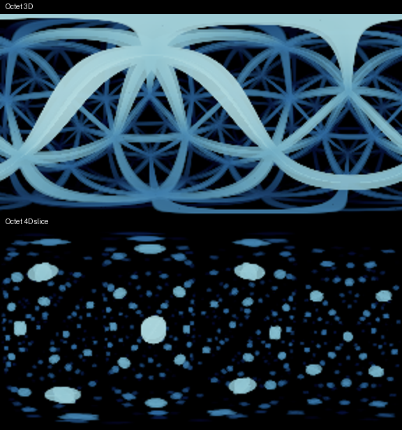
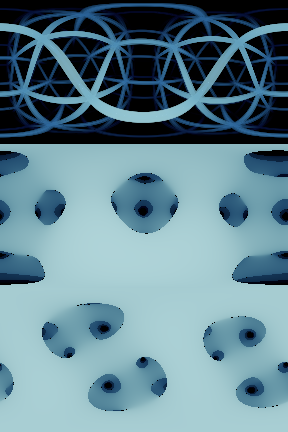

# HyperLattice experimental presets (2026-09-27)

The simulator's HyperLattice preset list offers Octet Flight and Octet 4D Slice
alongside Cubic Flight, Hypercube Flight, and Cubic Wide Flight. **Pattern** selects Cubic or
Experimental / Octet Truss; **View** independently selects 3D perspective or
4D slice. Both patterns define both views. Octet remains outside standard
Teensy admission. Triangular, Cosine, and Gyroid have been removed from the
effect's preset list; their earlier measurements are retained below.

| Preset ID | Geometry | Work bound |
| --- | --- | --- |
| `experimental-octet-flight` | 3D D3/FCC edges | 64 plane candidates, 32 layers |
| `experimental-octet-4d-slice` | 4D D4 edges | 64 plane candidates, 32 layers |

Octet's vertices are integer lattice coordinates whose sum is even. Edges join
nearest neighbors, differing by one unit in two coordinates. In 3D this is the
D3/FCC lattice, with 12 neighbors per vertex and regular tetrahedral and
octahedral cells. In 4D the same rule gives D4, with 24 neighbors per vertex.
Cell Size is the nearest-neighbor strut length in world units in either view.

### Cubic Wide Flight

The `cubic-wide-flight` preset is available in both the default firmware and
the simulator. Its exact settings are Pattern Cubic, View 3D perspective,
Sphere Radius 0, Cell Size 2.38525, Wire Radius 0.055, Softness 0.08,
Near Fade 2, Far Distance 11.66, AA Strength 1, Speed 0.05, 3D Spin 0.015,
4D Spin 0, Color Depth, and Lattice Planes 2 (`ShellCount::TWO`).
It is appended after the other available presets: index 2 in default firmware,
index 4 when Octet is enabled. The original preset IDs and Octet indices remain
unchanged. Pattern/View edits still adopt their tuple's normal defaults;
select Cubic Wide Flight to adopt this complete setting.

The fixed-preset device check on clean source
`1faa99e98065aa7a47ef1393f91168ba3aaf1567` passes the 62.5 ms deadline:
**44.530 ms mean, 50.804 ms peak, 0/616 runtime spills**, frames 2?617.
This shipping-selective-O3 capture uses COM3, the same 288?144 segmented driver,
40 seconds and 16-frame counter windows. Setup frame 1 (77.628 ms) is excluded.
Scope summaries use frames 17?608; the final nine live frames remain in the
exact runtime statistics. The untouched log passes parser validation, with
0.386 ppm root-cycle/wall agreement at frames 65?80. See the
[raw capture](evidence/hyperlattice_cubic_wide_2026-09-27/ship.txt),
[summary](evidence/hyperlattice_cubic_wide_2026-09-27/ship_summary.json), and
[parameter readback](evidence/hyperlattice_cubic_wide_2026-09-27/parameter-readback.json).
This is a fixed-preset check; the older standard HyperLattice full-cycle reports
cover the two original presets, not the newly expanded three-preset cycle.
No global-O3 capture was collected for Cubic Wide Flight.

The final [focused native checks](evidence/hyperlattice_cubic_wide_2026-09-27/native-tests.txt)
and [five-preset WASM smoke](evidence/hyperlattice_cubic_wide_2026-09-27/wasm-smoke.txt)
pass. Both firmware gates pass with unchanged RAM1 code/variables and FLASH
data relative to the Octet table below. Cubic Wide Flight adds only 40 bytes of
FLASH code to each image: 502,464 bytes default and 515,696 bytes with Octet.
The zero-reserve gate still leaves 1,064/424 bytes of ITCM headroom respectively.
The final opt-in [build log](evidence/hyperlattice_cubic_wide_2026-09-27/optin-build.txt)
and paired default build in the capture evidence retain those measurements.

### Octet rendering

The 3D adapter visits four equally spaced plane families with tetrahedral
normals. Their pairwise acute angles are approximately 70.53 degrees. Each
strut belongs to two planes; its sampling owner is the plane crossed more
directly by the ray, with ties resolved by family index. Coverage uses the
shortest distance between the ray and that strut, so the two planes cannot
produce overlapping bands for the same strut. Depth, clipping, and the pixel
footprint still use the owner's plane crossing rather than a cylinder surface
intersection. A ray parallel to a strut has no event for that strut.

The 4D adapter visits eight diagonal hyperplane families and measures
distance to D4's edge graph. Both reuse monotone plane cursors and the shared
layer compositor. Coverage is approximate; neither adapter claims certified
surface intersections. The timings and preview below predate the 3D
single-owner correction.

Both presets begin at radial offset zero with depth coloring and continuous
bounded world-space camera motion. Pause stops preset choreography; spatial
motion and palette cycling continue. A 4D view rotates the three-dimensional
ray domain inside the four-dimensional lattice. It does not project a 3D
octet image or extrude that image along another axis.

Unresolved, invalid, unsupported, or exhausted searches increment the read-only
Unfinished Rays count for the rendered frame. Analytic traversal preserves
already-consumed layers if a work cap is reached.
The previews do not claim error-free coverage or the Teensy's 62.5 ms deadline.
The [earlier device sweep](spherical_periodic_device_2026-09-26.md) already
exceeded that deadline at much smaller periodic-field budgets.

Changing Pattern or View adopts the selected tuple's complete default geometry,
preserving common color and near-fade controls. Automatic transitions switch
incompatible geometry at their midpoint. Schema 12 rejects older snapshots
without mutation. Lattice Planes and Softness are read-only for Octet;
Wire Radius and AA Strength remain editable. 4D Spin is read-only in 3D.
Cell Size changes framework spacing without moving the camera.
Experimental Sphere Radius, near
fade, and far distance use world units; the legacy cubic radial start remains
cell-relative for compatibility.

## Build availability

`HS_ENABLE_HYPERLATTICE_EXPERIMENTS` defaults to one for Emscripten and native
test-oracle builds, and zero for firmware. Explicit zero or one overrides it.
With zero, experimental renderer calls, selectors, telemetry, and preset IDs
are absent. No new effect is registered.

An opt-in device capture uses the normal locked wrapper, for example:

```powershell
$env:HS_PROFILE_TREE = 'C:/work/Holosphere'
$env:HS_TEENSY_PORT = 'COM3'
bash tools/profile_one.sh HyperLattice profile 70 16 '-DHS_ENABLE_HYPERLATTICE_EXPERIMENTS=1 -DHS_PROFILE_PRESET=2'
```

Preset indices 2 and 3 select Octet in 3D and 4D respectively.
Fixed selection avoids mistaking a partial slow experimental cycle for a full
preset sweep. Device size/layout gates still apply to opt-in builds.

## Octet validation and device measurements

These measurements use clean source `39225587612be7a45a9d4569dd1eb489569338a5`.
Both fixed presets were captured sequentially on COM3, Teensy 4.0 at 600 MHz,
with the shipping selective-O3 configuration and the real
`POVSegmented<288, 4, 480>` driver, including live flywheel and DMA interrupts.
Each capture lasts 70 seconds with 16-frame counter windows. The harness holds
the preset while camera motion, rotation, and palette cycling continue.
This is a bounded observation of each moving preset, not an exhaustive pose
sweep or a global-O3 comparison.

| View | Runtime frames | Mean render ms | Peak render ms | Spilled | Mean wall ms |
| --- | --- | ---: | ---: | ---: | ---: |
| 3D | 2–549 | 90.406 | 103.733 | 548/548 (100%) | 124.903 |
| 4D slice | 2–121 | 529.105 | 549.828 | 120/120 (100%) | 562.136 |

Neither view meets the 62.5 ms frame budget. The observed display cadence is
approximately 8 fps in 3D and 1.78 fps in 4D. The previous
[Triangular capture](hyperlattice_triangular_2026-09-27.md) averaged 126.099 ms
and peaked at 134.620 ms; these are separate moving-geometry captures.

Startup frame 1 is excluded from every runtime statistic: 172.165 ms in 3D,
1041.042 ms in 4D. Exact runtime statistics retain trailing frames after the
last full window (5 in 3D, 9 in 4D). Counter summaries exclude the entire
startup-containing window: frames 17–544 in 3D and 17–112 in 4D.
Both raw logs pass fixed-preset, effect-name, frame-monotonicity, complete-row,
and cycle/wall validation; no epoch reset occurs.

3D: `hl_shader_draw` averages 88.282 ms/frame (70.6% of root cycles). Frames 401–416 agree between root cycles and wall sum within 0.064 ppm.

4D: `hl_shader_draw` averages 524.969 ms/frame (93.4% of root cycles). Frames 17–32 agree between root cycles and wall sum within 0.062 ppm.

Shader scopes include traversal, coverage, and coloring. No per-pixel scopes
were added; the nominal 10,368-pixel quadrant evaluates 10,658 shader samples
with the scan margin. Buffer wait is display alignment, not rendering work.
Device captures do not log unfinished-ray counts; timing alone does not prove
coverage quality.

Evidence: [3D raw capture](evidence/hyperlattice_octet_2026-09-27/3d.txt),
[3D summary](evidence/hyperlattice_octet_2026-09-27/3d_summary.json),
[4D raw capture](evidence/hyperlattice_octet_2026-09-27/4d.txt),
[4D summary](evidence/hyperlattice_octet_2026-09-27/4d_summary.json).
The evidence directory also preserves parser validation, provenance, build
logs, and exact-byte environment dumps. The wrapper's paired Phantasm image is
the default roster; the separate opt-in build below validates the full roster
with Octet enabled.

### Firmware size and code placement

| Image | RAM1 code | RAM1 variables | FLASH code | FLASH data | ITCM headroom |
| --- | ---: | ---: | ---: | ---: | ---: |
| Default | 195,544 | 314,784 | 502,424 | 725,504 | 1,064 |
| Octet enabled | 196,184 | 314,784 | 515,656 | 725,628 | 424 |
| Opt-in minus default | +640 | 0 | +13,232 | +124 | -640 |

Both images pass size/layout gates. RAM2 variables remain 520,064 bytes with
4,224 free; RAM1 leaves 12,896 bytes for locals. The ITCM ceiling remains
196,608 bytes with zero reserved headroom. Against the pre-Octet default,
RAM1 code and variables are unchanged, FLASH code grows 312 bytes and FLASH
data grows 52 bytes. Against the earlier three-experiment opt-in image,
Octet reduces RAM1 code by 400 bytes and FLASH data by 100 bytes; FLASH code
grows 536 bytes.

The [symbol audit](evidence/hyperlattice_octet_2026-09-27/layout.json) finds no
Octet symbols in the default image. The opt-in image has one shared scan
wrapper, one shared plane-cursor initializer, and separate 3D/4D shade functions.
Cold initialization and control callbacks use `HS_COLD_MEMBER`; large hot
Octet shading/query helpers use `HS_HOT_FLASH_MEMBER`. The small 84-byte D4
validity check remains in ITCM. Build logs contain vendor warnings; no
first-party warning was observed.

Bounding the coincident-event group to its single merge identity saves
608 bytes of FLASH code and 32 bytes of ITCM, and reduces the observed 4D WASM
render stack watermark from 1,120 to 888 bytes. The 24-frame RGB16 previews are
[byte-identical across that change](evidence/hyperlattice_octet_2026-09-27/group-storage-parity.json).

### Native and simulator validation

The [full native suite](evidence/hyperlattice_octet_2026-09-27/native-tests.txt)
passes 100 tests, with one intentional replay skip. After the group-storage
change, [five focused suites](evidence/hyperlattice_octet_2026-09-27/native-final-tests.txt)
pass again. Geometry tests cover independent nearest-edge oracles, symmetry,
FCC/D4 parity, scale, placement, fourth-coordinate dependence, invalid rays,
coincident events, and traversal limits. Control tests cover all four tuples,
independent Pattern/View writes, default adoption, snapshot validation, and
visible moving output.

The final [WASM smoke](evidence/hyperlattice_octet_2026-09-27/wasm-final-smoke.txt)
passes all HyperLattice presets at every supported resolution. The following
flat equirectangular previews show each Octet preset after 24 frames at 288×144,
converted from linear RGB16 to sRGB. Both last frames report zero unfinished
rays, with 888-byte render and 944-byte initialization stack watermarks out
of 8,192 bytes. These host observations are not device timing measurements.
The 4D image contains disconnected cross-sections of thick struts, as expected
for a three-dimensional slice through a four-dimensional edge graph.



## Historical validation of the replaced previews

The following validation and images describe the earlier Triangular, Cosine,
and Gyroid presets, before their replacement by Octet. They do not measure
the current Octet implementation.

Native tests cover experimental selection, visible output and continued motion,
schema restore, invalid pattern values, inactive controls, and atomic geometry
transitions. The shared backend suites cover candidate ordering, verified hit
acceptance, and failure/query-budget accounting. Shipping firmware and the
simulator are built separately to exercise both feature-switch branches.

The full native suite passes (100 tests, one intentional replay skip), followed
by six passing focused tests after the camera/world-ray changes. The release
WASM smoke selects and renders every HyperLattice preset at every supported
resolution. [Native full run](evidence/hyperlattice_experiments_2026-09-27/native-full.txt),
[final focused run](evidence/hyperlattice_experiments_2026-09-27/native-final-focused.txt),
and [WASM smoke](evidence/hyperlattice_experiments_2026-09-27/wasm-smoke.txt)
preserve the results.

The standard Phantasm build passes its size/layout gates with 195,544 bytes of
RAM1 code (unchanged), 314,784 bytes of RAM1 variables (unchanged), and 725,452
bytes of FLASH data (+4). The zero-reserve ITCM ceiling remains 196,608 bytes,
leaving 1,064 bytes. [Build evidence](evidence/hyperlattice_experiments_2026-09-27/shipping-build.txt)
uses the integrated preset source before the subsequent experimental-only
camera and query improvements.

The following previews use the final renderer source `c012be4a8`, at 288 by
144 after 24 frames from each preset's fresh initialization. From top to bottom:
triangular framework, cosine, gyroid. RGB16 linear output is converted to sRGB
for this flat equirectangular preview; it is not a photograph of the device.



The last rendered frames report zero, 104, and 69 unfinished rays respectively;
the maximum observed WASM stack watermark is 944 bytes. The
[preview summary](evidence/hyperlattice_experiments_2026-09-27/wasm-preview-summary.json)
also records host timings, including the first draw. Those host timings are not
Teensy measurements or admission evidence.

## Historical opt-in device validation

Final cold builds at clean source `596cdc1fd` pass the default and opt-in
Phantasm size/layout gates with zero first-party warnings. Their runtime source
is identical to landed `920a9f622`. The
[layout/symbol audit](evidence/hyperlattice_experiments_2026-09-27/device-layout.txt),
[default build](evidence/hyperlattice_experiments_2026-09-27/default-final-build.txt),
[opt-in build](evidence/hyperlattice_experiments_2026-09-27/optin-final-build.txt),
[warning audit](evidence/hyperlattice_experiments_2026-09-27/warnings.txt), and
[7,550 passing native assertions](evidence/hyperlattice_experiments_2026-09-27/native-placement.txt)
retain the final evidence.

| Full Phantasm | Standard | Experiments enabled | Change |
| --- | ---: | ---: | ---: |
| RAM1 code | 195,544 | 196,584 | +1,040 |
| RAM1 variables | 314,784 | 314,784 | 0 |
| FLASH code | 502,112 | 515,120 | +13,008 |
| FLASH data | 725,452 | 725,728 | +276 |
| ITCM headroom | 1,064 | 24 | -1,040 |

Both retain 12,896 bytes of stack space and 4,224 free bytes in RAM2. The
standard ELF contains no experimental renderer symbols. Four measured
`HS_HOT_FLASH_MEMBER` placements move the surface search, surface shading,
outlined evaluation lambda, and framework validity check to cached flash.
This reduces opt-in ITCM from 199,560 to 196,584 bytes without changing the
zero-reserve ceiling. Small emit and step helpers retain the compiler's inline
choices. These annotations are no-ops for Clang; the installed WASM binary
matches the tested preview binary byte for byte.

A 30-second locked capture on COM4 selects gyroid preset 4 with four-frame
counter windows, shipping optimization, and live segmented-driver interrupts.
It validates execution, not realtime admission: runtime frames 2 through 38
average **731.814 ms**, with **629.698 / 820.923 ms** minimum/maximum and
**37/37 deadline spills**. Setup frame 1 takes 1,439.063 ms and is excluded.
Nine complete counter windows cover frames 1 through 36; the runtime figures
also retain the two trailing individual frame records.

[Raw capture](evidence/hyperlattice_experiments_2026-09-27/gyro.txt),
[provenance](evidence/hyperlattice_experiments_2026-09-27/gyro.provenance),
[profile build](evidence/hyperlattice_experiments_2026-09-27/gyro-build.txt),
[exact flags](evidence/hyperlattice_experiments_2026-09-27/gyro-envdump.json),
[summary](evidence/hyperlattice_experiments_2026-09-27/gyro-summary.txt), and
[parser validation](evidence/hyperlattice_experiments_2026-09-27/gyro-validate.txt)
identify the image and frame ranges. This timing capture does not log per-ray
failure counts; the native/WASM diagnostic results above are separate evidence.
The wrapper's paired Phantasm attestation is the default image; the full opt-in
image is separately identified by the layout audit and build log above.

## Single-owner 3D strut correction timing

The corrected renderer on `3c0ad6dca` was measured with the same fixed Octet 3D
preset and original oscillating camera path, on COM3 for 70 seconds per build.
The [shipping report](shipping/profile_hyperlattice_teensy_2026-09-27.md#supplemental-octet-3d-single-owner-correction)
and [global-O3 report](O3/profile_hyperlattice_teensy_2026-09-27.md#supplemental-octet-3d-single-owner-correction)
retain full scope, ISR, build and raw-capture evidence.

| Renderer / image | Mean render ms | Peak render ms | Spilled | Mean wall ms |
| --- | ---: | ---: | ---: | ---: |
| Previous Octet 3D / shipping | 90.406 | 103.733 | 548/548 | 124.903 |
| Single-owner Octet 3D / shipping | 88.700 | 96.869 | 548/548 | 124.847 |
| Single-owner Octet 3D / global-O3 | 86.675 | 95.710 | 548/548 | 124.889 |

All three ranges contain runtime frames 2–549; setup frame 1 is excluded.
Shipping mean render falls 1.9%, peak falls 6.6%, and cadence remains about
8 fps because every frame exceeds the 62.5 ms budget. This is a comparison
against the earlier capture, not an isolated rebuild of the immediate parent.
The six ray setup square roots and reduced plane/layer work were not timed
individually, so these measurements do not attribute their separate costs.
